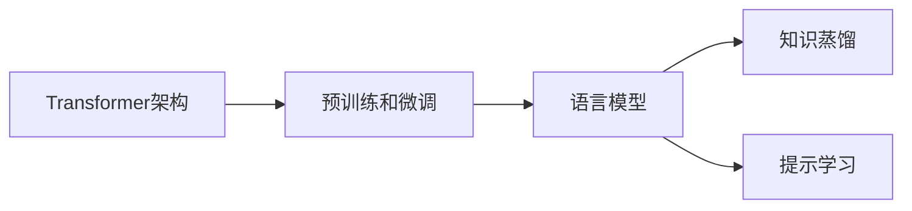

# 大语言模型原理与工程实践：局限和发展

## 1. 背景介绍
### 1.1 大语言模型的兴起
近年来,随着深度学习技术的快速发展,大语言模型(Large Language Model,LLM)在自然语言处理(Natural Language Processing,NLP)领域取得了突破性的进展。从2018年的BERT(Bidirectional Encoder Representations from Transformers)[1]到2020年的GPT-3(Generative Pre-trained Transformer 3)[2],再到最近的PaLM(Pathways Language Model)[3]和ChatGPT[4],大语言模型展现出了惊人的语言理解和生成能力,引发了学术界和工业界的广泛关注。

### 1.2 大语言模型的应用前景
大语言模型在许多NLP任务上取得了state-of-the-art的性能,如机器翻译、文本摘要、问答系统、情感分析等。同时,大语言模型也为构建通用人工智能(Artificial General Intelligence,AGI)提供了新的思路和可能性。微软、谷歌、OpenAI等科技巨头纷纷投入巨资,加速大语言模型的研发和应用落地。

### 1.3 大语言模型面临的挑战
尽管大语言模型取得了瞩目的成就,但它们仍然存在一些局限性和挑战,如计算资源消耗大、推理速度慢、泛化能力不足、伦理风险等。本文将从原理和工程实践的角度,系统地探讨大语言模型的局限性,并展望其未来的发展方向。

## 2. 核心概念与联系
### 2.1 Transformer架构
大语言模型的核心基础是Transformer架构[5]。与传统的RNN(Recurrent Neural Network)和CNN(Convolutional Neural Network)不同,Transformer完全基于注意力机制(Attention Mechanism),通过自注意力(Self-Attention)和多头注意力(Multi-Head Attention)建模输入序列中词与词之间的依赖关系,从而实现并行计算和长程依赖建模。

### 2.2 预训练和微调
大语言模型采用了预训练(Pre-training)和微调(Fine-tuning)的范式。首先在大规模无标注语料上进行自监督预训练,学习通用的语言表示;然后在下游任务的标注数据上进行微调,快速适应特定任务。这种"预训练+微调"的范式大大提升了模型的性能和泛化能力。

### 2.3 语言模型
大语言模型本质上是一种语言模型(Language Model),即以概率的方式对语言进行建模。给定前文信息,语言模型可以预测下一个词的概率分布。通过最大化语言模型的似然概率,可以学习到语言的统计规律和语义信息。常见的语言模型有n-gram模型、RNN语言模型和Transformer语言模型等。

### 2.4 知识蒸馏
由于大语言模型参数量巨大(动辄上百亿、千亿),直接部署和推理成本很高。知识蒸馏(Knowledge Distillation)[6]技术可以将大模型的知识转移到小模型中,在保持性能的同时大幅降低模型体积和推理延迟。具体做法是用大模型的输出作为小模型的软目标(Soft Target),引导小模型学习大模型的行为。

### 2.5 提示学习
传统的微调方式需要为每个任务重新训练模型,代价较大。提示学习(Prompt Learning)[7]是一种新兴的范式,通过设计恰当的提示模板(Prompt Template),在推理阶段引导预训练模型执行不同的任务,而无需重新训练模型。提示学习大大提高了预训练模型的可用性和灵活性。

下图展示了大语言模型的核心概念之间的联系:



## 3. 核心算法原理与具体操作步骤
### 3.1 Transformer的自注意力机制
Transformer的核心是自注意力机制,它可以建模输入序列中任意两个位置之间的依赖关系。具体步骤如下:

1. 将输入序列 $X \in \mathbb{R}^{n \times d}$ 通过三个线性变换得到查询矩阵 $Q$、键矩阵 $K$ 和值矩阵 $V$:

$$
\begin{aligned}
Q &= XW_Q \\
K &= XW_K \\
V &= XW_V
\end{aligned}
$$

其中 $W_Q, W_K, W_V \in \mathbb{R}^{d \times d_k}$ 是可学习的参数矩阵。

2. 计算查询矩阵 $Q$ 和键矩阵 $K$ 的点积注意力分数:

$$
A = \text{softmax}(\frac{QK^T}{\sqrt{d_k}})
$$

其中 $A \in \mathbb{R}^{n \times n}$ 是注意力分数矩阵,$\sqrt{d_k}$ 是缩放因子。

3. 将注意力分数矩阵 $A$ 与值矩阵 $V$ 相乘,得到注意力输出:

$$
\text{Attention}(Q,K,V) = AV
$$

通过自注意力机制,Transformer可以捕捉输入序列中的长程依赖,并实现并行计算。

### 3.2 Masked Language Model预训练
大语言模型常采用Masked Language Model(MLM)进行预训练,即随机遮挡输入序列中的一部分词,让模型根据上下文预测被遮挡的词。具体步骤如下:

1. 随机选择输入序列中15%的词进行遮挡,其中80%替换为特殊的[MASK]词,10%替换为随机词,10%保持不变。

2. 将遮挡后的输入序列输入Transformer编码器,得到每个位置的隐向量表示。

3. 在被遮挡位置的隐向量上添加一个全连接层和softmax层,预测该位置的词。

4. 计算预测词的交叉熵损失,并通过反向传播更新模型参数。

通过MLM预训练,模型可以学习到语言的统计规律和语义信息,为下游任务提供良好的初始化。

### 3.3 知识蒸馏算法
知识蒸馏可以将大模型的知识迁移到小模型中。以软化温度(Temperature)的方式蒸馏是常用的方法,具体步骤如下:

1. 在教师模型(大模型)的输出logits上除以温度系数 $T$,得到软化后的概率分布:

$$
p_i = \frac{\exp(z_i/T)}{\sum_j \exp(z_j/T)}
$$

其中 $z_i$ 是第 $i$ 个logit,$p_i$ 是软化后的概率。

2. 在学生模型(小模型)的输出logits上除以相同的温度系数 $T$,得到软化后的概率分布:

$$
q_i = \frac{\exp(y_i/T)}{\sum_j \exp(y_j/T)}
$$

其中 $y_i$ 是第 $i$ 个logit,$q_i$ 是软化后的概率。

3. 最小化学生模型和教师模型软化概率分布之间的KL散度:

$$
\mathcal{L}_{KD} = T^2 \cdot \text{KL}(p||q)
$$

4. 在蒸馏损失 $\mathcal{L}_{KD}$ 和学生模型的任务损失 $\mathcal{L}_{task}$ 之间加权求和,得到最终的训练损失:

$$
\mathcal{L} = \alpha \mathcal{L}_{KD} + (1-\alpha) \mathcal{L}_{task}
$$

其中 $\alpha$ 是权重系数。

通过知识蒸馏,小模型可以学习大模型的软目标,从而提升性能。

## 4. 数学模型和公式详细讲解举例说明
本节将详细讲解大语言模型中的几个关键数学模型和公式,并给出具体的例子。

### 4.1 Transformer的多头注意力
Transformer采用多头注意力来捕捉输入序列中不同子空间的信息。多头注意力将自注意力的过程重复 $h$ 次,每次使用不同的参数矩阵,然后将各头的输出拼接起来。

假设有一个输入序列"我爱自然语言处理",经过词嵌入后得到词向量矩阵 $X \in \mathbb{R}^{6 \times 512}$。

对于第 $i$ 个注意力头,首先计算查询矩阵 $Q_i$、键矩阵 $K_i$ 和值矩阵 $V_i$:

$$
\begin{aligned}
Q_i &= XW_Q^i, \quad W_Q^i \in \mathbb{R}^{512 \times 64} \\
K_i &= XW_K^i, \quad W_K^i \in \mathbb{R}^{512 \times 64} \\ 
V_i &= XW_V^i, \quad W_V^i \in \mathbb{R}^{512 \times 64}
\end{aligned}
$$

然后计算第 $i$ 个头的注意力输出:

$$
\text{head}_i = \text{Attention}(Q_i, K_i, V_i)
$$

最后将 $h$ 个头的输出拼接起来,并经过一个线性变换:

$$
\text{MultiHead}(Q,K,V) = \text{Concat}(\text{head}_1, ..., \text{head}_h)W_O
$$

其中 $W_O \in \mathbb{R}^{512 \times 512}$ 是可学习的参数矩阵。

通过多头注意力,Transformer可以在不同的子空间中捕捉词与词之间的多样化交互。

### 4.2 语言模型的概率公式
大语言模型的目标是估计一个句子 $x=(x_1,...,x_T)$ 的概率。根据概率论的链式法则,句子概率可以分解为:

$$
p(x) = \prod_{t=1}^T p(x_t|x_{<t})
$$

其中 $x_{<t}$ 表示 $x_t$ 之前的所有词。

以"我爱自然语言处理"为例,其概率可以分解为:

$$
\begin{aligned}
p(\text{我爱自然语言处理}) &= p(\text{我}) \cdot p(\text{爱}|\text{我}) \cdot p(\text{自然}|\text{我爱}) \\
&\quad \cdot p(\text{语言}|\text{我爱自然}) \cdot p(\text{处理}|\text{我爱自然语言})
\end{aligned}
$$

语言模型的任务就是估计每个条件概率 $p(x_t|x_{<t})$。Transformer语言模型使用自注意力机制建模 $x_{<t}$ 与 $x_t$ 之间的依赖关系,从而得到 $p(x_t|x_{<t})$ 的估计。

### 4.3 微调阶段的损失函数
在下游任务的微调阶段,需要在任务数据上重新训练模型。以文本分类任务为例,损失函数通常选择交叉熵损失:

$$
\mathcal{L} = -\sum_{i=1}^N \sum_{c=1}^C y_{ic} \log p_{ic}
$$

其中 $N$ 是训练样本数,$C$ 是类别数,$y_{ic}$ 是样本 $i$ 属于类别 $c$ 的真实标签(0或1),$p_{ic}$ 是模型预测样本 $i$ 属于类别 $c$ 的概率。

假设有一个二分类任务,判断一个句子的情感是正面还是负面。对于样本"这部电影太棒了!",其真实标签为 $y_{pos}=1, y_{neg}=0$。

模型经过微调后,在该样本上的输出概率为 $p_{pos}=0.8, p_{neg}=0.2$。则该样本的交叉熵损失为:

$$
\mathcal{L} = -y_{pos} \log p_{pos} - y_{neg} \log p_{neg} = - \log 0.8 \approx 0.223
$$

通过最小化所有训练样本的交叉熵损失,模型可以学习到分类任务的决策边界。

## 5. 项目实践:代码实例和详细解释说明
本节将以PyTorch为例,给出大语言模型的核心代码实现,并进行详细解释。

### 5.1 Transformer编码器层的实现
下面是Transformer编码器层的PyTorch实现:

```python
import torch
import torch.nn as nn

class TransformerEncoderLayer(nn.Module):
    def __init__(self, d_model, nhead, dim_feedforward, dropout=0.1):
        super(TransformerEncoderLayer, self).__init__()