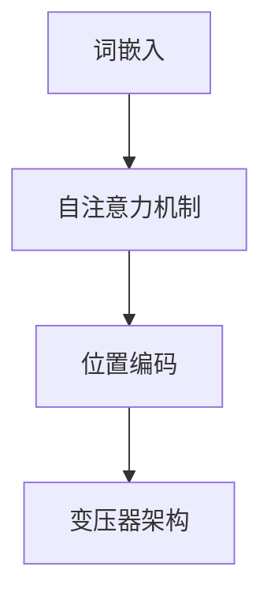

## 1.背景介绍

在过去的几年中，人工智能领域取得了显著的进步。尤其是在自然语言处理（NLP）领域，大型语言模型已经成为了一个热门的研究方向。这些模型，如GPT-3和BERT等，已经在各种任务中展现出了强大的性能，包括文本分类、命名实体识别、情感分析等。然而，尽管这些模型具有显著的性能，但它们的整体能力评测仍然是一个开放的问题。本文将探讨大型语言模型的原理，并通过工程实践来评测其整体能力。

## 2.核心概念与联系

大型语言模型是基于深度学习的自然语言处理模型，它们的目标是理解和生成人类语言。这些模型是通过在大量的文本数据上进行预训练，然后在特定的任务上进行微调来训练的。这种训练方式使得模型能够学习到语言的统计规律，并能够在各种任务中迁移这些知识。

大型语言模型的核心概念包括：词嵌入（Word Embedding），自注意力机制（Self-Attention Mechanism），位置编码（Positional Encoding），和变压器架构（Transformer Architecture）。这些概念之间的关系可以通过下面的Mermaid流程图进行展示：



## 3.核心算法原理具体操作步骤

大型语言模型的训练过程可以分为两个阶段：预训练和微调。在预训练阶段，模型在大量的无标签文本数据上进行训练，学习语言的统计规律。在微调阶段，模型在特定任务的标注数据上进行训练，以便在该任务上达到最佳性能。

预训练阶段的具体操作步骤如下：

1. **数据准备**：收集大量的无标签文本数据，例如网页、新闻文章、书籍等。

2. **词嵌入**：将文本数据转化为词嵌入向量。这是通过预训练的词嵌入模型，如Word2Vec或GloVe，将每个单词转化为一个高维向量。

3. **自注意力机制**：使用自注意力机制计算词嵌入向量之间的关系。这是通过计算每个词嵌入向量和其他所有词嵌入向量的点积，然后通过softmax函数转化为概率。

4. **位置编码**：添加位置编码到词嵌入向量中，以便模型能够理解单词在句子中的位置。

5. **变压器架构**：使用变压器架构处理词嵌入向量。这是通过多层自注意力机制和前馈神经网络组成的变压器架构，将词嵌入向量转化为上下文相关的词嵌入向量。

6. **目标函数**：定义目标函数为预测下一个单词的概率。这是通过将上下文相关的词嵌入向量通过一个线性层和softmax函数转化为概率分布，然后使用交叉熵损失函数计算预测概率和真实概率的差距。

7. **优化算法**：使用优化算法，如Adam，来更新模型的参数，以便最小化目标函数。

微调阶段的具体操作步骤如下：

1. **数据准备**：收集特定任务的标注数据，例如文本分类任务的标注数据。

2. **目标函数**：根据特定任务定义目标函数。例如，在文本分类任务中，目标函数可以定义为预测类别的概率。

3. **优化算法**：使用优化算法，如Adam，来更新模型的参数，以便最小化目标函数。

4. **评估**：在验证集上评估模型的性能，并调整模型的超参数以达到最佳性能。

## 4.数学模型和公式详细讲解举例说明

在大型语言模型中，自注意力机制是一个关键的概念。它的数学模型可以表示为：

$$
\text{Attention}(Q, K, V) = \text{softmax}\left(\frac{QK^T}{\sqrt{d_k}}\right)V
$$

其中，$Q$、$K$和$V$分别表示查询（Query）、键（Key）和值（Value），它们都是词嵌入向量。$d_k$是键向量的维度。这个公式表示了如何计算查询和键之间的匹配程度，并用这个匹配程度来加权值向量。

举个例子，假设我们有一个句子"I love dogs"，我们想要计算"love"这个单词的上下文相关的词嵌入向量。我们首先将每个单词转化为词嵌入向量，然后使用上述公式计算自注意力得分。例如，我们可以将"love"作为查询，"I"和"dogs"作为键，然后计算查询和键之间的匹配程度，然后用这个匹配程度来加权"I"和"dogs"的值向量，最后得到"love"的上下文相关的词嵌入向量。

## 5.项目实践：代码实例和详细解释说明

接下来，我们将通过一个代码实例来说明如何使用大型语言模型。我们将使用Hugging Face的Transformers库，它提供了许多预训练的大型语言模型，如GPT-3和BERT等。

首先，我们需要安装Transformers库：

```python
pip install transformers
```

然后，我们可以加载预训练的GPT-3模型：

```python
from transformers import GPT3LMHeadModel, GPT3Tokenizer

tokenizer = GPT3Tokenizer.from_pretrained('gpt3')
model = GPT3LMHeadModel.from_pretrained('gpt3')
```

接着，我们可以使用模型来生成文本：

```python
input_text = "I love dogs"
input_ids = tokenizer.encode(input_text, return_tensors='pt')

output = model.generate(input_ids, max_length=50, num_return_sequences=5)

for i in range(5):
    print(tokenizer.decode(output[i]))
```

在这个代码实例中，我们首先加载了预训练的GPT-3模型。然后，我们将输入文本转化为模型可以接受的格式。接着，我们使用模型来生成新的文本。最后，我们将生成的文本解码为人类可以理解的语言。

## 6.实际应用场景

大型语言模型在许多实际应用场景中都有广泛的应用。例如：

1. **聊天机器人**：大型语言模型可以用来构建聊天机器人，它可以理解用户的输入，然后生成有意义的回复。

2. **文本生成**：大型语言模型可以用来生成新的文本，例如写作助手、新闻生成等。

3. **情感分析**：大型语言模型可以用来进行情感分析，理解文本的情感倾向。

4. **文本分类**：大型语言模型可以用来进行文本分类，例如垃圾邮件检测、新闻分类等。

## 7.工具和资源推荐

如果你对大型语言模型感兴趣，以下是一些推荐的工具和资源：

1. **Hugging Face的Transformers库**：这是一个非常强大的库，提供了许多预训练的大型语言模型，如GPT-3和BERT等。

2. **Google的BERT GitHub仓库**：这个仓库提供了BERT的源代码和预训练模型。

3. **OpenAI的GPT-3 Playground**：这是一个在线的工具，可以直接使用GPT-3模型进行文本生成。

## 8.总结：未来发展趋势与挑战

大型语言模型在自然语言处理领域有着广泛的应用，它们的性能在许多任务中都达到了人类的水平。然而，它们也面临着一些挑战，例如模型的解释性、模型的公平性、模型的安全性等。在未来，我们期待看到更多的研究来解决这些挑战，并进一步提升大型语言模型的性能。

## 9.附录：常见问题与解答

**问题1：大型语言模型的训练需要多长时间？**

答：这取决于许多因素，包括模型的大小、训练数据的大小、硬件的性能等。一般来说，大型语言模型的训练可能需要几天到几周的时间。

**问题2：我可以在我的个人电脑上训练大型语言模型吗？**

答：理论上是可以的，但实际上可能会非常困难。因为大型语言模型通常需要大量的计算资源，例如高性能的GPU和大量的内存。因此，通常我们会在云计算平台或者专门的深度学习服务器上进行训练。

**问题3：大型语言模型可以理解所有的语言吗？**

答：大型语言模型是在大量的文本数据上训练的，因此它们可以理解训练数据中出现的所有语言。然而，对于训练数据中没有出现的语言，大型语言模型可能无法理解。

作者：禅与计算机程序设计艺术 / Zen and the Art of Computer Programming