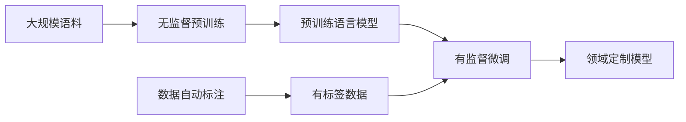

# 大语言模型原理与工程实践：有监督微调数据的自动化构建

## 1. 背景介绍
### 1.1 大语言模型的兴起
大语言模型(Large Language Model, LLM)是近年来自然语言处理(NLP)领域的重大突破。它们是在海量文本数据上训练的深度神经网络模型,具有强大的语言理解和生成能力。代表性的大语言模型包括GPT系列、BERT、T5等。这些模型在问答、对话、文本分类、文本生成等任务上取得了显著的性能提升,推动了NLP技术的快速发展。

### 1.2 有监督微调的必要性
尽管预训练的大语言模型已经具备了一定的语言能力,但它们在特定领域的任务上往往还需要进一步微调(Fine-tuning)才能达到最优性能。微调是在预训练模型的基础上,使用领域内的标注数据对模型进行二次训练的过程。然而,高质量的标注数据获取成本较高,通常需要大量人工标注,限制了微调的应用范围。因此,如何自动化构建用于微调的有监督数据,成为了大语言模型落地应用的关键问题之一。

### 1.3 本文的主要内容
本文将重点探讨大语言模型有监督微调数据的自动化构建方法。首先,我们将介绍几种常见的数据自动标注技术,包括基于规则、基于模型、基于众包的方法。然后,我们将详细讲解一种基于大语言模型的数据自动标注算法原理和实现步骤。接着,我们将通过实际项目案例,演示如何利用该算法自动生成高质量的微调数据。最后,我们将总结全文,并展望未来的研究方向和挑战。

## 2. 核心概念与联系
### 2.1 大语言模型
大语言模型是基于深度学习的语言模型,通过在大规模语料上进行无监督预训练,习得了丰富的语言知识。它们一般采用 Transformer 等注意力机制的神经网络架构,参数量动辄上百亿。预训练的目标是让模型学会对给定上下文预测下一个词,从而掌握词语之间的关联性。大语言模型为下游NLP任务提供了性能强大的基础模型。

### 2.2 有监督微调 
有监督微调是利用标注数据对预训练语言模型进行二次训练的过程。微调阶段通常会冻结大部分预训练参数,只更新顶层分类器或少量网络层的权重。这样可以在较小的数据集上快速适应具体任务,达到比从头训练更优的效果。微调使得大语言模型可以灵活应用到各种实际场景中。

### 2.3 数据自动标注
数据自动标注旨在减少人工标注的成本,自动为大规模无标签数据生成标签。常见的自动标注方法包括:
- 基于规则:人工定义一些启发式规则,用于从文本中抽取特定信息作为标签。
- 基于模型:先在少量标注数据上训练模型,然后用模型预测无标签数据的伪标签。可通过迭代的方式逐步扩充训练集。
- 基于众包:利用众包平台,将标注任务分发给众多网络工作者完成,从而加速标注过程。

数据自动标注与大语言模型微调的结合,为快速构建领域定制模型提供了新思路。

### 2.4 概念联系
下图展示了几个核心概念之间的关系:



## 3. 核心算法原理具体操作步骤
本节我们将详细介绍一种基于大语言模型的数据自动标注算法。该算法利用大语言模型强大的语言理解和生成能力,通过少量种子标注数据,自动生成大规模的伪标签数据。

### 3.1 算法原理
算法的核心思想是利用大语言模型在种子标注数据上进行"上下文学习",从而掌握标注任务的模式。然后,我们利用模型的生成能力,让其自动生成更多与种子数据相似的伪标签样本。具体来说,算法分为以下几个步骤:

1. 准备少量种子标注数据,每个样本形如 (x,y),其中 x 为文本,y 为对应的标签。
2. 对于每个种子样本 (x,y),构造一个模板字符串 "x [SEP] The label of the above text is y",其中 [SEP] 为分隔符。
3. 将所有模板字符串拼接成一个长文本,作为大语言模型的输入。
4. 对于每个待标注样本 x',构造一个查询字符串 "x' [SEP] The label of the above text is",作为大语言模型的输入前缀。
5. 利用大语言模型基于前缀生成后续标签文本,将生成结果解析为标签 y'。
6. 将 (x',y') 作为新的伪标签样本加入数据集。

### 3.2 算法步骤
基于以上原理,算法的具体操作步骤如下:

**输入**:
- 种子标注数据集 $D=\{(x_i,y_i)\}_{i=1}^n$
- 待标注数据集 $U=\{x'_j\}_{j=1}^m$
- 大语言模型 $\mathcal{M}$

**过程**:
1. 初始化伪标签数据集 $\tilde{D}=\emptyset$
2. 对于每个 $(x_i,y_i) \in D$:
   - 构造模板 $t_i=\texttt{concat}(x_i,\texttt{" [SEP] The label of the above text is "},y_i)$
3. 构造种子上下文 $C=\texttt{concat}(t_1, t_2, ..., t_n)$
4. 对于每个 $x'_j \in U$:
   - 构造查询 $q_j=\texttt{concat}(x'_j,\texttt{" [SEP] The label of the above text is "})$
   - 生成标签 $y'_j=\mathcal{M}(C,q_j)$
   - 将 $(x'_j,y'_j)$ 加入 $\tilde{D}$
5. 返回 $\tilde{D}$

**输出**:
- 伪标签数据集 $\tilde{D}=\{(x'_j,y'_j)\}_{j=1}^m$

以上就是基于大语言模型的数据自动标注算法的原理和步骤。该算法充分利用了大语言模型学习种子标注模式和生成相似样本的能力,可以显著降低人工标注成本。

## 4. 数学模型和公式详细讲解举例说明
本节我们将对算法中涉及的数学模型和公式进行详细讲解,并给出具体的例子说明。

### 4.1 大语言模型的数学描述
大语言模型可以用条件概率的形式来描述。给定一个文本序列 $x=(x_1,x_2,...,x_T)$,语言模型的目标是估计该序列的概率:

$$P(x)=\prod_{t=1}^T P(x_t|x_{<t})$$

其中 $x_{<t}=(x_1,x_2,...,x_{t-1})$ 表示 $x_t$ 之前的所有词。大语言模型通过最小化负对数似然损失函数来学习这个条件概率分布:

$$\mathcal{L}=-\sum_{x\in \mathcal{X}} \log P(x)=-\sum_{x\in \mathcal{X}}\sum_{t=1}^T \log P(x_t|x_{<t})$$

其中 $\mathcal{X}$ 为训练语料集合。

### 4.2 种子上下文的构造
在我们的算法中,第3步构造种子上下文 $C$ 的过程可以用下面的公式来表示:

$$C=\texttt{concat}(t_1, t_2, ..., t_n)$$

$$t_i=\texttt{concat}(x_i,\texttt{" [SEP] The label of the above text is "},y_i)$$

其中 $\texttt{concat}$ 表示字符串拼接操作,$\texttt{[SEP]}$ 为分隔符。举个例子,假设我们有两个种子标注样本:

$$(x_1,y_1)=(\texttt{"John is happy."},\texttt{positive})$$
$$(x_2,y_2)=(\texttt{"Mary is sad."},\texttt{negative})$$

则构造的模板字符串为:

$$t_1=\texttt{"John is happy. [SEP] The label of the above text is positive"}$$
$$t_2=\texttt{"Mary is sad. [SEP] The label of the above text is negative"}$$

拼接后的种子上下文为:

$$C=\texttt{"John is happy. [SEP] The label of the above text is positive Mary is sad. [SEP] The label of the above text is negative"}$$

### 4.3 标签的生成
在算法的第4步,我们利用大语言模型 $\mathcal{M}$ 基于查询 $q_j$ 生成标签 $y'_j$。这个过程可以表示为:

$$y'_j=\mathop{\arg\max}_{y} P(y|C,q_j)$$

其中 $P(y|C,q_j)$ 是大语言模型估计的在种子上下文 $C$ 和查询前缀 $q_j$ 下,标签 $y$ 的条件概率。生成标签的过程就是找到概率最大的标签序列。

举个例子,假设我们有一个待标注样本:

$$x'=\texttt{"Tom is excited."}$$

则构造的查询为:

$$q=\texttt{"Tom is excited. [SEP] The label of the above text is"}$$

假设语言模型 $\mathcal{M}$ 估计的标签概率为:

$$P(\texttt{positive}|C,q)=0.8$$
$$P(\texttt{negative}|C,q)=0.2$$

则生成的标签为:

$$y'=\mathop{\arg\max}_{y} P(y|C,q)=\texttt{positive}$$

最终得到的伪标签样本为:

$$(x',y')=(\texttt{"Tom is excited."},\texttt{positive})$$

以上就是算法中涉及的主要数学模型和公式的详细讲解和举例说明。

## 5. 项目实践：代码实例和详细解释说明
本节我们将通过一个实际的项目案例,演示如何使用 Python 代码实现基于大语言模型的数据自动标注算法。我们将使用 OpenAI 的 GPT-3 模型作为大语言模型,以情感分类任务为例。

### 5.1 环境准备
首先,我们需要安装必要的 Python 库,并设置 OpenAI API 密钥:

```python
!pip install openai
import openai
openai.api_key = "YOUR_API_KEY"
```

### 5.2 准备种子标注数据
我们准备少量的种子标注数据,每个样本包含一个文本和对应的情感标签(正面/负面):

```python
seed_data = [
    ("John is happy.", "positive"),
    ("Mary is sad.", "negative"),
    ("Tom is excited.", "positive"),
    ("Amy is angry.", "negative")
]
```

### 5.3 构造种子上下文
根据种子标注数据,我们构造种子上下文字符串:

```python
def build_seed_context(seed_data):
    context = ""
    for text, label in seed_data:
        template = f"{text} [SEP] The label of the above text is {label}\n"
        context += template
    return context

seed_context = build_seed_context(seed_data)
print(seed_context)
```

输出:
```
John is happy. [SEP] The label of the above text is positive
Mary is sad. [SEP] The label of the above text is negative
Tom is excited. [SEP] The label of the above text is positive
Amy is angry. [SEP] The label of the above text is negative
```

### 5.4 生成伪标签
对于每个待标注样本,我们构造查询前缀,然后利用 GPT-3 生成标签:

```python
def generate_label(text, seed_context):
    query = f"{text} [SEP] The label of the above text is"
    prompt = seed_context + query
    response = openai.Completion.create(
        engine="text-davinci-002",
        prompt=prompt,
        max_tokens=1,
        n=1,
        stop=None,
        temperature=0,
    )
    label = response.choices[0].text.strip()
    return label

unlabeled_data = [
    "I love this movie!",
    "The food was terrible.",
    "I had a great day today."
]

pseudo_labeled_data = []
for text in unlabeled_data:
    label = generate_label(text, seed_context)