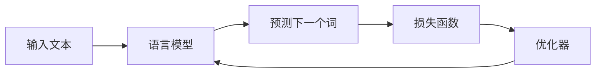

## 1.背景介绍

在近年来，大语言模型已经在各种自然语言处理任务中取得了显著的成功。从生成型任务（如文本生成、机器翻译）到判别型任务（如情感分类、问答系统），大语言模型都展现出了强大的能力。本文将深入探讨大语言模型的原理，并通过实例展示如何在实际项目中应用。

## 2.核心概念与联系

大语言模型是基于深度学习的模型，主要包括Transformer、BERT、GPT等。这些模型的核心是通过学习语言的统计规律，以理解和生成人类语言。模型的训练目标是最小化预测下一个词的损失函数。



## 3.核心算法原理具体操作步骤

以下是大语言模型训练的基本步骤：

1. **数据预处理**：首先，我们需要将原始的文本数据转化为模型可以处理的格式。这通常包括分词、构建词汇表、将词转化为向量等步骤。

2. **模型构建**：然后，我们需要构建模型。这通常包括定义模型的结构（如层数、隐藏单元数等）、初始化参数等步骤。

3. **模型训练**：接着，我们需要训练模型。这通常包括多轮的迭代，在每一轮中，模型会通过反向传播算法更新参数以最小化损失函数。

4. **模型评估**：最后，我们需要评估模型的性能。这通常包括在验证集上计算模型的损失函数、精度等指标。

## 4.数学模型和公式详细讲解举例说明

大语言模型的损失函数通常是交叉熵损失函数。对于给定的输入$x$和真实的下一个词$y$，模型预测的概率分布为$p$，那么交叉熵损失函数可以定义为：

$$
L = -\log p(y|x)
$$

模型的目标是最小化整个训练集上的平均损失：

$$
L = -\frac{1}{N}\sum_{i=1}^{N}\log p(y_i|x_i)
$$

其中，$N$是训练集的大小，$x_i$和$y_i$是第$i$个样本的输入和真实的下一个词。

## 5.项目实践：代码实例和详细解释说明

以下是一个简单的例子，展示如何使用PyTorch训练一个大语言模型。

```python
import torch
from torch import nn
from torch.nn import CrossEntropyLoss

# 定义模型
class LanguageModel(nn.Module):
    def __init__(self, vocab_size, hidden_size):
        super(LanguageModel, self).__init__()
        self.embedding = nn.Embedding(vocab_size, hidden_size)
        self.rnn = nn.GRU(hidden_size, hidden_size, batch_first=True)
        self.fc = nn.Linear(hidden_size, vocab_size)

    def forward(self, x):
        x = self.embedding(x)
        x, _ = self.rnn(x)
        x = self.fc(x)
        return x

# 初始化模型
model = LanguageModel(vocab_size, hidden_size)
optimizer = torch.optim.Adam(model.parameters())
criterion = CrossEntropyLoss()

# 训练模型
for epoch in range(num_epochs):
    for x, y in dataloader:
        optimizer.zero_grad()
        outputs = model(x)
        loss = criterion(outputs.view(-1, vocab_size), y.view(-1))
        loss.backward()
        optimizer.step()
```

## 6.实际应用场景

大语言模型已经被广泛应用在各种场景中，包括：

- **机器翻译**：模型可以学习源语言和目标语言之间的映射，以实现高质量的翻译。

- **文本生成**：模型可以生成连贯、有趣的文本，用于聊天机器人、创作助手等应用。

- **情感分类**：模型可以理解文本的情感，用于评论分析、舆情监控等应用。

## 7.工具和资源推荐

以下是一些有用的工具和资源：

- **PyTorch**：一个强大的深度学习框架，提供了丰富的模型和优化器，适合研究和开发。

- **Hugging Face Transformers**：一个提供了大量预训练模型（如BERT、GPT）的库，可以方便地进行微调和应用。

- **TensorBoard**：一个可视化工具，可以用来监控模型的训练过程，如损失函数、参数分布等。

## 8.总结：未来发展趋势与挑战

大语言模型已经取得了显著的成功，但仍面临一些挑战，如模型解释性、数据偏见等。未来，我们需要进一步研究如何解决这些问题，以推动大语言模型的发展。

## 9.附录：常见问题与解答

1. **Q: 大语言模型的训练需要多少数据？**

   A: 这取决于模型的复杂性和任务的难度。一般来说，更复杂的模型和更难的任务需要更多的数据。

2. **Q: 大语言模型可以生成多长的文本？**

   A: 这取决于模型的设计。一般来说，Transformer类模型可以生成任意长度的文本，但是生成的文本长度受到计算资源的限制。

3. **Q: 大语言模型的训练需要多久？**

   A: 这取决于模型的复杂性、数据的大小和计算资源。一般来说，大语言模型的训练需要大量的计算资源和时间。

作者：禅与计算机程序设计艺术 / Zen and the Art of Computer Programming