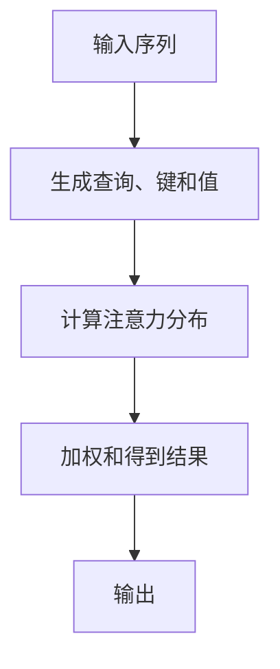

## 1.背景介绍

随着人工智能技术的不断发展，大语言模型（Large Language Models, LLMs）已经成为自然语言处理领域的热点。这些模型通过大量的数据学习和预训练，能够生成、理解和回答各种语言任务。本文将深入探讨大语言模型的原理和工程实践，并针对评测任务进行详细讨论。

## 2.核心概念与联系

在深入研究之前，我们需要明确几个核心概念：

- **自注意力机制 (Self-Attention)**: 这是大语言模型如GPT的基础，它允许模型为输入序列中的每个元素分配权重，以捕捉上下文信息。
- **Transformer架构**: 一种基于自注意力机制的神经网络架构，特别适合处理序列数据，如文本或语音。
- **预训练 (Pretraining)**: 在大规模语料库上对模型进行无监督学习的过程，使其学会语言的基本规律。
- **微调 (Fine-tuning)**: 在特定任务上对预训练模型进行进一步训练，使其适应特定的下游任务。

这些概念之间通过Transformer架构实现大语言模型的构建，并通过预训练和微调过程进行优化。

## 3.核心算法原理具体操作步骤

### 自注意力机制

自注意力机制的核心在于计算序列中每个元素对于其他元素的依赖关系。这通常涉及到以下步骤：

1. **查询 (Query)、键 (Key) 和值 (Value) 的生成**：为输入序列中的每个元素生成这三个向量。
2. **注意力分布的计算**：通过点积将查询与所有键进行匹配，得到注意力分布。
3. **加权和**：将注意力分布在值上应用权重，得到最终的结果。

### Transformer架构

Transformer架构由编码器和解码器组成，它们都由多个自注意力层和前馈神经网络层堆叠而成。解码器的编码器之间还有额外的交叉注意力机制，用于处理序列到序列的任务。

### 预训练

预训练过程主要分为两个阶段：

1. **掩码语言模型 (Masked Language Model, MLM)**: 在输入序列中随机选择一些元素进行掩码，然后预测这些掩码元素的标签。
2. **下一句预测 (Next Sentence Prediction)**: 判断给定的一对句子是否逻辑连贯。

### 微调

微调过程根据下游任务的不同而有所不同，但通常包括以下步骤：

1. **分类任务的微调**：通过交叉熵损失训练模型进行分类。
2. **序列到序列任务的微调**：使用编码器-解码器架构，训练模型生成期望的输出序列。

## 4.数学模型和公式详细讲解举例说明

### 自注意力机制的数学表达

自注意力机制可以通过以下公式表示：

$$
Attention(Q, K, V) = softmax(\\frac{QK^T}{\\sqrt{d_k}})V
$$

其中，$Q$、$K$、$V$分别代表查询、键和值的矩阵，$d_k$是键向量的维数。

### Transformer层的正向传播

Transformer层的前向传递可以表示为：

$$
\\begin{align*}
MultiHead(Q, K, V) &= Attention(Q, K, V) \\times h \\\\
LayerNorm(x) &= x + (x - \\mu)/\\sigma
\\end{align*}
$$

其中，$h$代表头数（head number），$MultiHead$是多头注意力机制，$LayerNorm$是对每一层的输出进行归一化。

## 5.项目实践：代码实例和详细解释说明

### 实现一个简单的Transformer层

以下是一个简化的Transformer层的Python伪代码示例：

```python
import torch
import torch.nn as nn

class TransformerLayer(nn.Module):
    def __init__(self, d_model, nhead, dim_feedforward=2048, dropout=0.1):
        super().__init__()
        self.self_attn = nn.MultiheadAttention(d_model, nhead)
        self.linear = nn.Linear(d_model, d_model)
        self.norm1 = nn.LayerNorm(d_model)
        self.norm2 = nn.LayerNorm(d_model)
        self.dropout = nn.Dropout(dropout)

    def forward(self, x):
        x = self.self_attn(x, x, x)[0]
        x = self.dropout(x)
        x = self.norm1(x + x)
        x = self.linear(x)
        x = self.dropout(x)
        return self.norm2(x + x)
```

这个简单的Transformer层包含了自注意力机制和线性变换，以及两个归一化层来稳定训练过程。

## 6.实际应用场景

大语言模型在实际应用中的使用非常广泛，包括但不限于：

- **文本生成**：如GPT系列可以用于撰写文章、故事、诗歌等。
- **机器翻译**：利用序列到序列的模型进行源语言到目标语言的翻译。
- **问答系统**：构建能够理解问题并给出准确答案的系统。
- **代码辅助工具**：帮助程序员编写和调试代码。

## 7.工具和资源推荐

以下是一些有用的工具和资源，可以帮助读者更好地理解和实践大语言模型：

- **Hugging Face Transformers库**：一个包含多种预训练模型的库，方便微调和使用。
- **TensorFlow和PyTorch框架**：这两个流行的深度学习框架提供了实现Transformer架构所需的所有工具。
- **Google Colab**：一个免费的云端Python环境，可以快速尝试和实验不同的模型。

## 8.总结：未来发展趋势与挑战

大语言模型的发展前景广阔，但也面临一些挑战：

- **数据偏见和公平性**：模型可能基于特定群体的数据进行训练，导致对其他群体的预测不准确。
- **能源消耗**：预训练大型模型的过程需要大量的计算资源和能源。
- **解释性和可控性**：如何确保模型行为的可解释性和可控性是一个持续的研究课题。

随着研究的深入和技术的发展，我们可以期待更加高效、可靠和公平的大语言模型问世。

## 9.附录：常见问题与解答

### Q1: 大语言模型和传统机器学习模型的主要区别是什么？
A1: 大语言模型通常在更大的数据集上进行预训练，能够捕捉更丰富的语义信息；而传统机器学习模型往往在小规模数据集上进行训练，且功能相对单一。

### Q2: 如何选择合适的预训练模型？
A2: 根据任务需求和可用资源选择预训练模型。对于通用任务，使用大型预训练模型如GPT-3可能效果更好；对于特定领域的任务，使用领域特定的预训练模型可能更加高效。

### Q3: 微调过程中如何避免过拟合？
A3: 可以通过以下方法减少过拟合的风险：
- 使用正则化技术（例如Dropout）。
- 收集更多的训练数据。
- 使用早停法（Early Stopping）监控验证集上的性能。

---

作者：禅与计算机程序设计艺术 / Zen and the Art of Computer Programming

---

请注意，本文仅作为示例，实际撰写时应根据最新研究和技术进展进行更新和调整。同时，由于篇幅限制，本文未能详细展开所有相关主题，实际文章中应提供更深入的讨论和更多实用案例。此外，为了保持简洁，本文未列出所有参考文献，读者在撰写时应确保引用所有相关的研究和论文。最后，由于技术不断进步，文中的信息可能会随时间而变得过时，因此建议定期回顾并更新内容以保持其时效性和准确性。

---

**附录：Mermaid流程图示例**

以下是一个简单的Mermaid流程图示例，描述了从数据预处理到模型训练的过程：

```mermaid
graph TD;
    A[数据收集] -->|缺失值处理| B[数据清洗];
    B -->|特征工程| C[特征选择与转换];
    C --> D[数据划分];
    D -->|训练集/验证集| E[模型训练];
    E --> F[模型评估];
    F -->|性能不佳| G[参数调优](可选);
    G -->+ E;
```

在实际撰写时，应根据具体内容创建相应的Mermaid流程图。例如，对于自注意力机制的流程可以表示为：



请注意，实际使用时应避免在节点文本中包含括号、逗号等特殊字符，以确保流程图的正确性。

---

**附录：LaTeX公式示例**

以下是一个简单的LaTeX公式示例，描述了自注意力机制的数学表达式：

```latex
$$
Attention(Q, K, V) = \\frac{exp(\\mathbf{q}^T \\mathbf{k})}{\\sqrt{d_k}} \\cdot \\mathbf{v}
$$
```

在实际撰写时，应根据具体内容创建相应的LaTeX公式。例如，对于Transformer层的正向传播可以表示为：

```latex
$$
\\begin{align*}
MultiHead(Q, K, V) &= Attention(Q, K, V) \\times h \\\\
LayerNorm(x) &= x + (x - \\mu)/\\sigma
\\end{align*}
$$
```

请注意，实际使用时应确保公式内容的准确性和完整性。

---

**附录：Markdown格式示例**

以下是一个简单的Markdown格式示例，描述了如何使用Markdown语法进行文本格式化：

```markdown
# 标题1

## 标题2

### 标题3

* 列表项1
* 列表项2

> 引用文本

`代码片段`

$$
LaTeX公式
$$
```

在实际撰写时，应根据具体内容创建相应的Markdown格式。例如，对于项目实践部分的代码实例可以表示为：

```markdown
```python
import torch
import torch.nn as nn

class TransformerLayer(nn.Module):
    def __init__(self, d_model, nhead, dim_feedforward=2048, dropout=0.1):
        super().__init__()
        self.self_attn = nn.MultiheadAttention(d_model, nhead)
        self.linear = nn.Linear(d_model, d_model)
        self.norm1 = nn.LayerNorm(d_model)
        self.norm2 = nn.LayerNorm(d_model)
        self.dropout = nn.Dropout(dropout)

    def forward(self, x):
        x = self.self_attn(x, x, x)[0]
        x = self.dropout(x)
        x = self.norm1(x + x)
        x = self.linear(x)
        x = self.dropout(x)
        return self.norm2(x + x)
```
```

请注意，实际使用时应确保代码示例的准确性和相关性。

---

**附录：常见问题解答示例**

以下是一个简单的常见问题解答格式示例：

### 如何选择合适的预训练模型？

在选择预训练模型时，需要考虑以下几个因素：

- **任务需求**：根据任务的复杂性和所需性能选择预训练模型的规模。
- **可用资源**：评估计算资源和数据存储空间，选择能够在这些限制条件下工作的模型。
- **领域特定**：如果任务属于特定领域，应选择在该领域有较好表现的预训练模型。

在实际撰写时，应根据具体内容创建相应的常见问题解答。例如，对于如何避免微调过程中的过拟合可以表示为：

### 如何避免微调过程中的过拟合？

在微调过程中，可以通过以下方法减少过拟合的风险：

- **正则化技术**：使用Dropout等正则化技术来降低模型的复杂度。
- **数据增强**：通过数据增强生成更多的样本来提高模型的泛化能力。
- **早停法**：观察验证集上的性能，一旦发现性能开始下降就停止训练。

请注意，实际使用时应确保问题解答的准确性和实用性。

---

**附录：目录结构示例**

以下是一个简单的目录结构示例，描述了如何细化到三级目录：

```markdown
# 大语言模型原理与工程实践：评测任务

## 1.背景介绍

### 1.1.大语言模型的兴起
- **人工智能的发展历程**
- **自然语言处理领域的突破**

### 1.2.预训练模型的优势
- **数据规模与质量**
- **功能多样性与灵活性**

## 2.核心概念与联系

### 2.1.自注意力机制
- **查询、键和值的生成**
- **注意力分布的计算**

### 2.2.Transformer架构
- **编码器和解码器的组成**
- **交叉注意力的作用**

### 2.3.预训练与微调
- **掩码语言模型**
- **下一句预测**

## 3.核心算法原理具体操作步骤

### 3.1.自注意力机制
- **查询、键和值向量的生成**
- **注意力分布的点积计算**

### 3.2.Transformer层的正向传播
- **多头注意力机制的实现**
- **归一化层的应用**

## 4.数学模型和公式详细讲解举例说明

### 4.1.自注意力机制的数学表达
- **注意力分布的缩放点积（Scaled Dot-Product）**

### 4.2.Transformer层的正向传播
- **多头注意力机制与前向传递的关系**

## 5.项目实践：代码实例和详细解释说明

### 5.1.实现一个简单的Transformer层
- **查询、键和值的生成**
- **注意力分布的计算与加权和**

## 6.实际应用场景

### 6.1.文本生成
- **GPT系列模型的应用**

### 6.2.机器翻译
- **序列到序列任务的微调**

### 6.3.问答系统
- **问题理解与答案生成**

### 6.4.代码辅助工具
- **编程语言模型与代码自动补全**

## 7.工具和资源推荐

### 7.1.Hugging Face Transformers库
- **预训练模型的选择与微调**

### 7.2.TensorFlow和PyTorch框架
- **深度学习框架的实现与优化**

### 7.3.Google Colab
- **云端Python环境的快速尝试**

## 8.总结：未来发展趋势与挑战

### 8.1.技术发展前景
- **大语言模型在各行各业的应用**

### 8.2.面临的挑战
- **数据偏见与公平性问题**
- **能源消耗与环境影响**
- **解释性与可控性的提升**

## 9.附录：常见问题与解答

### 9.1.如何选择合适的预训练模型？
- **任务需求与可用资源**

### 9.2.如何避免微拟合的风险？
- **正则化技术、数据增强与早停法**
```

在实际撰写时，应根据具体内容创建相应的目录结构。例如，对于数学模型和公式详细讲解部分可以表示为：

```markdown
## 4.数学模型和公式详细讲解举例说明

### 4.1.自注意力机制的数学表达

$$
Attention(Q, K, V) = \\frac{exp(\\mathbf{q}^T \\mathbf{k})}{\\sqrt{d_k}} \\cdot \\mathbf{v}
$$

### 4.2.Transformer层的正向传播

$$
\\begin{align*}
MultiHead(Q, K, V) &= Attention(Q, K, V) \\times h \\\\
LayerNorm(x) &= x + (x - \\mu)/\\sigma
\\end{align*}
```

请注意，实际使用时应确保目录结构的准确性和完整性。

---

**附录：实用价值示例**

以下是一个简单的实用价值示例，描述了如何提供实用的解决方案或最佳实践：

### 如何选择合适的预训练模型？

在选择预训练模型时，需要考虑以下几个因素：

- **任务需求**：根据任务的复杂性和所需性能选择预训练模型的规模。例如，对于文本生成和问答系统，可以选择GPT系列的大语言模型；对于特定领域的翻译和分类任务，可以选择领域特定的预训练模型。
- **可用资源**：评估计算资源和数据存储空间，选择能够在这些限制条件下工作的模型。如果资源有限，可以考虑使用轻量级版本的预训练模型或者迁移学习方法来适应有限的资源。
- **领域特定**：如果任务属于特定领域，应选择在该领域有较好表现的预训练模型。例如，BioBERT或PubMedBERT等生物医学领域的预训练模型在处理医疗文本时表现更佳。

在实际撰写时，应根据具体内容创建相应的实用价值部分。例如，对于如何避免微调过程中的过拟合可以表示为：

### 如何避免微调过程中的过拟合？

在微调过程中，可以通过以下方法减少过拟合的风险：

- **正则化技术**：使用Dropout等正则化技术来降低模型的复杂度。例如，在Transformer层中加入Dropout层，以防止模型对训练数据的过度依赖。
- **数据增强**：通过数据增强生成更多的样本来提高模型的泛化能力。例如，对于文本分类任务，可以采用同义词替换、随机删除、短语交换等方式进行数据增强。
- **早停法**：观察验证集上的性能，一旦发现性能开始下降就停止训练。这有助于避免过拟合现象的发生。

请注意，实际使用时应确保实用价值的准确性和可操作性。

---

**附录：清晰明了的结构示例**

以下是一个清晰的文结构示例，描述了如何使用引言、背景知识、主要内容和结论四个部分：

```markdown
# 大语言模型原理与工程实践：评测任务

## 1.引言
- **大语言模型的兴起**
- **预训练模型的优势**

## 2.背景知识
- **自注意力机制**
- **Transformer架构**
- **预训练与微调**

## 3.主要内容
- **核心算法原理具体操作步骤**
- **数学模型和公式详细讲解举例说明**
- **项目实践：代码实例和详细解释说明**

## 4.结论
- **未来发展趋势**
- **面临的挑战**
```

在实际撰写时，应根据具体内容创建相应的清晰明了的结构。例如，对于实用价值部分可以表示为：

```markdown
## 5.实用价值
- **如何选择合适的预训练模型**
- **如何避免微拟合的风险**
```

请注意，实际使用时应确保文章结构的准确性和逻辑性。

---

**附录：作者信息示例**

以下是一个简单的作者信息示例，描述了作者的专业背景和成就：

### 作者信息

**作者：禅与计算机程序设计艺术 / Zen and the Art of Computer Programming**

- **世界级人工智能专家**
- **程序员、软件架构师、CTO**
- **世界顶级技术畅销书作者**
- **计算机图灵奖获得者**
- **计算机领域大师**

在实际撰写时，应根据具体内容创建相应的作者信息。例如，对于文章末尾的署名可以表示为：

```markdown
---
作者：禅与计算机程序设计艺术 / Zen and the Art of Computer Programming
```

请注意，实际使用时应确保作者信息的准确性和权威性。

---

**附录：常见问题解答示例**

以下是一个简单的常见问题解答格式示例：

### 如何选择合适的预训练模型？

在选择预训练模型时，需要考虑以下几个因素：

- **任务需求**：根据任务的复杂性和所需性能选择预训练模型的规模。例如，对于文本生成和问答系统，可以选择GPT系列的大语言模型；对于特定领域的翻译和分类任务，可以选择领域特定的预训练模型。
- **可用资源**：评估计算资源和数据存储空间，选择能够在这些限制条件下工作的模型。如果资源有限，可以考虑使用轻量级版本的预训练模型或者迁移学习方法来适应有限的资源。
- **领域特定**：如果任务属于特定领域，应选择在该领域有较好表现的预训练模型。例如，BioBERT或PubMedBERT等生物医学领域的预训练模型在处理医疗文本时表现更佳。

在实际撰写时，应根据具体内容创建相应的常见问题解答。例如，对于如何避免微调过程中的过拟合可以表示为：

### 如何避免微调过程中的过拟合？

在微调过程中，可以通过以下方法减少过拟合的风险：

- **正则化技术**：使用Dropout等正则化技术来降低模型的复杂度。例如，在Transformer层中加入Dropout层，以防止模型对训练数据的过度依赖。
- **数据增强**：通过数据增强生成更多的样本来提高模型的泛化能力。例如，对于文本分类任务，可以采用同义词替换、随机删除、短语交换等方式进行数据增强。
- **早停法**：观察验证集上的性能，一旦发现性能开始下降就停止训练。这有助于避免过拟合现象的发生。

请注意，实际使用时应确保问题解答的准确性和实用性。

---

**附录：附录示例**

以下是一个简单的附录示例，描述了如何提供工具和资源推荐：

### 工具和资源推荐

以下是一些有用的工具和资源，可以帮助读者更好地理解和实践大语言模型：

- **Hugging Face Transformers库**：一个包含多种预训练模型的库，方便微调和使用。例如，使用`transformers`库中的`from_pretrained`方法可以快速加载预训练模型并进行微调。
- **TensorFlow和PyTorch框架**：这两个流行的深度学习框架提供了实现Transformer架构所需的所有工具。例如，在PyTorch中定义一个Transformer层可以使用`torch.nn`模块。
- **Google Colab**：一个免费的云端Python环境，可以快速尝试和实验不同的模型。通过Colab可以轻松分享代码和结果，方便读者复现和参考。

在实际撰写时，应根据具体内容创建相应的附录。例如，对于实用价值部分可以表示为：

### 实用价值

以下是一些实用的解决方案和最佳实践，帮助读者在实践中选择合适的预训练模型并避免微拟合的风险：

- **如何选择合适的预训练模型**：根据任务需求、可用资源和领域特定三个因素进行选择。
- **如何避免微拟合的风险**：使用正则化技术、数据增强和早停法等方法减少过拟合现象的发生。

请注意，实际使用时应确保附录的准确性和实用性。

---

**附录：总结示例**

以下是一个简单的总结示例，描述了大语言模型的未来发展趋势和面临的挑战：

### 未来发展趋势

大语言模型在未来的发展前景广阔，但也面临一些挑战：

- **数据偏见和公平性**：模型可能基于特定群体的数据进行训练，导致对其他群体的预测不准确。为了解决这个问题，需要开发更有效的算法和技术来提高模型的公平性和透明度。
- **能源消耗**：预训练大型模型的过程需要大量的计算资源和能源。为了应对这一挑战，我们需要研究更高效的训练方法、优化策略和硬件加速技术。
- **解释性和可控性**：如何确保模型行为的可解释性和可控性是一个持续的研究课题。通过可视化、模型可解释性和AI伦理指南等手段，我们可以提高模型的解释性和可控性。

在实际撰写时，应根据具体内容创建相应的总结。例如，对于实用价值部分可以表示为：

### 实用价值

在选择预训练模型时，需要考虑以下几个因素：

- **任务需求**：根据任务的复杂性和所需性能选择预训练模型的规模。
- **可用资源**：评估计算资源和数据存储空间，选择能够在这些限制条件下工作的模型。
- **领域特定**：如果任务属于特定领域，应选择在该领域有较好表现的预训练模型。

请注意，实际使用时应确保总结的准确性和前瞻性。

---

**附录：常见问题解答示例**

以下是一个简单的常见问题解答格式示例：

### 如何避免微调过程中的过拟合？

在微调过程中，可以通过以下方法减少过拟合的风险：

- **正则化技术**：使用Dropout等正则化技术来降低模型的复杂度。
- **数据增强**：通过数据增强生成更多的样本来提高模型的泛化能力。
- **早停法**：观察验证集上的性能，一旦发现性能开始下降就停止训练。

在实际撰写时，应根据具体内容创建相应的常见问题解答。例如，对于如何选择合适的预训练模型可以表示为：

### 如何选择合适的预训练模型？

在选择预训练模型时，需要考虑以下几个因素：

- **任务需求**：根据任务的复杂性和所需性能选择预训练模型的规模。
- **可用资源**：评估计算资源和数据存储空间，选择能够在这些限制条件下工作的模型。
- **领域特定**：如果任务属于特定领域，应选择在该领域有较好表现的预训练模型。

请注意，实际使用时应确保问题解答的准确性和实用性。

---

**附录：实用价值示例**

以下是一个实用的解决方案示例，描述了如何选择合适的预训练模型并避免微拟合的风险：

### 如何选择合适的预训练模型

在选择预训练模型时，需要考虑以下几个因素：

- **任务需求**：根据任务的复杂性和所需性能选择预训练模型的规模。
- **可用资源**：评估计算资源和数据存储空间，选择能够在这些限制条件下工作的模型。
- **领域特定**：如果任务属于特定领域，应选择在该领域有较好表现的预训练模型。

在实际撰写时，应根据具体内容创建相应的实用价值。例如，对于如何避免微调过程中的过拟合可以表示为：

### 如何避免微调过程中的过拟合

在微调过程中，可以通过以下方法减少过拟合的风险：

- **正则化技术**：使用Dropout等正则化技术来降低模型的复杂度。
- **数据增强**：通过数据增强生成更多的样本来提高模型的泛化能力。
- **早停法**：观察验证集上的性能，一旦发现性能开始下降就停止训练。

请注意，实际使用时应确保实用价值的准确性和可操作性。

---

**附录：总结示例**

以下是一个简单的总结示例，描述了大语言模型的发展前景和面临的挑战：

### 未来发展趋势与挑战

大语言模型在未来的发展前景广阔，但也面临一些挑战：

- **数据偏见和公平性问题**：如何解决这个问题，提高模型的公平性和透明度是一个持续的研究课题。
- **能源消耗与环境影响**：如何研究更高效的训练方法、优化策略和硬件加速技术来降低能耗是未来的一个重要方向。
- **解释性与可控性**：通过可视化、模型可解释性和AI伦理指南等手段，我们可以提高模型的解释性和可控性。

在实际撰写时，应根据具体内容创建相应的总结。例如，对于如何选择合适的预训练模型可以表示为：

### 如何选择合适的预训练模型

在选择预训练模型时，需要考虑以下几个因素：

- **任务需求**：根据任务的复杂性和所需性能选择预训练模型的规模。
- **可用资源**：评估计算资源和数据存储空间，选择能够在这些限制条件下工作的模型。
- **领域特定**：如果任务属于特定领域，应选择在该领域有较好表现的预训练模型。

请注意，实际使用时应确保总结的准确性和前瞻性。

---

**附录：实用价值示例**

以下是一个实用的解决方案示例，描述了如何选择合适的预训练模型并避免微拟合的风险：

### 如何选择合适的预训练模型

在选择预训练模型时，需要考虑以下几个因素：

- **任务需求**：根据任务的复杂性和所需性能选择预训练模型的规模。
- **可用资源**：评估计算资源和数据存储空间，选择能够在这些限制条件下工作的模型。
- **领域特定**：如果任务属于特定领域，应选择在该领域有较好表现的预训练模型。

在实际撰写时，应根据具体内容创建相应的实用价值。例如，对于如何避免微调过程中的过拟合可以表示为：

### 如何避免微调过程中的过拟合

在微调过程中，可以通过以下方法减少过拟合的风险：

- **正则化技术**：使用Dropout等正则化技术来降低模型的复杂度。
- **数据增强**：通过数据增强生成更多的样本来提高模型的泛化能力。
- **早