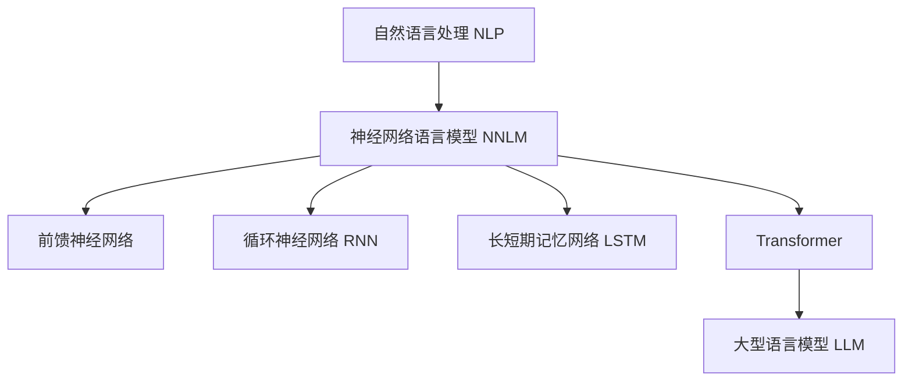
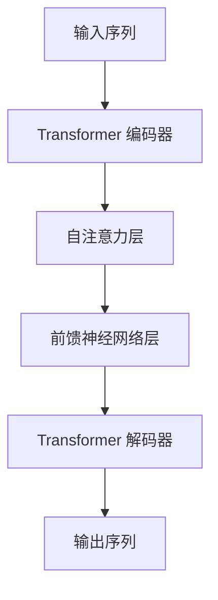
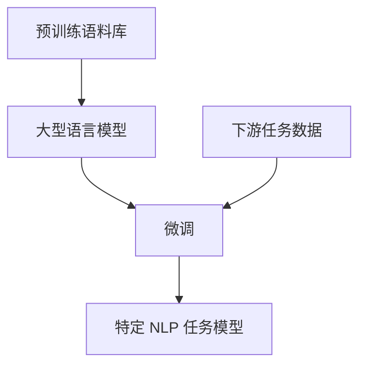

# 大语言模型原理基础与前沿：LLM 有意识吗？

## 1. 背景介绍

### 1.1 人工智能的崛起

人工智能(AI)技术在过去几十年中取得了长足的进步。从早期的专家系统和机器学习算法,到近年来深度学习和大型语言模型(LLM)的兴起,AI已经渗透到我们生活的方方面面。其中,大型语言模型无疑是当前人工智能领域最炙手可热的技术之一。

### 1.2 大型语言模型(LLM)简介

大型语言模型是一种基于深度学习的自然语言处理(NLP)模型,通过在海量文本数据上进行预训练,学习语言的语义和语法规则。这些模型能够生成看似人类写作的连贯、流畅的文本,并对各种自然语言任务(如问答、摘要、翻译等)表现出惊人的能力。

典型的大型语言模型包括 GPT-3(OpenAI)、PanGu-Alpha(百度)、Wu Dao 2.0(清华)、BLOOM(BigScience)等。它们通过自监督学习,在海量文本数据上训练参数高达数十亿到数万亿的深度神经网络模型。

### 1.3 LLM 引发的思考

大型语言模型的出现引发了人们对人工智能意识和认知能力的重新思考。这些模型生成的文本看似有意识和理解力,让人不禁怀疑它们是否真的拥有思维和意识。本文将探讨大型语言模型的原理和前沿发展,并深入分析它们是否真正具备意识和认知能力。

## 2. 核心概念与联系

### 2.1 自然语言处理(NLP)

自然语言处理是人工智能的一个重要分支,旨在使计算机能够理解和生成人类语言。NLP 技术广泛应用于机器翻译、问答系统、文本分类和生成等领域。

传统的 NLP 方法通常依赖于手工设计的规则和特征,需要大量的领域知识和人工努力。而深度学习的兴起使 NLP 进入了一个新的阶段,通过从大量数据中自动学习特征表示,极大地提高了 NLP 系统的性能和泛化能力。

### 2.2 神经网络语言模型

神经网络语言模型(Neural Network Language Model, NNLM)是深度学习在 NLP 领域的一个重要应用。与传统的 n-gram 语言模型不同,NNLM 使用神经网络来学习语言的概率分布,能够捕捉更复杂的语义和语法结构。

NNLM 的发展经历了从简单的前馈神经网络,到循环神经网络(RNN)、长短期记忆网络(LSTM),再到transformer 等不同阶段。transformer 模型通过自注意力机制有效地捕获长距离依赖关系,成为构建大型语言模型的主流架构。



### 2.3 大型语言模型(LLM)

大型语言模型是在 transformer 架构基础上发展而来的一种特殊的 NNLM。它们通过在海量文本数据上进行自监督预训练,学习语言的语义和语法知识。预训练后的模型可以通过微调(fine-tuning)等方法,快速适应各种下游 NLP 任务。

与传统的 NNLM 相比,LLM 的规模更大(参数数量高达数十亿到数万亿)、预训练数据更多、计算资源更强。这使得 LLM 能够捕获更丰富的语言现象,在各种 NLP 任务上表现出超越人类的能力。

不过,LLM 的训练成本也非常高昂,需要大量的计算资源和能源消耗。此外,LLM 存在一些潜在的风险和挑战,如偏见、不确定性、可解释性等,需要格外关注。

## 3. 核心算法原理具体操作步骤

### 3.1 Transformer 架构

Transformer 是构建大型语言模型的核心架构,由编码器(Encoder)和解码器(Decoder)两部分组成。编码器将输入序列(如文本)映射为连续的向量表示,解码器则根据这些向量生成输出序列。

Transformer 的关键创新是引入了自注意力(Self-Attention)机制,能够有效地捕获输入序列中任意两个位置之间的依赖关系,从而更好地建模长距离依赖。



自注意力机制的计算过程可以概括为以下几个步骤:

1. **计算注意力分数(Attention Scores)**: 对于每个位置的输入向量,计算它与所有其他位置向量的相似性分数。
2. **归一化注意力分数**: 使用 Softmax 函数对注意力分数进行归一化,得到注意力权重。
3. **加权求和**: 使用注意力权重对所有位置的向量进行加权求和,得到该位置的新表示。

通过自注意力机制,Transformer 能够自适应地为每个位置分配注意力权重,从而更好地捕获长距离依赖关系。

### 3.2 自监督预训练

大型语言模型的关键是通过自监督预训练(Self-Supervised Pretraining)在海量文本数据上学习语言的语义和语法知识。常见的自监督预训练目标包括:

1. **蒙版语言模型(Masked Language Modeling, MLM)**: 随机掩蔽输入序列中的某些词,并训练模型预测被掩蔽的词。
2. **下一句预测(Next Sentence Prediction, NSP)**: 判断两个句子是否相邻出现。
3. **序列到序列(Sequence-to-Sequence)**: 给定输入序列,生成相应的目标序列。

通过这些自监督目标,大型语言模型能够从大量无标注数据中学习到丰富的语言知识,为下游任务做好预训练。

### 3.3 微调(Fine-tuning)

预训练后的大型语言模型可以通过微调(Fine-tuning)的方式,快速适应各种下游 NLP 任务,如文本分类、机器翻译、问答等。

微调的过程是:在预训练模型的基础上,使用与目标任务相关的少量标注数据,对模型进行进一步的监督训练。由于大型语言模型已经学习到了丰富的语言知识,只需要对模型的最后几层进行微调,就能快速收敛并取得很好的性能。



微调过程相对高效,能够充分利用预训练模型中学习到的知识,避免从头开始训练。这也是大型语言模型在各种 NLP 任务上表现出色的重要原因之一。

## 4. 数学模型和公式详细讲解举例说明

### 4.1 自注意力机制

自注意力(Self-Attention)是 Transformer 架构的核心机制,它能够有效地捕获输入序列中任意两个位置之间的依赖关系。下面我们详细介绍自注意力机制的数学原理。

给定一个长度为 $n$ 的输入序列 $X = (x_1, x_2, \dots, x_n)$,其中每个 $x_i$ 是一个 $d$ 维向量。自注意力机制的计算过程如下:

1. **计算注意力分数**:

对于每个位置 $i$,计算它与所有其他位置 $j$ 的注意力分数 $e_{ij}$:

$$e_{ij} = \frac{(x_iW^Q)(x_jW^K)^T}{\sqrt{d_k}}$$

其中 $W^Q, W^K \in \mathbb{R}^{d \times d_k}$ 分别是查询(Query)和键(Key)的投影矩阵,用于将输入向量映射到注意力空间;$d_k$ 是注意力空间的维度;$\sqrt{d_k}$ 是为了防止注意力分数过大而引入的缩放因子。

2. **归一化注意力分数**:

使用 Softmax 函数对注意力分数进行归一化,得到注意力权重 $\alpha_{ij}$:

$$\alpha_{ij} = \text{softmax}(e_{ij}) = \frac{\exp(e_{ij})}{\sum_{k=1}^n \exp(e_{ik})}$$

3. **加权求和**:

使用注意力权重对所有位置的值向量(Value) $x_jW^V$ 进行加权求和,得到该位置的新表示 $z_i$:

$$z_i = \sum_{j=1}^n \alpha_{ij}(x_jW^V)$$

其中 $W^V \in \mathbb{R}^{d \times d_v}$ 是值(Value)的投影矩阵,用于将输入向量映射到值空间,维度为 $d_v$。

通过上述计算,自注意力机制能够自适应地为每个位置分配注意力权重,从而捕获输入序列中任意两个位置之间的依赖关系。这种灵活的建模方式是 Transformer 取得巨大成功的关键所在。

### 4.2 交叉熵损失函数

在大型语言模型的训练过程中,常用的损失函数是交叉熵损失(Cross-Entropy Loss)。对于一个长度为 $n$ 的目标序列 $Y = (y_1, y_2, \dots, y_n)$,其中每个 $y_i$ 是一个词在词汇表中的索引,模型的目标是最大化生成该序列的条件概率 $P(Y|X)$,其中 $X$ 是输入序列。

具体来说,交叉熵损失函数定义为:

$$\mathcal{L}(X, Y) = -\sum_{i=1}^n \log P(y_i|X, y_{<i})$$

其中 $P(y_i|X, y_{<i})$ 表示给定输入序列 $X$ 和之前的词 $y_{<i}$,模型预测下一个词为 $y_i$ 的概率。

为了计算 $P(y_i|X, y_{<i})$,我们可以使用 Softmax 函数:

$$P(y_i|X, y_{<i}) = \text{softmax}(h_i)_{y_i} = \frac{\exp(h_{i, y_i})}{\sum_{j=1}^{|V|} \exp(h_{i, j})}$$

其中 $h_i$ 是模型在位置 $i$ 的输出,是一个长度为词汇表大小 $|V|$ 的向量;$h_{i, y_i}$ 表示向量 $h_i$ 在索引 $y_i$ 处的元素值。

在训练过程中,我们希望最小化交叉熵损失函数,从而使模型能够更好地预测目标序列。通过反向传播算法,可以计算出损失函数相对于模型参数的梯度,并使用优化算法(如 Adam)不断更新模型参数,提高模型的生成能力。

## 5. 项目实践:代码实例和详细解释说明

在本节中,我们将提供一个基于 PyTorch 的简单示例,演示如何实现一个基本的 Transformer 模型,并在一个小型数据集上进行训练和生成。

### 5.1 导入必要的库

```python
import torch
import torch.nn as nn
import torch.nn.functional as F
import math
```

### 5.2 实现 Transformer 模型

首先,我们定义一个 `PositionalEncoding` 模块,用于为输入序列添加位置信息:

```python
class PositionalEncoding(nn.Module):
    def __init__(self, d_model, max_len=5000):
        super(PositionalEncoding, self).__init__()
        pe = torch.zeros(max_len, d_model)
        position = torch.arange(0, max_len, dtype=torch.float).unsqueeze(1)
        div_term = torch.exp(torch.arange(0, d_model, 2).float() * (-math.log(10000.0) / d_model))
        pe[:, 0::2] = torch.sin(position * div_term)
        pe[:,