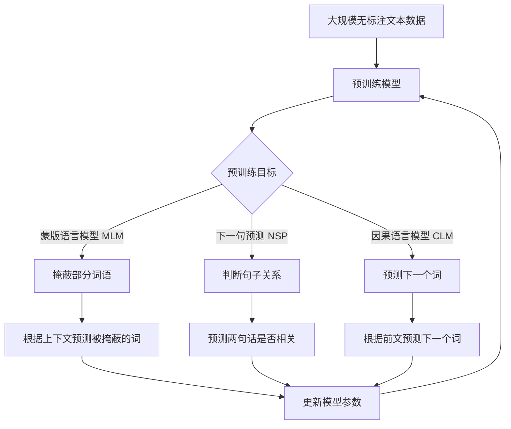
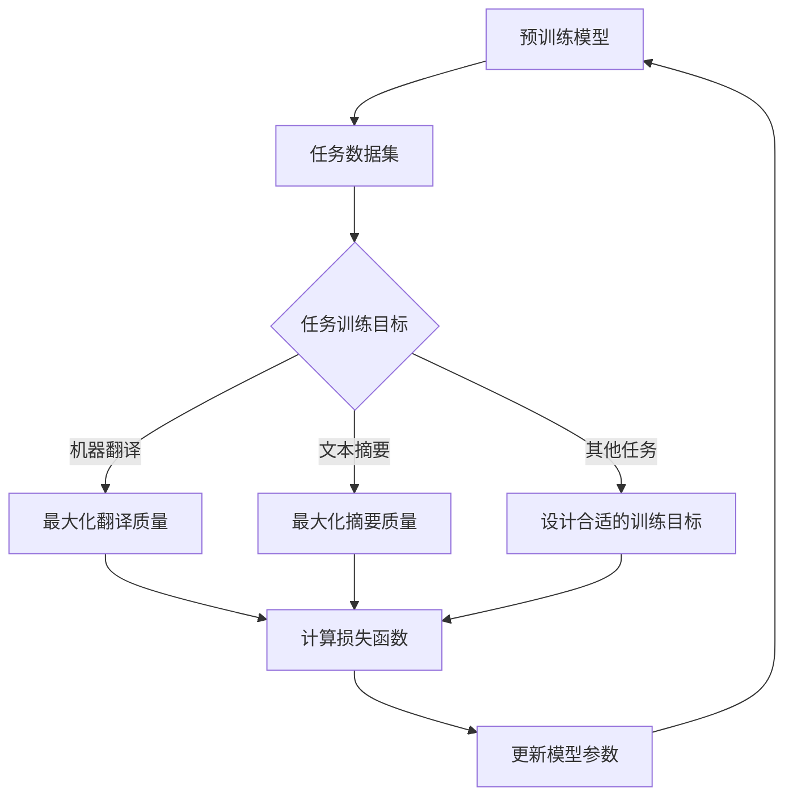

# 大语言模型原理基础与前沿 估算训练模型的排放量

## 1.背景介绍

### 1.1 人工智能的飞速发展

在过去几年中,人工智能(AI)技术取得了长足的进步,尤其是在自然语言处理(NLP)和计算机视觉等领域。这些进展很大程度上归功于深度学习模型的发展,特别是大型语言模型和计算机视觉模型。

### 1.2 大语言模型的兴起

大型语言模型是一种利用海量文本数据进行预训练的深度学习模型。这些模型能够捕捉文本数据中的复杂语义和上下文信息,并可应用于各种自然语言处理任务,如机器翻译、文本生成、问答系统等。代表性的大型语言模型包括 GPT(Generative Pre-trained Transformer)、BERT(Bidirectional Encoder Representations from Transformers)和 T5(Text-to-Text Transfer Transformer)等。

### 1.3 训练大语言模型的挑战

训练大型语言模型需要消耗大量的计算资源和能源。以 GPT-3 为例,它拥有 1750 亿个参数,在训练过程中消耗了数百万美元的计算成本和大量的电力。这不仅对环境造成了负面影响,也限制了许多组织和个人开发和使用这些模型的能力。

## 2.核心概念与联系

### 2.1 深度学习模型

深度学习模型是一种利用多层神经网络来学习数据特征的机器学习模型。这些模型通过反向传播算法对网络参数进行优化,从而逐步提高模型在特定任务上的性能。

### 2.2 自然语言处理(NLP)

自然语言处理是一个研究领域,旨在让计算机能够理解和生成人类语言。NLP 任务包括机器翻译、文本摘要、情感分析、问答系统等。

### 2.3 预训练与微调

预训练是指使用大量无标注数据对模型进行初始训练,以捕捉数据中的一般性模式。微调是指在预训练模型的基础上,使用有标注的任务数据对模型进行进一步训练,以适应特定的下游任务。

### 2.4 变压器(Transformer)模型

Transformer 是一种基于注意力机制的序列到序列模型,被广泛应用于自然语言处理和计算机视觉等领域。它不依赖于循环神经网络(RNN)和卷积神经网络(CNN),而是通过自注意力机制来捕捉输入序列中的长程依赖关系。

### 2.5 模型参数量与计算复杂度

模型参数量是指需要在训练过程中学习的参数的数量。一般来说,参数量越大,模型的表达能力就越强,但同时也需要更多的计算资源进行训练。计算复杂度则描述了模型在推理过程中所需的计算量,这直接影响了模型的推理速度和能源消耗。

## 3.核心算法原理具体操作步骤

### 3.1 预训练阶段

大型语言模型的训练通常分为两个阶段:预训练和微调。在预训练阶段,模型使用大量无标注的文本数据进行训练,目标是学习文本数据中的一般性语义和上下文信息。常见的预训练目标包括:

1. **蒙版语言模型(Masked Language Modeling, MLM)**: 随机掩蔽输入序列中的一些词,并让模型根据上下文预测被掩蔽的词。
2. **下一句预测(Next Sentence Prediction, NSP)**: 给定两个句子,让模型判断第二个句子是否为第一个句子的下一句。
3. **因果语言模型(Causal Language Modeling, CLM)**: 给定一个文本序列,模型需要预测下一个词。

预训练过程通常采用自监督学习的方式,利用大量无标注数据对模型进行初始化训练。这个过程非常计算密集,需要消耗大量的计算资源和能源。



### 3.2 微调阶段

在微调阶段,预训练模型将被进一步训练以适应特定的下游任务,如机器翻译、文本摘要等。这个过程通常使用相对较小的任务数据集,并根据任务的特点设计合适的训练目标和损失函数。



微调过程相对于预训练阶段计算量较小,但仍需要一定的计算资源。通过微调,预训练模型可以针对特定任务进行优化,提高模型在该任务上的性能。

## 4.数学模型和公式详细讲解举例说明

### 4.1 自注意力机制

自注意力机制是 Transformer 模型的核心组件,它允许模型捕捉输入序列中任意两个位置之间的依赖关系。给定一个输入序列 $X = (x_1, x_2, \ldots, x_n)$,自注意力机制首先计算每个位置与所有其他位置之间的相关性分数:

$$
\text{Attention}(Q, K, V) = \text{softmax}\left(\frac{QK^T}{\sqrt{d_k}}\right)V
$$

其中 $Q$、$K$ 和 $V$ 分别表示查询(Query)、键(Key)和值(Value),它们都是输入序列 $X$ 通过不同的线性变换得到的。$d_k$ 是缩放因子,用于防止点积的值过大导致梯度消失或爆炸。

计算出的注意力权重可以看作是对输入序列中每个位置的重要性分配。通过将注意力权重与值 $V$ 相乘并求和,我们可以获得该位置的注意力表示:

$$
\text{Attention}_i = \sum_{j=1}^n \alpha_{ij}v_j
$$

其中 $\alpha_{ij}$ 是位置 $i$ 对位置 $j$ 的注意力权重,而 $v_j$ 是位置 $j$ 的值向量。

自注意力机制允许模型在编码输入序列时,充分利用序列中的上下文信息,从而提高模型的表达能力。

### 4.2 transformer 模型架构

Transformer 模型由编码器(Encoder)和解码器(Decoder)两个主要部分组成。编码器负责编码输入序列,而解码器则根据编码器的输出生成目标序列。

编码器由多个相同的编码器层堆叠而成,每个编码器层包含两个子层:多头自注意力子层和前馈网络子层。多头自注意力子层允许每个位置的表示与输入序列中的其他位置进行交互,捕捉序列的上下文信息。前馈网络子层则对每个位置的表示进行独立的非线性变换,提供额外的表达能力。

解码器的结构与编码器类似,但在多头自注意力子层之后,还添加了一个编码器-解码器注意力子层。该子层允许每个输出位置的表示与输入序列中的所有位置进行交互,从而捕捉输入和输出序列之间的依赖关系。

数学上,给定输入序列 $X = (x_1, x_2, \ldots, x_n)$ 和目标序列 $Y = (y_1, y_2, \ldots, y_m)$,Transformer 模型的目标是最大化条件概率 $P(Y|X)$。在训练过程中,模型会最小化负对数似然损失函数:

$$
\mathcal{L}(\theta) = -\frac{1}{m}\sum_{t=1}^m \log P(y_t|y_{<t}, X; \theta)
$$

其中 $\theta$ 表示模型参数,而 $y_{<t}$ 表示目标序列中位置 $t$ 之前的所有词。通过梯度下降优化算法,模型可以逐步更新参数 $\theta$,提高在训练数据上的性能。

## 5.项目实践:代码实例和详细解释说明

为了更好地理解 Transformer 模型的工作原理,我们提供了一个基于 PyTorch 的简化实现示例。这个示例实现了一个基本的 Transformer 编码器,用于对输入序列进行编码。

```python
import torch
import torch.nn as nn
import math

# 缩放点积注意力
class ScaledDotProductAttention(nn.Module):
    def __init__(self, d_k):
        super().__init__()
        self.d_k = d_k

    def forward(self, Q, K, V):
        scores = torch.matmul(Q, K.transpose(-2, -1)) / math.sqrt(self.d_k)
        attn_weights = nn.Softmax(dim=-1)(scores)
        output = torch.matmul(attn_weights, V)
        return output

# 多头注意力
class MultiHeadAttention(nn.Module):
    def __init__(self, d_model, num_heads):
        super().__init__()
        self.num_heads = num_heads
        self.head_dim = d_model // num_heads
        self.qkv_linear = nn.Linear(d_model, 3 * d_model)
        self.out_linear = nn.Linear(d_model, d_model)
        self.attention = ScaledDotProductAttention(self.head_dim)

    def forward(self, x):
        batch_size = x.size(0)
        qkv = self.qkv_linear(x).view(batch_size, -1, 3, self.num_heads, self.head_dim)
        q, k, v = qkv.permute(2, 0, 3, 1, 4)

        attn_output = self.attention(q, k, v)
        attn_output = attn_output.permute(0, 2, 1, 3).contiguous().view(batch_size, -1, self.num_heads * self.head_dim)
        output = self.out_linear(attn_output)
        return output

# 前馈网络
class FeedForward(nn.Module):
    def __init__(self, d_model, d_ff):
        super().__init__()
        self.linear1 = nn.Linear(d_model, d_ff)
        self.linear2 = nn.Linear(d_ff, d_model)
        self.relu = nn.ReLU()

    def forward(self, x):
        x = self.linear1(x)
        x = self.relu(x)
        x = self.linear2(x)
        return x

# 编码器层
class EncoderLayer(nn.Module):
    def __init__(self, d_model, num_heads, d_ff):
        super().__init__()
        self.attn = MultiHeadAttention(d_model, num_heads)
        self.ff = FeedForward(d_model, d_ff)
        self.norm1 = nn.LayerNorm(d_model)
        self.norm2 = nn.LayerNorm(d_model)

    def forward(self, x):
        residual = x
        x = self.norm1(x + self.attn(x))
        x = self.norm2(x + self.ff(x))
        return x

# 编码器
class Encoder(nn.Module):
    def __init__(self, d_model, num_heads, d_ff, num_layers):
        super().__init__()
        self.layers = nn.ModuleList([EncoderLayer(d_model, num_heads, d_ff) for _ in range(num_layers)])

    def forward(self, x):
        for layer in self.layers:
            x = layer(x)
        return x
```

在这个示例中,我们首先实现了缩放点积注意力机制,它是计算自注意力权重的核心。然后,我们构建了多头注意力模块,它将输入分成多个头,并对每个头进行缩放点积注意力计算,最后将所有头的结果拼接起来。

前馈网络是一个简单的两层全连接网络,它对每个位置的表示进行独立的非线性变换。

编码器层将多头注意力和前馈网络结合在一起,并使用残差连接和层归一化来提高训练稳定性。最后,编码器由多个编码器层堆叠而成。

在实际应用中,我们可以使用这个