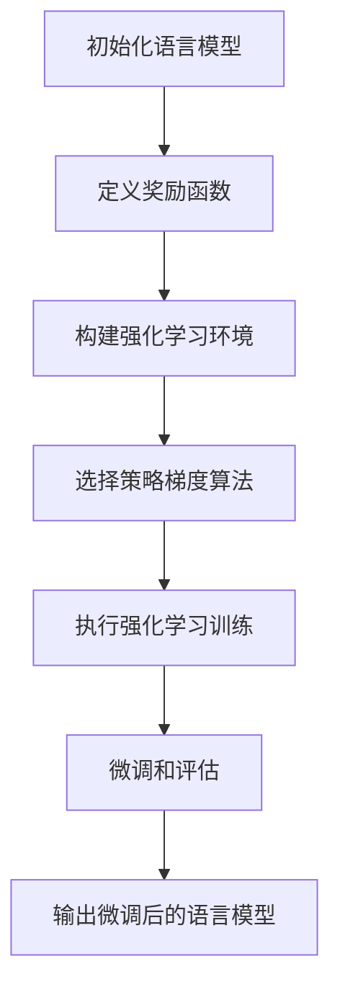
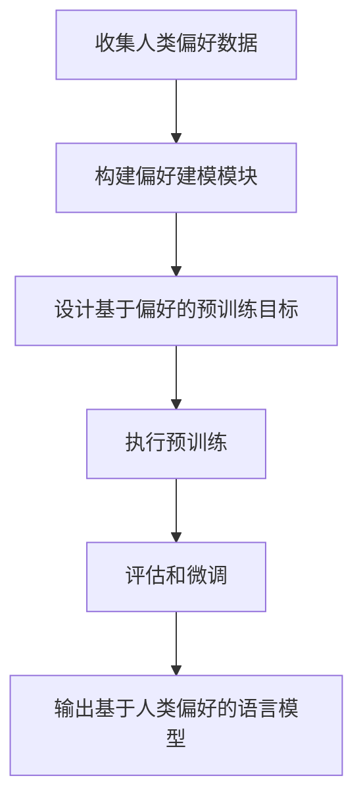

以下是标题为《大语言模型原理基础与前沿 基于强化学习的微调和基于人类偏好的预训练》的技术博客文章正文内容：

# 大语言模型原理基础与前沿 基于强化学习的微调和基于人类偏好的预训练

## 1.背景介绍

### 1.1 大语言模型的兴起

近年来,大型语言模型(Large Language Models, LLMs)在自然语言处理领域取得了令人瞩目的成就。这些模型通过在海量文本数据上进行预训练,学习到了丰富的语言知识和上下文表示能力,展现出惊人的泛化性能。

代表性的大语言模型包括GPT(Generative Pre-trained Transformer)系列、BERT(Bidirectional Encoder Representations from Transformers)、XLNet、RoBERTa等,它们在广泛的自然语言处理任务中表现出色,如文本生成、机器翻译、问答系统、文本摘要等。

### 1.2 大语言模型的局限性

尽管大语言模型取得了卓越的成绩,但它们也存在一些明显的局限性:

1. **数据驱动的局限性**:大语言模型的性能高度依赖于训练数据的质量和数量。当训练数据存在偏差或噪声时,模型的表现可能会受到影响。

2. **缺乏因果推理能力**:大语言模型擅长捕捉文本中的统计模式,但缺乏对因果关系的深入理解。它们难以进行复杂的推理和决策。

3. **缺乏交互性和持续学习能力**:大语言模型通常是在静态数据集上进行一次性预训练,缺乏与人类进行交互和持续学习的能力。

4. **存在不确定性和不可控性**:大语言模型的输出可能存在不确定性和不可控性,有时会产生不合理或有害的内容。

为了解决这些局限性,研究人员提出了多种改进方法,其中包括基于强化学习的微调和基于人类偏好的预训练等前沿技术。

## 2.核心概念与联系

### 2.1 强化学习与序列生成任务

强化学习(Reinforcement Learning, RL)是机器学习的一个重要分支,它研究如何通过与环境的交互来学习一个最优策略,以最大化预期的累积奖励。

在序列生成任务(如机器翻译、文本摘要等)中,可以将语言模型视为一个智能体(Agent),其目标是生成高质量的序列以获得最大奖励。通过与环境(如人类评分或任务指标)的交互,语言模型可以学习到一个优化的生成策略。

基于强化学习的微调技术就是将这一思想应用于大语言模型的微调过程中。具体来说,我们可以设计一个奖励函数来衡量生成序列的质量,然后使用强化学习算法(如策略梯度算法)来优化语言模型的参数,使其能够生成更高质量的序列。

### 2.2 人类偏好与语言模型预训练

人类偏好(Human Preferences)是指人类对于某些输出或行为的主观偏好或价值判断。在自然语言处理领域,人类偏好可以体现在对语言模型输出的评价中,例如对于文本的流畅性、一致性、信息量等方面的评价。

基于人类偏好的预训练技术旨在将人类的主观偏好融入到语言模型的预训练过程中,使得模型在预训练阶段就能够学习到人类期望的语言模式和属性。这种方法可以看作是一种主动式的知识注入,有助于提高语言模型的性能和可控性。

人类偏好的获取方式通常包括人工标注、在线评分、对比学习等。将人类偏好融入预训练过程的具体方法包括构建基于偏好的损失函数、设计基于偏好的数据增强策略等。

### 2.3 两种技术的关联

基于强化学习的微调和基于人类偏好的预训练技术虽然在应用阶段不同,但它们都旨在提高语言模型的性能和可控性,并且具有一定的关联性:

1. **目标一致性**:两种技术都致力于使语言模型的输出更加符合人类的期望和偏好,从而提高模型的实用性和可靠性。

2. **交互式学习**:两种技术都需要与人类进行交互,以获取奖励信号或偏好反馈,实现持续的优化和学习。

3. **算法共享**:一些强化学习算法(如Actor-Critic算法)可以同时应用于基于强化学习的微调和基于人类偏好的预训练中。

4. **联合优化**:未来可以探索将两种技术进行有机结合,在预训练和微调阶段同时利用强化学习和人类偏好,实现更全面的优化。

## 3.核心算法原理具体操作步骤

### 3.1 基于强化学习的微调

基于强化学习的微调技术通常包括以下主要步骤:

1. **定义奖励函数(Reward Function)**:根据任务目标和要求,设计一个合适的奖励函数,用于评估生成序列的质量。常见的奖励函数包括基于评估指标(如BLEU、ROUGE等)的函数、基于人工评分的函数等。

2. **构建强化学习环境(RL Environment)**:将序列生成任务建模为一个强化学习环境,其中语言模型作为智能体,通过生成序列与环境进行交互,并根据奖励函数获得奖励信号。

3. **选择强化学习算法(RL Algorithm)**:选择合适的强化学习算法,如策略梯度算法(Policy Gradient)、Actor-Critic算法等,用于优化语言模型的参数。

4. **执行强化学习训练**:在强化学习环境中,使用选定的算法对语言模型进行训练,通过不断的交互和奖励反馈,逐步优化模型的生成策略。

5. **微调和评估**:在训练过程中,定期对模型进行微调和评估,观察性能的变化,并根据需要调整超参数或训练策略。

以下是一个基于策略梯度算法进行微调的示例流程图:

### 3.2 基于人类偏好的预训练

基于人类偏好的预训练技术通常包括以下主要步骤:

1. **获取人类偏好数据**:通过人工标注、在线评分、对比学习等方式,收集人类对于语言模型输出的偏好反馈数据。

2. **构建偏好建模模块**:设计一个模块,用于从人类偏好数据中学习偏好模式,并将其编码为可供语言模型学习的表示形式。

3. **设计基于偏好的预训练目标**:根据偏好建模模块的输出,设计一个新的预训练目标或损失函数,用于引导语言模型学习人类偏好。

4. **执行预训练**:在大规模文本数据上,结合基于偏好的预训练目标,对语言模型进行预训练,使其能够学习到人类期望的语言模式和属性。

5. **评估和微调**:在预训练后,可以对模型进行评估和进一步的任务特定微调,以提高在下游任务上的性能。

以下是一个基于人类偏好的预训练流程图:

## 4.数学模型和公式详细讲解举例说明

在基于强化学习的微调和基于人类偏好的预训练中,涉及到一些重要的数学模型和公式,下面将对其进行详细讲解和举例说明。

### 4.1 策略梯度算法(Policy Gradient)

策略梯度算法是一种常用的强化学习算法,适用于连续动作空间的情况。在基于强化学习的微调中,它被用于优化语言模型的生成策略。

策略梯度算法的目标是最大化预期的累积奖励,即:

$$J(\theta) = \mathbb{E}_{\tau \sim p_\theta(\tau)} \left[ \sum_{t=0}^{T} r(s_t, a_t) \right]$$

其中,$\theta$表示策略参数,$\tau$表示一个轨迹序列(trajectory),$p_\theta(\tau)$是在策略$\pi_\theta$下产生轨迹$\tau$的概率密度函数,$r(s_t, a_t)$是在状态$s_t$执行动作$a_t$时获得的奖励。

为了最大化$J(\theta)$,我们可以计算其关于$\theta$的梯度:

$$\nabla_\theta J(\theta) = \mathbb{E}_{\tau \sim p_\theta(\tau)} \left[ \sum_{t=0}^{T} \nabla_\theta \log \pi_\theta(a_t | s_t) Q^{\pi_\theta}(s_t, a_t) \right]$$

其中,$Q^{\pi_\theta}(s_t, a_t)$是在状态$s_t$执行动作$a_t$后,按策略$\pi_\theta$行动所能获得的预期累积奖励。

在实践中,我们通常使用蒙特卡罗方法或时序差分方法来估计$Q^{\pi_\theta}(s_t, a_t)$,然后根据上式更新策略参数$\theta$。

### 4.2 对比学习(Contrastive Learning)

对比学习是一种常用的获取人类偏好数据的方法。它的基本思想是,通过让人类对比不同的语言模型输出,选择更优的那一个,从而获取人类的偏好反馈。

假设我们有一个语言模型$f_\theta$,它根据输入$x$生成输出$y$,概率为$p_\theta(y|x)$。我们希望优化模型参数$\theta$,使得生成的输出$y$更符合人类偏好。

对比学习的目标函数可以表示为:

$$\mathcal{L}(\theta) = \mathbb{E}_{x \sim p(x)} \left[ -\mathbb{E}_{y^+ \sim p(y^+|x)} \left[ \log \frac{p_\theta(y^+|x)}{p_\theta(y^+|x) + \sum_{y^- \in \mathcal{Y}^-} p_\theta(y^-|x)} \right] \right]$$

其中,$y^+$表示符合人类偏好的输出,$\mathcal{Y}^-$表示不符合人类偏好的输出集合。目标函数旨在最大化正样本$y^+$的概率,同时最小化负样本$y^-$的概率。

在实践中,我们可以通过人工标注或在线评分的方式,构建正负样本对$(y^+, y^-)$,然后使用对比损失函数对语言模型进行优化。

### 4.3 Actor-Critic算法

Actor-Critic算法是一种常用的强化学习算法,它将策略函数(Actor)和值函数(Critic)分开训练,可以同时应用于基于强化学习的微调和基于人类偏好的预训练中。

在Actor-Critic算法中,Actor部分负责生成动作(如生成文本序列),其目标是最大化预期的累积奖励:

$$J(\theta) = \mathbb{E}_{\tau \sim p_\theta(\tau)} \left[ \sum_{t=0}^{T} r(s_t, a_t) \right]$$

其中,$\theta$表示Actor的参数。

Critic部分则旨在估计状态值函数$V(s)$或状态动作值函数$Q(s, a)$,以指导Actor的优化。常用的Critic损失函数包括:

- 状态值函数损失:$\mathcal{L}_V(\phi) = \mathbb{E}_{s \sim p(s)} \left[ \left( V_\phi(s) - y^{(s)} \right)^2 \right]$
- 状态动作值函数损失:$\mathcal{L}_Q(\phi) = \mathbb{E}_{s, a \sim p(s, a)} \left[ \left( Q_\phi(s, a) - y^{(s, a)} \right)^2 \right]$

其中,$\phi$表示Critic的参数,$y^{(s)}$