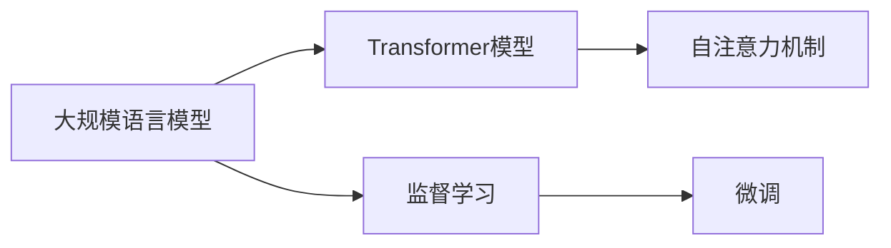
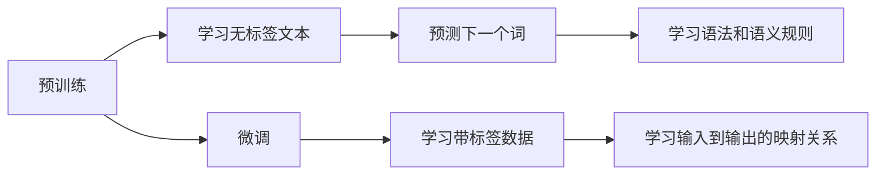

## 1.背景介绍

在过去的几年中，大规模语言模型（Large Language Model，简称LLM）已经成为了自然语言处理（Natural Language Processing，简称NLP）领域的一颗璀璨明星。从GPT-3到BERT，再到最近的Transformer系列模型，它们的出现极大地推动了NLP的发展，为我们提供了一种全新的方式来理解和生成文本。

大规模语言模型的核心思想是使用大量的文本数据来训练一个能够理解和生成自然语言的模型。这种模型可以理解语言的语法和语义，甚至能够生成一些看起来像是人类写作的文本。然而，尽管这些模型在生成文本方面表现出色，但它们并不能完全理解文本的含义，也不能进行深度的推理。

为了解决这些问题，研究者们开始探索如何使用监督学习来微调大规模语言模型。通过监督学习，我们可以教导模型如何更好地理解和生成文本，从而提升其性能。在本文中，我将详细介绍大规模语言模型的原理，以及如何使用监督学习进行微调。

## 2.核心概念与联系

大规模语言模型的基础是Transformer模型。Transformer模型是一种基于自注意力（Self-Attention）机制的深度学习模型，它可以处理序列数据，并且在处理长序列时具有很好的性能。

在Transformer模型中，自注意力机制通过计算序列中每个元素与其他元素的关联度，来决定模型应该关注序列中的哪些部分。这种机制使得模型能够捕捉到序列中长距离的依赖关系，从而更好地理解文本。

监督学习是一种机器学习方法，它通过给模型提供输入和对应的输出，训练模型学习从输入到输出的映射关系。在微调大规模语言模型时，我们可以使用监督学习来教导模型如何更好地生成文本。

下面是一个简单的Mermaid流程图，展示了大规模语言模型和监督学习的关系：



## 3.核心算法原理具体操作步骤

大规模语言模型的训练过程可以分为两个阶段：预训练阶段和微调阶段。

在预训练阶段，模型通过学习大量的无标签文本数据，学习语言的语法和语义规则。具体来说，模型需要预测给定的一段文本中的下一个词，通过这种方式，模型可以学习到词与词之间的关系，以及词的上下文含义。

在微调阶段，模型通过学习带标签的数据，进一步提升其性能。具体来说，我们可以提供一些输入和对应的输出，让模型学习这种映射关系。比如，在情感分析任务中，我们可以提供一些文本和对应的情感标签，让模型学习如何从文本中预测情感。

下面是一个简单的Mermaid流程图，展示了大规模语言模型的训练过程：



## 4.数学模型和公式详细讲解举例说明

在大规模语言模型的训练过程中，我们主要使用了两种损失函数：交叉熵损失函数和负对数似然损失函数。

交叉熵损失函数用于预训练阶段，用来衡量模型预测的下一个词的概率分布与真实的概率分布之间的差距。具体来说，如果我们的模型预测下一个词的概率分布为$p$，而真实的概率分布为$q$，那么交叉熵损失函数可以定义为：

$$
L_{\text{CE}}(p, q) = -\sum_{i} q_i \log p_i
$$

负对数似然损失函数用于微调阶段，用来衡量模型预测的输出与真实输出之间的差距。具体来说，如果我们的模型预测的输出的概率为$p$，而真实的输出为$y$，那么负对数似然损失函数可以定义为：

$$
L_{\text{NLL}}(p, y) = -\log p_y
$$

这两种损失函数都可以通过梯度下降法来最小化，从而训练出一个性能良好的模型。

## 5.项目实践：代码实例和详细解释说明

在实际项目中，我们可以使用Python的transformers库来训练和微调大规模语言模型。以下是一个简单的例子：

```python
from transformers import BertForSequenceClassification, Trainer, TrainingArguments

# 加载预训练的BERT模型
model = BertForSequenceClassification.from_pretrained("bert-base-uncased")

# 定义训练参数
training_args = TrainingArguments(
    output_dir="./results",          # 输出目录
    num_train_epochs=3,              # 训练轮数
    per_device_train_batch_size=16,  # 每个设备的训练批大小
    per_device_eval_batch_size=64,   # 每个设备的评估批大小
    warmup_steps=500,                # 预热步数
    weight_decay=0.01,               # 权重衰减
)

# 定义训练器
trainer = Trainer(
    model=model,                         # 模型
    args=training_args,                  # 训练参数
    train_dataset=train_dataset,         # 训练数据集
    eval_dataset=test_dataset            # 测试数据集
)

# 开始训练和微调
trainer.train()
```

在这个例子中，我们首先加载了预训练的BERT模型，然后定义了一些训练参数，包括输出目录、训练轮数、批大小等。接着，我们定义了一个训练器，指定了模型、训练参数和数据集。最后，我们调用`trainer.train()`方法来开始训练和微调模型。

## 6.实际应用场景

大规模语言模型在许多NLP任务中都有广泛的应用，包括但不限于：

- **文本生成**：大规模语言模型可以生成一些看起来像是人类写作的文本，这在聊天机器人、文章写作助手等场景中非常有用。
- **情感分析**：通过微调，大规模语言模型可以从文本中预测情感，这在社交媒体分析、客户反馈分析等场景中非常有用。
- **文本分类**：大规模语言模型可以用于文本分类任务，如垃圾邮件检测、新闻分类等。

## 7.工具和资源推荐

以下是一些训练和微调大规模语言模型的推荐工具和资源：

- **transformers库**：这是一个Python库，提供了许多预训练的大规模语言模型，如BERT、GPT-3等，以及训练和微调这些模型的工具。
- **TensorFlow和PyTorch**：这两个库是目前最流