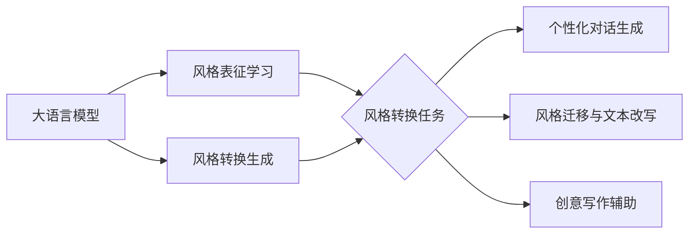

# 大语言模型原理基础与前沿 基于风格转换的方法

## 1. 背景介绍
### 1.1 大语言模型的发展历程
#### 1.1.1 早期的语言模型
#### 1.1.2 神经网络语言模型的崛起
#### 1.1.3 Transformer 的革命性突破

### 1.2 风格转换的研究意义
#### 1.2.1 个性化内容生成
#### 1.2.2 跨领域文本迁移
#### 1.2.3 创意写作辅助

## 2. 核心概念与联系
### 2.1 大语言模型
#### 2.1.1 定义与特点
#### 2.1.2 训练方法概述
#### 2.1.3 评估指标

### 2.2 风格转换
#### 2.2.1 风格的定义与分类
#### 2.2.2 风格表征学习
#### 2.2.3 风格转换的任务形式化

### 2.3 大语言模型与风格转换的关系
#### 2.3.1 大语言模型作为风格转换的基础
#### 2.3.2 风格转换拓展大语言模型的应用
#### 2.3.3 两者的相互促进与融合

## 3. 核心算法原理具体操作步骤
### 3.1 基于Transformer的大语言模型
#### 3.1.1 Transformer编码器结构
#### 3.1.2 自注意力机制
#### 3.1.3 位置编码

### 3.2 风格表征学习算法
#### 3.2.1 基于对抗学习的风格表征
#### 3.2.2 基于VAE的风格表征
#### 3.2.3 基于元学习的风格表征

### 3.3 风格转换的生成式方法
#### 3.3.1 基于条件语言模型的风格转换
#### 3.3.2 基于编码器-解码器的风格转换
#### 3.3.3 基于预训练-微调范式的风格转换

## 4. 数学模型和公式详细讲解举例说明
### 4.1 Transformer的数学描述
#### 4.1.1 自注意力机制的数学推导
#### 4.1.2 多头注意力的数学描述
#### 4.1.3 残差连接与层归一化的数学意义

### 4.2 风格表征学习的数学模型
#### 4.2.1 对抗学习中判别器与生成器的数学描述
#### 4.2.2 VAE中编码器与解码器的数学描述
#### 4.2.3 元学习中任务分布与元优化器的数学描述

### 4.3 风格转换生成过程的数学描述
#### 4.3.1 条件语言模型生成的数学描述
#### 4.3.2 编码器-解码器生成的数学描述 
#### 4.3.3 预训练-微调生成的数学描述

## 5. 项目实践：代码实例和详细解释说明
### 5.1 基于Transformer的大语言模型实现
#### 5.1.1 Transformer编码器的PyTorch实现
#### 5.1.2 基于Transformer的语言模型训练
#### 5.1.3 使用预训练的Transformer语言模型进行文本生成

### 5.2 风格表征学习的代码实现
#### 5.2.1 基于对抗学习的风格表征学习代码
#### 5.2.2 基于VAE的风格表征学习代码
#### 5.2.3 基于元学习的风格表征学习代码

### 5.3 风格转换的代码实现
#### 5.3.1 基于条件语言模型的风格转换代码
#### 5.3.2 基于编码器-解码器的风格转换代码
#### 5.3.3 基于预训练-微调范式的风格转换代码

## 6. 实际应用场景
### 6.1 个性化对话生成
#### 6.1.1 基于用户画像的个性化回复
#### 6.1.2 情感倾向的对话风格控制
#### 6.1.3 角色扮演的对话生成

### 6.2 风格迁移与文本改写
#### 6.2.1 正式与非正式文本的相互转换
#### 6.2.2 现代文与古文的相互转换
#### 6.2.3 不同作者风格的模仿与迁移

### 6.3 创意写作辅助
#### 6.3.1 故事情节生成与风格控制
#### 6.3.2 诗歌创作中的风格模仿
#### 6.3.3 广告文案生成中的风格优化

## 7. 工具和资源推荐
### 7.1 开源工具包
#### 7.1.1 Hugging Face Transformers
#### 7.1.2 Fairseq
#### 7.1.3 OpenNMT

### 7.2 预训练模型资源
#### 7.2.1 BERT及其变体
#### 7.2.2 GPT系列模型
#### 7.2.3 T5与BART等编码器-解码器模型

### 7.3 数据集资源
#### 7.3.1 风格迁移数据集
#### 7.3.2 对话数据集
#### 7.3.3 创意写作数据集

## 8. 总结：未来发展趋势与挑战
### 8.1 大语言模型的发展趋势
#### 8.1.1 模型规模的持续增长
#### 8.1.2 多模态语言模型的崛起
#### 8.1.3 语言模型的普适化应用

### 8.2 风格转换研究的发展方向 
#### 8.2.1 细粒度与组合风格转换
#### 8.2.2 风格转换的可控性与可解释性
#### 8.2.3 风格转换在更广泛任务中的应用

### 8.3 面临的挑战
#### 8.3.1 计算资源与训练效率的瓶颈
#### 8.3.2 风格转换的评估难题
#### 8.3.3 生成文本的可靠性与安全性

## 9. 附录：常见问题与解答
### 9.1 大语言模型常见问题解答
#### Q1: 大语言模型需要多少训练数据与计算资源？
#### Q2: 如何缓解大语言模型生成文本的不可控性？
#### Q3: 大语言模型是否具有真正的语言理解能力？

### 9.2 风格转换常见问题解答  
#### Q1: 风格转换的本质是什么？
#### Q2: 风格转换与文本生成的区别是什么？
#### Q3: 如何评估风格转换的效果？

### 9.3 实践中的常见问题解答
#### Q1: 如何选择合适的预训练模型进行风格转换？
#### Q2: 风格转换实践中如何平衡风格与内容的关系？
#### Q3: 在数据缺乏的情况下如何开展风格转换研究？

大语言模型作为基础，通过风格表征学习模块，可以获取文本的风格特征。在此基础上，结合风格转换的生成式方法，可以实现将输入文本转换为特定风格的输出文本。这一技术在个性化对话生成、风格迁移与文本改写、创意写作辅助等任务中有广泛的应用前景。

大语言模型的快速发展为风格转换研究提供了新的机遇。Transformer 等高效的神经网络结构，使得训练大规模语言模型成为可能。预训练的语言模型可以作为风格转换的基础，通过在特定风格的文本数据上进行微调，可以使模型习得目标风格的特征。

在风格表征学习方面，对抗学习、变分自编码器（VAE）、元学习等方法被广泛探索。通过引入风格判别器，可以从原始文本中分离出风格特征与内容特征。VAE 则通过编码器将文本映射到隐空间，再通过解码器生成目标风格的文本。元学习使模型具备快速适应新风格的能力。

风格转换的生成式方法主要包括基于条件语言模型、编码器-解码器结构以及预训练-微调范式。条件语言模型根据目标风格对文本进行逐词生成；编码器-解码器结构则将输入文本编码为隐向量，再解码生成目标风格文本；预训练-微调范式在大规模语料上预训练通用语言模型，再在特定风格数据上微调。

尽管风格转换研究取得了长足进展，但仍面临诸多挑战。计算资源与训练效率是制约大语言模型发展的瓶颈。风格转换效果的评估也存在难题，缺乏统一的自动评估指标。此外，风格转换生成的文本在可靠性与安全性方面也需要进一步探索。未来，细粒度与组合风格转换、风格转换的可控性与可解释性等方向值得深入研究。

总之，大语言模型为风格转换研究带来了新的突破口。风格转换技术在个性化内容生成、跨领域文本迁移、创意写作辅助等方面具有广阔的应用前景。随着大语言模型的不断发展与风格转换方法的日益完善，我们有望实现更加智能、灵活、可控的文本风格转换，为人机交互、内容创作等领域赋能。

作者：禅与计算机程序设计艺术 / Zen and the Art of Computer Programming