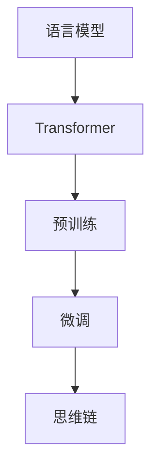

# 大语言模型原理基础与前沿 思维链

## 1.背景介绍
近年来,随着深度学习技术的飞速发展,自然语言处理领域取得了突破性的进展。其中,大语言模型(Large Language Model,LLM)的出现,更是引领了NLP技术的新浪潮。从2018年OpenAI发布的GPT模型,到2020年的GPT-3,再到2022年的ChatGPT,大语言模型不断刷新着人们对人工智能的认知。

那么,大语言模型究竟是什么?它为什么能取得如此惊人的效果?背后的原理和算法又是怎样的?本文将带你一探究竟。

### 1.1 什么是大语言模型
大语言模型,顾名思义,就是在海量的文本语料上训练的语言模型。与传统的语言模型不同,大语言模型通常具有以下特点:

- 模型参数量巨大,动辄上百亿甚至上千亿
- 训练语料极其丰富,涵盖了网络上的各类文本
- 采用了transformer等先进的神经网络结构
- 具备强大的zero-shot和few-shot学习能力

### 1.2 大语言模型的发展历程
大语言模型的发展,可以追溯到2017年谷歌发布的Transformer模型。Transformer引入了self-attention机制,极大地提升了模型处理长文本的能力。此后,各大科技公司和研究机构纷纷开始探索大规模预训练语言模型。

2018年,OpenAI发布了GPT(Generative Pre-Training)模型,在多个NLP任务上取得了SOTA的成绩。2019年,谷歌发布了BERT(Bidirectional Encoder Representations from Transformers)模型,进一步推动了预训练语言模型的发展。

2020年,OpenAI发布了GPT-3,其1750亿个参数的规模震惊了整个AI界。GPT-3展现出了惊人的语言理解和生成能力,引发了人们对通用人工智能的无限遐想。

2022年,Anthropic发布了Constitutional AI(宪法AI),提出了一种全新的AI训练范式。同年,OpenAI发布了ChatGPT,再次引爆了AI圈。ChatGPT不仅继承了GPT-3强大的语言能力,还具备了知识、推理、多轮对话等多项能力,标志着大语言模型正在向通用人工智能迈进。

## 2.核心概念与联系

### 2.1 语言模型
语言模型是大语言模型的基础。所谓语言模型,就是对语言的概率分布进行建模。给定一个单词序列 $w_1, w_2, ..., w_n$,语言模型的目标是估计这个序列出现的概率:

$$P(w_1, w_2, ..., w_n) = \prod_{i=1}^n P(w_i | w_1, ..., w_{i-1})$$

传统的语言模型如n-gram模型,只能考虑有限的上下文信息。而基于神经网络的语言模型,则可以建模任意长度的上下文。

### 2.2 Transformer
Transformer是大语言模型的核心组件。与传统的RNN/LSTM不同,Transformer完全基于attention机制,避免了序列建模中的长距离依赖问题。

Transformer的核心是self-attention层,它允许序列中的任意两个位置直接交互信息。通过多头注意力机制,Transformer可以建模不同子空间的信息。Transformer还引入了位置编码,使得模型能够感知单词的顺序信息。

### 2.3 预训练与微调
预训练(pre-training)是大语言模型的关键所在。与传统的有监督学习不同,预训练不需要人工标注数据,而是让模型在大规模无标注语料上自监督学习。

预训练的目标有两类,一类是自回归语言建模(auto-regressive language modeling),即预测下一个单词;另一类是自编码(auto-encoding),即用mask等方式破坏输入,让模型重建原始输入。

在预训练的基础上,我们可以在下游任务的小样本数据上对模型进行微调(fine-tuning),使其适应特定任务。得益于预训练学到的丰富语言知识,模型在微调阶段往往只需很少的样本就可以达到不错的效果。

### 2.4 思维链
思维链(Chain of Thought,CoT)是近期大语言模型领域的一个研究热点。传统的大语言模型虽然具备了强大的语言能力,但在需要逻辑推理的任务上往往表现欠佳。

思维链的核心思想是,让语言模型显式地生成中间推理步骤,而不是直接给出最终答案。例如,在做数学应用题时,模型先根据题意列出解题步骤,再一步步演算出答案。研究表明,引入思维链可以显著提升语言模型在复杂推理任务上的表现。

思维链的形式多种多样,可以是自由格式的自然语言,也可以是结构化的表达式。一些工作还将思维链与外部知识相结合,赋予了语言模型更强的常识推理能力。

下图展示了大语言模型的核心概念及其联系:

## 3.核心算法原理具体操作步骤
接下来,我们将详细介绍大语言模型的核心算法原理和具体操作步骤。

### 3.1 Transformer的计算过程

#### 3.1.1 输入表示
首先,我们需要将输入的单词序列转换为向量表示。具体来说,就是将每个单词映射为一个d维的词嵌入向量,再加上位置编码向量,得到最终的输入表示:

$$\mathbf{x}_i = \mathbf{e}_i + \mathbf{p}_i$$

其中,$\mathbf{e}_i$是第i个单词的词嵌入向量,$\mathbf{p}_i$是第i个位置的位置编码向量。

#### 3.1.2 自注意力层
自注意力层是Transformer的核心。对于第l层的第i个位置,其自注意力的计算过程如下:

1. 根据上一层的输出 $\mathbf{h}_i^{l-1}$ 计算查询向量 $\mathbf{q}_i^l$、键向量 $\mathbf{k}_i^l$、值向量 $\mathbf{v}_i^l$:
$$\mathbf{q}_i^l = \mathbf{W}_q^l \mathbf{h}_i^{l-1}$$
$$\mathbf{k}_i^l = \mathbf{W}_k^l \mathbf{h}_i^{l-1}$$
$$\mathbf{v}_i^l = \mathbf{W}_v^l \mathbf{h}_i^{l-1}$$

2. 计算第i个位置与所有位置的注意力权重:
$$\alpha_{ij}^l = \frac{\exp(\mathbf{q}_i^l \cdot \mathbf{k}_j^l / \sqrt{d_k})}{\sum_{j=1}^n \exp(\mathbf{q}_i^l \cdot \mathbf{k}_j^l / \sqrt{d_k})}$$

3. 根据注意力权重对值向量进行加权求和,得到第i个位置的输出:
$$\mathbf{z}_i^l = \sum_{j=1}^n \alpha_{ij}^l \mathbf{v}_j^l$$

多头注意力就是并行地执行h次不同的自注意力,然后将结果拼接起来:

$$\mathrm{MultiHead}(\mathbf{h}^{l-1}) = \mathrm{Concat}(\mathbf{z}_1^l, ..., \mathbf{z}_h^l) \mathbf{W}_o^l$$

#### 3.1.3 前馈层
前馈层由两层全连接网络组成,对自注意力层的输出进行非线性变换:

$$\mathbf{h}_i^l = \mathrm{FFN}(\mathbf{z}_i^l) = \mathrm{ReLU}(\mathbf{z}_i^l \mathbf{W}_1^l + \mathbf{b}_1^l) \mathbf{W}_2^l + \mathbf{b}_2^l$$

#### 3.1.4 残差连接与层归一化
为了促进梯度的反向传播和训练的稳定性,Transformer在每个子层之间加入了残差连接和层归一化:

$$\mathbf{z}_i^l = \mathrm{LayerNorm}(\mathbf{z}_i^l + \mathbf{h}_i^{l-1})$$
$$\mathbf{h}_i^l = \mathrm{LayerNorm}(\mathbf{h}_i^l + \mathbf{z}_i^l)$$

其中,层归一化的计算公式为:

$$\mathrm{LayerNorm}(\mathbf{x}) = \frac{\mathbf{x} - \mathrm{E}[\mathbf{x}]}{\sqrt{\mathrm{Var}[\mathbf{x}] + \epsilon}} \odot \mathbf{g} + \mathbf{b}$$

$\mathbf{g}$和$\mathbf{b}$是可学习的缩放和偏置参数。

### 3.2 预训练的目标与损失函数

#### 3.2.1 自回归语言建模
自回归语言建模的目标是最大化序列的对数似然概率:

$$\mathcal{L}_{\mathrm{LM}} = -\sum_{i=1}^n \log P(w_i | w_1, ..., w_{i-1})$$

其中,条件概率$P(w_i | w_1, ..., w_{i-1})$由模型的输出层计算得到:

$$P(w_i | w_1, ..., w_{i-1}) = \mathrm{softmax}(\mathbf{h}_i^L \mathbf{W}_{\mathrm{out}} + \mathbf{b}_{\mathrm{out}})$$

$\mathbf{h}_i^L$是第L层Transformer的第i个位置的输出,$\mathbf{W}_{\mathrm{out}}$和$\mathbf{b}_{\mathrm{out}}$是输出层的参数。

#### 3.2.2 去噪自编码
去噪自编码的目标是让模型重建被破坏的输入序列。具体来说,我们随机地mask掉一些单词,让模型预测这些单词。损失函数为:

$$\mathcal{L}_{\mathrm{DAE}} = -\sum_{i \in \mathcal{M}} \log P(w_i | \hat{w}_1, ..., \hat{w}_n)$$

其中,$\mathcal{M}$是被mask的单词的下标集合,$\hat{w}_i$是第i个单词,如果$i \in \mathcal{M}$则$\hat{w}_i$为特殊的[MASK]符号,否则$\hat{w}_i = w_i$。

### 3.3 思维链的生成与评估

#### 3.3.1 基于采样的思维链生成
生成思维链的一种常见方法是基于采样。具体来说,我们首先给定一个提示(如题干),然后让模型自回归地生成后续的推理步骤。在每一步,我们根据模型输出的条件概率分布采样下一个单词,直到生成完整的思维链。

常用的采样策略包括贪心搜索、束搜索、Top-k采样、Top-p(nucleus)采样等。其中,Top-p采样根据累积概率选择单词,可以在探索和利用之间取得平衡。给定一个概率阈值p,Top-p采样的过程如下:

1. 对模型输出的条件概率分布 $P(w|c)$ 按降序排序。
2. 计算累积概率分布 $Q(w|c)$。
3. 选择满足 $Q(w|c) \leq p$ 的单词集合 $V_p$。
4. 从 $V_p$ 中按照归一化后的概率分布采样下一个单词。

#### 3.3.2 基于搜索的思维链生成
另一种生成思维链的方法是基于搜索。与采样不同,搜索会显式地维护一个搜索空间,并根据某种评估函数对候选结果进行排序。

以束搜索为例,我们在每个时间步维护k个最优的候选序列。对于每个候选序列,我们让模型生成b个可能的延续,然后从kb个候选中选出新的k个最优序列。重复这一过程,直到达到最大长度或终止符。

搜索的关键是设计合适的评估函数。一种常见的做法是使用模型本身的对数似然概率作为评估分数:

$$s(y) = \sum_{i=1}^n \log P(y_i | y_1, ..., y_{i-1}, c)$$

其中,$y$是候选的思维链,$c$是给定的上下文(如题干)。直觉上,对数似然概率越大,说明候选序列越符合模型所学