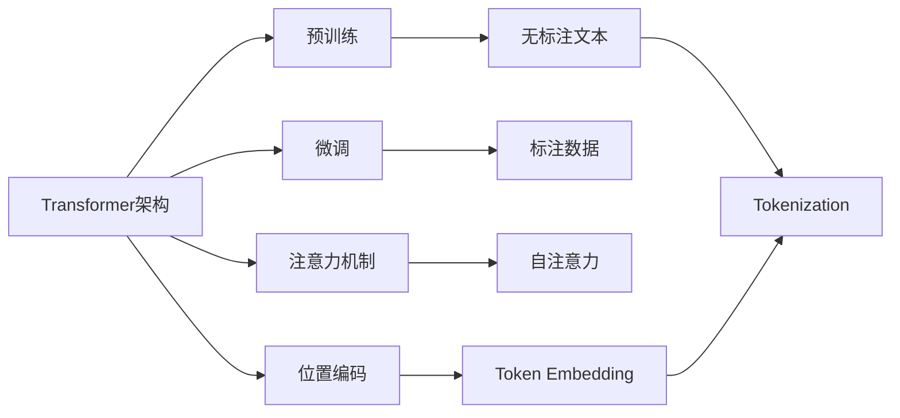

# 大语言模型原理基础与前沿 新时代的曙光

## 1.背景介绍
### 1.1 大语言模型的定义与发展历程
大语言模型(Large Language Model, LLM)是一类基于海量文本数据训练的大规模神经网络模型。它们能够学习和理解人类语言,并完成多种自然语言处理任务,如文本生成、对话、问答、摘要等。近年来,随着计算能力的提升和训练数据的爆炸式增长,大语言模型取得了突破性进展,代表性的模型包括GPT系列、BERT、T5等。这些模型的出现,标志着自然语言处理领域进入了一个新的时代。

### 1.2 大语言模型的重要意义
大语言模型的出现具有划时代的意义。首先,它们展示了人工智能在理解和生成人类语言方面的惊人能力,为实现通用人工智能迈出了重要一步。其次,大语言模型为众多自然语言处理应用提供了强大的基础设施,极大地推动了智能对话、知识问答、文本生成等领域的发展。此外,大语言模型蕴含的语言知识和常识推理能力,有望应用于更广泛的人工智能领域,如视觉、规划、决策等。可以说,大语言模型是通向人工智能新时代的曙光。

### 1.3 本文的主要内容与结构
本文将全面探讨大语言模型的原理基础与前沿进展。首先,我们将介绍大语言模型的核心概念,如Transformer架构、预训练和微调等。然后,我们将深入剖析几个代表性的大语言模型,讲解其背后的算法原理和数学模型。接着,我们将通过代码实例,演示如何使用大语言模型进行文本生成和问答等任务。此外,我们还将展望大语言模型在各个领域的应用场景,并推荐相关的工具和资源。最后,我们将总结大语言模型的发展趋势与面临的挑战,并回答一些常见问题。

## 2.核心概念与联系
### 2.1 Transformer 架构
Transformer是大语言模型的核心架构。它由多个编码器和解码器层组成,每一层都包含自注意力机制和前馈神经网络。自注意力机制能够捕捉文本中的长距离依赖关系,使模型能够更好地理解上下文。Transformer摒弃了传统的循环神经网络,采用了并行计算,大大提高了训练效率。

### 2.2 预训练与微调
预训练和微调是大语言模型的两个关键步骤。预训练阶段,模型在海量无标注文本上进行自监督学习,掌握语言的基本规律和知识。微调阶段,模型在特定任务的标注数据上进行有监督学习,适应具体的应用场景。这种"预训练+微调"的范式,使得大语言模型能够在少量标注数据的情况下,取得优异的性能。

### 2.3 Tokenization 与 Embedding
Tokenization是将文本转换为模型可以处理的离散单元(token)的过程。常见的tokenization方法包括字符级、单词级和子词级(如BPE和WordPiece)。Embedding是将离散的token映射为连续的向量表示,捕捉token之间的语义关系。大语言模型通常使用可学习的embedding层,在训练过程中不断优化embedding表示。

### 2.4 注意力机制与自注意力
注意力机制是大语言模型的核心组件之一。它允许模型根据当前位置与其他位置的相关性,动态地分配权重。自注意力机制是注意力机制的一种,它使得模型能够在不依赖外部信息的情况下,计算位置之间的依赖关系。自注意力极大地增强了模型捕捉长距离依赖的能力。

### 2.5 位置编码
由于Transformer架构没有循环连接,无法显式地建模位置信息。为了引入位置信息,大语言模型使用位置编码(Positional Encoding)。位置编码可以是固定的(如正弦曲线)或可学习的,它与token embedding相加,使得模型能够区分不同位置的token。

下图展示了大语言模型的核心概念之间的联系:

## 3.核心算法原理具体操作步骤
### 3.1 Transformer 的编码器
Transformer的编码器由多个相同的层组成,每一层包含两个子层:多头自注意力和前馈神经网络。

1. 将输入文本进行tokenization和embedding,得到初始的token表示。
2. 对token表示进行位置编码,引入位置信息。
3. 将位置编码后的表示输入到第一个编码器层。
4. 在多头自注意力子层,计算token之间的注意力权重,更新token表示。
5. 在前馈神经网络子层,对更新后的token表示进行非线性变换。
6. 重复步骤4-5,直到最后一个编码器层。
7. 将最后一层的输出作为整个编码器的输出。

### 3.2 Transformer 的解码器
Transformer的解码器也由多个相同的层组成,每一层包含三个子层:掩码多头自注意力、编码-解码注意力和前馈神经网络。

1. 将目标文本进行tokenization和embedding,得到初始的token表示。
2. 对token表示进行位置编码,引入位置信息。
3. 将位置编码后的表示输入到第一个解码器层。
4. 在掩码多头自注意力子层,计算目标token之间的注意力权重,更新token表示。这里使用掩码是为了避免模型看到未来的信息。
5. 在编码-解码注意力子层,计算目标token与编码器输出之间的注意力权重,融合编码器的信息。
6. 在前馈神经网络子层,对更新后的token表示进行非线性变换。
7. 重复步骤4-6,直到最后一个解码器层。
8. 将最后一层的输出经过线性变换和softmax,得到下一个token的概率分布。
9. 根据概率分布采样或选择概率最大的token,作为生成的下一个token。
10. 重复步骤3-9,直到生成完整的目标文本。

### 3.3 预训练的目标与损失函数
大语言模型的预训练通常采用自监督学习,即利用无标注文本本身的信息来构建监督信号。常见的预训练目标包括:

1. 语言模型:预测下一个token。损失函数为负对数似然损失。
2. 去噪自编码:随机遮挡部分输入,预测被遮挡的token。损失函数为重构损失。
3. 对比学习:最大化相似文本对的表示相似度,最小化不相似文本对的表示相似度。损失函数为对比损失。

不同的预训练目标可以捕捉文本的不同方面信息,联合使用多个目标有助于学习更全面的语言知识。

### 3.4 微调的过程与策略
在特定任务上微调大语言模型通常包括以下步骤:

1. 根据任务的输入和输出格式,设计合适的数据处理流程。
2. 在预训练模型的基础上,添加任务特定的输入和输出层。
3. 使用任务的标注数据,对整个模型进行端到端的有监督训练。
4. 评估微调后模型在任务上的性能,根据需要调整超参数和训练策略。

常见的微调策略包括:

1. 全参数微调:更新预训练模型的所有参数。适用于任务数据较多的情况。
2. 部分参数微调:只更新预训练模型的部分参数(如最后几层),其余参数固定。适用于任务数据较少的情况。
3. 提示微调:在输入中添加任务描述或示例,引导模型进行特定任务。无需更新预训练模型的参数。
4. 参数高效微调:使用适应性学习率、梯度掩码等技术,在更新参数的同时保留预训练的知识。

选择合适的微调策略,可以在降低计算开销的同时,达到更好的任务性能。

## 4.数学模型和公式详细讲解举例说明
### 4.1 Transformer 的自注意力机制
Transformer的核心是自注意力机制,它允许模型计算文本中任意两个位置之间的依赖关系。对于一个长度为$n$的输入序列$X \in \mathbb{R}^{n \times d}$,自注意力的计算过程如下:

1. 计算查询矩阵$Q$、键矩阵$K$和值矩阵$V$:

$$ Q = XW_Q, K = XW_K, V = XW_V $$

其中$W_Q, W_K, W_V \in \mathbb{R}^{d \times d_k}$是可学习的参数矩阵。

2. 计算注意力权重矩阵$A$:

$$ A = \text{softmax}(\frac{QK^T}{\sqrt{d_k}}) $$

其中$\sqrt{d_k}$是缩放因子,用于控制点积的方差。

3. 计算自注意力输出$Z$:

$$ Z = AV $$

直观地理解,自注意力机制可以看作是一个查询-键-值的过程。对于每个位置,它根据查询向量与所有位置的键向量计算相似度,得到注意力权重,然后用权重加权求和值向量,得到该位置的更新表示。

举例说明,假设有一个句子"The cat sat on the mat"。对于单词"cat",自注意力机制可以计算它与句子中其他单词的相关性。通过查询"cat"的表示,与"The"、"sat"、"on"、"the"、"mat"的表示计算相似度,得到注意力权重。然后用权重加权求和这些单词的值向量,得到"cat"的更新表示。这个过程可以捕捉到"cat"与"sat"、"on"、"mat"的依赖关系,使模型能够理解"cat"在句子中的角色。

### 4.2 多头自注意力
多头自注意力是自注意力的扩展,它允许模型在不同的子空间中计算多组注意力权重,捕捉不同方面的依赖关系。对于$h$个注意力头,多头自注意力的计算过程如下:

1. 对每个注意力头$i=1,\dots,h$,计算查询矩阵$Q_i$、键矩阵$K_i$和值矩阵$V_i$:

$$ Q_i = XW_{Q_i}, K_i = XW_{K_i}, V_i = XW_{V_i} $$

其中$W_{Q_i}, W_{K_i}, W_{V_i} \in \mathbb{R}^{d \times d_k}$是第$i$个注意力头的参数矩阵。

2. 对每个注意力头$i=1,\dots,h$,计算注意力权重矩阵$A_i$和输出$Z_i$:

$$ A_i = \text{softmax}(\frac{Q_iK_i^T}{\sqrt{d_k}}), Z_i = A_iV_i $$

3. 将所有注意力头的输出拼接起来,并经过线性变换得到最终输出$Z$:

$$ Z = \text{Concat}(Z_1, \dots, Z_h)W_O $$

其中$W_O \in \mathbb{R}^{hd_k \times d}$是输出的参数矩阵。

直观地理解,多头自注意力可以看作是多个"专家"并行地从不同角度分析文本,然后将它们的见解综合起来。每个注意力头关注文本的不同方面,捕捉不同类型的依赖关系。最终将所有头的输出融合,得到更全面的文本表示。

举例说明,对于句子"The cat sat on the mat",多头自注意力可以让不同的头关注不同的依赖关系。比如,一个头可能更关注"cat"与"sat"的主谓关系,另一个头可能更关注"sat"与"on"的动宾关系,还有一个头可能更关注"mat"与"the"的定语关系。通过综合这些不同方面的信息,模型可以更全面地理解句子的语法结构和语义内容。

### 4.3 位置编码
由于Transformer不包含循环连接,需要