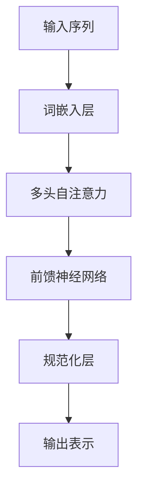

# 大语言模型原理基础与前沿 新时代的曙光

## 1. 背景介绍

### 1.1 人工智能的崛起

人工智能(Artificial Intelligence, AI)作为一门跨学科的技术,已经渗透到我们生活的方方面面。从语音助手到自动驾驶汽车,从推荐系统到医疗诊断,AI无处不在。在这场技术革命的浪潮中,大语言模型(Large Language Model, LLM)作为AI的核心驱动力之一,正在引领着人工智能的新纪元。

### 1.2 语言模型的重要性

语言是人类智能的基础,也是人工智能系统与人类交互的桥梁。语言模型旨在捕捉和模拟人类语言的规律,从而实现自然语言理解和生成。随着数据和计算能力的不断增长,大型语言模型展现出了令人惊叹的能力,可以生成看似人类写作的文本、回答复杂问题、进行多语种翻译等。

### 1.3 大语言模型的兴起

早期的语言模型规模有限,性能也相对较弱。但近年来,benefiting from大量标注数据、强大的硬件资源和创新的深度学习算法,大语言模型的规模和性能都取得了突破性进展。像GPT、BERT、XLNet、T5等模型,凭借数十亿甚至上百亿参数,展现出了令人惊艳的语言理解和生成能力,引发了学术界和工业界的广泛关注。

## 2. 核心概念与联系

### 2.1 语言模型的基本概念

语言模型的本质是建立一个概率分布模型,用于估计一个句子或者一个词序列的概率。形式化地,给定一个词序列$w_1, w_2, \ldots, w_n$,语言模型需要计算该序列的概率:

$$P(w_1, w_2, \ldots, w_n)$$

根据链式法则,上述概率可以分解为:

$$P(w_1, w_2, \ldots, w_n) = \prod_{i=1}^{n}P(w_i|w_1, \ldots, w_{i-1})$$

其中$P(w_i|w_1, \ldots, w_{i-1})$表示在给定前面的词$w_1, \ldots, w_{i-1}$的条件下,第$i$个词$w_i$出现的条件概率。

### 2.2 神经网络语言模型

传统的统计语言模型依赖于人工设计的特征,而神经网络语言模型则可以自动从数据中学习特征表示。神经网络语言模型通常由以下几个主要部分组成:

1. **词嵌入层(Word Embedding Layer)**: 将词映射到连续的向量空间中,作为神经网络的输入。
2. **编码器(Encoder)**: 捕捉输入序列的上下文信息,生成上下文表示。常见的编码器包括循环神经网络(RNN)、卷积神经网络(CNN)和自注意力机制(Self-Attention)。
3. **解码器(Decoder)**: 根据上下文表示和已生成的词,预测下一个词的概率分布。

### 2.3 自注意力机制

自注意力机制是大语言模型的核心创新之一,它允许模型直接捕捉输入序列中任意两个位置之间的关系,而不需要依赖序列的顺序结构。自注意力机制通过计算查询(Query)、键(Key)和值(Value)之间的相似性,动态地确定每个位置应该关注哪些其他位置。

自注意力机制可以形式化表示为:

$$\text{Attention}(Q, K, V) = \text{softmax}(\frac{QK^T}{\sqrt{d_k}})V$$

其中$Q$、$K$、$V$分别表示查询、键和值,它们都是由输入序列的词嵌入经过线性变换得到的向量。$d_k$是缩放因子,用于防止点积的值过大导致梯度饱和。

### 2.4 transformer 模型

Transformer 是第一个完全基于自注意力机制的序列到序列(Seq2Seq)模型,它抛弃了传统的RNN和CNN结构,完全依赖自注意力机制来捕捉输入和输出序列之间的依赖关系。Transformer 的核心组件包括:

1. **多头自注意力(Multi-Head Attention)**: 将多个注意力头的结果进行拼接,捕捉不同的依赖关系。
2. **位置编码(Positional Encoding)**: 因为自注意力机制没有捕捉序列顺序的能力,所以需要显式地引入位置信息。
3. **前馈神经网络(Feed-Forward Network)**: 对每个位置的表示进行独立的非线性变换,提供更强的表示能力。

Transformer 模型的创新设计使其在许多自然语言处理任务上取得了卓越的表现,为后续的大语言模型奠定了基础。

## 3. 核心算法原理具体操作步骤

### 3.1 transformer 解码器

虽然 transformer 最初是为机器翻译任务设计的,但它的解码器部分也被广泛应用于生成式语言模型。transformer 解码器的主要步骤如下:

1. **掩码自注意力(Masked Self-Attention)**: 在自注意力计算中,将当前位置之后的位置进行掩码,确保模型只能关注之前的上下文信息。
2. **解码器-编码器注意力(Decoder-Encoder Attention)**: 计算解码器的输出和编码器的输出之间的注意力,将编码器的上下文信息融入解码器。
3. **前馈神经网络(Feed-Forward Network)**: 对解码器的输出进行非线性变换,提高表示能力。
4. **输出层(Output Layer)**: 将解码器的输出映射到词汇表上,得到下一个词的概率分布。

在语言模型的预训练过程中,通常采用自回归(Auto-regressive)的方式,给定前缀$w_1, \ldots, w_{i-1}$,最大化下一个词$w_i$的条件概率:

$$\max_{w_i} P(w_i|w_1, \ldots, w_{i-1})$$

在生成过程中,模型会逐步生成下一个词,直到达到终止条件(如生成特定的结束符号)。

### 3.2 transformer 编码器

transformer 编码器主要用于捕捉输入序列的上下文信息,为后续的任务提供有效的表示。编码器的主要步骤包括:

1. **词嵌入层(Word Embedding Layer)**: 将输入序列的词映射到连续的向量空间中。
2. **位置编码(Positional Encoding)**: 为每个位置添加位置信息,使模型能够捕捉序列的顺序结构。
3. **多头自注意力(Multi-Head Attention)**: 计算输入序列中每个位置与其他位置之间的注意力权重,捕捉长距离依赖关系。
4. **前馈神经网络(Feed-Forward Network)**: 对每个位置的表示进行非线性变换,提高表示能力。
5. **残差连接(Residual Connection)**: 将输入和输出相加,缓解了深层神经网络的梯度消失问题。
6. **层归一化(Layer Normalization)**: 对每一层的输出进行归一化,加速收敛并提高模型的稳定性。

编码器的输出表示将作为后续任务(如机器翻译、问答等)的输入,提供了丰富的上下文信息。

### 3.3 BERT 模型

BERT(Bidirectional Encoder Representations from Transformers)是一种基于 transformer 编码器的双向语言模型,它能够同时捕捉输入序列中每个位置的左右上下文信息。BERT 的预训练过程包括两个主要任务:

1. **掩码语言模型(Masked Language Model, MLM)**: 随机掩码输入序列中的部分词,并让模型预测被掩码的词。这种方式可以让模型学习双向的上下文信息。
2. **下一句预测(Next Sentence Prediction, NSP)**: 判断两个句子是否相邻,以捕捉更长范围的依赖关系。

BERT 在预训练后,可以通过在顶层添加任务特定的输出层,将其应用于各种自然语言处理任务,如文本分类、问答系统、序列标注等。BERT 的出现极大地推动了迁移学习在 NLP 领域的应用,为后续的大语言模型奠定了基础。

### 3.4 GPT 模型

GPT(Generative Pre-trained Transformer)是一种基于 transformer 解码器的自回归语言模型,专注于生成式任务。GPT 的预训练过程是在大量无监督文本数据上最大化下一个词的条件概率:

$$\max_{\theta} \sum_{i=1}^{n} \log P_{\theta}(w_i|w_1, \ldots, w_{i-1})$$

其中$\theta$表示模型参数,目标是最大化给定前缀下一个词的概率。

在预训练完成后,GPT 可以通过对输出层进行微调,应用于各种生成式任务,如文本生成、机器翻译、问答等。GPT 的创新之处在于首次将 transformer 解码器应用于大规模语言模型的预训练,为后续的 GPT-2、GPT-3 等大型语言模型奠定了基础。

## 4. 数学模型和公式详细讲解举例说明

### 4.1 自注意力机制

自注意力机制是大语言模型的核心创新之一,它允许模型直接捕捉输入序列中任意两个位置之间的关系,而不需要依赖序列的顺序结构。自注意力机制通过计算查询(Query)、键(Key)和值(Value)之间的相似性,动态地确定每个位置应该关注哪些其他位置。

自注意力机制可以形式化表示为:

$$\text{Attention}(Q, K, V) = \text{softmax}(\frac{QK^T}{\sqrt{d_k}})V$$

其中:

- $Q$、$K$、$V$分别表示查询(Query)、键(Key)和值(Value),它们都是由输入序列的词嵌入经过线性变换得到的向量。
- $d_k$是缩放因子,用于防止点积的值过大导致梯度饱和。

让我们通过一个具体的例子来理解自注意力机制的计算过程。假设我们有一个长度为 4 的输入序列 "我 爱 学习 自然语言处理",我们将计算第三个位置(学习)对其他位置的注意力权重。

1. 首先,我们将输入序列映射到词嵌入向量空间,得到四个向量 $x_1$、$x_2$、$x_3$、$x_4$。
2. 然后,我们将这些向量分别线性变换得到查询向量 $q_3$、键向量 $k_1$、$k_2$、$k_3$、$k_4$ 和值向量 $v_1$、$v_2$、$v_3$、$v_4$。
3. 计算查询向量 $q_3$ 与每个键向量 $k_i$ 的点积,得到未缩放的注意力分数 $e_i = q_3 \cdot k_i$。
4. 对注意力分数进行缩放和 softmax 归一化,得到注意力权重 $\alpha_i = \text{softmax}(\frac{e_i}{\sqrt{d_k}})$。
5. 将注意力权重与值向量相乘,并求和,得到第三个位置的注意力输出 $\text{attn}_3 = \sum_{i=1}^{4} \alpha_i v_i$。

通过上述计算,我们可以得到第三个位置(学习)对其他位置的注意力权重,从而捕捉到与该位置相关的上下文信息。自注意力机制的优势在于,它可以自适应地关注输入序列中的不同位置,而不需要人工设计特征或依赖序列的顺序结构。

### 4.2 transformer 模型

transformer 模型是第一个完全基于自注意力机制的序列到序列(Seq2Seq)模型,它抛弃了传统的 RNN 和 CNN 结构,完全依赖自注意力机制来捕捉输入和输出序列之间的依赖关系。transformer 模型的核心组件包括多头自注意力(Multi-Head Attention)、位置编码(Positional Encoding)和前馈神经网络(Feed-Forward Network)。

#### 多头自注