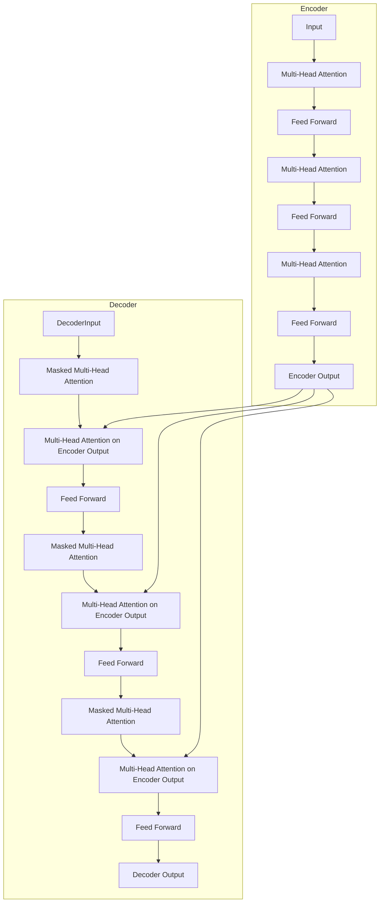

# 大语言模型原理基础与前沿 流水线并行

## 1.背景介绍

### 1.1 大语言模型的兴起

近年来,大型语言模型(Large Language Models, LLMs)在自然语言处理(Natural Language Processing, NLP)领域掀起了一场革命。传统的NLP模型通常专注于特定任务,如机器翻译、文本分类或问答系统。然而,LLMs则旨在通过在大量文本数据上进行预训练,学习通用的语言表示,从而能够应对各种下游NLP任务。

LLMs的核心思想是利用自监督学习(Self-Supervised Learning)方法,在大规模语料库上训练模型,使其能够捕捉语言的内在规律和语义信息。这种通用语言表示能够转移到各种下游任务,从而避免了为每个任务单独训练模型的需求。

### 1.2 流水线并行的重要性

随着模型规模的不断扩大,训练LLMs面临着巨大的计算资源需求。为了高效利用硬件资源,减少训练时间,流水线并行(Pipeline Parallelism)成为了训练大型模型的关键技术之一。

流水线并行是一种模型并行策略,它将神经网络模型划分为多个阶段,每个阶段由不同的加速器(如GPU)执行。通过将不同的小批次数据并行传输到不同的阶段,可以充分利用硬件资源,提高整体吞吐量。这种技术尤其适用于具有层次结构的大型模型,如Transformer模型。

本文将深入探讨LLMs的基础原理,流水线并行技术的实现细节,以及在训练大型语言模型时的实践经验。我们还将讨论LLMs在各种应用场景中的潜力,以及未来的发展趋势和挑战。

## 2.核心概念与联系

### 2.1 自然语言处理基础

自然语言处理(NLP)是人工智能领域的一个重要分支,旨在使计算机能够理解和生成人类语言。NLP涉及多个子领域,包括机器翻译、文本分类、信息检索、问答系统等。

传统的NLP系统通常采用基于规则或统计方法,需要大量的人工特征工程。近年来,随着深度学习技术的发展,基于神经网络的方法在NLP领域取得了巨大成功,显著提高了系统的性能和泛化能力。

### 2.2 自监督学习与语言模型

自监督学习(Self-Supervised Learning)是一种无需人工标注的学习范式,通过设计合理的预测任务,利用大量未标注数据训练模型,学习数据的内在表示。在NLP领域,常见的自监督学习任务包括掩码语言模型(Masked Language Modeling)和下一句预测(Next Sentence Prediction)等。

语言模型(Language Model)是自然语言处理的基础,旨在学习语言的概率分布。传统的语言模型通常基于n-gram统计或神经网络,用于生成自然语言或评估语句的可能性。近年来,基于Transformer的大型语言模型(如GPT、BERT)通过自监督学习在大规模语料库上预训练,展现出了强大的语言理解和生成能力。

### 2.3 Transformer与自注意力机制

Transformer是一种全新的基于自注意力机制(Self-Attention)的神经网络架构,被广泛应用于序列到序列(Sequence-to-Sequence)的任务中,如机器翻译、语言模型等。与传统的循环神经网络(RNN)相比,Transformer能够更好地捕捉长距离依赖关系,并支持并行计算,从而提高了训练效率。

自注意力机制是Transformer的核心组件,它允许模型在计算目标位置的表示时,直接关注整个输入序列的所有位置。这种全局关注机制使得Transformer能够有效地建模长距离依赖关系,并且支持并行计算,从而克服了RNN的局限性。

### 2.4 大型语言模型与通用语言表示

大型语言模型(LLMs)是指在大规模语料库上训练的具有数十亿甚至上万亿参数的巨型神经网络模型。通过自监督学习,LLMs能够学习通用的语言表示,捕捉语言的内在规律和语义信息。这种通用语言表示能够转移到各种下游NLP任务,从而避免了为每个任务单独训练模型的需求。

LLMs的核心思想是利用自监督学习方法,在海量文本数据上预训练模型,使其能够捕捉语言的内在规律和语义信息。这种通用语言表示能够转移到各种下游NLP任务,从而避免了为每个任务单独训练模型的需求。

### 2.5 模型并行与流水线并行

为了训练大型神经网络模型,需要利用多个加速器(如GPU)的计算能力。模型并行(Model Parallelism)和流水线并行(Pipeline Parallelism)是两种常见的并行策略。

模型并行将模型的不同部分分配给不同的加速器,每个加速器计算模型的一部分。这种方法可以支持超大型模型的训练,但需要大量的通信开销。

流水线并行则将模型划分为多个阶段,每个阶段由不同的加速器执行。通过将不同的小批次数据并行传输到不同的阶段,可以充分利用硬件资源,提高整体吞吐量。这种技术尤其适用于具有层次结构的大型模型,如Transformer模型。

## 3.核心算法原理具体操作步骤

### 3.1 Transformer模型架构

Transformer是一种全新的基于自注意力机制的神经网络架构,被广泛应用于序列到序列的任务中,如机器翻译、语言模型等。Transformer的核心组件包括编码器(Encoder)和解码器(Decoder)。

编码器由多个相同的层组成,每层包含两个子层:多头自注意力机制(Multi-Head Self-Attention)和前馈神经网络(Feed-Forward Neural Network)。自注意力机制允许每个位置的输出与输入序列的所有位置相关联,捕捉长距离依赖关系。前馈神经网络则对每个位置的表示进行非线性转换。

解码器的结构与编码器类似,但增加了一个额外的多头注意力子层,用于关注输入序列的表示。此外,解码器的自注意力子层被掩码,以确保每个位置的输出只依赖于该位置之前的输入。

Transformer的训练过程包括两个阶段:编码器映射输入序列到连续的表示,解码器则根据编码器的输出和输出序列的前缀生成下一个标记。通过最小化预测标记与真实标记之间的差异,Transformer可以学习序列到序列的映射。

### 3.2 自注意力机制

自注意力机制(Self-Attention)是Transformer的核心组件,它允许模型在计算目标位置的表示时,直接关注整个输入序列的所有位置。这种全局关注机制使得Transformer能够有效地建模长距离依赖关系,并且支持并行计算,从而克服了RNN的局限性。

自注意力机制的计算过程包括三个步骤:查询(Query)、键(Key)和值(Value)的计算。对于每个位置的查询向量,计算其与所有键向量的相似性得分,然后使用这些相似性得分对值向量进行加权求和,得到该位置的注意力表示。

多头自注意力机制(Multi-Head Attention)是自注意力机制的扩展,它将查询、键和值并行投影到多个子空间,分别计算注意力,最后将所有注意力表示拼接起来。这种方式可以让模型关注不同的子空间表示,从而提高模型的表达能力。

$$
\begin{aligned}
\text{MultiHead}(Q, K, V) &= \text{Concat}(\text{head}_1, \ldots, \text{head}_h)W^O\\
\text{where } \text{head}_i &= \text{Attention}(QW_i^Q, KW_i^K, VW_i^V)
\end{aligned}
$$

其中$Q$、$K$、$V$分别表示查询、键和值矩阵,$W_i^Q$、$W_i^K$、$W_i^V$是投影矩阵,$W^O$是输出线性变换矩阵。

### 3.3 位置编码

由于Transformer没有像RNN那样的递归结构,因此需要一种机制来捕捉序列的位置信息。位置编码(Positional Encoding)就是一种将位置信息注入到输入序列的方法。

最常见的位置编码方式是使用正弦和余弦函数,对不同的位置赋予不同的值。具体来说,对于序列中的第$i$个位置和第$j$个维度,位置编码值计算如下:

$$
\begin{aligned}
\text{PE}_{(i,2j)} &= \sin\left(\frac{i}{10000^{2j/d_\text{model}}}\right)\\
\text{PE}_{(i,2j+1)} &= \cos\left(\frac{i}{10000^{2j/d_\text{model}}}\right)
\end{aligned}
$$

其中$d_\text{model}$是模型的隐藏层大小。这种位置编码方式可以很好地捕捉序列的位置信息,并且在不同的位置和维度上具有不同的周期性。

位置编码矩阵与输入序列的嵌入矩阵相加,就得到了包含位置信息的输入表示。这种简单而有效的位置编码方式,使得Transformer能够很好地处理序列数据。

### 3.4 掩码语言模型与下一句预测

掩码语言模型(Masked Language Modeling, MLM)和下一句预测(Next Sentence Prediction, NSP)是BERT等大型语言模型的两个关键预训练任务。

在MLM任务中,模型需要预测输入序列中被掩码的标记。具体来说,模型会随机选择一些输入标记,并用特殊的[MASK]标记替换它们。模型的目标是根据上下文,正确预测这些被掩码的标记。

NSP任务则要求模型判断两个句子是否连续出现在语料库中。在预训练过程中,模型会随机采样一些句子对,其中一部分是真实的连续句子对,另一部分则是随机组合的句子对。模型需要学习区分这两种情况。

通过这两个预训练任务,BERT能够同时学习双向语言表示和句子关系表示,从而获得强大的语言理解能力。

### 3.5 生成式语言模型

与BERT这种编码器模型不同,GPT等生成式语言模型采用了Transformer的解码器架构,旨在生成连贯的文本序列。

在生成式语言模型中,模型会根据给定的文