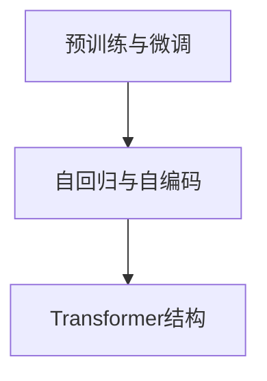

## 1.背景介绍

随着深度学习的发展以及数据和计算能力的提升，语言模型（Language Model，简称LM）已经取得了显著的进步。特别是大规模预训练语言模型（Large Language Model，简称LLM）如GPT-3、BERT等，已经在各种自然语言处理任务中展现出了惊人的性能。本文将深入探讨大语言模型的原理，以及其层次结构的理解。

## 2.核心概念与联系

语言模型的主要任务是预测给定的词序列中下一个词的概率。而大语言模型则是在大规模的语料库上预训练的模型，通过学习语料库中的词序列，模型能够理解和生成人类语言。

大语言模型的核心概念包括：

- **预训练与微调**：预训练是在大规模无标签数据上进行的学习，微调则是在特定任务的小规模标签数据上进行的学习。

- **自回归与自编码**：自回归模型（如GPT系列）是预测下一个词，自编码模型（如BERT）则是预测被遮挡的词。

- **Transformer结构**：Transformer是一种基于自注意力机制的神经网络结构，是大语言模型的核心组成部分。

这些概念之间的联系可以通过如下的Mermaid流程图进行展示：



## 3.核心算法原理具体操作步骤

大语言模型的训练过程主要包括预训练和微调两个步骤。

首先，进行预训练。模型在大规模无标签文本数据上进行训练，学习语言的一般规律。具体来说，对于自回归模型，给定一个词序列，模型需要预测下一个词；对于自编码模型，模型需要预测被遮挡的词。

然后，进行微调。模型在特定任务的小规模标签数据上进行训练，学习任务的特定知识。微调过程中，模型的参数进行微小的调整，以适应新的任务。

## 4.数学模型和公式详细讲解举例说明

大语言模型的训练过程可以用数学模型来描述。以自回归模型为例，给定一个词序列$x_1, x_2, ..., x_t$，模型需要预测下一个词$x_{t+1}$的概率，即$P(x_{t+1}|x_1, x_2, ..., x_t)$。

这个概率可以通过softmax函数计算得到：

$$
P(x_{t+1}|x_1, x_2, ..., x_t) = \frac{exp(f(x_1, x_2, ..., x_t, x_{t+1}))}{\sum_{x' \in V} exp(f(x_1, x_2, ..., x_t, x'))}
$$

其中，$f$是模型的函数，$V$是词汇表。

## 5.项目实践：代码实例和详细解释说明

以使用Hugging Face的Transformers库进行GPT-2模型微调为例，代码如下：

```python
from transformers import GPT2LMHeadModel, GPT2Tokenizer

tokenizer = GPT2Tokenizer.from_pretrained("gpt2")
model = GPT2LMHeadModel.from_pretrained("gpt2")

inputs = tokenizer("Hello, I'm a language model,", return_tensors="pt")
outputs = model(**inputs, labels=inputs["input_ids"])

loss = outputs.loss
logits = outputs.logits
```

这段代码首先载入GPT-2模型和对应的词汇表，然后给定一个输入序列，通过模型得到预测的输出，最后计算损失。

## 6.实际应用场景

大语言模型在各种自然语言处理任务中都有广泛的应用，例如：

- **文本生成**：如生成文章、写作辅助、诗歌创作等。

- **文本理解**：如阅读理解、情感分析、文本分类等。

- **对话系统**：如智能客服、聊天机器人等。

- **知识图谱**：如实体抽取、关系抽取、事件抽取等。

## 7.工具和资源推荐

在大语言模型的学习和使用过程中，以下工具和资源可能会有所帮助：

- **Hugging Face的Transformers库**：提供了各种预训练语言模型的实现和预训练模型。

- **TensorFlow和PyTorch**：两种主流的深度学习框架，可以用来实现和训练自己的模型。

- **Google的BERT论文**：详细介绍了BERT模型的原理和训练方法。

## 8.总结：未来发展趋势与挑战

大语言模型已经取得了显著的进步，但仍然面临着一些挑战，例如计算资源的需求、模型的解释性问题、以及模型的安全性和道德问题。

未来，我们期待通过更好的模型结构、更大的数据和更强的计算能力，以及更多的研究，来进一步提升大语言模型的性能。

## 9.附录：常见问题与解答

**Q: 大语言模型和小语言模型有什么区别？**

A: 大语言模型和小语言模型的主要区别在于模型的规模，包括模型的参数数量和训练数据的规模。大语言模型通常有更多的参数，需要更大的训练数据，但能够学习到更丰富的语言规律，从而在各种任务上取得更好的性能。

**Q: 如何理解自回归和自编码？**

A: 自回归和自编码是两种不同的预训练方式。自回归模型是预测下一个词，每次输入一个词，预测下一个词；自编码模型则是预测被遮挡的词，给定一个包含遮挡词的序列，模型需要预测被遮挡的词。

**Q: 如何理解Transformer结构？**

A: Transformer是一种基于自注意力机制的神经网络结构。它通过自注意力机制，可以捕获序列中的长距离依赖关系，而无需依赖于循环或卷积结构。

作者：禅与计算机程序设计艺术 / Zen and the Art of Computer Programming