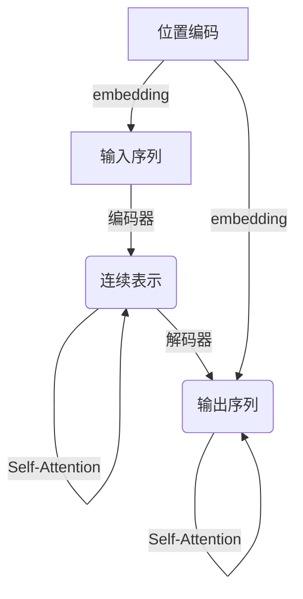
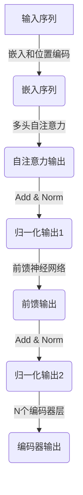
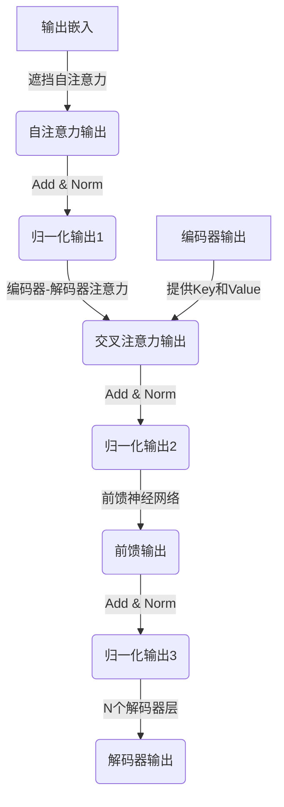

# 大语言模型原理基础与前沿 简化Transformer

## 1. 背景介绍

### 1.1 自然语言处理的发展历程

自然语言处理(Natural Language Processing, NLP)是人工智能领域的一个重要分支,旨在使计算机能够理解和生成人类语言。在过去几十年中,NLP技术取得了长足的进步,从早期基于规则的系统,到统计机器学习模型,再到近年来的深度学习模型。

### 1.2 深度学习在NLP中的突破

深度学习的兴起为NLP带来了革命性的变化。传统的统计模型受限于特征工程的瓶颈,而深度学习模型能够自动从数据中学习特征表示,显著提高了模型的性能。2018年,Transformer模型在机器翻译任务上取得了突破性的成果,随后在自然语言理解、文本生成等多个任务中表现出色,成为NLP领域的主导模型。

### 1.3 大语言模型的兴起

随着计算能力和数据量的不断增长,训练大规模语言模型成为可能。大语言模型(Large Language Model, LLM)通过在海量文本数据上进行预训练,学习到丰富的语言知识,并可以通过微调(fine-tuning)等方式应用于下游任务。代表性的大语言模型包括GPT、BERT、T5等,它们在多个NLP任务上展现出了强大的性能。

## 2. 核心概念与联系

### 2.1 Transformer模型

Transformer是一种全新的基于注意力机制(Attention Mechanism)的序列到序列(Seq2Seq)模型,它摒弃了传统的循环神经网络(RNN)和卷积神经网络(CNN)结构,完全依赖注意力机制来捕获输入和输出序列之间的长程依赖关系。

Transformer的核心组件包括:

1. **编码器(Encoder)**: 将输入序列映射为一系列连续的表示。
2. **解码器(Decoder)**: 根据编码器的输出和之前生成的tokens,生成输出序列。
3. **多头注意力(Multi-Head Attention)**: 允许模型同时关注输入序列的不同表示子空间。
4. **位置编码(Positional Encoding)**: 因为Transformer没有循环或卷积结构,所以引入位置编码来保留序列的位置信息。

Transformer模型通过自注意力(Self-Attention)机制,能够直接建立任意距离token之间的连接,有效解决了长序列输入的长程依赖问题,显著提高了模型的并行计算能力。

### 2.2 注意力机制(Attention Mechanism)

注意力机制是Transformer的核心,它允许模型在编码和解码过程中,动态地为不同的输入token分配不同的注意力权重,从而聚焦于最相关的信息。

在Transformer中,注意力机制主要包括以下几个步骤:

1. **计算注意力分数(Attention Scores)**: 将查询(Query)与键(Key)进行点积,得到未缩放的注意力分数。
2. **注意力分数缩放(Attention Score Scaling)**: 将注意力分数除以$\sqrt{d_k}$,其中$d_k$是键的维度,以缓解较长输入导致的梯度消失问题。
3. **Softmax**: 对缩放后的注意力分数应用Softmax函数,得到注意力权重。
4. **加权求和(Weighted Sum)**: 将注意力权重与值(Value)相乘,并对所有值进行求和,得到注意力输出。

数学表示如下:

$$
\begin{aligned}
\text{Attention}(Q, K, V) &= \text{softmax}\left(\frac{QK^T}{\sqrt{d_k}}\right)V \\
\text{head}_i &= \text{Attention}\left(QW_i^Q, KW_i^K, VW_i^V\right)
\end{aligned}
$$

其中$Q$、$K$、$V$分别表示查询、键和值,而$W_i^Q$、$W_i^K$、$W_i^V$是可学习的线性投影矩阵。多头注意力机制通过并行计算多个注意力头,捕获不同的子空间表示,并将它们连接起来作为最终的注意力输出。

### 2.3 自注意力(Self-Attention)

自注意力是指查询(Query)、键(Key)和值(Value)来自同一个序列,它允许模型直接建立序列内元素之间的长程依赖关系。在Transformer的编码器和解码器中,都广泛使用了自注意力机制。

自注意力的计算过程如下:

1. 将输入序列线性映射到查询(Query)、键(Key)和值(Value)表示。
2. 计算查询(Query)与所有键(Key)的注意力分数。
3. 对注意力分数应用Softmax函数,得到注意力权重分布。
4. 使用注意力权重对值(Value)进行加权求和,得到注意力输出。
5. 将注意力输出和输入序列进行残差连接,并进行层归一化(Layer Normalization)。

通过自注意力机制,Transformer能够同时关注输入序列中的所有位置,直接建立长程依赖关系,从而有效解决了RNN的梯度消失和爆炸问题,提高了模型的并行计算能力。

### 2.4 前馈神经网络(Feed-Forward Neural Network)

除了注意力子层,Transformer的编码器和解码器还包含前馈神经网络子层。前馈神经网络对每个位置的输入进行位置wise的线性变换,它由两个线性变换和一个ReLU激活函数组成:

$$
\text{FFN}(x) = \max(0, xW_1 + b_1)W_2 + b_2
$$

其中$W_1$、$W_2$、$b_1$、$b_2$是可学习的参数。前馈神经网络为模型引入了非线性变换,增强了其表示能力。

### 2.5 层归一化(Layer Normalization)

为了加速模型的收敛并提高其性能,Transformer采用了层归一化(Layer Normalization)技术。层归一化在每个子层的输出上执行,它通过减去均值并除以标准差来归一化输入,然后再乘以可学习的缩放因子和偏移量。层归一化有助于减少内部协变量偏移(Internal Covariate Shift)问题,使模型更容易优化。

### 2.6 残差连接(Residual Connection)

为了更好地传播梯度并缓解优化过程中的退化问题,Transformer在每个子层之后使用残差连接(Residual Connection)。残差连接将子层的输出与输入相加,确保了重要的信息能够直接传递到后续层,从而提高了模型的优化效率。

## 3. 核心算法原理具体操作步骤

### 3.1 Transformer编码器

Transformer编码器的工作流程如下:

1. **输入嵌入(Input Embedding)**: 将输入tokens映射为嵌入向量,并添加位置编码。
2. **子层1: 多头自注意力(Multi-Head Self-Attention)**: 对输入序列进行自注意力计算,捕获序列内元素之间的依赖关系。
3. **子层2: 前馈神经网络(Feed-Forward Neural Network)**: 对每个位置的输出进行非线性变换,增强表示能力。
4. **层归一化和残差连接**: 在每个子层之后应用层归一化和残差连接,以加速收敛和提高性能。
5. **重复步骤2-4**: 编码器由多个相同的层堆叠而成,每层重复执行自注意力、前馈神经网络、层归一化和残差连接的操作。
6. **输出**: 最后一层的输出作为编码器的输出,传递给解码器。

### 3.2 Transformer解码器

Transformer解码器的工作流程类似于编码器,但有以下不同之处:

1. **遮挡自注意力(Masked Self-Attention)**: 在自注意力计算中,解码器的每个位置只能关注之前的位置,以保证自回归(auto-regressive)属性。
2. **编码器-解码器注意力(Encoder-Decoder Attention)**: 解码器还需要计算查询(Query)与编码器输出的键(Key)和值(Value)之间的注意力,以捕获输入和输出序列之间的依赖关系。

Transformer解码器的具体步骤如下:

1. **输出嵌入(Output Embedding)**: 将输出tokens映射为嵌入向量,并添加位置编码。
2. **子层1: 遮挡自注意力(Masked Self-Attention)**: 对输出序列进行遮挡自注意力计算,只关注之前的位置。
3. **子层2: 编码器-解码器注意力(Encoder-Decoder Attention)**: 计算输出序列与编码器输出之间的注意力。
4. **子层3: 前馈神经网络(Feed-Forward Neural Network)**: 对每个位置的输出进行非线性变换。
5. **层归一化和残差连接**: 在每个子层之后应用层归一化和残差连接。
6. **重复步骤2-5**: 解码器由多个相同的层堆叠而成,每层重复执行遮挡自注意力、编码器-解码器注意力、前馈神经网络、层归一化和残差连接的操作。
7. **输出**: 最后一层的输出作为解码器的输出,可用于生成目标序列。

### 3.3 Transformer训练

Transformer模型通常采用监督学习的方式进行训练。对于序列到序列(Seq2Seq)任务,如机器翻译,训练目标是最小化输入序列和目标序列之间的交叉熵损失。对于其他任务,如语言模型或者文本分类,也可以使用相应的损失函数进行优化。

在训练过程中,通常采用Teacher Forcing策略,即在每个时间步,使用上一步的真实目标tokens作为解码器的输入,而不是使用解码器自己生成的tokens。这种策略虽然可能导致训练和推理之间存在exposure bias,但能够加快收敛速度并提高训练效率。

为了防止过拟合,Transformer模型通常采用正则化技术,如dropout、权重衰减等。此外,还可以使用标签平滑(Label Smoothing)技术,将一些模型置信度从正确标签平滑到其他标签上,以提高模型的泛化能力。

## 4. 数学模型和公式详细讲解举例说明

在Transformer模型中,注意力机制是核心组件,它允许模型动态地为不同的输入token分配不同的注意力权重,从而聚焦于最相关的信息。我们将详细介绍注意力机制的数学原理和计算过程。

### 4.1 缩放点积注意力(Scaled Dot-Product Attention)

缩放点积注意力是Transformer中使用的基本注意力机制。它的计算过程如下:

1. **计算注意力分数(Attention Scores)**: 将查询(Query)与键(Key)进行点积,得到未缩放的注意力分数。

$$
\text{Attention Scores} = Q \cdot K^T
$$

其中$Q \in \mathbb{R}^{n \times d_q}$是查询矩阵,包含$n$个查询向量,每个向量维度为$d_q$。$K \in \mathbb{R}^{m \times d_k}$是键矩阵,包含$m$个键向量,每个向量维度为$d_k$。注意力分数矩阵的