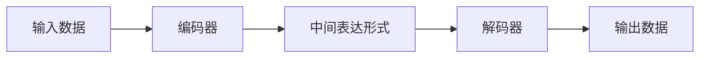

## 1.背景介绍

在人工智能的世界中，语言模型已经成为了一个重要的研究方向。自从神经网络的复兴以来，大规模的语言模型，特别是编码器-解码器架构的模型，已经在许多任务中取得了显著的效果。从机器翻译到文本生成，再到对话系统，这种架构已经成为了处理序列数据的主流方式。

## 2.核心概念与联系

### 2.1 语言模型

语言模型的任务是预测下一个词，给定前面的词。它可以用来生成自然语言文本，也可以用来评估一个给定的文本序列的可能性。在编码器-解码器架构中，编码器负责将输入序列（如一句话）编码成一个固定的向量，解码器则负责将这个向量解码成输出序列。

### 2.2 编码器-解码器架构

编码器-解码器架构是一种端到端的模型，它可以直接从输入数据预测输出数据，而无需人为设定中间的规则。编码器负责把输入数据转化成一种中间的表达形式，而解码器则负责把这种中间的表达形式转化成我们想要的输出数据。



## 3.核心算法原理具体操作步骤

### 3.1 编码器

编码器通常采用循环神经网络（RNN）或者是变换器（Transformer）架构。输入数据首先被转化成词向量，然后被送入编码器。编码器通过逐步读入输入数据，更新其内部状态，最后输出一个固定长度的向量，这个向量就是输入数据的编码。

### 3.2 解码器

解码器也通常采用RNN或者是变换器架构。它接收编码器的输出向量，然后逐步生成输出序列。在每一步，解码器都会生成一个输出，并更新其内部状态。然后，这个新的内部状态和编码器的输出向量一起被用来生成下一个输出。

## 4.数学模型和公式详细讲解举例说明

### 4.1 编码器

假设我们的输入数据是一个序列$x = (x_1, x_2, ..., x_n)$，编码器的任务就是将这个序列转化成一个固定长度的向量$c$。在RNN中，这个过程可以用以下的公式来表示：

$$
h_t = f(h_{t-1}, x_t)
$$

$$
c = q(h_n)
$$

其中，$f$是RNN的更新函数，$q$是一个可以提取出最后状态的函数，$h_t$是在时刻$t$的隐藏状态。

### 4.2 解码器

解码器的任务是根据编码器的输出$c$，生成一个输出序列$y = (y_1, y_2, ..., y_m)$。在RNN中，这个过程可以用以下的公式来表示：

$$
s_t = g(s_{t-1}, y_{t-1}, c)
$$

$$
y_t = softmax(Ws_t + b)
$$

其中，$g$是RNN的更新函数，$s_t$是在时刻$t$的隐藏状态，$W$和$b$是需要学习的参数。

## 5.项目实践：代码实例和详细解释说明

这是一个简单的编码器-解码器模型的实现，使用了Keras库。

```python
from keras.models import Model
from keras.layers import Input, LSTM, Dense

# 编码器
encoder_inputs = Input(shape=(None, num_encoder_tokens))
encoder = LSTM(latent_dim, return_state=True)
encoder_outputs, state_h, state_c = encoder(encoder_inputs)
encoder_states = [state_h, state_c]

# 解码器
decoder_inputs = Input(shape=(None, num_decoder_tokens))
decoder_lstm = LSTM(latent_dim, return_sequences=True, return_state=True)
decoder_outputs, _, _ = decoder_lstm(decoder_inputs, initial_state=encoder_states)
decoder_dense = Dense(num_decoder_tokens, activation='softmax')
decoder_outputs = decoder_dense(decoder_outputs)

# 模型
model = Model([encoder_inputs, decoder_inputs], decoder_outputs)
model.compile(optimizer='rmsprop', loss='categorical_crossentropy')
model.fit([encoder_input_data, decoder_input_data], decoder_target_data, batch_size=batch_size, epochs=epochs, validation_split=0.2)
```

这段代码首先定义了一个编码器，它接收一个输入序列，并返回其内部状态。然后，定义了一个解码器，它接收编码器的内部状态和一个输入序列，然后返回一个输出序列。最后，定义了一个模型，它连接了编码器和解码器，并使用了分类交叉熵作为损失函数。

## 6.实际应用场景

编码器-解码器架构已经被广泛应用在了许多领域，包括但不限于：

- 机器翻译：将一种语言的文本翻译成另一种语言的文本。
- 文本生成：根据一段给定的文本，生成一段新的文本。
- 对话系统：根据用户的输入，生成一个回应。

## 7.工具和资源推荐

有许多优秀的工具和资源可以用来学习和实践编码器-解码器模型，包括但不限于：

- Keras：一个易于使用的深度学习库，支持多种后端，包括TensorFlow和Theano。
- TensorFlow：一个强大的深度学习框架，由Google开发。
- PyTorch：一个动态的深度学习框架，由Facebook开发。

## 8.总结：未来发展趋势与挑战

编码器-解码器模型已经在许多任务中取得了显著的效果，但也面临着一些挑战。首先，如何有效地处理长序列数据仍然是一个问题。其次，如何将先验知识融入模型也是一个重要的研究方向。最后，如何提高模型的解释性，使其能够给出更有用的反馈，也是一个需要解决的问题。

## 9.附录：常见问题与解答

1. **编码器和解码器必须是相同的模型吗？**

   不必。虽然在许多应用中，编码器和解码器是相同的模型，但它们也可以是不同的模型。例如，编码器可以是一个卷积神经网络（CNN），而解码器可以是一个RNN。

2. **编码器-解码器模型可以处理多模态数据吗？**

   可以。编码器-解码器模型可以很容易地扩展到多模态数据。例如，可以将图像数据和文本数据一起输入到模型中，生成一个描述图像内容的文本。

3. **编码器-解码器模型如何处理不同长度的输入和输出序列？**

   编码器-解码器模型通过使用特殊的标记（如开始和结束标记）来处理不同长度的输入和输出序列。在训练时，所有的输入和输出序列都会被填充到相同的长度。

作者：禅与计算机程序设计艺术 / Zen and the Art of Computer Programming