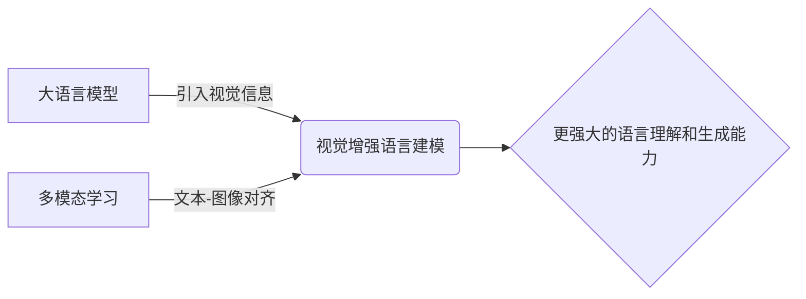

# 大语言模型原理基础与前沿 视觉增强语言建模

## 1.背景介绍

### 1.1 大语言模型的发展历程
大语言模型(Large Language Model, LLM)是近年来自然语言处理(NLP)领域最重要的突破之一。从2018年GPT-1的问世,到如今GPT-3、PaLM、Megatron-Turing NLG等百亿乃至千亿级参数规模的模型不断涌现,大语言模型展现出了惊人的自然语言理解和生成能力,在机器翻译、对话系统、文本摘要等诸多NLP任务上取得了显著进展。

### 1.2 多模态语言模型的兴起
随着大语言模型的发展,研究者们开始探索如何将视觉信息融入语言模型,使其具备更强的感知和理解能力。视觉增强语言建模(Visually-enhanced Language Modeling)正是在这一背景下应运而生。通过将图像、视频等视觉信息与文本结合,多模态语言模型能够更好地把握语义,实现更自然、更具交互性的人机对话。

### 1.3 视觉增强语言建模的研究意义
视觉增强语言建模有望突破传统语言模型的局限,实现更通用的人工智能。它不仅能提升模型对现实世界的感知和理解能力,还能赋予模型更强的创造力和想象力。此外,多模态语言模型在智能助理、教育培训、医疗诊断等领域也有广阔的应用前景。因此,深入研究视觉增强语言建模,对于推动人工智能的进一步发展具有重要意义。

## 2.核心概念与联系

### 2.1 大语言模型
大语言模型通过在海量文本数据上进行预训练,习得强大的语言理解和生成能力。主要特点包括:

- 参数规模巨大,一般在百亿到千亿量级
- 采用 Transformer 等先进的神经网络架构  
- 使用无监督或自监督学习方式进行预训练
- 可通过少量调优应用于下游任务

### 2.2 多模态学习
多模态学习旨在处理和关联来自多种信息源的数据,如文本、图像、音频等。其核心是学习不同模态数据的统一表示,捕捉它们之间的内在联系。常见的多模态学习任务有:

- 图像描述生成
- 视觉问答
- 视听语音识别
- 多模态情感分析

### 2.3 视觉增强语言建模 
视觉增强语言建模是将视觉信息融入语言模型的过程。主要思路是在预训练阶段加入图像编码器,将图像特征与文本表示对齐,使模型学习到视觉-语言对应关系。这样在下游任务中,模型能够根据图像内容生成更准确、更丰富的文本。

### 2.4 核心概念之间的联系


## 3.核心算法原理与具体操作步骤

### 3.1 预训练阶段

#### 3.1.1 多模态数据准备
- 收集大规模的图文对齐数据集,如MSCOCO、Flickr30k等
- 对图像进行预处理,提取CNN特征
- 对文本进行tokenization,转换为模型可接受的输入形式

#### 3.1.2 模型结构设计
- 在传统 Transformer 结构基础上,引入视觉编码器
- 视觉编码器可采用预训练的CNN,如ResNet、ViT等
- 文本编码器采用多层 Transformer 结构
- 在 Transformer 的注意力机制中加入视觉-文本交互

#### 3.1.3 预训练目标设计
- 掩码语言建模(Masked Language Modeling,MLM):随机掩盖文本词块,让模型根据上下文和图像预测 
- 图像-文本匹配(Image-Text Matching,ITM):判断图像与文本是否匹配
- 图像-文本对比学习(Image-Text Contrastive Learning):拉近匹配图文对的特征距离,推开不匹配对的距离

#### 3.1.4 预训练过程
- 将多模态数据输入模型,计算预训练目标的损失函数
- 使用Adam等优化器更新模型参数,进行多轮训练
- 监控验证集性能,保存最优模型权重

### 3.2 微调阶段

#### 3.2.1 下游任务数据准备
- 根据具体任务收集相应的图文数据
- 数据预处理步骤与预训练阶段类似
- 划分训练集、验证集和测试集

#### 3.2.2 模型结构调整
- 根据任务需求,可在预训练模型结构基础上,添加任务特定的输出层
- 例如图像描述生成任务需要在模型末尾加入文本解码器
- 视觉问答则需要根据图像-问题对,预测答案范围

#### 3.2.3 微调训练
- 加载预训练模型权重,冻结大部分参数
- 使用下游任务数据,训练新增的任务特定层参数
- 通常只需训练很少的轮数,即可在目标任务上取得不错效果
- 监控验证集性能,防止过拟合

### 3.3 推理阶段
- 使用训练好的模型对新样本进行预测
- 对于开放域的任务如图像描述生成,直接用模型输出作为最终结果
- 对于封闭域任务如视觉问答,需要对模型输出进行后处理,如答案筛选、排序等

## 4.数学模型和公式详解

### 4.1 Transformer 结构
Transformer 是视觉增强语言模型的核心组件之一。其主要由多头注意力机制(Multi-Head Attention)和前馈神经网络(Feed-Forward Network)组成。

#### 4.1.1 注意力机制
对于查询 $Q$,键 $K$ 和值 $V$,注意力函数 $Attention(Q,K,V)$ 的计算过程为:

$$Attention(Q,K,V) = softmax(\frac{QK^T}{\sqrt{d_k}})V$$

其中 $d_k$ 为键向量的维度。

多头注意力则是将 $Q,K,V$ 通过线性变换,划分为多个子空间,分别计算注意力,再拼接结果:

$$MultiHead(Q,K,V) = Concat(head_1,...,head_h)W^O$$

$$head_i = Attention(QW_i^Q, KW_i^K, VW_i^V)$$

其中 $W_i^Q \in \mathbb{R}^{d_model \times d_k}, W_i^K \in \mathbb{R}^{d_model \times d_k}, W_i^V \in \mathbb{R}^{d_model \times d_v}, W^O \in \mathbb{R}^{hd_v \times d_model}$ 为可学习的参数矩阵。

#### 4.1.2 前馈神经网络
前馈神经网络由两个线性变换和一个非线性激活函数(通常为ReLU)组成:

$$FFN(x) = max(0, xW_1 + b_1)W_2 + b_2$$

其中 $W_1 \in \mathbb{R}^{d_model \times d_{ff}}, b_1 \in \mathbb{R}^{d_{ff}}, W_2 \in \mathbb{R}^{d_{ff} \times d_model}, b_2 \in \mathbb{R}^{d_model}$ 为可学习参数。$d_{ff}$ 通常设为 $4d_{model}$。

### 4.2 预训练目标

#### 4.2.1 掩码语言建模
给定图像 $I$ 和文本序列 $w_{1:T} = [w_1,...,w_T]$,随机掩盖一部分文本词块,得到掩码后的序列 $\hat{w}_{1:T}$。目标是最大化如下似然:

$$\mathcal{L}_{MLM}(\theta) = \mathbb{E}_{(I,w)\sim D}\log P(w_{1:T}|\hat{w}_{1:T},I;\theta)$$

#### 4.2.2 图像-文本匹配
对于图像 $I$ 和文本 $S$,使用特殊符号 $[CLS]$ 对应位置的输出向量进行二分类,判断是否匹配:

$$P(y|I,S) = sigmoid(W_{ITM}h_{[CLS]} + b_{ITM})$$

匹配损失为:

$$\mathcal{L}_{ITM}(\theta) = \mathbb{E}_{(I,S)\sim D}[y\log P(y|I,S) + (1-y)\log(1-P(y|I,S))]$$

#### 4.2.3 图像-文本对比学习
对于批量数据中的图像-文本对 $(I_i,S_i)$,将图像-文本表示 $v_i,t_i$ 经过映射函数 $f_v,f_t$ 后在公共空间对齐。对比损失为:

$$\mathcal{L}_{ITC}(\theta) = -\mathbb{E}_{(I,S)\sim D}\left[\frac{1}{N}\sum_{i=1}^{N}\log\frac{\exp(f_v(v_i)^Tf_t(t_i)/\tau)}{\sum_{j=1}^{N}\exp(f_v(v_i)^Tf_t(t_j)/\tau)}\right]$$

其中 $\tau$ 为温度超参数。

最终的预训练损失为上述三个损失函数的加权和:

$$\mathcal{L}(\theta) = \mathcal{L}_{MLM}(\theta) + \alpha\mathcal{L}_{ITM}(\theta) + \beta\mathcal{L}_{ITC}(\theta)$$

## 5.项目实践:代码实例与详解

下面以PyTorch为例,给出视觉增强语言模型预训练的简要实现:

```python
import torch
import torch.nn as nn
from transformers import BertModel, ViTModel

class VLModel(nn.Module):
    def __init__(self, text_encoder, image_encoder):
        super().__init__()
        self.text_encoder = text_encoder
        self.image_encoder = image_encoder
        
        self.itm_head = nn.Linear(self.text_encoder.config.hidden_size, 2)
        self.mlm_head = nn.Linear(self.text_encoder.config.hidden_size, self.text_encoder.config.vocab_size)
        self.proj_v = nn.Linear(self.image_encoder.config.hidden_size, 256)  
        self.proj_t = nn.Linear(self.text_encoder.config.hidden_size, 256)
        
    def forward(self, input_ids, attention_mask, pixel_values):
        text_outputs = self.text_encoder(input_ids=input_ids, attention_mask=attention_mask)
        image_outputs = self.image_encoder(pixel_values=pixel_values)
        
        cls_embedding = text_outputs.last_hidden_state[:,0,:]
        itm_logits = self.itm_head(cls_embedding)
        
        text_feat = text_outputs.last_hidden_state
        mlm_logits = self.mlm_head(text_feat)
        
        image_feat = image_outputs.last_hidden_state[:,0,:]  
        image_proj = self.proj_v(image_feat)
        text_proj = self.proj_t(cls_embedding)
        
        return itm_logits, mlm_logits, image_proj, text_proj
    
def main():
    # 加载预训练模型
    text_encoder = BertModel.from_pretrained('bert-base-uncased')
    image_encoder = ViTModel.from_pretrained('google/vit-base-patch16-224-in21k')
    model = VLModel(text_encoder, image_encoder)
    
    # 准备数据
    input_ids = torch.randint(1000, (4,128))  # 随机文本输入
    attention_mask = torch.ones(4,128)
    pixel_values = torch.randn(4,3,224,224)  # 随机图像输入
    itm_labels = torch.tensor([0,1,0,1])
    mlm_labels = torch.randint(1000, (4,128)) 
    
    # 定义损失函数和优化器
    itm_loss_fn = nn.CrossEntropyLoss()
    mlm_loss_fn = nn.CrossEntropyLoss()
    contrastive_loss_fn = nn.CrossEntropyLoss()
    optimizer = torch.optim.AdamW(model.parameters(), lr=1e-4)
    
    # 前向传播
    itm_logits, mlm_logits, image_proj, text_proj = model(input_ids, attention_mask, pixel_values)
    
    # 计算损失  
    itm_loss = itm_loss_fn(itm_logits, itm_labels)
    mlm_loss = mlm_loss_fn(mlm_logits.view(-1,text_encoder.config.vocab_size), mlm_labels.view(-1))
    contrastive_loss = contrastive_loss_fn(torch.matmul(text_proj,