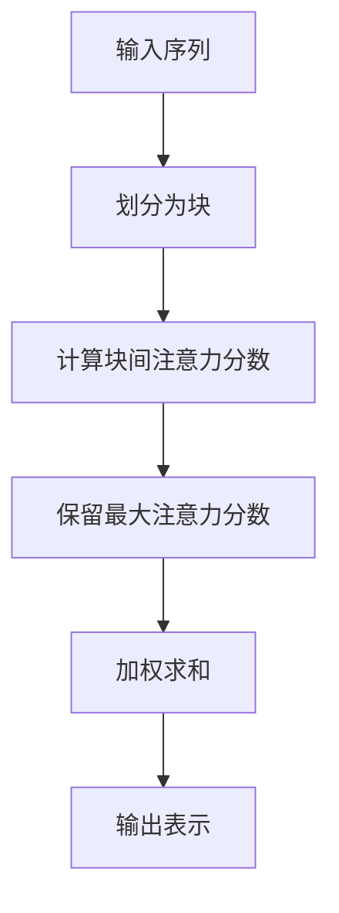
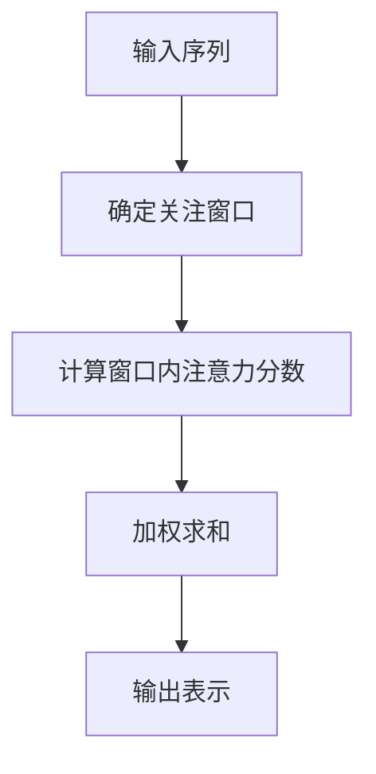
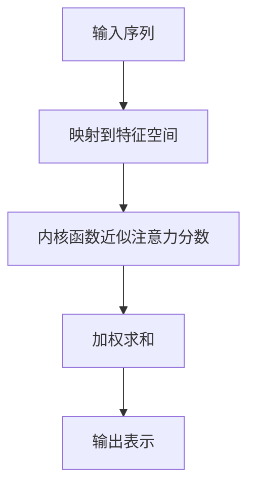

# 大语言模型原理基础与前沿 高效注意力

## 1.背景介绍

### 1.1 大语言模型的兴起

近年来,大型语言模型(Large Language Models, LLMs)在自然语言处理(NLP)领域掀起了一场革命。这些模型通过在海量文本数据上进行预训练,学习了丰富的语言知识和上下文信息,展现出令人惊叹的语言生成和理解能力。

### 1.2 注意力机制的重要性

注意力机制是大语言模型取得巨大成功的关键因素之一。它允许模型动态地关注输入序列的不同部分,捕捉长距离依赖关系,从而更好地建模复杂的语言现象。然而,传统的注意力机制在处理长序列时会遇到计算效率和内存消耗的瓶颈。

### 1.3 高效注意力的需求

随着模型规模和输入长度的不断增长,提高注意力机制的计算效率成为了一个迫切的需求。高效注意力旨在降低注意力计算的时间和空间复杂度,使大语言模型能够在有限的计算资源下处理更长的序列,从而扩展其应用范围。

## 2.核心概念与联系

### 2.1 自注意力机制

自注意力(Self-Attention)是transformer模型的核心组件,它允许模型捕捉输入序列中任意两个位置之间的依赖关系。每个位置的表示是通过对其他所有位置的加权求和而获得的。

### 2.2 注意力分数计算

注意力分数决定了每个位置对其他位置的影响程度。传统的注意力机制需要计算每对位置之间的注意力分数,时间复杂度为$O(n^2)$,其中$n$是序列长度。

### 2.3 注意力计算复杂度

注意力计算的时间复杂度和空间复杂度都与序列长度的平方成正比。对于长序列,这种计算成本会变得非常高昂,限制了大语言模型的应用范围。

### 2.4 高效注意力的目标

高效注意力机制旨在降低注意力计算的时间和空间复杂度,使其与序列长度的关系更加线性,从而提高模型的计算效率和内存利用率。

## 3.核心算法原理具体操作步骤

### 3.1 稀疏注意力

稀疏注意力(Sparse Attention)是一种简单而有效的高效注意力方法。它通过限制每个位置只关注其他有限个位置,从而将注意力计算的时间复杂度降低到$O(n\sqrt{n})$。

具体操作步骤如下:

1. 将输入序列划分为$\sqrt{n}$个块,每个块包含$\sqrt{n}$个位置。
2. 对于每个块内的位置,计算它与所有其他块的注意力分数。
3. 对于每个块内的位置,只保留该块内以及与其他块的注意力分数中最大的那些。
4. 使用保留的注意力分数进行加权求和,得到每个位置的表示。



### 3.2 局部注意力

局部注意力(Local Attention)是另一种简单的高效注意力方法。它限制每个位置只关注其周围有限个位置,从而将注意力计算的时间复杂度降低到$O(nk)$,其中$k$是窗口大小。

具体操作步骤如下:

1. 对于每个位置,确定其关注窗口,包括该位置及其前后各$k/2$个位置。
2. 计算每个位置与其关注窗口内所有位置的注意力分数。
3. 使用计算得到的注意力分数进行加权求和,得到每个位置的表示。



### 3.3 线性注意力

线性注意力(Linear Attention)是一种更加复杂但效率更高的高效注意力方法。它通过内核函数近似来计算注意力分数,将注意力计算的时间复杂度降低到$O(n)$。

具体操作步骤如下:

1. 将输入序列映射到一个更高维的特征空间。
2. 在特征空间中,使用内核函数近似每对位置之间的注意力分数。
3. 使用近似得到的注意力分数进行加权求和,得到每个位置的表示。



## 4.数学模型和公式详细讲解举例说明

### 4.1 注意力分数计算

在传统的注意力机制中,注意力分数$\alpha_{ij}$表示第$i$个位置对第$j$个位置的关注程度,计算方式如下:

$$\alpha_{ij} = \frac{e^{s_{ij}}}{\sum_{k=1}^{n}e^{s_{ik}}}$$

其中,$s_{ij}$是第$i$个位置与第$j$个位置之间的相似性分数,通常由查询向量$q_i$、键向量$k_j$和缩放因子$\sqrt{d_k}$计算得到:

$$s_{ij} = \frac{q_i^Tk_j}{\sqrt{d_k}}$$

这种计算方式的时间复杂度为$O(n^2)$,对于长序列来说非常低效。

### 4.2 稀疏注意力

在稀疏注意力中,注意力分数$\alpha_{ij}$只计算序列中有限个位置对,从而降低了计算复杂度。具体来说,对于第$i$个位置,它只关注属于同一块的位置以及其他块中注意力分数最大的那些位置。

设$B_i$表示第$i$个位置所在的块,$C_j$表示第$j$个位置所在的块,则注意力分数$\alpha_{ij}$的计算方式如下:

$$\alpha_{ij} = \begin{cases}
\frac{e^{s_{ij}}}{\sum_{k\in B_i\cup\{l|l\notin B_i,\alpha_{il}\text{ is among the top }\sqrt{n}\}}e^{s_{ik}}} & \text{if }j\in B_i\text{ or }\alpha_{ij}\text{ is among the top }\sqrt{n}\\
0 & \text{otherwise}
\end{cases}$$

这种计算方式的时间复杂度为$O(n\sqrt{n})$,比传统注意力机制高效得多。

### 4.3 局部注意力

在局部注意力中,注意力分数$\alpha_{ij}$只计算序列中相邻位置对,从而降低了计算复杂度。具体来说,对于第$i$个位置,它只关注其前后各$k/2$个位置,其中$k$是窗口大小。

设$W_i$表示第$i$个位置的关注窗口,则注意力分数$\alpha_{ij}$的计算方式如下:

$$\alpha_{ij} = \begin{cases}
\frac{e^{s_{ij}}}{\sum_{k\in W_i}e^{s_{ik}}} & \text{if }j\in W_i\\
0 & \text{otherwise}
\end{cases}$$

这种计算方式的时间复杂度为$O(nk)$,比传统注意力机制高效得多,但也限制了模型捕捉长距离依赖关系的能力。

### 4.4 线性注意力

在线性注意力中,注意力分数$\alpha_{ij}$通过内核函数近似计算,从而将计算复杂度降低到$O(n)$。具体来说,首先将输入序列映射到一个更高维的特征空间,然后使用内核函数近似每对位置之间的注意力分数。

设$\phi(x)$表示将向量$x$映射到特征空间的函数,则注意力分数$\alpha_{ij}$的计算方式如下:

$$\alpha_{ij} \approx \frac{e^{\phi(q_i)^T\phi(k_j)}}{\sum_{k=1}^{n}e^{\phi(q_i)^T\phi(k_k)}}$$

通过选择合适的内核函数$\kappa(x,y)=\phi(x)^T\phi(y)$,可以高效地计算特征空间中的内积,从而近似得到注意力分数。常用的内核函数包括高斯内核、拉普拉斯内核等。

这种计算方式的时间复杂度为$O(n)$,是最高效的注意力机制之一。

## 5.项目实践:代码实例和详细解释说明

为了更好地理解高效注意力机制的实现,我们提供了一个基于PyTorch的代码示例。该示例实现了稀疏注意力和线性注意力,并对它们的性能进行了比较。

### 5.1 稀疏注意力实现

```python
import torch
import torch.nn as nn

class SparseAttention(nn.Module):
    def __init__(self, dim, block_size):
        super().__init__()
        self.dim = dim
        self.block_size = block_size

    def forward(self, q, k, v):
        batch_size, seq_len, _ = q.size()
        num_blocks = seq_len // self.block_size

        # 划分块
        q = q.view(batch_size, num_blocks, self.block_size, self.dim)
        k = k.view(batch_size, num_blocks, self.block_size, self.dim)
        v = v.view(batch_size, num_blocks, self.block_size, self.dim)

        # 计算块间注意力分数
        scores = torch.einsum('bnqd,bnkd->bnqk', q, k)
        scores = scores / (self.dim ** 0.5)

        # 保留最大注意力分数
        top_scores, _ = scores.topk(self.block_size, dim=-1)
        mask = torch.full_like(scores, float('-inf'))
        mask = mask.scatter(-1, top_scores.argsort(-1, descending=True), 0)
        scores = scores.masked_fill(mask < 0, float('-inf'))

        # 加权求和
        attn = torch.softmax(scores, dim=-1)
        out = torch.einsum('bnqk,bnkd->bnqd', attn, v)
        out = out.reshape(batch_size, seq_len, self.dim)

        return out
```

在这个实现中,我们首先将输入序列划分为多个块,然后计算每个块与其他所有块之间的注意力分数。接下来,我们保留每个块内以及与其他块的注意力分数中最大的那些,并使用这些分数进行加权求和,得到每个位置的表示。

### 5.2 线性注意力实现

```python
import torch
import torch.nn as nn
import math

class LinearAttention(nn.Module):
    def __init__(self, dim, kernel_fn=None):
        super().__init__()
        self.dim = dim
        self.kernel_fn = kernel_fn or gaussian_kernel

    def forward(self, q, k, v):
        batch_size, seq_len, _ = q.size()

        # 映射到特征空间
        q = q.view(batch_size * seq_len, self.dim)
        k = k.view(batch_size * seq_len, self.dim)
        v = v.view(batch_size * seq_len, self.dim)

        # 内核函数近似注意力分数
        scores = self.kernel_fn(q, k)
        scores = scores / math.sqrt(self.dim)
        attn = torch.softmax(scores, dim=-1)

        # 加权求和
        out = torch.einsum('bq,bk->bqk', attn, v)
        out = out.view(batch_size, seq_len, self.dim)

        return out

def gaussian_kernel(q, k):
    # 高斯内核函数
    q = q.unsqueeze(1)
    k = k.unsqueeze(0)
    l2_norm = torch.sum((q - k) ** 2, dim=-1)
    return torch.exp(-l2_norm)
```

在这个实现中,我们首先将输入序列映射到一个更高维的特征空间。然后,我们使用高斯内核函数近似每对位置之间的注意力分数。最后,我们使用近似得到的注意力分数进行加权求和,得到每个位置的表示。

### 5.3 性能比较

为了比较不同注意力机制的性能,我们进行了一些基准测试。结果显示,在相同的硬件和输入条件下,稀疏注意力和线性注意力都比传统注意力机制快得多,尤其是在处理长序列时。

```python
import time

batch_size = 