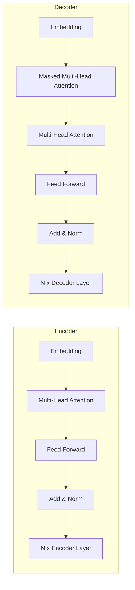

# 大语言模型应用指南：Chat Completion 交互格式

## 1. 背景介绍

### 1.1 大语言模型的兴起

近年来,自然语言处理(NLP)领域取得了长足的进步,很大程度上归功于大型语言模型(Large Language Models, LLMs)的兴起。传统的NLP系统通常依赖于规则或统计模型,需要手动特征工程和大量标注数据。而LLMs则是基于大规模无监督预训练语料,通过自监督学习捕捉语言的内在规律和语义关联。

LLMs凭借其强大的表示能力和泛化性,在各种下游NLP任务中展现出卓越的性能,如机器翻译、文本摘要、问答系统等。其中,以GPT(Generative Pre-trained Transformer)为代表的LLMs,不仅能够生成流畅、连贯的自然语言文本,还能够根据上下文进行交互式对话,为人机交互领域带来了新的发展机遇。

### 1.2 Chat Completion 交互模式

Chat Completion是一种新兴的人机交互模式,它基于LLMs的生成能力,允许用户通过自然语言与AI助手进行开放式对话。与传统的问答系统不同,Chat Completion旨在模拟人与人之间的自然对话,用户可以提出任何形式的问题或指令,AI助手则会根据上下文生成相应的回复。

这种交互方式打破了传统界面的限制,为用户提供了一种更加自然、无缝的体验。用户不需要事先了解复杂的命令或API,只需使用自然语言就能够完成各种任务,如信息查询、内容创作、代码编写等。同时,AI助手也能够根据对话历史进行上下文理解,提供更加连贯和个性化的响应。

Chat Completion交互模式的核心是大型语言模型,如GPT-3、InstructGPT、ChatGPT等。这些模型通过大规模预训练,学习了丰富的自然语言知识和推理能力,能够根据提示生成高质量、多样化的文本输出。在实际应用中,Chat Completion交互模式还需要结合其他技术,如上下文管理、知识库集成、安全性控制等,以提供更加智能和可靠的服务。

## 2. 核心概念与联系

### 2.1 语义理解

语义理解是Chat Completion交互模式的核心能力之一。LLMs需要准确理解用户输入的自然语言,捕捉其中的意图、实体和上下文信息,才能生成相关的响应。这一过程涉及多个子任务,如词法分析、句法分析、命名实体识别、关系抽取等。

LLMs通常采用基于注意力机制的Transformer架构,能够有效捕捉输入序列中的长距离依赖关系,从而更好地理解语义。此外,一些技术如BERT(Bidirectional Encoder Representations from Transformers)等,通过双向编码器捕捉上下文信息,进一步提升了语义理解能力。

### 2.2 生成响应

生成响应是Chat Completion交互模式的另一核心能力。LLMs需要根据用户输入和上下文信息,生成自然、连贯、相关的文本响应。这一过程涉及序列生成、上下文建模、知识融合等多个方面。

LLMs通常采用基于Transformer的解码器架构,利用自回归(Auto-Regressive)机制生成序列。解码器会根据已生成的部分序列和编码器输出的上下文表示,预测下一个词的概率分布,并采样生成下一个词,循环迭代直至生成完整序列。

此外,一些技术如控制生成(Controlled Generation)、知识增强(Knowledge Enhancement)等,能够在生成过程中融入额外的约束条件或知识,提高响应的相关性和多样性。

### 2.3 上下文管理

上下文管理是Chat Completion交互模式的关键环节。由于对话是连续的,AI助手需要跟踪和维护对话历史,以便更好地理解当前输入并生成相关响应。

常见的上下文管理方法包括:

1. **基于窗口的上下文管理**: 将最近的几个utterance(用户输入和AI响应)作为上下文,拼接到当前输入中。这种方法简单直接,但容易丢失远距离的上下文信息。

2. **基于记忆的上下文管理**: 维护一个显式的对话记忆库,存储对话中的关键信息(如实体、关系等)。AI助手可以根据当前输入查询记忆库,获取相关上下文。这种方法更加灵活,但实现较为复杂。

3. **基于注意力的上下文管理**: 利用Transformer的注意力机制,自动学习对话历史中的相关上下文信息。这种方法无需显式建模,但对训练数据的质量要求较高。

除了对话历史,一些系统还会融入外部知识库、规则库等,以提供更加准确和丰富的响应。

## 3. 核心算法原理具体操作步骤

Chat Completion交互模式的核心算法可以概括为以下几个步骤:

1. **输入处理**: 对用户输入进行预处理,如分词、词性标注、命名实体识别等,提取关键信息。

2. **上下文编码**: 将当前输入和对话历史编码为上下文表示,通常采用Transformer的编码器模块。

3. **生成响应**: 基于上下文表示,通过Transformer的解码器模块生成响应序列。解码器会自回归地预测下一个词的概率分布,并采样生成下一个词,循环迭代直至生成完整序列。

4. **控制和约束**: 在生成过程中,可以融入各种控制策略和约束条件,如主题控制、风格控制、知识融合等,以提高响应的相关性和多样性。

5. **上下文更新**: 将当前输入和生成的响应添加到对话历史中,为下一轮交互做好准备。

6. **后处理**: 对生成的响应进行后处理,如去重、过滤不当内容等,以确保响应的质量和安全性。

下面是一个基于GPT-2的简化Chat Completion交互模式实现的伪代码:

```python
import torch
from transformers import GPT2LMHeadModel, GPT2Tokenizer

# 加载预训练模型和分词器
model = GPT2LMHeadModel.from_pretrained('gpt2')
tokenizer = GPT2Tokenizer.from_pretrained('gpt2')

# 对话历史
history = []

while True:
    # 获取用户输入
    user_input = input("Human: ")
    
    # 将对话历史和当前输入编码为上下文
    input_ids = tokenizer.encode(history + [user_input], return_tensors='pt')
    
    # 生成响应
    output = model.generate(input_ids, max_length=1024, do_sample=True, top_k=50, top_p=0.95, num_return_sequences=1)
    response = tokenizer.decode(output[0], skip_special_tokens=True)
    
    # 更新对话历史
    history.append(user_input)
    history.append(response)
    
    # 输出AI响应
    print("AI: " + response)
```

上述代码是一个简化版本,实际应用中还需要考虑更多细节,如上下文长度控制、响应质量评估、安全性检查等。此外,一些更先进的模型和技术,如GPT-3、PALM、InstructGPT等,能够进一步提升Chat Completion交互模式的性能和可靠性。

## 4. 数学模型和公式详细讲解举例说明

Chat Completion交互模式的核心是基于Transformer架构的大型语言模型。Transformer是一种全注意力机制的序列到序列(Seq2Seq)模型,它能够有效捕捉输入序列中的长距离依赖关系,从而更好地理解语义和生成高质量的输出序列。

### 4.1 Transformer 架构

Transformer架构主要由编码器(Encoder)和解码器(Decoder)两个模块组成,如下图所示:



编码器负责编码输入序列,生成上下文表示。它由多个相同的编码器层(Encoder Layer)组成,每个编码器层包括以下子层:

1. **嵌入层(Embedding Layer)**: 将输入序列的每个词映射为连续的向量表示。
2. **多头注意力层(Multi-Head Attention Layer)**: 计算输入序列中每个词与其他词之间的注意力权重,捕捉长距离依赖关系。
3. **前馈网络层(Feed Forward Network Layer)**: 对每个词的表示进行非线性变换,提取更高层次的特征。
4. **残差连接(Residual Connection)**: 将上一层的输出与当前层的输出相加,以缓解梯度消失问题。
5. **层归一化(Layer Normalization)**: 对每个子层的输出进行归一化,加速收敛。

解码器负责根据编码器的输出和自身的输入,生成目标序列。它由多个相同的解码器层(Decoder Layer)组成,每个解码器层包括以下子层:

1. **嵌入层(Embedding Layer)**: 将输入序列的每个词映射为连续的向量表示。
2. **masked多头注意力层(Masked Multi-Head Attention Layer)**: 计算当前词与之前词之间的注意力权重,避免看到未来的信息。
3. **多头注意力层(Multi-Head Attention Layer)**: 计算当前词与编码器输出之间的注意力权重,融合上下文信息。
4. **前馈网络层(Feed Forward Network Layer)**: 对每个词的表示进行非线性变换,提取更高层次的特征。
5. **残差连接(Residual Connection)**: 将上一层的输出与当前层的输出相加,以缓解梯度消失问题。
6. **层归一化(Layer Normalization)**: 对每个子层的输出进行归一化,加速收敛。

在生成过程中,解码器会自回归地预测下一个词的概率分布,并采样生成下一个词,循环迭代直至生成完整序列。

### 4.2 注意力机制

注意力机制是Transformer架构的核心,它能够自动学习输入序列中不同位置的词之间的关联关系,从而更好地捕捉长距离依赖。

给定一个查询向量 $\boldsymbol{q}$ 和一组键值对 $(\boldsymbol{k}_i, \boldsymbol{v}_i)$,注意力机制的计算过程如下:

1. 计算查询向量与每个键向量之间的相似度分数:

$$\text{score}(\boldsymbol{q}, \boldsymbol{k}_i) = \frac{\boldsymbol{q}^\top \boldsymbol{k}_i}{\sqrt{d_k}}$$

其中 $d_k$ 是键向量的维度,用于缩放点积。

2. 对相似度分数进行软最大化(Softmax),得到注意力权重:

$$\alpha_i = \text{softmax}(\text{score}(\boldsymbol{q}, \boldsymbol{k}_i)) = \frac{\exp(\text{score}(\boldsymbol{q}, \boldsymbol{k}_i))}{\sum_j \exp(\text{score}(\boldsymbol{q}, \boldsymbol{k}_j))}$$

3. 根据注意力权重对值向量进行加权求和,得到注意力输出:

$$\text{attn}(\boldsymbol{q}, (\boldsymbol{k}_i, \boldsymbol{v}_i)) = \sum_i \alpha_i \boldsymbol{v}_i$$

多头注意力(Multi-Head Attention)是将多个注意力机制的输出进行拼接,以捕捉不同子空间的关联关系:

$$\begin{aligned}
\text{MultiHead}(\boldsymbol{Q}, \boldsymbol{K}, \boldsymbol{V}) &= \text{Concat}(\text{head}_1, \dots, \text{head}_h)\boldsymbol{W}^O\\
\text{where}\  \text{head}_i &= \text{Attention}(\boldsymbol{Q}\boldsymbol{W}_i^Q, \boldsymbol{K}\boldsymbol{W}_i^K, \boldsymbol{V}\boldsymbol{W}_i^V)
\end{aligned}$$

其中 $\boldsymbol{W}_i^Q$、$\boldsymbol{W}_i^K$、$\boldsymbol{