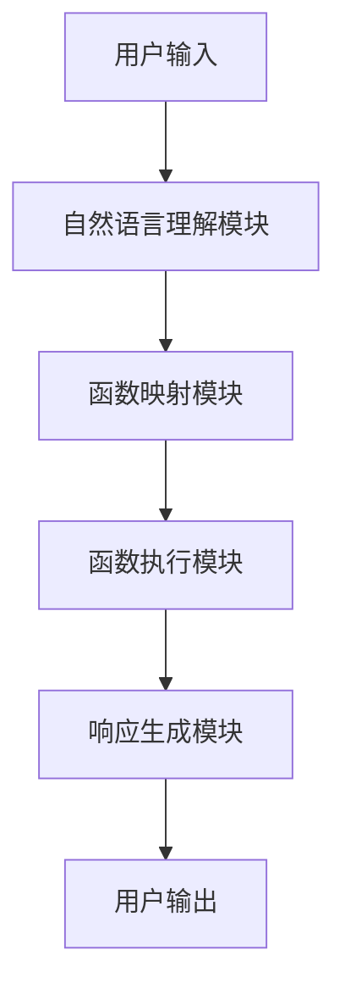

# 大语言模型应用指南：function calling

## 1. 背景介绍

### 1.1 大语言模型的兴起

近年来,自然语言处理(NLP)领域取得了长足的进步,很大程度上得益于大型语言模型(Large Language Models, LLMs)的兴起。LLMs是一种基于深度学习的技术,能够从海量文本数据中学习语言的模式和结构,从而生成看似人类写作的自然语言输出。

### 1.2 大语言模型的能力

LLMs展现出了令人印象深刻的语言理解和生成能力,可以用于多种NLP任务,如机器翻译、文本摘要、问答系统、内容生成等。它们不仅能够生成流畅、连贯的文本,还能根据上下文和指令生成定制的输出。

### 1.3 Function Calling的重要性

在LLMs的应用中,Function Calling是一个关键概念。它允许用户通过自然语言指令调用预定义的函数,从而扩展LLMs的功能,实现更复杂的任务。Function Calling为LLMs提供了一种灵活的接口,使它们能够与外部系统和服务集成,大大增强了它们的实用性。

## 2. 核心概念与联系

### 2.1 什么是Function Calling?

Function Calling是指通过自然语言指令调用预定义的函数或API,以执行特定的计算或操作。在LLMs的上下文中,Function Calling允许用户利用LLMs的语言理解能力,将自然语言指令转换为对应的函数调用,从而实现更复杂的任务。

### 2.2 Function Calling与LLMs的关系

LLMs擅长理解和生成自然语言,但它们本身的功能受到一定限制。通过Function Calling,LLMs可以与外部系统和服务集成,利用这些系统和服务提供的功能来扩展自身的能力。例如,LLMs可以调用数据库API来查询和处理数据,或者调用计算API来执行复杂的数学运算。

### 2.3 Function Calling的应用场景

Function Calling在多个领域都有广泛的应用前景,包括但不限于:

- 问答系统: 通过调用知识库API或搜索引擎API,提供更准确、更全面的答复。
- 任务自动化: 将自然语言指令转换为对应的API调用,实现自动化流程。
- 个性化推荐: 根据用户偏好和行为数据,调用推荐算法API生成个性化推荐。
- 智能助手: 将LLMs与各种功能API集成,构建功能丰富的智能助手。

## 3. 核心算法原理具体操作步骤

### 3.1 Function Calling的基本流程

Function Calling的基本流程如下:

1. 用户输入自然语言指令。
2. LLMs理解指令的语义,识别出需要调用的函数及其参数。
3. LLMs将指令转换为对应的函数调用,并执行该函数。
4. 函数的输出结果被LLMs捕获并转换为自然语言响应。
5. LLMs将响应返回给用户。

### 3.2 关键技术

实现Function Calling需要以下几项关键技术:

1. **语义理解**: LLMs需要准确理解用户输入的自然语言指令,识别出需要调用的函数及其参数。这通常需要利用NLP技术,如命名实体识别、关系抽取等。

2. **函数映射**: 将用户指令映射到实际的函数调用。这可能需要维护一个函数库,并建立自然语言指令与函数之间的映射关系。

3. **函数执行**: 执行映射后的函数调用,并捕获函数的输出结果。这可能需要与外部系统或服务进行交互。

4. **响应生成**: 将函数输出结果转换为自然语言响应,以便用户理解。这需要利用LLMs的语言生成能力。

### 3.3 算法步骤

以下是Function Calling的典型算法步骤:

1. **预处理用户输入**:
    - 标记化: 将用户输入的自然语言指令分割成单词序列。
    - 词性标注: 为每个单词分配词性标签(名词、动词等)。
    - 命名实体识别: 识别出指令中的命名实体(人名、地名等)。

2. **语义解析**:
    - 依存关系分析: 分析单词之间的语法依存关系。
    - 关系抽取: 从依存关系中抽取出函数调用和参数之间的关系。

3. **函数映射**:
    - 查找函数库,将抽取出的函数调用及参数映射到实际的函数。

4. **函数执行**:
    - 执行映射后的函数调用,获取函数输出结果。

5. **响应生成**:
    - 利用LLMs的语言生成能力,将函数输出结果转换为自然语言响应。

6. **返回响应**:
    - 将生成的自然语言响应返回给用户。

这个算法的关键在于准确理解用户指令的语义,并将其正确映射到实际的函数调用。同时,还需要处理各种边缘情况和异常,以确保算法的鲁棒性。

## 4. 数学模型和公式详细讲解举例说明

在Function Calling的过程中,可能需要利用一些数学模型和公式来提高语义理解和映射的准确性。以下是一些常见的模型和公式:

### 4.1 命名实体识别

命名实体识别(Named Entity Recognition, NER)是一项重要的NLP任务,旨在从文本中识别出命名实体,如人名、地名、组织名等。NER通常采用序列标注的方法,将每个单词标注为命名实体类型或非命名实体。

一种常见的NER模型是基于条件随机场(Conditional Random Fields, CRFs)的模型。CRF是一种判别式无向图模型,可以捕捉观测序列和标记序列之间的复杂依赖关系。

对于给定的观测序列$X=\{x_1, x_2, \ldots, x_n\}$和标记序列$Y=\{y_1, y_2, \ldots, y_n\}$,CRF模型定义了条件概率$P(Y|X)$,其对数似然函数为:

$$\log P(Y|X) = \sum_{i=1}^{n}\sum_{j}\lambda_jt_j(y_{i-1}, y_i, X, i) - \log Z(X)$$

其中:

- $t_j(y_{i-1}, y_i, X, i)$是一个特征函数,用于捕捉观测序列和标记序列之间的依赖关系。
- $\lambda_j$是对应特征函数的权重参数。
- $Z(X)$是归一化因子,用于确保概率和为1。

在训练过程中,通过最大化对数似然函数来学习权重参数$\lambda_j$。在预测时,可以使用维特比算法或其他解码算法来找到最可能的标记序列。

### 4.2 依存关系分析

依存关系分析(Dependency Parsing)是另一项重要的NLP任务,旨在分析句子中单词之间的语法依存关系。依存关系通常表示为一棵有向树,其中每个单词都依赖于另一个单词(称为头词)。

一种常见的依存关系分析模型是基于图的模型,将句子表示为一个有向图$G=(V, E)$,其中$V$是单词集合,而$E$是依存关系集合。模型的目标是找到一棵最大生成树,即一棵包含所有单词且无环的树。

可以使用结构化预测的方法来学习依存关系分析模型,例如结构化支持向量机(Structured Support Vector Machines, SSVMs)。SSVM模型将依存树的分数定义为特征函数的加权和:

$$\text{score}(x, y) = \sum_i \lambda_i f_i(x, y)$$

其中:

- $x$是输入句子。
- $y$是依存树。
- $f_i(x, y)$是特征函数,用于捕捉句子和依存树之间的依赖关系。
- $\lambda_i$是对应特征函数的权重参数。

在训练过程中,通过最大化正确依存树的分数与错误依存树的分数之间的间隔来学习权重参数$\lambda_i$。在预测时,可以使用最大生成树算法(如Chu-Liu/Edmonds算法)来找到最高分数的依存树。

### 4.3 关系抽取

关系抽取(Relation Extraction)是指从文本中识别出实体之间的语义关系,如"出生地"、"就职于"等。关系抽取通常被建模为一个监督学习问题,利用标注好的训练数据来学习一个分类器。

一种常见的关系抽取模型是基于深度学习的模型,例如使用卷积神经网络(Convolutional Neural Networks, CNNs)或循环神经网络(Recurrent Neural Networks, RNNs)来捕捉文本的语义信息。

以CNN为例,可以将输入句子$S$表示为一个词嵌入矩阵$X \in \mathbb{R}^{d \times l}$,其中$d$是词嵌入维度,而$l$是句子长度。然后,CNN模型会在$X$上应用一系列卷积和池化操作,提取出不同尺度的特征表示。最后,这些特征表示被输入到一个全连接层,用于预测实体之间的关系类型。

CNN模型的目标是最小化训练数据上的交叉熵损失函数:

$$J(\theta) = -\frac{1}{N}\sum_{i=1}^{N}\sum_{j=1}^{C}y_{ij}\log p(y_{ij}|X_i; \theta)$$

其中:

- $N$是训练样本数量。
- $C$是关系类型数量。
- $y_{ij}$是样本$i$的真实标签,如果属于关系类型$j$则为1,否则为0。
- $p(y_{ij}|X_i; \theta)$是模型预测样本$i$属于关系类型$j$的概率,参数为$\theta$。

通过梯度下降等优化算法,可以学习模型参数$\theta$,使得损失函数最小化。

以上是Function Calling中一些常见的数学模型和公式。根据具体应用场景和需求,可能还需要使用其他模型和技术,如序列到序列模型(Seq2Seq)、注意力机制(Attention Mechanism)等。

## 5. 项目实践: 代码实例和详细解释说明

为了更好地理解Function Calling的实现,我们将通过一个实际的代码示例来演示其工作原理。在这个示例中,我们将构建一个简单的Function Calling系统,允许用户通过自然语言指令调用一些基本的数学函数。

### 5.1 系统架构

我们的Function Calling系统将采用模块化设计,包括以下几个主要模块:

1. **自然语言理解模块**: 负责解析用户输入的自然语言指令,识别出需要调用的函数及其参数。
2. **函数映射模块**: 将解析出的函数调用及参数映射到实际的函数。
3. **函数执行模块**: 执行映射后的函数调用,获取函数输出结果。
4. **响应生成模块**: 将函数输出结果转换为自然语言响应。

系统架构可以用以下Mermaid流程图表示:



### 5.2 代码实现

我们将使用Python语言实现这个Function Calling系统。以下是各个模块的代码实现:

#### 5.2.1 自然语言理解模块

```python
import re

def parse_input(input_text):
    """
    解析用户输入的自然语言指令
    
    Args:
        input_text (str): 用户输入的自然语言指令
        
    Returns:
        tuple: (函数名, 参数列表)
    """
    # 使用正则表达式匹配函数名和参数
    pattern = r"(\w+)\((.*?)\)"
    match = re.search(pattern, input_text)
    
    if match:
        func_name = match.group(1)
        args_str = match.group(2)
        args = [float(arg.strip()) for arg in args_str.split(",") if arg.strip()]
        return func_name, args
    else:
        return None, None
```

这个模块使用正则表达式来匹配用户输入中的函数名和参数。它返回一个元组,包含函数名和参数列表。

#### 5.2.2 函数映射模块

```python
def map