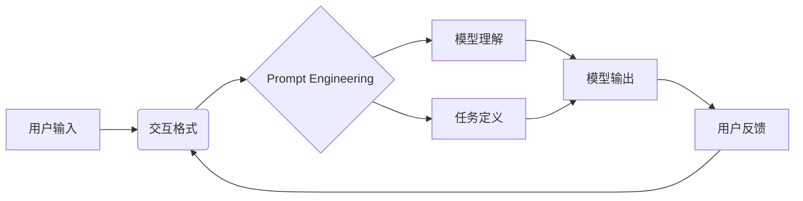

# 大语言模型应用指南：交互格式

## 1. 背景介绍

### 1.1 大语言模型的兴起

近年来，随着深度学习技术的飞速发展，大语言模型（Large Language Model，LLM）成为自然语言处理领域的研究热点。从 GPT 到 GPT-3，再到最新的 GPT-4、PaLM 等，大语言模型展现出了惊人的语言理解和生成能力，引发了学术界和业界的广泛关注。

### 1.2 大语言模型的应用潜力

大语言模型不仅在自然语言处理任务上取得了突破性进展，更重要的是，它们为各种应用场景提供了无限可能。从智能对话、内容生成到代码编写、知识问答等，大语言模型正在重塑我们与计算机交互的方式。

### 1.3 交互格式的重要性

然而，要真正发挥大语言模型的潜力，仅仅依靠模型本身是不够的。我们还需要设计合理、高效的交互格式，使得用户能够与模型进行自然、流畅的交互。好的交互格式不仅能提升用户体验，更能最大限度地挖掘模型的能力。

## 2. 核心概念与联系

### 2.1 Prompt Engineering

Prompt Engineering 是指设计、优化与语言模型交互的提示（Prompt）的过程。通过精心设计的 Prompt，我们可以引导模型生成我们期望的输出，提高交互质量。

### 2.2 Few-Shot Learning

Few-Shot Learning 指的是语言模型在只给予少量示例的情况下，就能快速理解任务并给出合理输出的能力。利用 Few-Shot Learning，我们可以通过几个示例来定义任务，而无需大量的训练数据。

### 2.3 交互格式与 Prompt Engineering 的关系

交互格式可以看作是 Prompt Engineering 的一种具体应用。通过设计合理的交互格式，我们可以更好地引导模型理解用户意图，生成高质量的响应。同时，交互格式也为 Few-Shot Learning 提供了便利，使得用户可以通过简单的示例来定义任务。

### 2.4 交互格式的核心要素

一个好的交互格式应该具备以下特点：

1. 清晰明确：格式应该易于理解，用户可以快速上手。
2. 灵活多样：格式应该能够适应各种任务和场景。
3. 高效简洁：格式应该尽可能简洁，减少冗余信息。
4. 引导性强：格式应该能够有效引导模型生成期望的输出。

下面是一个交互格式与 Prompt Engineering 关系的 Mermaid 流程图：



## 3. 核心算法原理具体操作步骤

### 3.1 基于模板的交互格式

基于模板的交互格式是一种常见的实现方式。其基本思路是预定义一组模板，每个模板对应一种特定的任务或场景。当用户输入符合某个模板的内容时，系统会自动识别并填充模板，生成相应的 Prompt。

以下是基于模板的交互格式的具体操作步骤：

1. 定义模板：根据应用场景，预先定义一组模板，每个模板包含固定的文本和变量占位符。
2. 用户输入：用户以自然语言的形式输入内容。
3. 模板匹配：系统根据用户输入，匹配最相关的模板。
4. 变量提取：从用户输入中提取出模板所需的变量值。
5. 模板填充：将提取出的变量值填充到模板的占位符中，生成完整的 Prompt。
6. 模型推理：将生成的 Prompt 输入到语言模型中，进行推理生成输出。
7. 结果呈现：将模型生成的输出呈现给用户。

### 3.2 基于语义解析的交互格式

另一种实现交互格式的方式是基于语义解析。相比模板匹配，语义解析可以更加灵活地理解用户意图，适应更加开放的交互场景。

基于语义解析的交互格式的具体操作步骤如下：

1. 用户输入：用户以自然语言的形式输入内容。
2. 语义解析：系统对用户输入进行语义分析，提取出关键信息，如意图、实体等。
3. 意图识别：根据提取出的关键信息，判断用户的意图，如查询、生成等。
4. 槽位填充：根据意图，填充相应的槽位信息，如查询的对象、生成的主题等。
5. Prompt 生成：根据意图和槽位信息，生成相应的 Prompt。
6. 模型推理：将生成的 Prompt 输入到语言模型中，进行推理生成输出。
7. 结果呈现：将模型生成的输出呈现给用户。

## 4. 数学模型和公式详细讲解举例说明

在交互格式的实现中，我们通常需要用到一些数学模型和公式。下面我们以语义解析中的意图识别为例，详细讲解其中涉及的数学模型。

意图识别可以看作是一个文本分类问题。给定用户输入的文本 $x$，我们要预测其对应的意图类别 $y$。常见的意图识别模型包括：

### 4.1 FastText

FastText 是一种简单高效的文本分类模型。其核心思想是将文本表示为词向量的平均，再通过线性分类器进行分类。

假设文本 $x$ 包含 $n$ 个词，每个词的向量表示为 $v_i$，则文本的向量表示 $V$ 为：

$$V = \frac{1}{n} \sum_{i=1}^n v_i$$

FastText 的分类器使用线性函数，对于类别 $j$，其得分 $s_j$ 计算如下：

$$s_j = W_j \cdot V + b_j$$

其中 $W_j$ 和 $b_j$ 分别为类别 $j$ 的权重向量和偏置项。最终的预测类别 $\hat{y}$ 为得分最高的类别：

$$\hat{y} = \arg\max_j s_j$$

### 4.2 TextCNN

TextCNN 是一种基于卷积神经网络的文本分类模型。它通过卷积操作提取文本的局部特征，再通过池化操作聚合特征，最后通过全连接层进行分类。

假设文本 $x$ 的词向量矩阵为 $E \in \mathbb{R}^{n \times d}$，其中 $n$ 为文本长度，$d$ 为词向量维度。TextCNN 首先使用多个不同尺寸的卷积核对词向量矩阵进行卷积操作，提取局部特征。以尺寸为 $h \times d$ 的卷积核为例，其卷积操作为：

$$c_i = f(W \cdot E_{i:i+h-1} + b)$$

其中 $W \in \mathbb{R}^{h \times d}$ 和 $b \in \mathbb{R}$ 分别为卷积核的权重矩阵和偏置项，$f$ 为激活函数，如 ReLU。

卷积操作得到的特征图 $c \in \mathbb{R}^{n-h+1}$ 通过最大池化操作聚合为一个特征向量：

$$\hat{c} = \max(c)$$

不同卷积核提取出的特征向量拼接成最终的文本表示 $v$，再通过全连接层和 Softmax 函数进行分类：

$$p(y|x) = \text{Softmax}(W \cdot v + b)$$

其中 $W$ 和 $b$ 为全连接层的权重矩阵和偏置项。

## 5. 项目实践：代码实例和详细解释说明

下面我们通过一个简单的代码实例，演示如何使用 Python 实现基于模板的交互格式。

```python
import re

# 定义模板
templates = [
    {
        "intent": "weather",
        "template": "What's the weather like in {city} today?",
        "variables": ["city"]
    },
    {
        "intent": "time",
        "template": "What time is it in {city}?",
        "variables": ["city"]
    }
]

# 模板匹配函数
def match_template(input_text):
    for template in templates:
        pattern = re.sub(r'{.*?}', r'(.*?)', template['template'])
        match = re.match(pattern, input_text)
        if match:
            return template, match.groups()
    return None, None

# 交互主函数
def interact():
    while True:
        user_input = input("User: ")
        template, variables = match_template(user_input)
        if template:
            prompt = template['template'].format(*variables)
            print(f"Assistant: Matched template: {template['intent']}")
            print(f"Assistant: Generated prompt: {prompt}")
            # TODO: 调用语言模型进行推理
        else:
            print("Assistant: No matching template found.")

if __name__ == '__main__':
    interact()
```

代码解释：

1. 我们首先定义了一组模板，每个模板包含意图、模板字符串和变量列表。
2. `match_template` 函数用于匹配用户输入与模板。它遍历所有模板，使用正则表达式将模板中的变量占位符替换为通配符，然后尝试匹配用户输入。如果匹配成功，则返回对应的模板和提取出的变量值。
3. `interact` 函数是交互的主函数。它循环接收用户输入，调用 `match_template` 函数进行模板匹配。如果匹配成功，则使用提取出的变量值填充模板，生成最终的 Prompt。
4. 在实际应用中，我们还需要调用语言模型对生成的 Prompt 进行推理，并将结果返回给用户。这部分代码需要根据具体的语言模型 API 进行编写。

以上就是一个简单的基于模板的交互格式的实现。在实际项目中，我们可以根据需要扩展模板的数量和种类，并结合语义解析等技术，实现更加灵活、智能的交互格式。

## 6. 实际应用场景

交互格式在大语言模型的实际应用中有着广泛的用途。下面我们列举几个典型的应用场景：

### 6.1 智能客服

在智能客服系统中，我们可以使用交互格式来引导用户提供必要的信息，如订单号、问题类型等，然后根据这些信息生成相应的 Prompt，调用语言模型生成回复。这样可以大大提高客服的效率和准确性。

### 6.2 智能写作助手

交互格式可以用于辅助写作。用户可以通过简单的交互，如提供写作主题、关键词等，生成相应的 Prompt，然后由语言模型生成初稿。用户再根据需要进行修改和完善，从而提高写作效率。

### 6.3 代码生成

交互格式还可以用于代码生成。用户可以通过自然语言描述需要实现的功能，系统根据描述生成相应的 Prompt，调用语言模型生成代码。这种方式可以降低编程门槛，提高开发效率。

### 6.4 知识问答

在知识问答系统中，交互格式可以帮助用户更准确地描述问题，提供必要的上下文信息。系统根据这些信息生成 Prompt，调用语言模型从知识库中检索相关信息，生成回答。

以上仅是交互格式的一些典型应用场景。随着大语言模型的不断发展，交互格式的应用领域也将不断拓展。

## 7. 工具和资源推荐

下面我们推荐一些常用的工具和资源，帮助大家更好地学习和实践交互格式。

### 7.1 OpenAI API

OpenAI 提供了强大的语言模型 API，如 GPT-3、ChatGPT 等。通过调用这些 API，我们可以方便地实现各种交互格式。OpenAI 还提供了详细的文档和示例代码，帮助开发者快速上手。

官网：https://openai.com/

### 7.2 Hugging Face

Hugging Face 是一个开源的自然语言处理平台，提供了大量预训练的语言模型和相关工具。我们可以使用 Hugging Face 的 Transformers 库来微调语言模型，实现定制化的交互格式。

官网：https://huggingface.co/

### 7.3 Prompt Engineering 资源集

这是一个由 OpenAI 维护的 Prompt Engineering 资源集