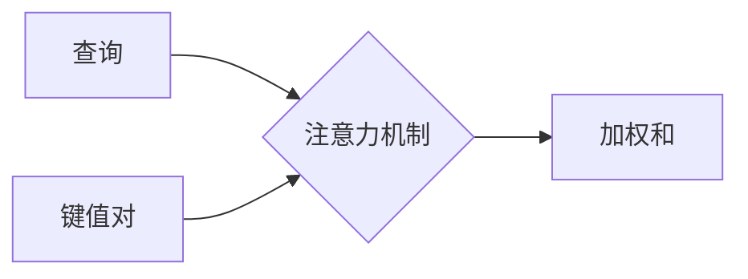
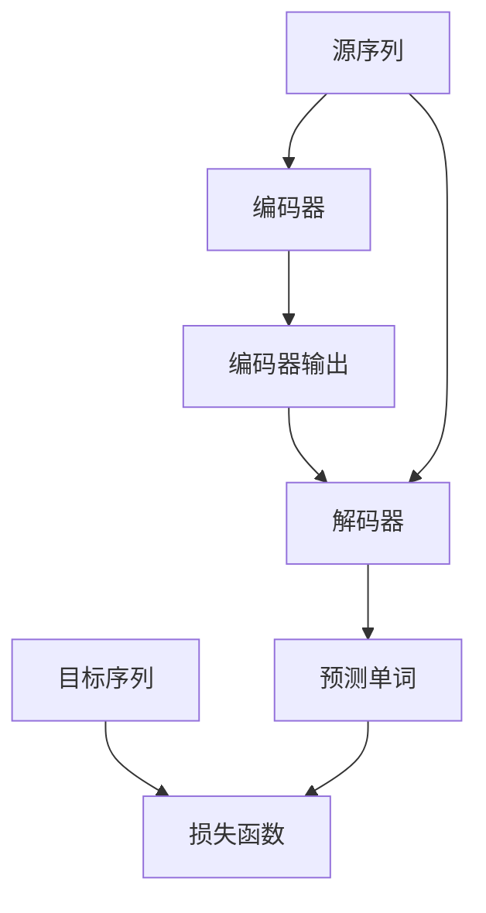

# 大语言模型应用指南：什么是自然语言处理

## 1. 背景介绍

### 1.1 自然语言处理的重要性

在当今的数字时代,人机交互已经成为日常生活中不可或缺的一部分。无论是智能助手、客户服务聊天机器人,还是语音识别系统,它们都依赖于自然语言处理(Natural Language Processing, NLP)技术。自然语言处理旨在使计算机能够理解、解释和生成人类语言,从而实现人机之间高效、自然的沟通。

### 1.2 自然语言处理的挑战

尽管自然语言处理取得了长足的进步,但它仍然面临着诸多挑战。首先,自然语言是高度复杂和多义的,同一句话在不同上下文中可能有完全不同的含义。其次,自然语言存在着许多语法和语义歧义,这给计算机带来了巨大的理解难度。此外,不同语言之间的差异也增加了自然语言处理的复杂性。

### 1.3 大语言模型的崛起

为了应对这些挑战,大型语言模型(Large Language Models, LLMs)应运而生。这些模型通过在海量文本数据上进行预训练,学习自然语言的模式和规则,从而获得对语言的深刻理解。随着计算能力和数据量的不断增长,大语言模型的性能也在不断提高,为自然语言处理带来了革命性的进展。

## 2. 核心概念与联系

### 2.1 语言模型

语言模型是自然语言处理的基础,它旨在预测给定上下文下的下一个单词或标记的概率。通过建模语言的统计规律,语言模型可以生成自然、流畅的语言输出。

$$P(w_1, w_2, \dots, w_n) = \prod_{i=1}^n P(w_i | w_1, \dots, w_{i-1})$$

上述公式表示了语言模型的核心思想,即预测下一个单词 $w_i$ 的概率,基于之前的单词序列 $w_1, \dots, w_{i-1}$。

### 2.2 词嵌入

词嵌入(Word Embeddings)是将单词映射到连续的向量空间中的技术,使得语义相似的单词在向量空间中彼此靠近。这种表示方式不仅compact高效,而且能够捕捉单词之间的语义关系,为自然语言处理任务提供了强大的特征表示。


### 2.3 注意力机制

注意力机制(Attention Mechanism)是一种允许模型selectively关注输入的不同部分的技术。它通过为输入序列中的每个元素分配不同的权重,使模型能够更好地捕捉长距离依赖关系,从而提高了模型的性能。



### 2.4 transformer架构

Transformer是一种全新的基于注意力机制的神经网络架构,它完全摒弃了传统的递归神经网络和卷积神经网络结构,使用了自注意力(Self-Attention)层来捕捉输入序列中元素之间的依赖关系。Transformer架构在机器翻译、文本生成等任务中表现出色,成为了大语言模型的核心组成部分。


## 3. 核心算法原理具体操作步骤

### 3.1 transformer编码器

Transformer编码器的主要作用是将输入序列映射到一个连续的表示空间中,以捕捉输入序列中元素之间的依赖关系。它由多个相同的层组成,每一层包含两个子层:多头自注意力层和前馈神经网络层。

1. **输入嵌入**:将输入单词序列转换为对应的词嵌入向量表示。
2. **位置编码**:由于transformer没有递归或卷积结构,因此需要添加位置编码来引入序列的位置信息。
3. **多头自注意力层**:该层允许每个单词注意力分配到其他相关单词上,捕捉长距离依赖关系。
4. **前馈神经网络层**:对每个位置的表示进行非线性变换,允许模型更好地拟合输入和输出之间的映射函数。
5. **层规范化和残差连接**:用于加速训练收敛并缓解梯度消失问题。

### 3.2 transformer解码器

Transformer解码器的作用是根据编码器的输出和目标序列的前缀,生成目标序列的下一个单词。它与编码器类似,但增加了一个额外的注意力子层,用于关注编码器的输出。

1. **遮掩自注意力层**:与编码器的自注意力层类似,但被遮掩以防止关注后续位置的单词,确保模型的自回归性质。
2. **编码器-解码器注意力层**:允许每个输出元素注意力分配到输入序列的不同位置上,捕捉输入和输出之间的依赖关系。
3. **前馈神经网络层**:与编码器相同。
4. **层规范化和残差连接**:与编码器相同。

### 3.3 transformer模型训练

Transformer模型通常采用监督学习的方式进行训练。对于编码器,输入是源序列,目标是源序列本身(掩码语言模型)。对于解码器,输入是源序列和目标序列的前缀,目标是下一个单词。训练过程使用最大似然估计,最小化模型预测和真实目标之间的交叉熵损失。



## 4. 数学模型和公式详细讲解举例说明  

### 4.1 自注意力机制

自注意力机制是transformer的核心,它允许输入的每个单词都能够关注到其他相关单词,捕捉长距离依赖关系。给定一个输入序列 $X = (x_1, x_2, \dots, x_n)$,自注意力计算如下:

$$\text{Attention}(Q, K, V) = \text{softmax}\left(\frac{QK^T}{\sqrt{d_k}}\right)V$$

其中 $Q$、$K$、$V$ 分别是查询(Query)、键(Key)和值(Value),它们都是输入序列 $X$ 通过不同的线性变换得到的。$d_k$ 是缩放因子,用于防止点积过大导致的梯度饱和。

自注意力机制可以并行计算,允许模型高效地捕捉全局依赖关系。此外,多头注意力机制通过线性投影将注意力分布到不同的子空间,进一步提高了模型的表达能力。

### 4.2 transformer损失函数

对于编码器,transformer采用掩码语言模型(Masked Language Modeling)的方式进行训练。给定一个输入序列 $X = (x_1, x_2, \dots, x_n)$,我们随机掩码一些位置的单词,目标是正确预测这些被掩码的单词。损失函数定义为:

$$\mathcal{L}_\text{MLM} = -\frac{1}{N}\sum_{i=1}^N \log P(x_i^\text{masked}|X^\text{masked})$$

其中 $N$ 是被掩码单词的总数, $X^\text{masked}$ 是经过掩码的输入序列, $x_i^\text{masked}$ 是第 $i$ 个被掩码的单词。

对于解码器,transformer采用标准的序列到序列(Sequence-to-Sequence)训练方式。给定一个源序列 $X = (x_1, x_2, \dots, x_n)$ 和目标序列 $Y = (y_1, y_2, \dots, y_m)$,目标是最大化生成正确目标序列的条件概率:

$$\mathcal{L}_\text{seq2seq} = -\sum_{t=1}^m \log P(y_t|y_{<t}, X)$$

通过最小化这两种损失函数,transformer模型可以学习到输入序列和目标序列之间的映射关系,从而实现各种自然语言处理任务。

## 5. 项目实践:代码实例和详细解释说明

以下是一个使用PyTorch实现的简化版transformer模型,用于机器翻译任务。为了简洁起见,我们只实现了编码器和解码器的核心部分。

```python
import torch
import torch.nn as nn
import math

# 助手模块
def attention(q, k, v, mask=None, dropout=None):
    scores = torch.matmul(q, k.transpose(-2, -1)) / math.sqrt(q.size(-1))
    if mask is not None:
        scores = scores.masked_fill(mask == 0, -1e9)
    scores = torch.softmax(scores, dim=-1)
    if dropout is not None:
        scores = dropout(scores)
    output = torch.matmul(scores, v)
    return output

class MultiHeadAttention(nn.Module):
    def __init__(self, heads, d_model, dropout=0.1):
        super().__init__()
        self.d_model = d_model
        self.d_k = d_model // heads
        self.h = heads
        self.q_linear = nn.Linear(d_model, d_model)
        self.v_linear = nn.Linear(d_model, d_model)
        self.k_linear = nn.Linear(d_model, d_model)
        self.dropout = nn.Dropout(dropout)
        self.out = nn.Linear(d_model, d_model)

    def forward(self, q, k, v, mask=None):
        bs = q.size(0)
        k = self.k_linear(k).view(bs, -1, self.h, self.d_k)
        q = self.q_linear(q).view(bs, -1, self.h, self.d_k)
        v = self.v_linear(v).view(bs, -1, self.h, self.d_k)
        k = k.transpose(1, 2)
        q = q.transpose(1, 2)
        v = v.transpose(1, 2)
        scores = attention(q, k, v, mask, self.dropout)
        concat = scores.transpose(1, 2).contiguous().view(bs, -1, self.d_model)
        output = self.out(concat)
        return output

# 编码器层
class EncoderLayer(nn.Module):
    def __init__(self, d_model, heads, dropout=0.1):
        super().__init__()
        self.norm_1 = nn.LayerNorm(d_model)
        self.norm_2 = nn.LayerNorm(d_model)
        self.attn = MultiHeadAttention(heads, d_model, dropout=dropout)
        self.ff = nn.Sequential(
            nn.Linear(d_model, 4 * d_model),
            nn.ReLU(),
            nn.Linear(4 * d_model, d_model)
        )
        self.dropout_1 = nn.Dropout(dropout)
        self.dropout_2 = nn.Dropout(dropout)

    def forward(self, x, mask):
        x2 = self.norm_1(x)
        x = x + self.dropout_1(self.attn(x2, x2, x2, mask))
        x2 = self.norm_2(x)
        x = x + self.dropout_2(self.ff(x2))
        return x

# 解码器层
class DecoderLayer(nn.Module):
    def __init__(self, d_model, heads, dropout=0.1):
        super().__init__()
        self.norm_1 = nn.LayerNorm(d_model)
        self.norm_2 = nn.LayerNorm(d_model)
        self.norm_3 = nn.LayerNorm(d_model)

        self.dropout_1 = nn.Dropout(dropout)
        self.dropout_2 = nn.Dropout(dropout)
        self.dropout_3 = nn.Dropout(dropout)

        self.attn_1 = MultiHeadAttention(heads, d_model, dropout=dropout)
        self.attn_2 = MultiHeadAttention(heads, d_model, dropout=dropout)
        self.ff = nn.Sequential(
            nn.Linear(d_model, 4 * d_model),
            nn.ReLU(),
            nn.Linear(4 * d_model, d_model)
        )

    def forward(self, x, e_outputs, src_mask, trg_mask):
        x2 = self.norm_1(x)
        x = x + self.dropout_1(self.attn_1(x2, x2, x2, trg_mask))
        x2 = self.norm_2(x)
        x = x + self.dropout_2(self.attn_2(x2, e_outputs, e_outputs, src_mask))
        x2 = self.norm_3(x)
        x = x + self.dropout_3(self.ff(x2))
        return x