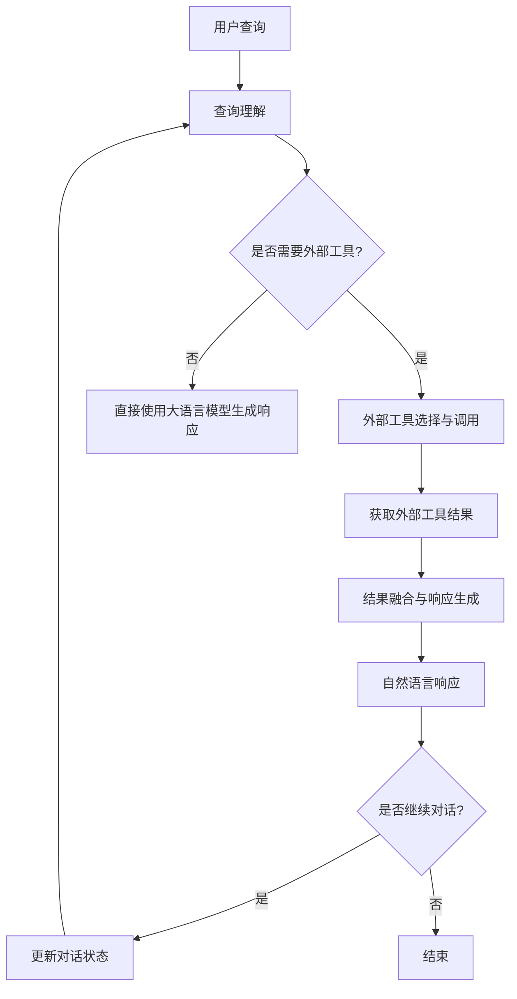

# 大语言模型应用指南：使用外部工具的基本原理

## 1. 背景介绍

### 1.1 大语言模型的兴起

近年来,大型语言模型(Large Language Models, LLMs)在自然语言处理领域取得了突破性进展,展现出令人惊叹的语言生成能力。这些模型通过在海量文本数据上进行预训练,学习了丰富的语言知识和上下文关系,能够生成看似人类水平的自然语言输出。

### 1.2 外部工具的必要性

尽管大语言模型具有强大的语言生成能力,但它们仍然存在一些局限性。例如,它们缺乏对特定领域知识的深入理解,无法直接访问最新的动态数据,并且在处理某些复杂任务时可能会产生不准确或不一致的输出。为了解决这些问题,将大语言模型与外部工具相结合就显得尤为重要。

### 1.3 外部工具的类型

外部工具可以是各种形式,包括:

- 知识库和数据源(如维基百科、新闻网站等)
- 计算工具(如计算器、单位转换器等)
- 专业软件和API(如天气预报API、金融分析工具等)
- 搜索引擎和信息检索系统
- 其他辅助工具(如规则引擎、约束求解器等)

通过将这些外部工具与大语言模型相结合,我们可以充分利用模型的语言理解和生成能力,同时弥补其在特定领域知识和动态数据访问方面的不足。

## 2. 核心概念与联系

### 2.1 语义解析

将用户查询转换为对应的外部工具调用是整个流程的关键环节。这需要对查询进行语义解析,提取出其中的意图、实体和其他相关信息。常见的语义解析方法包括基于规则的方法、基于机器学习的方法(如序列标注、语义角色标注等)以及结合大语言模型的方法。

### 2.2 外部工具调用

根据语义解析的结果,需要确定应该调用哪些外部工具,以及如何构造合适的输入参数。这可能涉及到查询重写、参数映射等步骤。同时,也需要考虑外部工具的可用性、响应时间和成本等因素。

### 2.3 结果融合

在获取到外部工具的输出结果后,需要将这些结果与大语言模型的语言生成能力相结合,生成最终的自然语言响应。这可能需要对结果进行解释、总结或者进一步的推理和计算。

### 2.4 交互式对话

在许多情况下,用户查询并不是一次性的,而是需要进行多轮交互式对话。这就要求系统能够跟踪对话状态,并根据之前的上下文进行适当的响应。同时,也需要考虑如何在对话过程中引入外部工具的使用,以提供更加准确和丰富的信息。

## 3. 核心算法原理具体操作步骤

将大语言模型与外部工具相结合的核心算法原理可以概括为以下几个步骤:

### 3.1 查询理解

1) 使用大语言模型对用户查询进行语义解析,提取出查询的意图、实体和其他相关信息。
2) 根据语义解析的结果,确定是否需要调用外部工具。

### 3.2 外部工具选择与调用

1) 根据查询的语义信息,从可用的外部工具集合中选择合适的工具。
2) 构造外部工具所需的输入参数,并发送请求调用外部工具。
3) 获取外部工具的输出结果。

### 3.3 结果融合与响应生成

1) 将外部工具的输出结果与大语言模型的语言生成能力相结合。
2) 对结果进行解释、总结或进一步的推理和计算,生成最终的自然语言响应。
3) 如果需要进行多轮交互式对话,则更新对话状态,并根据之前的上下文进行适当的响应。

这个过程可以通过以下 Mermaid 流程图来直观地展示:



## 4. 数学模型和公式详细讲解举例说明

在将大语言模型与外部工具相结合的过程中,可能需要使用一些数学模型和公式来量化和优化系统的各个组件。下面是一些常见的数学模型和公式:

### 4.1 语义解析模型

语义解析是将自然语言查询映射到形式化表示的过程,通常可以使用序列标注模型或语义角色标注模型来实现。

序列标注模型的目标是为输入序列中的每个token预测一个标签,常用的模型包括条件随机场(CRF)、LSTM-CRF等。给定输入序列 $X = (x_1, x_2, \dots, x_n)$,目标是找到最可能的标签序列 $Y^* = (y_1^*, y_2^*, \dots, y_n^*)$,使得:

$$Y^* = \arg\max_Y P(Y|X)$$

语义角色标注模型则是将输入句子映射到一个语义框架,包括谓词、论元及其语义角色。常用的模型包括基于注意力机制的序列到序列模型。

### 4.2 外部工具选择模型

在有多个可用的外部工具时,需要选择最合适的工具来满足用户查询。这可以通过构建一个多项逻辑回归模型或排名模型来实现。

给定查询 $q$,外部工具集合 $\mathcal{T} = \{t_1, t_2, \dots, t_m\}$,以及一组特征函数 $\mathbf{f}(q, t)$,多项逻辑回归模型可以计算每个工具 $t_i$ 被选中的概率:

$$P(y=i|q, \mathcal{T}) = \frac{e^{\mathbf{w}^T\mathbf{f}(q, t_i)}}{\sum_{j=1}^m e^{\mathbf{w}^T\mathbf{f}(q, t_j)}}$$

其中 $\mathbf{w}$ 是模型参数。

排名模型则是直接对工具进行排序,常用的模型包括基于对的RankNet、基于列表的ListNet等。

### 4.3 结果融合模型

在获取到外部工具的输出结果后,需要将其与大语言模型的语言生成能力相结合,生成最终的自然语言响应。这可以通过构建一个序列到序列模型来实现,例如使用带有注意力机制的编码器-解码器模型。

给定外部工具结果 $R$,以及之前的对话历史 $H$,模型需要生成响应 $Y = (y_1, y_2, \dots, y_m)$,目标是最大化条件概率:

$$P(Y|R, H) = \prod_{i=1}^m P(y_i|y_{<i}, R, H)$$

注意力机制可以让模型在生成每个词时,动态地关注输入序列的不同部分。

### 4.4 对话状态跟踪模型

在多轮交互式对话中,需要跟踪对话状态,以便系统能够根据之前的上下文做出恰当的响应。对话状态通常包括已提供的信息、未满足的信息需求等。

常用的对话状态跟踪模型包括基于规则的模型、discriminative模型(如最大熵马尔可夫模型)和生成模型(如基于POMDP的模型)。这些模型的目标是估计当前的对话状态 $s_t$ 的概率分布 $P(s_t|a_{1:t}, u_{1:t})$,其中 $a_{1:t}$ 表示之前的系统行为序列, $u_{1:t}$ 表示之前的用户查询序列。

以上是一些在将大语言模型与外部工具相结合过程中常用的数学模型和公式。根据具体的应用场景和需求,可以选择和组合不同的模型,以获得最佳的性能。

## 5. 项目实践: 代码实例和详细解释说明

为了更好地理解如何将大语言模型与外部工具相结合,我们将通过一个实际项目的代码实例来进行说明。在这个项目中,我们将构建一个智能问答系统,它可以回答涉及计算、单位转换等的查询,并利用外部工具来提供准确的结果。

### 5.1 项目概述

我们的智能问答系统将包括以下几个主要组件:

1. **查询理解模块**: 使用大语言模型对用户查询进行语义解析,提取出查询的意图、实体等信息。
2. **外部工具调用模块**: 根据语义解析的结果,选择合适的外部工具(如计算器、单位转换器等),构造输入参数并获取结果。
3. **响应生成模块**: 将外部工具的结果与大语言模型的语言生成能力相结合,生成自然语言响应。
4. **对话管理模块**: 跟踪对话状态,处理多轮交互式对话。

### 5.2 代码实例

下面是一个简化的代码实例,展示了如何将大语言模型与外部工具相结合。为了简洁起见,我们只展示了核心的代码逻辑,并省略了一些辅助函数和配置细节。

```python
import transformers
import calculator
import unit_converter

# 加载大语言模型
model = transformers.AutoModelForSeq2SeqLM.from_pretrained("t5-base")
tokenizer = transformers.AutoTokenizer.from_pretrained("t5-base")

# 查询理解
def parse_query(query):
    inputs = tokenizer(query, return_tensors="pt")
    outputs = model.generate(**inputs, max_length=100)
    parsed_query = tokenizer.decode(outputs[0], skip_special_tokens=True)
    return parsed_query

# 外部工具调用
def call_external_tool(parsed_query):
    if "calculate" in parsed_query:
        expression = parsed_query.split("calculate")[-1].strip()
        result = calculator.evaluate(expression)
    elif "convert" in parsed_query:
        value, from_unit, to_unit = parsed_query.split("convert")[-1].strip().split()
        result = unit_converter.convert(float(value), from_unit, to_unit)
    else:
        result = None
    return result

# 响应生成
def generate_response(query, result):
    inputs = tokenizer(query, return_tensors="pt")
    if result is not None:
        inputs["labels"] = tokenizer(str(result), return_tensors="pt").input_ids
    outputs = model.generate(**inputs, max_length=100)
    response = tokenizer.decode(outputs[0], skip_special_tokens=True)
    return response

# 对话管理
def interactive_conversation():
    history = []
    while True:
        query = input("User: ")
        parsed_query = parse_query(query)
        result = call_external_tool(parsed_query)
        response = generate_response(query, result)
        print("Assistant:", response)
        history.append((query, response))
        # 更新对话状态...

# 运行交互式对话
interactive_conversation()
```

在这个示例中,我们首先加载了一个基于 T5 模型的大语言模型,用于查询理解和响应生成。然后,我们定义了几个核心函数:

- `parse_query(query)`: 使用大语言模型对用户查询进行语义解析,提取出查询的意图和实体信息。
- `call_external_tool(parsed_query)`: 根据语义解析的结果,选择合适的外部工具(计算器或单位转换器),构造输入参数并获取结果。
- `generate_response(query, result)`: 将外部工具的结果与大语言模型的语言生成能力相结合,生成自然语言响应。
- `interactive_conversation()`: 管理交互式对话的流程,包括获取用户查询、调用上述函数并输出响应。

在实际运行时,用户可以输入诸如"计算 2 + 3 * 4"或"将 10 英里转换为公里"之类的查询,系统将调用相应的外部工具获取结果,并生成自然语言响应。

### 5.3 代码解释

下面我们对上述代码进行更详细的解释:

1. **加载大语言模型**:

   ```python
   model = transformers.AutoModelForSeq2SeqLM.from