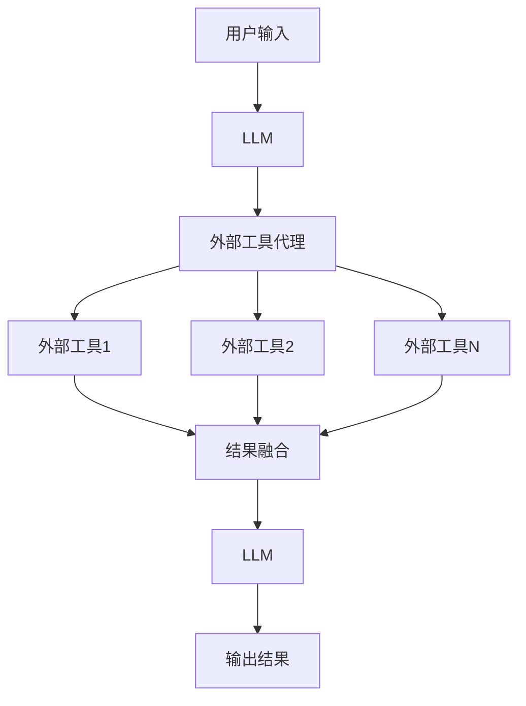

# 大语言模型应用指南：外部工具

## 1. 背景介绍

### 1.1 大语言模型的崛起

近年来,大型语言模型(Large Language Models, LLMs)在自然语言处理(NLP)领域取得了令人瞩目的成就。这些模型通过在海量文本数据上进行预训练,学习到了丰富的语言知识和上下文理解能力,可以生成高质量、连贯的自然语言输出。

LLMs的出现,为人工智能系统赋予了更强大的语言理解和生成能力,极大推动了智能对话系统、机器翻译、文本摘要、问答系统等应用的发展。其中,GPT-3、BERT、XLNet等模型因其卓越的性能而广受关注。

### 1.2 外部工具的重要性

尽管LLMs本身已经具备强大的语言能力,但在实际应用中,它们往往需要与外部工具和服务进行集成,以充分发挥其潜力。外部工具可以为LLMs提供补充功能,如数据检索、计算、知识库查询等,从而增强模型的上下文理解和推理能力。

此外,外部工具还能帮助LLMs更好地理解和处理特定领域的数据和任务,提高其在垂直领域的应用效果。因此,选择合适的外部工具并将其与LLMs相结合,是实现高质量语言智能应用的关键一环。

## 2. 核心概念与联系

### 2.1 语境理解与知识获取

LLMs通过预训练获得了丰富的语言知识,但在特定场景下,它们仍然需要外部知识源来补充上下文理解和知识获取。外部工具可以为LLMs提供以下支持:

- **知识库查询**: 连接结构化知识库(如维基百科、专业数据库等),快速获取相关事实和概念信息。
- **信息检索**: 从非结构化文本数据(如网页、文档等)中检索相关上下文信息。
- **实体链接**: 将文本中的实体(如人名、地名等)链接到知识库中的条目,丰富语义理解。

通过与这些外部工具的集成,LLMs可以获取更全面、更准确的上下文知识,提高语境理解和推理能力。

### 2.2 任务增强与功能扩展

除了知识获取,外部工具还可以为LLMs提供各种任务增强和功能扩展,如:

- **计算和数据处理**: 通过连接数据处理工具(如电子表格、数据库等),LLMs可以执行数值计算、数据查询和操作等任务。
- **多模态处理**: 集成计算机视觉、语音识别等工具,使LLMs能够处理图像、音频等多模态数据。
- **任务流编排**: 将多个外部工具组合在一起,构建复杂的任务流程,实现端到端的智能应用。

通过与这些外部工具的集成,LLMs的功能得到极大扩展,可以应用于更广泛的领域和场景。

## 3. 核心算法原理具体操作步骤

### 3.1 LLM与外部工具的集成架构

要将LLM与外部工具集成,需要设计一个统一的架构框架。一种常见的架构如下所示:



1. 用户输入被发送到LLM进行初步处理和理解。
2. LLM将输入分解为多个子任务,并将它们分发给外部工具代理。
3. 外部工具代理根据任务类型,将子任务分配给对应的外部工具进行处理。
4. 外部工具处理后的结果被发送回外部工具代理进行结果融合。
5. 融合后的结果被发送回LLM进行进一步处理和生成最终输出。

这种架构允许LLM与多个外部工具无缝集成,充分利用每个工具的专长,实现高质量的语言智能应用。

### 3.2 外部工具接入流程

要将外部工具接入到LLM架构中,一般需要遵循以下步骤:

1. **工具描述**: 首先需要对外部工具的功能、输入输出格式进行详细描述,以便LLM和外部工具代理理解和调用该工具。
2. **API封装**: 如果外部工具提供了API接口,则需要对API进行封装,使其可以被LLM架构调用。
3. **任务映射**: 需要定义LLM与外部工具之间的任务映射关系,即哪些类型的任务应该由哪些外部工具来处理。
4. **结果解析**: 外部工具返回的结果需要被解析和规范化,以便LLM进行后续处理。
5. **错误处理**: 处理外部工具调用过程中可能出现的错误和异常情况。

通过上述步骤,外部工具可以被顺利接入到LLM架构中,为LLM提供补充功能和服务。

## 4. 数学模型和公式详细讲解举例说明

在LLM与外部工具的集成过程中,可能需要使用一些数学模型和公式来优化和评估系统性能。以下是一些常见的数学模型和公式:

### 4.1 外部工具选择优化

在选择外部工具时,我们需要考虑工具的性能、成本和可靠性等因素。可以使用多目标优化模型来进行工具选择,例如:

$$
\begin{aligned}
\max\quad & \sum_{i=1}^{n} w_i f_i(x) \\
\text{s.t.}\quad & g_j(x) \leq 0, \quad j = 1, \ldots, m \\
& x \in X
\end{aligned}
$$

其中:
- $x$ 表示外部工具的选择向量
- $f_i(x)$ 表示第 $i$ 个目标函数,如性能、成本等
- $w_i$ 表示第 $i$ 个目标函数的权重
- $g_j(x)$ 表示第 $j$ 个约束条件,如可靠性要求等
- $X$ 表示外部工具的可选集合

通过求解该优化问题,我们可以得到一组最优的外部工具组合。

### 4.2 任务分配模型

在将任务分配给外部工具时,我们需要考虑工具的负载和响应时间等因素,以实现高效的任务分配。可以使用队列理论模型来描述和优化任务分配过程,例如:

$$
W_q = \frac{\lambda}{c\mu - \lambda} \cdot \frac{c^\rho \rho^{c-1}}{(c-1)!(c-\rho)}
$$

其中:
- $W_q$ 表示任务在队列中的平均等待时间
- $\lambda$ 表示任务到达率
- $\mu$ 表示外部工具的服务率
- $c$ 表示外部工具的数量
- $\rho = \lambda / (c\mu)$ 表示工具的利用率

通过分析和优化该模型,我们可以确定合适的外部工具数量和任务分配策略,以最小化任务等待时间。

### 4.3 结果融合模型

当多个外部工具返回不同的结果时,我们需要将这些结果进行融合,以获得最终的输出。可以使用加权融合模型,例如:

$$
y = \sum_{i=1}^{n} w_i y_i
$$

其中:
- $y$ 表示融合后的结果
- $y_i$ 表示第 $i$ 个外部工具的结果
- $w_i$ 表示第 $i$ 个外部工具结果的权重

权重 $w_i$ 可以根据外部工具的可靠性、准确性等因素进行设置。通过优化权重值,我们可以获得最优的结果融合效果。

上述数学模型和公式只是示例,在实际应用中,我们还可以使用其他更复杂的模型和算法来优化LLM与外部工具的集成过程。

## 5. 项目实践:代码实例和详细解释说明

为了更好地说明LLM与外部工具的集成过程,我们提供了一个简单的Python代码示例。该示例演示了如何将LLM与Wikipedia知识库和Wolfram Alpha计算引擎进行集成,以实现基本的问答功能。

### 5.1 代码结构

```
project/
├── main.py
├── llm.py
├── tools/
│   ├── __init__.py
│   ├── wikipedia.py
│   └── wolfram_alpha.py
└── utils.py
```

- `main.py`: 主程序入口
- `llm.py`: 实现LLM核心逻辑
- `tools/`: 外部工具模块
  - `wikipedia.py`: Wikipedia知识库查询工具
  - `wolfram_alpha.py`: Wolfram Alpha计算引擎工具
- `utils.py`: 工具函数

### 5.2 主程序 `main.py`

```python
from llm import LLM
from tools import WikipediaTool, WolframAlphaTool

# 初始化外部工具
wikipedia_tool = WikipediaTool()
wolfram_alpha_tool = WolframAlphaTool()

# 初始化LLM
llm = LLM(tools=[wikipedia_tool, wolfram_alpha_tool])

# 问答循环
while True:
    query = input("请输入您的问题: ")
    if query.lower() == "exit":
        break

    result = llm.run(query)
    print(f"结果: {result}")
```

该程序初始化Wikipedia和Wolfram Alpha两个外部工具,并将它们传递给LLM实例。然后进入问答循环,接收用户输入的问题,调用LLM的`run`方法获取结果,并输出结果。

### 5.3 LLM核心逻辑 `llm.py`

```python
from utils import tokenize, choose_tools

class LLM:
    def __init__(self, tools):
        self.tools = tools

    def run(self, query):
        # 分词和标记化
        tokens = tokenize(query)

        # 选择合适的外部工具
        chosen_tools = choose_tools(tokens, self.tools)

        # 调用外部工具并获取结果
        results = []
        for tool in chosen_tools:
            result = tool.run(query)
            results.append(result)

        # 结果融合
        final_result = " ".join(results)

        return final_result
```

`LLM`类包含以下主要步骤:

1. 对输入查询进行分词和标记化处理。
2. 根据标记化结果,选择合适的外部工具。
3. 调用选定的外部工具,获取各个工具的结果。
4. 将多个工具结果进行简单的字符串拼接,作为最终输出。

### 5.4 外部工具示例 `tools/wikipedia.py`

```python
import wikipedia

class WikipediaTool:
    def run(self, query):
        try:
            page = wikipedia.page(query)
            return page.content
        except wikipedia.exceptions.PageError:
            return "未找到相关Wikipedia页面"
        except Exception as e:
            return f"发生错误: {e}"
```

`WikipediaTool`使用`wikipedia`库查询Wikipedia知识库,并返回相关页面的内容。如果查询失败或发生异常,则返回相应的错误信息。

### 5.5 外部工具示例 `tools/wolfram_alpha.py`

```python
import wolframalpha

class WolframAlphaTool:
    def __init__(self, app_id):
        self.client = wolframalpha.Client(app_id)

    def run(self, query):
        try:
            res = self.client.query(query)
            return next(res.results).text
        except Exception as e:
            return f"发生错误: {e}"
```

`WolframAlphaTool`使用`wolframalpha`库调用Wolfram Alpha计算引擎,并返回计算结果。如果发生异常,则返回相应的错误信息。

### 5.6 工具函数 `utils.py`

```python
import re

def tokenize(text):
    # 简单的分词和标记化实现
    tokens = re.findall(r'\w+', text.lower())
    return tokens

def choose_tools(tokens, tools):
    # 根据标记化结果选择外部工具
    chosen_tools = []
    if any(t in tokens for t in ["wikipedia", "wiki"]):
        chosen_tools.append(tools[0])
    if any(t in tokens for t in ["calculate", "math", "compute"]):
        chosen_tools.append(tools[1])
    return chosen_tools
```

`utils.py`包含两个辅助函数:

- `tokenize(text)`: 对输入文本进行简单的分词和标记化处理。
- `choose_tools(tokens, tools)`: 根据标记化结果和关键词,选择合适的外部工具。

该示例仅用于