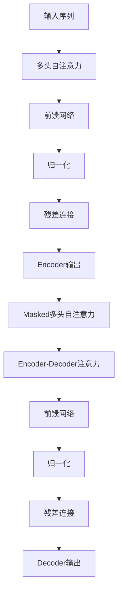

# 大语言模型应用指南：大语言模型的训练过程

## 1. 背景介绍

### 1.1 大语言模型的兴起

近年来,大型语言模型(Large Language Models,LLMs)在自然语言处理(Natural Language Processing,NLP)领域取得了令人瞩目的进展。这些模型通过在海量文本数据上进行预训练,学习了丰富的语言知识和上下文关系,展现出了强大的语言理解和生成能力。

代表性的大语言模型包括GPT(Generative Pre-trained Transformer)系列、BERT(Bidirectional Encoder Representations from Transformers)、XLNet、RoBERTa等。它们在机器翻译、文本摘要、问答系统、内容生成等多个领域取得了突破性的成果,推动了NLP技术的快速发展。

### 1.2 大语言模型的重要性

大语言模型的出现改变了传统NLP任务的解决方式。过去,我们需要为每个任务定制特定的模型架构和训练流程。而现在,只需在通用的大语言模型基础上进行少量的任务特定微调(fine-tuning),即可获得出色的性能表现。这种通用模型+微调的范式大大降低了模型开发的成本和复杂度。

此外,大语言模型展现出了强大的迁移学习能力。通过在不同领域的数据上进行预训练,它们可以捕捉到通用的语言规律,从而为下游任务提供有力的语义表示。这种通用知识的迁移学习,有助于提高模型在新领域的适用性和泛化能力。

## 2. 核心概念与联系

### 2.1 自注意力机制(Self-Attention)

$$\mathrm{Attention}(Q, K, V) = \mathrm{softmax}\left(\frac{QK^T}{\sqrt{d_k}}\right)V$$

自注意力机制是大语言模型的核心组件之一。它允许模型在编码输入序列时,捕捉不同位置之间的长程依赖关系。每个位置的表示是所有位置的加权和,权重由位置之间的相似性决定。这种灵活的注意力机制有助于模型更好地理解复杂的语义和上下文信息。

### 2.2 transformer架构

Transformer是一种全新的序列到序列(Seq2Seq)模型架构,它完全基于注意力机制,不依赖于RNN或CNN等传统结构。Transformer由编码器(Encoder)和解码器(Decoder)组成,两者均采用多头自注意力和点式前馈网络构建。这种全注意力的设计,使得Transformer在长序列建模任务中表现出色,同时具有更好的并行计算能力。



### 2.3 预训练与微调

大语言模型采用了两阶段的训练范式:预训练(Pre-training)和微调(Fine-tuning)。

预训练阶段旨在从大规模无监督文本数据中学习通用的语言知识。常见的预训练目标包括掩码语言模型(Masked Language Modeling)、下一句预测(Next Sentence Prediction)等。通过自监督学习,模型可以捕捉到丰富的语义和上下文信息。

微调阶段则是在预训练模型的基础上,使用相对较小的有监督数据集对模型进行任务特定的调整。由于预训练模型已经学习到了通用的语言表示,微调阶段只需要对模型的部分参数进行调整,即可快速收敛并取得良好的性能。这种预训练+微调的范式大大降低了数据标注的成本,成为大语言模型取得成功的关键。

## 3. 核心算法原理具体操作步骤

### 3.1 预训练阶段

大语言模型的预训练通常采用自监督学习的方式,从海量的文本语料中学习通用的语言知识。常见的预训练目标包括:

1. **掩码语言模型(Masked Language Modeling,MLM)**: 随机掩码输入序列中的部分词元,模型需要根据上下文预测被掩码的词元。这种方式可以让模型学习到双向的语境信息。

2. **下一句预测(Next Sentence Prediction,NSP)**: 给定两个句子,模型需要预测它们是否为连续的句子。这个任务可以增强模型对于上下文的理解能力。

3. **序列到序列预训练(Sequence-to-Sequence Pre-training)**: 针对生成式任务(如机器翻译、文本摘要等),模型需要学习将输入序列映射到目标序列。常见的目标函数包括交叉熵损失、自回归语言模型损失等。

预训练过程通常采用梯度下降优化算法,如Adam、AdaFactor等,并结合各种正则化技术(如权重衰减、梯度裁剪等)来防止过拟合。

### 3.2 微调阶段

在预训练模型的基础上,我们可以通过微调的方式快速将模型应用到特定的下游任务。微调的具体步骤如下:

1. **准备微调数据集**: 根据任务需求,准备相应的标注数据集,通常规模较小。

2. **设置微调超参数**: 包括学习率、批大小、训练轮数等,通常需要进行一定的调参。

3. **构建微调模型**: 将预训练模型作为初始化权重,添加任务特定的输入/输出层,并根据任务设计合适的损失函数。

4. **执行微调训练**: 在微调数据集上进行有监督训练,更新模型参数。为了防止过拟合,可以采用一些正则化技术,如dropout、权重衰减等。

5. **模型评估与部署**: 在验证集上评估模型性能,选择最优模型进行部署。

由于预训练模型已经学习到了通用的语言表示,微调阶段通常可以在较少的训练步骤内快速收敛,从而大大节省了模型开发的时间和计算资源。

## 4. 数学模型和公式详细讲解举例说明

### 4.1 自注意力机制(Self-Attention)

自注意力机制是大语言模型的核心组件之一,它允许模型捕捉输入序列中任意两个位置之间的依赖关系。给定一个查询(Query)向量$\boldsymbol{q}$、键(Key)向量集$\boldsymbol{K}=\{\boldsymbol{k}_1, \boldsymbol{k}_2, \ldots, \boldsymbol{k}_n\}$和值(Value)向量集$\boldsymbol{V}=\{\boldsymbol{v}_1, \boldsymbol{v}_2, \ldots, \boldsymbol{v}_n\}$,自注意力的计算过程如下:

1. 计算查询向量与每个键向量的相似性得分:

$$\mathrm{score}(\boldsymbol{q}, \boldsymbol{k}_i) = \frac{\boldsymbol{q}^\top \boldsymbol{k}_i}{\sqrt{d_k}}$$

其中$d_k$是键向量的维度,缩放因子$\sqrt{d_k}$用于防止内积值过大导致softmax饱和。

2. 对相似性得分应用softmax函数,得到注意力权重:

$$\alpha_i = \mathrm{softmax}(\mathrm{score}(\boldsymbol{q}, \boldsymbol{k}_i)) = \frac{\exp(\mathrm{score}(\boldsymbol{q}, \boldsymbol{k}_i))}{\sum_{j=1}^n \exp(\mathrm{score}(\boldsymbol{q}, \boldsymbol{k}_j))}$$

3. 将注意力权重与值向量相乘,得到加权和作为注意力输出:

$$\mathrm{Attention}(\boldsymbol{q}, \boldsymbol{K}, \boldsymbol{V}) = \sum_{i=1}^n \alpha_i \boldsymbol{v}_i$$

自注意力机制可以捕捉输入序列中任意两个位置之间的依赖关系,从而更好地理解复杂的语义和上下文信息。

### 4.2 多头自注意力(Multi-Head Attention)

为了进一步提高模型的表示能力,Transformer采用了多头自注意力机制。多头自注意力将查询、键和值向量线性投影到不同的子空间,并在每个子空间内计算自注意力,最后将所有子空间的注意力输出拼接起来。具体计算过程如下:

1. 将查询向量$\boldsymbol{q}$、键向量集$\boldsymbol{K}$和值向量集$\boldsymbol{V}$分别线性投影到$h$个子空间:

$$\begin{aligned}
\boldsymbol{q}_i &= \boldsymbol{W}_i^Q \boldsymbol{q} \\
\boldsymbol{K}_i &= \boldsymbol{W}_i^K \boldsymbol{K} \\
\boldsymbol{V}_i &= \boldsymbol{W}_i^V \boldsymbol{V}
\end{aligned}$$

其中$\boldsymbol{W}_i^Q \in \mathbb{R}^{d_q \times d_{\mathrm{model}}}, \boldsymbol{W}_i^K \in \mathbb{R}^{d_k \times d_{\mathrm{model}}}, \boldsymbol{W}_i^V \in \mathbb{R}^{d_v \times d_{\mathrm{model}}}$分别是查询、键和值的线性投影矩阵,$d_{\mathrm{model}}$是模型的隐层维度。

2. 在每个子空间内计算自注意力:

$$\mathrm{head}_i = \mathrm{Attention}(\boldsymbol{q}_i, \boldsymbol{K}_i, \boldsymbol{V}_i)$$

3. 将所有子空间的注意力输出拼接起来,并进行线性变换:

$$\mathrm{MultiHead}(\boldsymbol{q}, \boldsymbol{K}, \boldsymbol{V}) = \mathrm{Concat}(\mathrm{head}_1, \ldots, \mathrm{head}_h) \boldsymbol{W}^O$$

其中$\boldsymbol{W}^O \in \mathbb{R}^{d_{\mathrm{model}} \times d_{\mathrm{model}}}$是输出的线性变换矩阵。

多头自注意力机制可以从不同的子空间捕捉输入序列的不同表示,从而提高模型的表示能力和泛化性能。

## 5. 项目实践:代码实例和详细解释说明

为了更好地理解大语言模型的训练过程,我们将使用PyTorch框架实现一个简化版本的Transformer模型,并在一个小型的机器翻译数据集上进行训练和测试。

### 5.1 数据准备

我们将使用一个简单的英语到德语的平行语料库作为示例数据集。该数据集包含一些常见的短语对,如"Hello world"和"Hallo Welt"。我们将数据集划分为训练集、验证集和测试集。

```python
import torch
from torchtext.datasets import Multi30k
from torchtext.data import Field, BucketIterator

# 定义字段
SRC = Field(tokenize='spacy',
            tokenizer_language='en_core_web_sm',
            init_token='<sos>',
            eos_token='<eos>',
            lower=True)

TRG = Field(tokenize='spacy',
            tokenizer_language='de_core_news_sm',
            init_token='<sos>',
            eos_token='<eos>',
            lower=True)

# 加载数据集
train_data, valid_data, test_data = Multi30k.splits(exts=('.en', '.de'),
                                                    fields=(SRC, TRG))

# 构建词表
SRC.build_vocab(train_data, min_freq=2)
TRG.build_vocab(train_data, min_freq=2)

# 构建迭代器
train_iter, valid_iter, test_iter = BucketIterator.splits(
    (train_data, valid_data, test_data),
    batch_size=32,
    device=torch.device('cuda' if torch.cuda.is_available() else 'cpu'))
```

### 5.2 模型实现

我们将实现一个简化版本的Transformer模型,包括编码器(Encoder)和解码器(Decoder)两个主要组件。

```python
import torch.nn as nn
import math

class Transformer(nn.Module):
    def __init__(self, src_vocab_size, trg_vocab_size, src_pad_idx, trg_pad_idx, d_model=512, nhead=8, num_encoder_layers=6, num_decoder_layers=6, dim_feedforward=2048, dropout=0.1):
        super(Transformer, self).__init__()
        