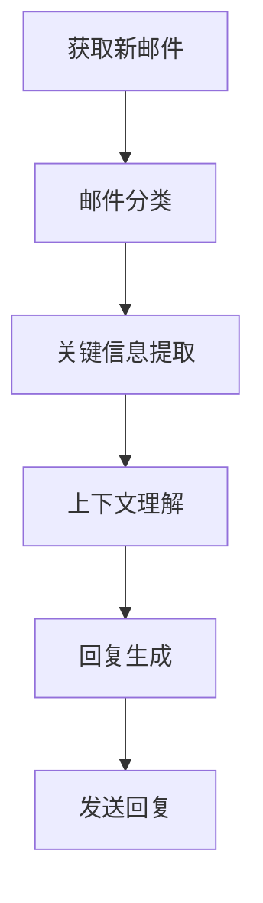

# 大语言模型应用指南：案例：私人邮件助手

## 1. 背景介绍

### 1.1 大语言模型的兴起

近年来,大型语言模型(Large Language Models, LLMs)在自然语言处理领域取得了令人瞩目的进展。这些模型通过在海量文本数据上进行预训练,能够捕捉丰富的语言知识和模式,为广泛的自然语言任务提供强大的基础能力。

### 1.2 邮件处理的挑战

在日常工作和生活中,我们不可避免地要处理大量的电子邮件。然而,随着邮件数量的增加,高效地组织、优先排序和回复邮件变得越来越具有挑战性。传统的邮件客户端通常缺乏智能化功能,导致用户需要耗费大量时间和精力来手动管理邮件。

### 1.3 智能邮件助手的需求

为了解决上述问题,开发一款智能的私人邮件助手变得迫在眉睫。这种助手应该能够自动理解和分类传入的邮件、提取关键信息、根据上下文生成适当的回复,从而大幅减轻用户的工作负担。大语言模型凭借其强大的语言理解和生成能力,为实现这一目标提供了绝佳的技术基础。

## 2. 核心概念与联系

### 2.1 大语言模型

大语言模型是一种基于深度学习的自然语言处理模型,通过在海量文本数据上进行预训练,学习丰富的语言知识和模式。这些模型具有极强的语言理解和生成能力,可以广泛应用于文本分类、机器翻译、问答系统、文本摘要等多种自然语言任务。

常见的大语言模型包括 GPT (Generative Pre-trained Transformer)、BERT (Bidirectional Encoder Representations from Transformers)、XLNet 等。它们采用了 Transformer 等注意力机制,能够有效捕捉长距离的语义依赖关系。

### 2.2 邮件处理流程

智能邮件助手需要处理以下几个关键步骤:

1. **邮件接收**: 从邮件服务器获取新的邮件。
2. **邮件分类**: 根据邮件内容,将其分类到不同的类别(如工作、个人、广告等)。
3. **关键信息提取**: 从邮件正文中提取关键信息,如发件人、主题、日期、附件等。
4. **上下文理解**: 结合发件人、主题和历史邮件,理解邮件的上下文和意图。
5. **回复生成**: 根据上下文,自动生成适当的回复内容。
6. **邮件发送**: 将生成的回复发送给相应的收件人。

### 2.3 大语言模型在邮件处理中的应用

大语言模型可以在上述邮件处理流程的多个环节发挥作用:

1. **邮件分类**: 利用大语言模型对邮件正文进行语义编码,然后使用分类器(如逻辑回归)将其分配到预定义的类别。
2. **关键信息提取**: 将邮件正文输入到大语言模型,利用其生成能力输出关键信息(如发件人、主题等)的掩码填充结果。
3. **上下文理解**: 将历史邮件、发件人信息等上下文信息连同当前邮件一并输入到大语言模型,让模型捕捉上下文语义。
4. **回复生成**: 直接利用大语言模型的生成能力,根据上下文信息生成自然的回复内容。

通过将大语言模型seamlessly地集成到邮件处理流程中,我们可以极大地提高邮件管理的自动化和智能化水平。

## 3. 核心算法原理具体操作步骤  

### 3.1 Transformer 模型

Transformer 是大语言模型的核心架构,它完全基于注意力机制,能够有效捕捉长距离的语义依赖关系。Transformer 包含了编码器(Encoder)和解码器(Decoder)两个主要组件。

#### 3.1.1 Encoder

Encoder 的主要作用是将输入序列(如邮件正文)映射为一系列向量表示。它由多个相同的层组成,每一层都包含两个子层:

1. **Multi-Head Attention**:
   $$\begin{aligned}
   \text{MultiHead}(Q, K, V) &= \text{Concat}(head_1, \ldots, head_h)W^O\\
   \text{where } head_i &= \text{Attention}(QW_i^Q, KW_i^K, VW_i^V)
   \end{aligned}$$

   这里 $Q$、$K$、$V$ 分别代表 Query、Key 和 Value。通过计算 Query 与所有 Key 的点积,并应用 Softmax 函数得到注意力权重,最后将权重与 Value 相乘并求和,得到注意力表示。

2. **前馈全连接网络(Feed-Forward)**: 
   $$\text{FFN}(x)=\max(0,xW_1+b_1)W_2+b_2$$
   
   这是一个简单的前馈神经网络,用于为每个位置的表示增加非线性变换。

在 Encoder 的最后,我们可以得到整个输入序列的向量表示。

#### 3.1.2 Decoder

Decoder 的作用是根据 Encoder 的输出,生成目标序列(如回复内容)。它的结构与 Encoder 类似,只是在 Multi-Head Attention 子层前,还引入了一个额外的 Masked Multi-Head Attention,用于防止关注后续的位置,保证生成的是符合因果关系的序列。

在训练过程中,Transformer 会最小化输入序列与目标序列之间的交叉熵损失,以学习序列到序列的映射关系。

### 3.2 大语言模型微调

虽然大语言模型在预训练阶段已经学习了丰富的语言知识,但为了更好地适应特定的下游任务(如邮件处理),我们还需要进行微调(Fine-tuning)。微调的过程是:

1. **准备数据集**: 收集与目标任务相关的数据,如邮件数据集。将数据切分为训练集、验证集和测试集。
2. **数据预处理**: 对文本数据进行标记化(Tokenization)、填充(Padding)等预处理,以符合模型的输入格式要求。
3. **设置训练目标**: 根据具体任务,设置合适的训练目标,如分类、生成等。
4. **模型微调**: 在预训练模型的基础上,使用准备好的数据集和训练目标,进行几个epoches的模型微调。
5. **模型评估**: 在验证集和测试集上评估微调后模型的性能,根据需要进行进一步的调优。

通过微调,大语言模型可以学习到特定任务的模式和知识,从而显著提高在该任务上的表现。

### 3.3 邮件处理流程算法步骤

现在,我们将上述核心算法原理与邮件处理任务结合,给出具体的算法步骤:



1. **获取新邮件**: 通过 IMAP/POP3 协议,从邮件服务器获取新的邮件。
2. **邮件分类**: 将邮件正文输入到微调后的大语言模型,获取分类logits,使用Softmax获得分类概率,将邮件划分到最可能的类别。
3. **关键信息提取**: 对邮件正文进行掩码,输入到微调后的大语言模型,根据模型生成的结果填充关键信息的掩码位置,提取关键信息。
4. **上下文理解**: 将当前邮件、发件人信息、历史邮件等上下文信息拼接为一个序列,输入到微调后的大语言模型,让模型捕捉上下文语义。
5. **回复生成**: 根据上下文表示,使用 Beam Search 或 Top-k/Top-p Sampling 等策略,利用大语言模型生成自然的回复内容。
6. **发送回复**: 将生成的回复通过 SMTP 协议发送给相应的收件人。

通过以上步骤,我们可以构建一个端到端的智能邮件助手系统,实现自动分类、关键信息提取、上下文理解和自动回复等功能,大幅提高邮件处理效率。

## 4. 数学模型和公式详细讲解举例说明

在第3节中,我们介绍了 Transformer 模型的核心注意力机制和前馈网络公式。现在,我们将更详细地解释这些公式,并给出具体的计算示例。

### 4.1 Multi-Head Attention

Multi-Head Attention 是 Transformer 模型中最关键的组件之一。它的计算公式为:

$$\begin{aligned}
\text{MultiHead}(Q, K, V) &= \text{Concat}(head_1, \ldots, head_h)W^O\\
\text{where } head_i &= \text{Attention}(QW_i^Q, KW_i^K, VW_i^V)
\end{aligned}$$

其中,

- $Q$、$K$、$V$ 分别代表 Query、Key 和 Value 矩阵
- $W_i^Q$、$W_i^K$、$W_i^V$ 是可训练的投影矩阵,用于将 $Q$、$K$、$V$ 映射到不同的表示子空间
- $\text{Attention}(\cdot)$ 是标准的缩放点积注意力函数,定义如下:

$$\text{Attention}(Q, K, V) = \text{softmax}(\frac{QK^T}{\sqrt{d_k}})V$$

其中,
- $d_k$ 是 Key 向量的维度,用于缩放点积值,避免过大的值导致 Softmax 函数梯度较小
- Softmax 函数用于获得 Query 对每个 Key 的注意力权重

让我们用一个简单的例子来计算 Multi-Head Attention:

```python
import numpy as np

# 输入维度
dim_val = 6 # Value 向量维度
dim_k = 3 # Key 向量维度
dim_q = 4 # Query 向量维度
num_heads = 2 # 注意力头数

# 投影矩阵
W_Q = np.random.randn(dim_q, dim_k * num_heads).astype('f')
W_K = np.random.randn(dim_val, dim_k * num_heads).astype('f')
W_V = np.random.randn(dim_val, dim_k * num_heads).astype('f')
W_O = np.random.randn(num_heads * dim_k, dim_val).astype('f')

# 输入向量
Q = np.random.randn(1, dim_q).astype('f')
K = np.random.randn(1, dim_val).astype('f')
V = np.random.randn(1, dim_val).astype('f')

# 计算 Multi-Head Attention
heads = []
for i in range(num_heads):
    # 投影
    q = np.matmul(Q, W_Q[:, i*dim_k:(i+1)*dim_k])
    k = np.matmul(K, W_K[:, i*dim_k:(i+1)*dim_k])
    v = np.matmul(V, W_V[:, i*dim_k:(i+1)*dim_k])
    
    # 计算注意力权重
    weights = np.matmul(q, k.transpose()) / np.sqrt(dim_k)
    weights = np.exp(weights) / np.sum(np.exp(weights), axis=-1, keepdims=True)
    
    # 加权求和
    head = np.matmul(weights, v)
    heads.append(head)

# 拼接多头注意力结果
multi_head = np.concatenate(heads, axis=-1)
multi_head = np.matmul(multi_head, W_O)

print(f"Multi-Head Attention 输出: {multi_head}")
```

在这个示例中,我们首先初始化投影矩阵 $W_Q$、$W_K$、$W_V$ 和 $W_O$。然后,我们对 Query $Q$、Key $K$ 和 Value $V$ 进行投影,得到每个注意力头的 $q$、$k$ 和 $v$。接下来,我们计算每个注意力头的注意力权重,并将其与 $v$ 相乘并求和,得到该头的注意力表示 $head$。最后,我们将所有注意力头的结果拼接,并与 $W_O$ 相乘,得到最终的 Multi-Head Attention 输出。

通过这个示例,您应该能够更好地理解 Multi-Head Attention 的计算过程。注意力机制是 Transformer 模型的核心,也是大语言模型取得巨大成功的关键所