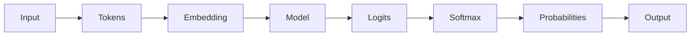

# 大语言模型应用指南：模型响应返回的参数

## 1. 背景介绍

大语言模型(Large Language Models, LLMs)是自然语言处理(NLP)领域近年来的重大突破。它们是在海量文本数据上训练的深度神经网络模型,具有强大的语言理解和生成能力。当我们将一个查询或提示输入到大语言模型中时,模型会生成一个相关的响应。这个响应通常包含一些有用的参数,可以帮助我们更好地理解和利用模型的输出。本文将深入探讨大语言模型响应中的各种参数,讨论它们的含义、用途以及如何有效地利用它们来构建更智能的应用。

### 1.1 大语言模型的崛起
#### 1.1.1 transformer 架构的突破
#### 1.1.2 预训练范式的优势  
#### 1.1.3 规模与性能的关系

### 1.2 大语言模型的应用场景
#### 1.2.1 问答系统
#### 1.2.2 对话机器人
#### 1.2.3 文本生成与创作

## 2. 核心概念与联系

要理解大语言模型响应中的参数,首先需要了解一些核心概念:

### 2.1 Tokens
Tokens 是构成输入和输出序列的基本单元。通常是词、子词或字符。模型响应由一系列 tokens 组成。

### 2.2 Logits
Logits 是模型在每个位置上预测下一个 token 的原始、未归一化的分数。它们反映了模型对每个候选 token 的偏好程度。

### 2.3 概率
将 logits 通过 softmax 函数归一化后,可以得到每个 token 的概率。概率体现了模型在当前位置选择该 token 作为输出的可能性。

### 2.4 Embedding
Embedding 是将离散的 tokens 映射为连续向量表示的方式。模型中的每个 token 都有对应的 embedding 向量,蕴含了该 token 的语义信息。

下图展示了这些概念之间的联系:



## 3. 核心算法原理与操作步骤

大语言模型的核心是 transformer 架构和自回归生成过程。下面我们详细讲解其工作原理。

### 3.1 Transformer 编码器
Transformer 编码器由多个自注意力层和前馈层交替堆叠而成。对于输入序列的每个位置,编码器会计算其与其他位置的注意力权重,实现全局信息的聚合。

1. 将输入 tokens 映射为 embedding 向量
2. 加入位置编码,引入位置信息 
3. 通过自注意力机制更新表示
4. 经过前馈神经网络,引入非线性变换
5. 重复步骤 3-4 多次,得到最终的编码器输出

### 3.2 Transformer 解码器  
Transformer 解码器在编码器的基础上引入了自回归机制,实现了从左到右的语言生成。

1. 将已生成的 tokens 映射为 embedding 向量
2. 加入位置编码
3. 通过掩码自注意力机制更新表示,避免看到未来信息
4. 与编码器输出进行交叉注意力计算
5. 经过前馈神经网络
6. 重复步骤 3-5 多次,得到最终的解码器输出
7. 将解码器输出映射为 logits
8. 通过 softmax 归一化,得到下一个 token 的概率分布
9. 根据概率分布采样或选择最可能的 token 作为新的生成结果
10. 重复步骤 1-9,直到生成结束符或达到最大长度

## 4. 数学模型与公式详解

接下来,我们用数学语言对大语言模型的关键组件进行更严谨的描述。

### 4.1 自注意力机制

自注意力机制是 transformer 的核心,它允许序列中的每个位置都能够关注并利用整个序列的信息。设输入序列的 embedding 表示为矩阵 $X \in \mathbb{R}^{n \times d}$,其中 $n$ 为序列长度,$d$ 为 embedding 维度。自注意力的计算过程如下:

1. 计算查询矩阵 $Q$、键矩阵 $K$ 和值矩阵 $V$:

$$
\begin{aligned}
Q &= XW_Q \\
K &= XW_K \\ 
V &= XW_V
\end{aligned}
$$

其中 $W_Q, W_K, W_V \in \mathbb{R}^{d \times d_k}$ 为可学习的参数矩阵。

2. 计算注意力权重:

$$A = \text{softmax}(\frac{QK^T}{\sqrt{d_k}})$$

其中 $A \in \mathbb{R}^{n \times n}$ 为注意力权重矩阵。$\sqrt{d_k}$ 为缩放因子,用于控制点积结果的方差。

3. 计算注意力输出:

$$\text{Attention}(Q,K,V) = AV$$

最终的注意力输出是值矩阵 $V$ 与注意力权重 $A$ 的加权和。

### 4.2 前馈神经网络

前馈神经网络在 transformer 中用于引入非线性变换和增加模型容量。设输入为 $X \in \mathbb{R}^{n \times d}$,前馈网络的计算过程为:

$$\text{FFN}(X) = \text{ReLU}(XW_1 + b_1)W_2 + b_2$$

其中 $W_1 \in \mathbb{R}^{d \times d_{ff}}, b_1 \in \mathbb{R}^{d_{ff}}, W_2 \in \mathbb{R}^{d_{ff} \times d}, b_2 \in \mathbb{R}^d$ 为可学习参数。$d_{ff}$ 通常大于 $d$,以扩展模型容量。

### 4.3 Softmax 函数

Softmax 函数用于将 logits 转化为概率分布。设 logits 向量为 $z \in \mathbb{R}^k$,则 softmax 函数定义为:

$$\text{softmax}(z)_i = \frac{\exp(z_i)}{\sum_{j=1}^k \exp(z_j)}$$

其中 $\text{softmax}(z)_i$ 表示第 $i$ 个元素的概率。Softmax 函数将 logits 映射到 $(0,1)$ 区间,并保证所有元素的和为 1。

## 5. 项目实践:代码实例与详解

下面我们用 PyTorch 实现一个简单的 transformer 解码器,并生成文本。

```python
import torch
import torch.nn as nn
import torch.nn.functional as F

class TransformerDecoder(nn.Module):
    def __init__(self, vocab_size, d_model, nhead, num_layers):
        super().__init__()
        self.embedding = nn.Embedding(vocab_size, d_model)
        self.pos_encoding = PositionalEncoding(d_model)
        decoder_layer = nn.TransformerDecoderLayer(d_model, nhead)
        self.transformer_decoder = nn.TransformerDecoder(decoder_layer, num_layers)
        self.fc = nn.Linear(d_model, vocab_size)
        
    def forward(self, input_ids, encoder_output):
        embedding = self.embedding(input_ids)
        pos_embedding = self.pos_encoding(embedding)
        decoder_output = self.transformer_decoder(pos_embedding, encoder_output)
        logits = self.fc(decoder_output)
        return logits
        
# 实例化模型
decoder = TransformerDecoder(vocab_size=10000, d_model=512, nhead=8, num_layers=6)

# 生成文本
def generate(decoder, encoder_output, max_length, start_token, end_token):
    decoder_input = torch.tensor([[start_token]])
    for i in range(max_length):
        decoder_output = decoder(decoder_input, encoder_output)
        prob = F.softmax(decoder_output[0,-1], dim=-1)
        next_token = torch.multinomial(prob, 1)
        decoder_input = torch.cat([decoder_input, next_token], dim=-1)
        if next_token.item() == end_token:
            break
    return decoder_input.squeeze()
```

这个简化版的 transformer 解码器包含了位置编码、自注意力层和前馈层。输入 token 序列经过 embedding 层和位置编码后,通过多个解码器层生成输出 logits。`generate` 函数根据 logits 采样下一个 token,直到生成结束符或达到最大长度。

## 6. 实际应用场景

大语言模型响应中的参数在许多实际应用中发挥着重要作用。下面列举几个典型场景:

### 6.1 对话状态跟踪
对话系统需要根据用户的输入和对话历史,准确地跟踪和更新对话状态。模型响应中的 logits 和概率分布可以用于预测槽位值、识别意图,帮助对话管理模块做出正确决策。

### 6.2 内容安全过滤
在文本生成场景中,我们希望模型输出的内容是安全、合规的。通过分析响应中的 logits 和概率,可以识别出一些危险或敏感的词汇。在后处理阶段,我们可以对这些词汇进行过滤或替换,从而得到更安全的生成结果。

### 6.3 知识蒸馏与模型压缩
大语言模型的参数量极其庞大,难以在资源受限的环境中部署。知识蒸馏技术可以利用大模型的 logits 作为软目标,来指导小模型的学习。这样,我们可以得到一个参数量更少、推理更快,但性能接近大模型的压缩模型。

## 7. 工具与资源推荐

为了方便开发者使用和研究大语言模型,这里推荐一些常用的工具和资源:

- Hugging Face Transformers: 提供了多种预训练语言模型的实现,包括 BERT、GPT、T5 等。
- OpenAI API: 允许开发者通过 API 接口访问 GPT-3 等强大的语言模型。
- DeepSpeed: 微软开源的深度学习优化库,可以显著提升大模型的训练速度和效率。
- EleutherAI GPT-Neo: 一个开源的 GPT 模型系列,在众多下游任务上展现出优异的性能。
- Megatron-LM: NVIDIA 提出的用于训练大规模语言模型的工具包,支持模型并行和数据并行。

## 8. 总结:未来发展趋势与挑战

大语言模型响应中的参数蕴含了丰富的语义信息,是理解和应用这些模型的关键。未来,我们可以期待以下发展趋势:

- 更大规模的模型:模型参数量还将持续增长,带来更强大的语言理解和生成能力。
- 更高效的推理:通过知识蒸馏、量化、剪枝等技术,可以降低模型推理的计算开销。  
- 更广泛的应用:语言模型有望在更多领域得到应用,如代码生成、数据分析、创意设计等。

同时,我们也面临着一些挑战:

- 可解释性:虽然模型展现出了惊人的性能,但其内部工作机制仍难以解释,存在一定的不可控风险。
- 公平性与伦理:模型可能放大数据中的偏见,产生不公平或有害的结果。确保模型的公平性和符合伦理规范至关重要。
- 数据隐私:模型在训练过程中可能记忆个人隐私信息。如何在保护隐私的同时充分利用数据,是一个值得关注的问题。

## 9. 附录:常见问题与解答

### Q1: logits 和概率有什么区别?
A1: logits 是模型原始的、未归一化的预测分数,可以为任意实数。概率是将 logits 通过 softmax 函数映射到 [0,1] 区间得到的归一化结果,表示每个类别的可能性。

### Q2: 如何比较不同模型生成响应的质量?
A2: 可以使用一些自动评价指标,如 BLEU、ROUGE、METEOR 等,通过与参考答案的相似度来评估生成质量。同时,人工评估也是必不可少的,可以从流畅度、相关性、信息量等维度对生成结果进行打分。

### Q3: 大语言模型生成的文本是否有版权风险?
A3: 这是一个复杂的法律和伦理问题。通常认为,模型本身和生成算法不受版权保护,但训练数据可能受到版权限制。模型生成的内容是否构成侵权,取