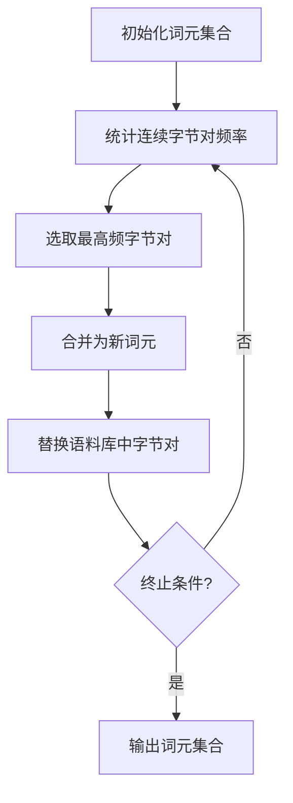
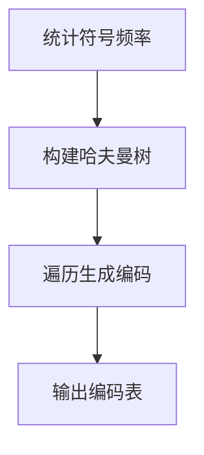

# 大语言模型应用指南：编码与无损压缩

## 1. 背景介绍

### 1.1 大语言模型的兴起

近年来,大型语言模型(Large Language Models, LLMs)在自然语言处理领域掀起了一场革命。这些模型通过在海量文本数据上进行预训练,学习了丰富的语言知识和上下文关联,展现出惊人的生成能力。从GPT-3到ChatGPT,再到谷歌的PaLM和OpenAI的GPT-4,LLMs的性能不断提升,应用范围也越来越广泛。

### 1.2 编码与无损压缩的重要性

随着LLMs的规模不断扩大,模型参数和输入输出数据的存储和传输成本也呈指数级增长。因此,高效的编码和无损压缩技术对于LLMs的实际应用至关重要。合理的编码方案可以减小模型大小,提高计算效率;无损压缩则能够节省存储空间和网络带宽。本文将围绕LLMs的编码与无损压缩技术展开深入探讨。

## 2. 核心概念与联系

### 2.1 词元编码(Token Encoding)

LLMs通常将输入文本分词为一系列词元(token),然后将每个词元映射为一个唯一的整数ID。这种词元编码方式不仅能够有效地表示任意文本,还可以降低计算复杂度。常见的词元编码方案包括字节对编码(BPE)、WordPiece和SentencePiece等。

$$
\text{Token Encoding: } \mathcal{T}(x) = [t_1, t_2, \ldots, t_n]
$$

其中$x$表示输入文本,$\mathcal{T}$为词元编码函数,输出为词元ID序列$[t_1, t_2, \ldots, t_n]$。

### 2.2 嵌入查找(Embedding Lookup)

在LLMs中,每个词元ID对应一个固定长度的嵌入向量,通过查找嵌入矩阵获得。嵌入向量能够捕捉词元的语义和上下文信息,为后续的注意力计算和变换层提供有效的表示。

$$
\boldsymbol{x} = \text{Embedding}([t_1, t_2, \ldots, t_n])
$$

其中$\boldsymbol{x} \in \mathbb{R}^{n \times d}$为输入序列的嵌入表示,每行对应一个词元嵌入,$d$为嵌入维度。

### 2.3 无损压缩(Lossless Compression)

无损压缩是一种数据压缩技术,能够从原始数据中完全恢复出原始内容,不会引入任何信息损失。常见的无损压缩算法包括熵编码(如哈夫曼编码和算术编码)和字典编码(如LZ77和LZW)等。无损压缩在LLMs中可应用于模型参数、中间激活值和输入输出数据的压缩,从而节省存储空间和网络带宽。

## 3. 核心算法原理具体操作步骤

### 3.1 BPE词元编码

BPE(Byte Pair Encoding)是一种基于统计的子词词元化算法,具有以下优点:

1. 可以根据语料库自动学习最优的词元集合
2. 能够有效地表示任意新词和未知词
3. 可控制词表大小,在词元数量和单词覆盖率之间取得平衡

BPE算法的核心思想是从字符级别开始,不断合并出现频率最高的连续字节对,直到达到预设的词表大小或其他终止条件。具体步骤如下:

1. 初始化词元集合为字符集
2. 统计语料库中所有连续字节对的出现频率
3. 选取频率最高的字节对,将其合并为新词元,加入词元集合
4. 在语料库中用新词元替换所有出现的该字节对
5. 重复步骤2-4,直到满足终止条件

以"unrefrigerated"为例,假设初始词元集合为所有单个字符,BPE算法可能的合并过程为:

1. u n r e f r i g e r a t e d
2. un r e f r i g e r a t e d  (合并"un")
3. unr e f r i ger a t e d (合并"re")
4. unr ef r i ger a t e d (合并"ef")
5. unrefr i ger a t e d (合并"iger")
6. unrefrigerated (合并"ated")

最终得到"unrefrigerated"的BPE编码为`['un', 'refr', 'ig', 'er', 'ated']`。



### 3.2 熵编码

熵编码是一类基于信息论原理的无损压缩算法,包括著名的哈夫曼编码和算术编码等。其核心思想是为出现概率较高的符号分配较短的编码,而为概率较低的符号分配较长的编码,从而达到压缩的目的。

以哈夫曼编码为例,其编码步骤如下:

1. 统计输入数据中每个符号的出现频率
2. 构建哈夫曼树:
    - 初始化每个符号为一个节点,权重为其频率
    - 每次选取两个权重最小的节点,构造一个新节点作为它们的父节点,新节点权重为两子节点权重之和
    - 重复上一步,直到只剩下一个根节点
3. 遍历哈夫曼树,为每个叶子节点(符号)生成编码:
    - 从根节点出发,向左子树编码0,向右子树编码1
    - 到达叶子节点时,路径上的0和1序列即为该符号的编码



例如,对于输入数据"ABBCCCDDDDEEEEEEEEEEEEEEEE",符号频率为A:2,B:2,C:3,D:4,E:16。构建的哈夫曼树和生成的编码如下:

```
        Root
        /    \
      19      16
     /  \      \
    7    12     E
   / \    /\
  3   4  2  10
 / \  /\ /\   \
A   B C D      
编码:
A: 110
B: 111
C: 010
D: 011
E: 1
```

可以看出,出现频率越高的符号E被分配了最短的编码1,而频率较低的A和B则被分配了较长的编码。这种编码方式可以有效地压缩数据。

### 3.3 LZ77压缩

LZ77是一种基于字典编码的无损压缩算法,广泛应用于ZIP、GZIP和PNG等压缩格式。其核心思想是在输入数据中查找重复出现的字符串,用一个指针(偏移量和长度)替换该字符串,从而达到压缩的目的。

LZ77算法的具体步骤如下:

1. 初始化滑动窗口,包括查找缓冲区(已编码数据)和查看缓冲区(未编码数据)
2. 在查找缓冲区中查找与查看缓冲区前缀最长匹配的字符串
3. 如果找到匹配:
    - 输出一个三元组(偏移量,长度,下一个字符)
    - 将查看缓冲区前缀移入查找缓冲区
4. 如果未找到匹配或达到最大匹配长度:
    - 输出原始字符
    - 将该字符移入查找缓冲区
5. 重复步骤2-4,直到处理完整个输入数据

```mermaid
graph TD
    A[初始化窗口] --> B[查找最长匹配]
    B -->|找到匹配| C[输出(偏移,长度,字符)]
    C --> D[移动窗口]
    B -->|未找到| E[输出原始字符]
    E --> D
    D --> F{终止?}
    F --否--> B
    F --是--> G[输出压缩数据]
```

例如,对于输入数据"ABBCBACABCAB",LZ77压缩过程如下:

```
查找缓冲区: "" (初始为空)
查看缓冲区: "ABBCBACABCAB"
输出: (0,0,A) (0,0,B) (0,0,B) (0,0,C) (3,2,A) (0,0,C) (6,3,B)

压缩数据: (0,0,A) (0,0,B) (0,0,B) (0,0,C) (3,2,A) (0,0,C) (6,3,B)
```

可以看出,LZ77通过查找和替换重复字符串,实现了有效的数据压缩。

## 4. 数学模型和公式详细讲解举例说明

### 4.1 交叉熵损失(Cross-Entropy Loss)

在LLMs的训练中,交叉熵损失是一种常用的目标函数,用于衡量模型预测和真实标签之间的差异。对于一个长度为$n$的序列$\boldsymbol{x} = (x_1, x_2, \ldots, x_n)$,其交叉熵损失定义为:

$$
\mathcal{L}(\boldsymbol{x}, \boldsymbol{y}) = -\sum_{i=1}^{n} \log P(y_i | x_1, \ldots, x_i)
$$

其中$\boldsymbol{y} = (y_1, y_2, \ldots, y_n)$为真实标签序列,$P(y_i | x_1, \ldots, x_i)$表示模型在给定前缀$x_1, \ldots, x_i$的条件下,预测下一个词元为$y_i$的概率。

交叉熵损失的计算过程如下:

1. 将输入序列$\boldsymbol{x}$通过嵌入查找和Transformer编码器获得隐藏表示$\boldsymbol{H} = (\boldsymbol{h}_1, \boldsymbol{h}_2, \ldots, \boldsymbol{h}_n)$
2. 对每个位置$i$,将$\boldsymbol{h}_i$输入到Transformer解码器,得到概率分布$P(y_i | x_1, \ldots, x_i)$
3. 计算$\log P(y_i | x_1, \ldots, x_i)$,并对所有位置求和得到总损失$\mathcal{L}(\boldsymbol{x}, \boldsymbol{y})$

在训练过程中,通过反向传播算法优化模型参数,使交叉熵损失最小化,从而提高模型在给定前缀下预测正确词元的能力。

### 4.2 注意力机制(Attention Mechanism)

注意力机制是Transformer等LLMs的核心组件,它允许模型在编码和解码过程中,动态地关注输入序列的不同部分,捕捉长距离依赖关系。

对于一个查询向量$\boldsymbol{q}$和一组键值对$(\boldsymbol{K}, \boldsymbol{V}) = \{\boldsymbol{k}_1, \boldsymbol{v}_1\}, \{\boldsymbol{k}_2, \boldsymbol{v}_2\}, \ldots, \{\boldsymbol{k}_n, \boldsymbol{v}_n\}$,注意力机制的计算过程如下:

1. 计算查询和每个键之间的相似度分数:

$$
e_i = \text{score}(\boldsymbol{q}, \boldsymbol{k}_i) = \boldsymbol{q}^\top \boldsymbol{k}_i
$$

2. 通过Softmax函数将分数归一化为注意力权重:

$$
\alpha_i = \frac{\exp(e_i)}{\sum_{j=1}^{n} \exp(e_j)}
$$

3. 将注意力权重与对应的值向量相乘,并求和得到注意力输出:

$$
\text{Attention}(\boldsymbol{q}, \boldsymbol{K}, \boldsymbol{V}) = \sum_{i=1}^{n} \alpha_i \boldsymbol{v}_i
$$

注意力机制能够自适应地为每个查询分配不同的注意力权重,关注输入序列中与查询相关的部分,从而提高模型的表示能力和预测精度。

### 4.3 位置编码(Positional Encoding)

由于Transformer缺乏递归或卷积结构,无法直接捕捉序列的位置信息。因此,需要在输入嵌入中显式地编码位置信息,以保持序列的顺序性。

常见的位