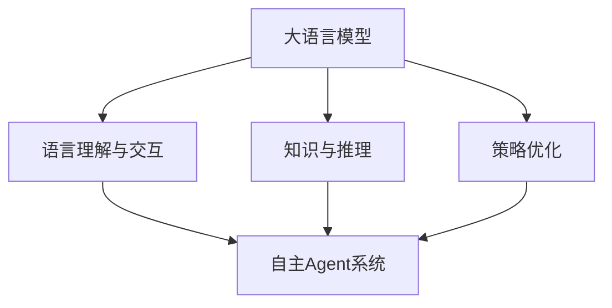

# 大语言模型应用指南：自主Agent系统案例分析（一）

## 1. 背景介绍
### 1.1 大语言模型的发展历程
#### 1.1.1 早期的语言模型
#### 1.1.2 Transformer模型的突破
#### 1.1.3 预训练语言模型的崛起

### 1.2 自主Agent系统的兴起
#### 1.2.1 Agent系统的定义与特点  
#### 1.2.2 自主Agent系统的研究现状
#### 1.2.3 自主Agent系统面临的挑战

### 1.3 大语言模型与自主Agent系统的结合
#### 1.3.1 大语言模型赋能自主Agent系统
#### 1.3.2 自主Agent系统拓展大语言模型应用场景
#### 1.3.3 二者结合的意义与前景

## 2. 核心概念与联系
### 2.1 大语言模型
#### 2.1.1 定义与原理
大语言模型（Large Language Model，LLM）是一种基于深度学习的自然语言处理模型，旨在从海量文本数据中学习语言的统计规律和语义表示。它通过无监督的方式预训练，能够捕捉语言的上下文信息，生成连贯、自然的文本。

#### 2.1.2 关键技术
- Transformer架构：采用自注意力机制，捕捉长距离依赖关系。
- 预训练任务：如语言模型、掩码语言模型等，从无标注数据中学习通用语言表示。
- 参数量巨大：数以亿计的参数，赋予模型强大的语言理解和生成能力。

#### 2.1.3 代表模型
- GPT系列（GPT-2、GPT-3等）
- BERT系列（BERT、RoBERTa等）
- T5、XLNet、ELECTRA等

### 2.2 自主Agent系统
#### 2.2.1 定义与特点
自主Agent系统是一种能够自主感知环境、推理决策并执行任务的智能系统。它具有以下特点：

- 自主性：能够独立地完成任务，无需人工干预。
- 适应性：能够根据环境变化动态调整策略。
- 交互性：能够与环境和其他Agent进行交互。
- 连续学习：能够从经验中不断学习和优化。

#### 2.2.2 关键技术
- 强化学习：通过试错和反馈不断优化策略。
- 多Agent协作：多个Agent之间的通信、协调与合作。
- 因果推理：理解因果关系，支持决策与规划。
- 知识图谱：构建结构化知识，赋予语义理解能力。

### 2.3 大语言模型与自主Agent系统的联系
#### 2.3.1 语言理解与交互
大语言模型为自主Agent系统提供了强大的自然语言处理能力，使其能够理解人类指令、参与对话交互。Agent可以利用LLM生成的语言表示进行推理决策。

#### 2.3.2 知识与推理
LLM中蕴含了丰富的世界知识和常识推理能力。将其与知识图谱等结构化知识相结合，可以增强Agent的语义理解和逻辑推理能力，支持复杂任务的完成。

#### 2.3.3 策略优化
LLM生成的语言可以作为Agent的行动空间，通过强化学习等方法优化语言生成策略，使Agent能够根据上下文生成更加合理、高效的行动序列。



## 3. 核心算法原理具体操作步骤
### 3.1 大语言模型预训练
#### 3.1.1 数据准备
- 收集大规模无标注文本数据，如维基百科、图书、新闻等。
- 对数据进行清洗、分词、编码等预处理操作。

#### 3.1.2 模型构建
- 选择合适的模型架构，如Transformer。
- 确定模型参数量、层数、注意力头数等超参数。
- 初始化模型参数。

#### 3.1.3 预训练任务
- 语言模型：预测下一个单词。
- 掩码语言模型：随机掩盖部分单词，预测被掩盖的单词。
- 其他任务如句子顺序预测、句子关系预测等。

#### 3.1.4 训练过程
- 将预处理后的数据分批次输入模型。
- 计算预测结果与真实标签的损失函数。
- 通过反向传播算法更新模型参数。
- 迭代多个epoch直至模型收敛。

### 3.2 自主Agent系统构建
#### 3.2.1 环境建模
- 定义状态空间和行动空间。
- 设计奖励函数，引导Agent学习优化策略。

#### 3.2.2 Agent架构设计
- 融合LLM作为Agent的语言理解和生成模块。
- 加入知识图谱、因果推理等模块增强推理能力。
- 采用层次化结构，支持复杂任务分解与规划。

#### 3.2.3 强化学习训练
- 采用策略梯度、Q-learning等强化学习算法。
- 通过与环境交互，收集经验数据。
- 更新Agent策略网络的参数，提高决策质量。

#### 3.2.4 多Agent协作
- 设计多Agent通信协议，实现信息共享。
- 引入博弈论机制，优化多Agent联合决策。
- 通过联邦学习等方式，实现分布式训练。

## 4. 数学模型和公式详细讲解举例说明
### 4.1 Transformer模型
Transformer是大语言模型的核心架构，其关键是自注意力机制。对于输入序列$\mathbf{x}=(x_1,\dots,x_n)$，Transformer的自注意力计算过程如下：

1. 计算查询矩阵$\mathbf{Q}$、键矩阵$\mathbf{K}$和值矩阵$\mathbf{V}$：

$$
\mathbf{Q} = \mathbf{X}\mathbf{W}^Q \\
\mathbf{K} = \mathbf{X}\mathbf{W}^K \\ 
\mathbf{V} = \mathbf{X}\mathbf{W}^V
$$

其中$\mathbf{W}^Q, \mathbf{W}^K, \mathbf{W}^V$为可学习的参数矩阵。

2. 计算注意力权重矩阵$\mathbf{A}$：

$$
\mathbf{A} = \text{softmax}(\frac{\mathbf{Q}\mathbf{K}^T}{\sqrt{d_k}})
$$

其中$d_k$为$\mathbf{Q}$和$\mathbf{K}$的维度，用于缩放点积结果。

3. 计算自注意力输出$\mathbf{Z}$：

$$
\mathbf{Z} = \mathbf{A}\mathbf{V}
$$

通过自注意力机制，Transformer能够捕捉序列中任意两个位置之间的依赖关系，从而建模长距离语义信息。

### 4.2 策略梯度算法
策略梯度是强化学习中常用的优化算法，用于更新Agent的策略网络参数。假设策略网络为$\pi_\theta$，其中$\theta$为可学习参数，目标是最大化期望奖励：

$$
J(\theta) = \mathbb{E}_{\tau \sim \pi_\theta}[R(\tau)]
$$

其中$\tau$为一条轨迹，$R(\tau)$为该轨迹的累积奖励。根据策略梯度定理，可以得到$J(\theta)$对$\theta$的梯度：

$$
\nabla_\theta J(\theta) = \mathbb{E}_{\tau \sim \pi_\theta}[\sum_{t=0}^T \nabla_\theta \log \pi_\theta(a_t|s_t) R_t]
$$

其中$s_t$和$a_t$分别为t时刻的状态和行动，$R_t$为t时刻之后的累积奖励。在实践中，通过采样多条轨迹，计算梯度的蒙特卡洛估计，并用随机梯度上升法更新$\theta$：

$$
\theta \leftarrow \theta + \alpha \frac{1}{N} \sum_{i=1}^N \sum_{t=0}^T \nabla_\theta \log \pi_\theta(a_t^{(i)}|s_t^{(i)}) R_t^{(i)}
$$

其中$\alpha$为学习率，$N$为采样轨迹数。策略梯度算法通过不断优化策略网络，使Agent能够学习到最优策略。

## 5. 项目实践：代码实例和详细解释说明
下面给出一个简单的PyTorch实现，展示如何使用Transformer构建语言模型，并应用于自主Agent系统。

```python
import torch
import torch.nn as nn
import torch.optim as optim

# Transformer编码器层
class TransformerEncoder(nn.Module):
    def __init__(self, d_model, nhead, dim_feedforward, dropout):
        super(TransformerEncoder, self).__init__()
        self.self_attn = nn.MultiheadAttention(d_model, nhead, dropout)
        self.fc1 = nn.Linear(d_model, dim_feedforward)
        self.fc2 = nn.Linear(dim_feedforward, d_model)
        self.norm1 = nn.LayerNorm(d_model)
        self.norm2 = nn.LayerNorm(d_model)
        self.dropout = nn.Dropout(dropout)
        
    def forward(self, x):
        residual = x
        x = self.self_attn(x, x, x)[0]
        x = self.norm1(x + residual)
        residual = x
        x = self.fc2(self.dropout(torch.relu(self.fc1(x))))
        x = self.norm2(x + residual)
        return x

# 语言模型
class LanguageModel(nn.Module):
    def __init__(self, vocab_size, d_model, nhead, dim_feedforward, num_layers, dropout):
        super(LanguageModel, self).__init__()
        self.embedding = nn.Embedding(vocab_size, d_model)
        self.pos_encoding = PositionalEncoding(d_model, dropout)
        self.transformer_encoders = nn.ModuleList([
            TransformerEncoder(d_model, nhead, dim_feedforward, dropout) 
            for _ in range(num_layers)
        ])
        self.fc = nn.Linear(d_model, vocab_size)
        
    def forward(self, x):
        x = self.embedding(x)
        x = self.pos_encoding(x)
        for encoder in self.transformer_encoders:
            x = encoder(x)
        x = self.fc(x)
        return x

# 位置编码
class PositionalEncoding(nn.Module):
    def __init__(self, d_model, dropout, max_len=5000):
        super(PositionalEncoding, self).__init__()
        self.dropout = nn.Dropout(p=dropout)
        pe = torch.zeros(max_len, d_model)
        position = torch.arange(0, max_len, dtype=torch.float).unsqueeze(1)
        div_term = torch.exp(torch.arange(0, d_model, 2).float() * (-math.log(10000.0) / d_model))
        pe[:, 0::2] = torch.sin(position * div_term)
        pe[:, 1::2] = torch.cos(position * div_term)
        pe = pe.unsqueeze(0).transpose(0, 1)
        self.register_buffer('pe', pe)

    def forward(self, x):
        x = x + self.pe[:x.size(0), :]
        return self.dropout(x)

# 训练语言模型
def train_language_model(model, data, optimizer, criterion, num_epochs):
    model.train()
    for epoch in range(num_epochs):
        total_loss = 0
        for batch in data:
            optimizer.zero_grad()
            input_seq = batch[:-1]
            target_seq = batch[1:]
            output = model(input_seq)
            loss = criterion(output.view(-1, vocab_size), target_seq.view(-1))
            loss.backward()
            optimizer.step()
            total_loss += loss.item()
        print(f"Epoch [{epoch+1}/{num_epochs}], Loss: {total_loss/len(data):.4f}")

# 应用语言模型于自主Agent
def generate_text(model, prompt, max_len):
    model.eval()
    input_seq = torch.tensor(tokenizer.encode(prompt)).unsqueeze(0)
    generated_seq = input_seq.clone()
    for _ in range(max_len):
        with torch.no_grad():
            output = model(generated_seq)
            next_token = torch.argmax(output[-1])
            generated_seq = torch.cat([generated_seq, next_token.unsqueeze(0)], dim=1)
    return tokenizer.decode(generated_seq.squeeze().tolist())

# 示例用法
vocab_size = 10000
d_model = 512
nhead = 8 
dim_feedforward = 2048
num_layers = 6
dropout = 0.1
num_epochs = 10
learning_rate = 0.001

model = LanguageModel(vocab_size, d_model, nhead, dim_feedforward, num_layers,