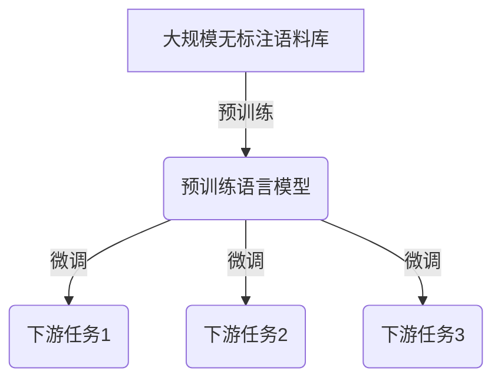

# 大语言模型应用指南：自然语言处理的发展历程

## 1.背景介绍

### 1.1 自然语言处理的重要性

自然语言处理(Natural Language Processing, NLP)是人工智能领域的一个重要分支,旨在使计算机能够理解和生成人类语言。随着大数据时代的到来,海量的文本数据不断涌现,对自然语言处理技术的需求与日俱增。NLP技术已广泛应用于机器翻译、智能问答、情感分析、文本摘要等诸多领域,极大地提高了人机交互的效率和质量。

### 1.2 NLP发展历程概述

自然语言处理的发展经历了几个重要阶段:

- 早期基于规则的方法(1950s-1980s)
- 统计自然语言处理(1990s-2000s)
- 深度学习时代(2010s-至今)

其中,深度学习的兴起推动了NLP领域的飞速发展,尤其是大型预训练语言模型的出现,使得NLP技术的性能得到了前所未有的提升。

## 2.核心概念与联系

### 2.1 预训练语言模型

预训练语言模型(Pre-trained Language Model, PLM)是NLP领域的一个关键概念。它是一种在大规模无标注语料库上预先训练的语言模型,能够捕捉语言的语义和语法信息。通过在下游任务上进行微调(fine-tuning),预训练模型可以快速适应特定的NLP任务,显著提高模型的性能。

### 2.2 自注意力机制

自注意力机制(Self-Attention)是预训练语言模型中的核心组件之一。它允许模型捕捉输入序列中任意两个位置之间的依赖关系,从而更好地建模长距离依赖。自注意力机制的引入,使得预训练语言模型能够有效地处理长序列输入,并在各种NLP任务中取得卓越表现。

### 2.3 transformer架构

Transformer是一种全新的基于自注意力机制的序列到序列(Sequence-to-Sequence)模型架构。它完全摒弃了传统的循环神经网络(RNN)和卷积神经网络(CNN)结构,使用多头自注意力机制和位置编码来捕捉输入序列的依赖关系。Transformer架构在机器翻译、文本生成等任务中表现出色,并被广泛应用于各种大型预训练语言模型中。

## 3.核心算法原理具体操作步骤

### 3.1 Transformer编码器(Encoder)

Transformer编码器的核心是多头自注意力机制和位置编码。具体操作步骤如下:

1. 将输入序列进行词嵌入(Word Embedding)和位置编码(Positional Encoding)。
2. 将嵌入序列输入到多头自注意力(Multi-Head Attention)层,计算每个位置与其他位置的注意力权重。
3. 对注意力权重进行缩放,并与值(Value)向量相乘,得到注意力输出。
4. 将注意力输出与输入相加,得到残差连接(Residual Connection)。
5. 对残差连接的结果进行层归一化(Layer Normalization)。
6. 将归一化后的结果输入到前馈神经网络(Feed-Forward Neural Network)中。
7. 重复步骤2-6进行多层编码。

### 3.2 Transformer解码器(Decoder)

Transformer解码器除了包含编码器的多头自注意力机制和前馈神经网络外,还引入了掩码多头自注意力(Masked Multi-Head Attention)和编码器-解码器注意力(Encoder-Decoder Attention)。具体操作步骤如下:

1. 将输出序列进行位置编码和词嵌入。
2. 对嵌入序列进行掩码多头自注意力,防止每个位置关注未来的位置。
3. 将掩码注意力输出与编码器输出进行编码器-解码器注意力,获取编码器端的上下文信息。
4. 对注意力输出进行残差连接和层归一化。
5. 将归一化后的结果输入到前馈神经网络中。
6. 重复步骤2-5进行多层解码。

### 3.3 模型预训练

大型预训练语言模型通常采用自监督学习(Self-Supervised Learning)的方式在大规模语料库上进行预训练。常见的预训练目标包括:

- 蒙版语言模型(Masked Language Model, MLM):随机掩蔽输入序列中的一些词,模型需要预测被掩蔽的词。
- 下一句预测(Next Sentence Prediction, NSP):判断两个句子是否为连续的句子。
- 序列到序列(Sequence-to-Sequence):输入一个序列,模型需要生成另一个相关的序列。

通过预训练,模型可以学习到通用的语言表示,为后续的下游任务微调奠定基础。

## 4.数学模型和公式详细讲解举例说明

### 4.1 自注意力机制

自注意力机制是Transformer的核心组件之一。给定一个查询(Query)向量$\boldsymbol{q}$、键(Key)向量集合$\boldsymbol{K}=\{\boldsymbol{k}_1, \boldsymbol{k}_2, \cdots, \boldsymbol{k}_n\}$和值(Value)向量集合$\boldsymbol{V}=\{\boldsymbol{v}_1, \boldsymbol{v}_2, \cdots, \boldsymbol{v}_n\}$,自注意力的计算过程如下:

$$\text{Attention}(\boldsymbol{Q}, \boldsymbol{K}, \boldsymbol{V}) = \text{softmax}\left(\frac{\boldsymbol{Q}\boldsymbol{K}^T}{\sqrt{d_k}}\right)\boldsymbol{V}$$

其中,$d_k$是缩放因子,用于防止内积过大导致梯度消失或爆炸。

多头自注意力机制(Multi-Head Attention)是将多个注意力头(Head)的结果拼接在一起,从不同的