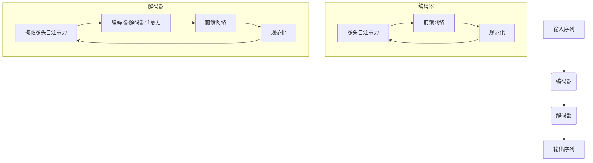
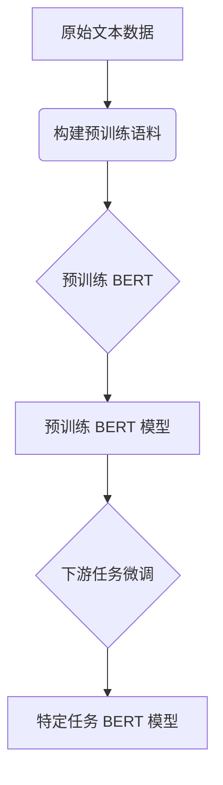
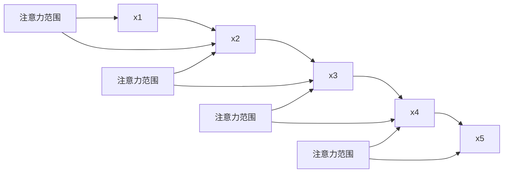

# 大语言模型应用指南：越狱攻击与数据投毒

## 1. 背景介绍

### 1.1 大语言模型的兴起

近年来,大型语言模型(Large Language Models, LLMs)在自然语言处理领域取得了令人瞩目的成就。这些模型通过在海量文本数据上进行预训练,学习了丰富的语言知识和上下文关联,从而能够生成流畅、连贯的文本输出。

代表性的大语言模型包括:

- GPT-3 (Generative Pre-trained Transformer 3)
- BERT (Bidirectional Encoder Representations from Transformers)
- XLNet
- RoBERTa
- ALBERT

这些模型展现出了强大的语言生成和理解能力,在机器翻译、问答系统、文本摘要等任务中表现出色。

### 1.2 大语言模型的应用前景

大语言模型的出现为自然语言处理领域带来了革命性的变化。它们有望推动人工智能系统更好地理解和生成自然语言,从而在以下领域发挥重要作用:

- 智能助手和对话系统
- 内容创作和自动写作
- 知识提取和问答系统
- 机器翻译和多语种处理
- 文本分类和情感分析

然而,大语言模型也面临着一些挑战和风险,如模型公平性、隐私和安全性等,需要研究人员进一步探索和解决。

## 2. 核心概念与联系

### 2.1 语言模型

语言模型是自然语言处理领域的基础概念,旨在学习和捕捉语言的统计规律。形式化地,语言模型的目标是估计一个语句或文本序列的概率:

$$P(w_1, w_2, \ldots, w_n) = \prod_{i=1}^n P(w_i | w_1, \ldots, w_{i-1})$$

其中 $w_i$ 表示序列中的第 i 个词。

传统的语言模型通常基于 n-gram 统计或神经网络模型,但存在上下文捕捉能力有限的问题。大语言模型则采用了transformer等新型架构,能够更好地捕捉长距离依赖关系。

### 2.2 自注意力机制(Self-Attention)

自注意力机制是transformer等大语言模型的核心,它允许模型在计算目标词的表示时,直接关注整个输入序列中的所有词。

具体来说,对于序列 $\boldsymbol{x} = (x_1, x_2, \ldots, x_n)$,自注意力机制首先计算查询(Query)、键(Key)和值(Value)向量,然后通过计算查询与每个键的相似性得分,对值向量进行加权求和,得到目标词的表示:

$$\mathrm{Attention}(Q, K, V) = \mathrm{softmax}\left(\frac{QK^T}{\sqrt{d_k}}\right)V$$

其中 $d_k$ 是缩放因子,用于防止内积值过大导致梯度消失。

自注意力机制赋予了大语言模型强大的上下文建模能力,使其能够同时关注序列中的所有词,捕捉长距离依赖关系。

### 2.3 transformer 架构

Transformer 是一种全新的基于自注意力机制的序列到序列模型,被广泛应用于大语言模型中。它主要由编码器(Encoder)和解码器(Decoder)两部分组成:

1. **编码器(Encoder)**: 将输入序列映射为连续的表示向量。
2. **解码器(Decoder)**: 接收编码器的输出,生成目标序列。

编码器和解码器内部都由多个相同的层组成,每层包含多头自注意力子层和前馈神经网络子层。通过这种结构,Transformer 能够同时关注输入和输出序列中的所有位置,捕捉长距离依赖关系。

Transformer 架构的创新性在于完全放弃了循环神经网络和卷积神经网络,纯粹依赖自注意力机制来建模序列,从而避免了梯度消失和爆炸问题,并显著提高了并行计算能力。

## 3. 核心算法原理具体操作步骤

### 3.1 transformer 模型训练

Transformer 模型的训练过程包括两个主要步骤:预训练(Pre-training)和微调(Fine-tuning)。

1. **预训练**:在大规模无监督文本数据上训练 Transformer 模型,学习通用的语言表示。常见的预训练目标包括:
   - 蒙版语言模型(Masked Language Modeling, MLM):随机掩蔽部分输入词,模型需要预测被掩蔽的词。
   - 下一句预测(Next Sentence Prediction, NSP):判断两个句子是否相邻。

2. **微调**:在特定的下游任务数据上,对预训练模型进行进一步的监督微调,使其适应特定任务。常见的微调方法包括:
   - 添加任务特定的输入表示(如分类标签)。
   - 在 Transformer 模型的输出上添加任务特定的输出层。
   - 对整个模型或部分层进行端到端的微调。

以 BERT 为例,其预训练和微调的具体步骤如下:

1. 从原始文本数据中构建预训练语料,包括词块化(Word Piece)、生成连续序列等步骤。
2. 在预训练语料上训练 BERT 模型,优化 MLM 和 NSP 两个预训练目标。
3. 将预训练 BERT 模型用于下游任务,如文本分类、问答等。根据任务的不同,对 BERT 模型进行微调。

通过两阶段的预训练和微调,Transformer 模型能够在大规模无监督数据上学习通用的语言表示,并在特定任务上进行进一步的专门化,取得了卓越的性能表现。

### 3.2 生成式预训练(Generative Pre-training)

除了 BERT 采用的蒙版语言模型和下一句预测目标外,GPT 等生成式大语言模型则采用了自回归语言模型(Autoregressive Language Modeling)的预训练方式。

自回归语言模型的目标是最大化序列的条件概率:

$$\begin{aligned}
\log P(x) &= \sum_{t=1}^T \log P(x_t | x_{<t}) \\
          &= \sum_{t=1}^T \log P(x_t | x_1, \ldots, x_{t-1})
\end{aligned}$$

其中 $x = (x_1, x_2, \ldots, x_T)$ 是长度为 T 的文本序列。

为了实现自回归,GPT 采用了因果自注意力机制(Causal Self-Attention),即在计算每个位置的表示时,只能关注该位置之前的内容。这种"单向"的建模方式使得 GPT 能够很好地捕捉语言的顺序性质,并具备强大的文本生成能力。

自回归语言模型的预训练过程中,GPT 会最大化序列的条件概率,即预测每个位置的词,基于之前所有位置的内容。通过在大规模语料上预训练,GPT 能够学习到丰富的语言知识和上下文信息,从而具备出色的文本生成能力。

## 4. 数学模型和公式详细讲解举例说明

### 4.1 transformer 注意力计算

在 transformer 的自注意力机制中,查询(Query)、键(Key)和值(Value)向量的计算方式如下:

$$\begin{aligned}
Q &= XW^Q \\
K &= XW^K \\
V &= XW^V
\end{aligned}$$

其中 $X \in \mathbb{R}^{n \times d}$ 是输入序列的表示,包含 n 个词,每个词的维度为 d。$W^Q, W^K, W^V \in \mathbb{R}^{d \times d_k}$ 是可训练的投影矩阵,将输入词嵌入映射到查询、键和值空间。

然后,计算查询与所有键的点积,对其进行缩放并应用 softmax 函数,得到注意力权重:

$$\mathrm{Attention}(Q, K, V) = \mathrm{softmax}\left(\frac{QK^T}{\sqrt{d_k}}\right)V$$

其中 $d_k$ 是查询和键的维度,用于对点积结果进行缩放,防止过大的值导致梯度消失或爆炸。

最终,通过将注意力权重与值向量相乘并求和,得到注意力输出:

$$\mathrm{Attention\_Output} = \mathrm{Attention}(Q, K, V) = \sum_{j=1}^n \alpha_{ij}v_j$$

其中 $\alpha_{ij}$ 是第 i 个查询对第 j 个键的注意力权重,表示查询对该键的关注程度。$v_j$ 是第 j 个值向量。

通过自注意力机制,transformer 能够同时关注输入序列中的所有位置,捕捉长距离依赖关系,从而提高了语言理解和生成的能力。

### 4.2 多头注意力机制

为了进一步提高模型的表示能力,transformer 采用了多头注意力机制(Multi-Head Attention)。具体来说,将查询、键和值分别投影到 h 个不同的子空间,对每个子空间执行缩放点积注意力,然后将结果拼接起来:

$$\begin{aligned}
\mathrm{MultiHead}(Q, K, V) &= \mathrm{Concat}(\mathrm{head}_1, \ldots, \mathrm{head}_h)W^O \\
\mathrm{where}\ \mathrm{head}_i &= \mathrm{Attention}(QW_i^Q, KW_i^K, VW_i^V)
\end{aligned}$$

其中 $W_i^Q, W_i^K, W_i^V$ 是第 i 个注意力头的投影矩阵,用于将查询、键和值映射到对应的子空间。$W^O$ 是可训练的输出投影矩阵,将各个注意力头的输出拼接并映射回原始空间。

多头注意力机制允许模型从不同的子空间捕捉不同的关系和依赖,提高了模型的表示能力和泛化性。

### 4.3 transformer 模型微调示例

以 BERT 在文本分类任务上的微调为例,其数学模型可以表示为:

$$\hat{y} = \mathrm{softmax}(W_c \cdot \mathrm{BERT}(x) + b_c)$$

其中:

- $x$ 是输入文本序列
- $\mathrm{BERT}(x)$ 是 BERT 模型对输入序列的编码,通常取 `[CLS]` 标记对应的输出向量
- $W_c$ 和 $b_c$ 分别是可训练的权重矩阵和偏置向量,用于将 BERT 输出映射到分类空间
- $\hat{y}$ 是模型预测的分类概率分布

在微调过程中,我们固定 BERT 模型的大部分参数,只对 $W_c$ 和 $b_c$ 进行训练,目标是最小化分类损失函数:

$$\mathcal{L}(y, \hat{y}) = -\sum_{i=1}^C y_i \log \hat{y}_i$$

其中 $y$ 是真实的一热编码标签,C 是类别数量。

通过在特定任务的数据上进行端到端的微调,BERT 模型能够将通用的语言表示与任务特定的知识相结合,从而取得更好的性能表现