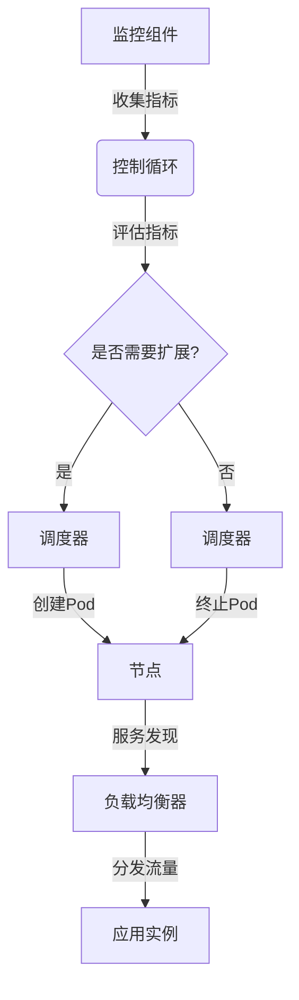

# 容器化部署与弹性伸缩原理与代码实战案例讲解

## 1.背景介绍

### 1.1 传统部署模式的挑战

在传统的软件部署模式中,应用程序通常需要直接安装在物理服务器或虚拟机上。这种方式存在一些固有的挑战:

- **环境依赖**:应用程序可能依赖于特定的操作系统、库版本和其他软件组件。在不同的环境中重现相同的运行条件并不容易。
- **资源浪费**:为了隔离应用程序,通常需要在单个物理服务器上运行多个虚拟机,导致资源利用率低下。
- **可伸缩性差**:手动扩展传统应用程序的能力受到硬件资源的限制,无法实现灵活的弹性伸缩。
- **部署复杂**:应用程序的部署、配置和升级过程通常需要人工介入,效率低下且容易出错。

### 1.2 容器化部署的兴起

为了解决上述挑战,容器化技术(如Docker)应运而生。容器可以将应用程序及其依赖项打包在一个轻量级、可移植的容器镜像中,确保应用程序在不同环境下的一致运行。

容器化部署带来了诸多优势:

- **一致的运行环境**:容器包含应用程序所需的全部依赖项,消除了环境差异带来的问题。
- **资源利用率高**:与虚拟机相比,容器更加轻量级,可在单个主机上运行更多容器,提高资源利用率。
- **快速部署和扩展**:容器镜像可以快速创建和销毁,实现应用程序的快速部署和弹性扩展。
- **DevOps友好**:容器化支持基础设施即代码(IaC)的理念,使得应用程序的构建、测试和部署过程可以自动化。

### 1.3 弹性伸缩的重要性

在现代云原生应用程序中,弹性伸缩是一个关键特性。它允许应用程序根据实际需求动态调整资源,实现以下目标:

- **高可用性**:通过自动扩展,应用程序可以处理突发的高负载,避免服务中断。
- **成本优化**:在低负载时缩减资源,降低运营成本。
- **响应能力**:快速响应负载变化,提供稳定的性能和用户体验。

## 2.核心概念与联系

### 2.1 容器与容器编排

容器是一种轻量级的虚拟化技术,它将应用程序及其依赖项打包在一个独立的、可移植的容器镜像中。容器与宿主操作系统共享内核,因此比传统虚拟机更加轻量级和高效。

然而,在生产环境中,通常需要管理和协调大量容器的部署、扩展、网络和存储等方面。这就需要容器编排工具,如Kubernetes、Docker Swarm等。

容器编排工具提供了以下核心功能:

- **调度**:根据资源需求,将容器调度到合适的节点上运行。
- **服务发现**:自动发现和管理容器之间的网络连接。
- **负载均衡**:自动分发流量到多个容器实例。
- **自动伸缩**:根据预定义的策略,自动扩展或缩减容器实例数量。
- **健康检查**:持续监控容器的健康状态,并自动重启失败的容器。
- **滚动升级**:无中断地升级应用程序版本。

### 2.2 弹性伸缩的类型

弹性伸缩可以分为两种类型:

1. **水平扩展(Scale Out/In)**:通过增加或减少应用程序实例的数量来调整资源。这是最常见的弹性伸缩方式,适用于无状态应用程序。

2. **垂直扩展(Scale Up/Down)**:通过增加或减少单个实例的资源(如CPU、内存等)来调整资源。这种方式适用于有状态应用程序,但受硬件资源的限制。

在容器化环境中,水平扩展是更加常见和推荐的做法,因为它更加灵活、高效,并且可以充分利用容器的轻量级和可移植性。

### 2.3 弹性伸缩的触发条件

弹性伸缩通常由以下条件触发:

- **CPU利用率**:当CPU利用率持续超过预设阈值时,可以触发扩展,以应对高计算负载。
- **内存利用率**:当内存利用率持续超过预设阈值时,可以触发扩展,以防止内存不足。
- **请求率**:当应用程序的请求率持续超过预设阈值时,可以触发扩展,以处理更多的请求。
- **自定义指标**:根据应用程序的特定指标(如队列长度、数据库连接数等)触发扩展或缩减。

这些指标通常由监控系统持续收集和评估,并根据预定义的策略自动执行扩展或缩减操作。

### 2.4 弹性伸缩与微服务架构

在微服务架构中,应用程序被拆分为多个独立的微服务。每个微服务可以独立部署、扩展和管理,从而提高了整体系统的灵活性和可伸缩性。

容器化部署和弹性伸缩为微服务架构提供了坚实的基础:

- 每个微服务可以打包为一个或多个容器镜像,实现独立的构建、测试和部署。
- 容器编排工具可以根据每个微服务的需求,独立地进行弹性伸缩。
-服务发现和负载均衡机制确保微服务之间的通信不受扩展操作的影响。

通过将容器化部署和弹性伸缩与微服务架构相结合,可以构建高度可扩展、灵活且高效的分布式系统。

## 3.核心算法原理具体操作步骤

### 3.1 容器编排中的弹性伸缩原理

在容器编排系统(如Kubernetes)中,弹性伸缩的核心原理如下:

1. **监控组件**持续收集应用程序的指标数据,如CPU、内存利用率、请求率等。

2. **控制循环**定期评估这些指标,并根据预定义的策略(如HorizontalPodAutoscaler)决定是否需要扩展或缩减应用程序实例。

3. **调度器**根据决策,创建或终止容器实例(Pod)。新创建的Pod会被调度到合适的节点上运行。

4. **服务发现**和**负载均衡**机制会自动将流量分发到所有正常运行的Pod实例。

5. **终止Pod**时,其上运行的应用程序实例会被正常关闭,并将连接和状态迁移到其他实例。

该过程是自动化和连续的,以确保应用程序的资源利用率和性能保持在期望的水平。

### 3.2 弹性伸缩的算法

弹性伸缩算法决定了何时以及如何扩展或缩减应用程序实例。常见的算法包括:

1. **基于阈值的算法**:当指标超过预设的上限阈值时扩展,低于下限阈值时缩减。这种算法简单直观,但可能导致资源利用率波动较大。

2. **基于利用率的算法**:根据目标利用率百分比(如50%的CPU利用率)来决定扩展或缩减。这种算法可以更好地控制资源利用率,但需要合理设置目标值。

3. **基于队列理论的算法**:根据请求队列的长度和服务时间来预测所需的实例数量。这种算法可以更好地响应突发流量,但需要准确估计服务时间。

4. **基于机器学习的算法**:利用历史数据和机器学习模型预测未来的资源需求,并提前扩展或缩减实例。这种算法可以更好地适应复杂的负载模式,但需要大量的训练数据和计算资源。

不同的算法适用于不同的场景和需求。在实际应用中,通常会结合多种算法,并根据具体情况进行调整和优化。

### 3.3 自动伸缩的最佳实践

为了有效利用弹性伸缩,需要遵循以下最佳实践:

1. **选择合适的指标**:根据应用程序的特点选择合适的指标,如CPU利用率、内存利用率、请求率等。避免使用单一指标,因为它可能无法准确反映应用程序的实际负载。

2. **设置合理的阈值**:过高或过低的阈值都可能导致不必要的扩展或缩减操作。应该根据实际情况和历史数据来设置合理的阈值。

3. **考虑冷启动时间**:应用程序实例从启动到可以接受流量需要一定的时间。在扩展时,应该考虑这个冷启动时间,以避免新实例无法及时处理流量。

4. **限制最大实例数**:为了控制成本和资源利用率,应该设置最大实例数的限制。当负载持续超过这个限制时,可以考虑其他措施,如流量控制或请求队列。

5. **监控和调整**:持续监控弹性伸缩的效果,并根据实际情况调整策略和参数。这是一个迭代的过程,需要不断优化。

6. **测试和模拟**:在生产环境中部署之前,应该对弹性伸缩策略进行充分的测试和模拟,以验证其正确性和效果。

7. **实现优雅终止**:当实例被终止时,应该确保应用程序能够正常关闭,并将连接和状态迁移到其他实例,以避免数据丢失或服务中断。

通过遵循这些最佳实践,可以最大限度地发挥弹性伸缩的优势,提高应用程序的可伸缩性、可用性和资源利用率。

## 4.数学模型和公式详细讲解举例说明

在弹性伸缩中,数学模型和公式可以帮助我们量化和优化资源利用率、响应时间和成本等关键指标。以下是一些常见的数学模型和公式:

### 4.1 队列理论模型

队列理论模型可以用于分析和优化基于请求队列的弹性伸缩策略。常见的模型包括M/M/n队列模型和M/G/1队列模型。

**M/M/n队列模型**假设:

- 请求到达服从泊松分布,平均到达率为$\lambda$
- 服务时间服从负指数分布,平均服务率为$\mu$
- 有n个并行的服务器(实例)

在稳定状态下,系统的利用率$\rho$可以计算为:

$$\rho = \frac{\lambda}{n\mu}$$

当$\rho < 1$时,队列长度的期望值$L_q$为:

$$L_q = \frac{(n\rho)^n\rho}{n!(1-\rho)^2}\cdot\frac{1}{1-\rho^n}$$

响应时间的期望值$W$为:

$$W = \frac{L_q}{\lambda} + \frac{1}{\mu}$$

根据这些公式,我们可以确定所需的实例数量$n$,以满足特定的响应时间或队列长度要求。

**M/G/1队列模型**假设:

- 请求到达服从泊松分布,平均到达率为$\lambda$
- 服务时间服从一般分布,平均服务率为$\mu$,方差为$\sigma^2$

在稳定状态下,响应时间的期望值$W$为:

$$W = \frac{1}{\mu} + \frac{\lambda\sigma^2}{2(1-\rho)}$$

其中$\rho = \lambda/\mu$是系统的利用率。

这些模型可以帮助我们分析和优化弹性伸缩策略,但也有一些限制和假设,在实际应用中需要进行适当的调整和验证。

### 4.2 成本优化模型

在云环境中,弹性伸缩还需要考虑成本因素。我们可以建立成本优化模型,以最小化总体运营成本。

假设:

- 每个