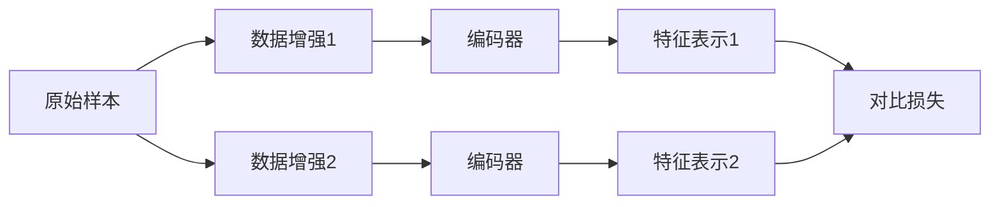

# 对比学习原理与代码实战案例讲解

## 1. 背景介绍
### 1.1 对比学习的起源与发展
对比学习(Contrastive Learning)是近年来机器学习和深度学习领域的一个研究热点。它起源于度量学习(Metric Learning)和表示学习(Representation Learning)。早期的对比学习工作可以追溯到 Hadsell 等人在 2006 年提出的对比损失(Contrastive Loss)。之后，对比学习在无监督学习、自监督学习、few-shot learning 等领域得到了广泛应用。近年来，对比学习在计算机视觉、自然语言处理等领域取得了显著进展，代表性的工作有 MoCo、SimCLR、BYOL、SimSiam 等。

### 1.2 对比学习的优势
对比学习相比传统的有监督学习，具有以下优势：

1. 不需要大量的人工标注数据，可以利用大规模无标注数据进行自监督预训练。
2. 学习到的特征表示更加通用和鲁棒，可以更好地迁移到下游任务。  
3. 可以挖掘数据中的内在结构信息，捕捉样本间的相似性和差异性。

### 1.3 对比学习的应用场景
对比学习在诸多领域都有广泛的应用，包括：

1. 计算机视觉：图像分类、目标检测、语义分割等
2. 自然语言处理：句子表示学习、文本匹配、机器翻译等  
3. 语音识别：说话人验证、语音分离等
4. 推荐系统：用户和物品的表示学习
5. 图表示学习：节点分类、链接预测等

## 2. 核心概念与联系
### 2.1 正样本与负样本
对比学习的核心思想是拉近正样本(positive samples)的距离，推开负样本(negative samples)的距离。那么如何构建正负样本对呢？常见的方式有：

1. 数据增强：对同一个样本施加随机数据增强，生成一对正样本。常见的数据增强包括裁剪、翻转、颜色变换等。
2. 时序数据：将时序数据中的连续片段作为正样本对。
3. 多视图数据：将样本的不同视图作为正样本对，如图像的 RGB 视图和深度视图。

负样本可以从数据集中随机采样得到。

### 2.2 编码器和投影头
对比学习一般采用双塔(Siamese)网络结构，包含两个编码器(Encoder)，用于将输入样本映射为低维特征向量。编码器一般是 CNN 或 Transformer 等神经网络。

在编码器之后一般会接一个投影头(Projection Head)，将特征进一步映射到对比学习的空间中。投影头可以是 MLP。在对比学习完成后，投影头会被丢弃，只使用编码器来提取特征。

### 2.3 对比损失函数 
对比学习的目标是最小化正样本对的距离，最大化负样本对的距离。常用的对比损失函数有：

1. 对比损失(Contrastive Loss): 
$$L = \frac{1}{2N} \sum_{i=1}^N \left( y_i d_i^2 + (1-y_i) \max(0, m-d_i)^2 \right)$$

其中 $d_i$ 是第 $i$ 对样本的距离，$y_i=1$ 表示正样本对，$y_i=0$ 表示负样本对。$m$ 是负样本对的距离边界。

2. 三元组损失(Triplet Loss):
$$L = \max(d_a^p - d_a^n + m, 0)$$

其中 $d_a^p$ 是锚点(anchor)和正样本的距离，$d_a^n$ 是锚点和负样本的距离。$m$ 是正负样本距离的间隔。

3. NT-Xent 损失(Normalized Temperature-scaled Cross Entropy Loss):
$$L = -\log \frac{\exp(\text{sim}(z_i, z_j)/\tau)}{\sum_{k=1}^{2N} \mathbf{1}_{[k \neq i]} \exp(\text{sim}(z_i, z_k)/\tau)}$$

其中 $\text{sim}(z_i, z_j)$ 是正样本对 $(i,j)$ 的余弦相似度，$\tau$ 是温度超参数。

### 2.4 数据增强与不变性
数据增强在对比学习中扮演着重要角色。通过对样本施加随机扰动，可以增加正样本的多样性，提高模型的鲁棒性。同时，我们希望模型学习到对这些扰动保持不变的特征表示。常见的数据增强包括：

- 图像：裁剪、翻转、旋转、颜色变换、高斯模糊等
- 文本：同义词替换、随机删除、句子乱序等

下图展示了对比学习中的数据增强过程：



### 2.5 自监督学习范式
对比学习是自监督学习的一种重要范式。自监督学习旨在从无标注数据中学习有用的特征表示，它不需要人工标注，而是通过设计巧妙的代理任务(pretext task)，让模型自己生成监督信号。对比学习的代理任务就是最小化正样本的距离，最大化负样本的距离。通过这种方式，模型可以学习到数据的内在结构和规律。

## 3. 核心算法原理具体操作步骤
下面以 SimCLR 算法为例，详细讲解对比学习的核心步骤。

### 3.1 数据增强
对每个样本 $x$，生成两个随机增强视图 $\tilde{x}_i$ 和 $\tilde{x}_j$：

$$\tilde{x}_i = t_i(x), \quad \tilde{x}_j = t_j(x)$$

其中 $t_i$ 和 $t_j$ 是随机数据增强算子，包括裁剪、翻转、颜色变换等。

### 3.2 特征提取
将增强后的样本输入编码器 $f$，得到特征表示：

$$h_i = f(\tilde{x}_i), \quad h_j = f(\tilde{x}_j)$$

编码器 $f$ 一般是 CNN 或 Transformer。

### 3.3 特征映射
将特征表示输入投影头 $g$，得到对比学习的表示：

$$z_i = g(h_i), \quad z_j = g(h_j)$$

投影头 $g$ 一般是 MLP，可以包含一到多层。

### 3.4 对比损失计算
使用 NT-Xent 损失函数计算对比损失。对于一个正样本对 $(i,j)$，它的损失为：

$$\ell_{i,j} = -\log \frac{\exp(\text{sim}(z_i, z_j)/\tau)}{\sum_{k=1}^{2N} \mathbf{1}_{[k \neq i]} \exp(\text{sim}(z_i, z_k)/\tau)}$$

其中 $\text{sim}(z_i, z_j) = z_i^\top z_j / (\|z_i\| \|z_j\|)$ 是余弦相似度，$\tau$ 是温度超参数，$N$ 是 batch size。

最终的损失是所有正样本对的损失的平均：

$$L = \frac{1}{2N} \sum_{k=1}^N [\ell_{2k-1,2k} + \ell_{2k,2k-1}]$$

### 3.5 优化与推断
使用梯度下降法优化编码器 $f$ 和投影头 $g$ 的参数，最小化对比损失 $L$。

在推断阶段，只使用编码器 $f$ 来提取特征表示，丢弃投影头 $g$。

## 4. 数学模型和公式详细讲解举例说明
本节详细推导 NT-Xent 损失函数的数学形式，并举例说明。

### 4.1 符号定义
- $x$：原始样本
- $\tilde{x}_i, \tilde{x}_j$：样本 $x$ 的两个随机增强视图
- $h_i, h_j$：$\tilde{x}_i, \tilde{x}_j$ 的特征表示
- $z_i, z_j$：$h_i, h_j$ 的投影表示
- $\text{sim}(z_i, z_j)$：$z_i$ 和 $z_j$ 的余弦相似度
- $\tau$：温度超参数
- $N$：batch size

### 4.2 NT-Xent 损失的推导
对于一对正样本 $(i,j)$，我们希望最大化它们的相似度 $\text{sim}(z_i,z_j)$，同时最小化 $i$ 与其他负样本的相似度 $\text{sim}(z_i,z_k)$。这可以通过最小化以下交叉熵损失实现：

$$\ell_{i,j} = -\log \frac{\exp(\text{sim}(z_i, z_j)/\tau)}{\sum_{k=1}^{2N} \mathbf{1}_{[k \neq i]} \exp(\text{sim}(z_i, z_k)/\tau)}$$

其中，指示函数 $\mathbf{1}_{[k \neq i]}$ 用于排除 $i$ 自身。温度 $\tau$ 用于缩放相似度，控制软最大化的集中程度。

假设 batch size 为 $N$，则共有 $2N$ 个增强视图。我们可以将损失写成矩阵形式：

$$L = -\frac{1}{2N} \sum_{i=1}^{2N} \log \frac{\exp(\text{sim}(z_i, z_{j(i)})/\tau)}{\sum_{k=1}^{2N} \mathbf{1}_{[k \neq i]} \exp(\text{sim}(z_i, z_k)/\tau)}$$

其中 $j(i)$ 表示 $i$ 的正样本索引。如果 $i \in [1,N]$，则 $j(i)=i+N$；如果 $i \in [N+1,2N]$，则 $j(i)=i-N$。

### 4.3 数值例子
假设 batch size $N=2$，温度 $\tau=0.5$。给定 4 个增强视图的特征表示 $\{z_1,z_2,z_3,z_4\}$，它们的余弦相似度矩阵为：

$$\begin{pmatrix} 
1 & 0.2 & 0.8 & 0.3\\
0.2 & 1 & 0.4 & 0.7\\
0.8 & 0.4 & 1 & 0.5\\
0.3 & 0.7 & 0.5 & 1
\end{pmatrix}$$

其中，$(z_1,z_3)$ 和 $(z_2,z_4)$ 是正样本对。

对于 $z_1$，它的损失为：

$$\begin{aligned}
\ell_{1,3} &= -\log \frac{\exp(0.8/0.5)}{\exp(0.2/0.5)+\exp(0.8/0.5)+\exp(0.3/0.5)} \\
&= -\log \frac{4.95}{1.49+4.95+1.82} \\
&= 0.42
\end{aligned}$$

同理可得 $\ell_{2,4}=0.69$，$\ell_{3,1}=0.42$，$\ell_{4,2}=0.69$。

最终的损失为：

$$L = \frac{1}{4} (0.42+0.69+0.42+0.69) = 0.56$$

## 5. 项目实践：代码实例和详细解释说明
下面使用 PyTorch 实现 SimCLR 算法，并在 CIFAR-10 数据集上进行实验。

### 5.1 数据增强
定义数据增强函数 `TransformsSimCLR`：

```python
class TransformsSimCLR:
    def __init__(self, size):
        s = 1
        color_jitter = torchvision.transforms.ColorJitter(
            0.8 * s, 0.8 * s, 0.8 * s, 0.2 * s
        )
        self.train_transform = torchvision.transforms.Compose(
            [
                torchvision.transforms.RandomResizedCrop(size=size),
                torchvision.transforms.RandomHorizontalFlip(),
                torchvision.transforms.RandomApply([color_jitter], p=0.8),
                torchvision.transforms.RandomGrayscale(p=0.2),
                torchvision.transforms.ToTensor(),
            ]
        )

    def __call__(self, x):
        return self.train_transform(x), self.train_transform(x)
```

### 