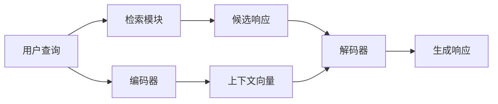

# 对话系统(Chatbots) - 原理与代码实例讲解

## 1. 背景介绍

### 1.1 什么是对话系统?

对话系统(Chatbots)是一种基于自然语言处理(NLP)和机器学习技术的计算机程序,旨在与人类进行类似人与人之间的自然语言对话交互。它们可以理解人类的输入(文本或语音),并提供相关和上下文的响应。

### 1.2 对话系统的重要性

随着人工智能技术的快速发展,对话系统正在渗透到各个领域,为用户提供无缝的交互体验。它们可以应用于客户服务、个人助理、教育、医疗保健等多个领域,极大地提高了工作效率和用户体验。

### 1.3 对话系统的发展历程

早期的对话系统主要基于规则和模板,如ELIZA和PARRY。随着机器学习和深度学习技术的兴起,对话系统逐渐转向基于数据驱动的方法,如检索式、生成式和混合式等模型。近年来,预训练语言模型(如GPT、BERT)的出现进一步推动了对话系统的发展。

## 2. 核心概念与联系

### 2.1 自然语言处理(NLP)

自然语言处理是对话系统的核心技术,包括多个子任务,如词法分析、句法分析、语义分析、对话管理等。这些技术使对话系统能够理解和生成自然语言。

### 2.2 机器学习和深度学习

机器学习和深度学习是对话系统中广泛应用的技术,用于从数据中学习模型,提高系统的性能和泛化能力。常用的模型包括序列到序列模型、注意力机制、transformer等。

### 2.3 知识库和知识图谱

对话系统通常需要一个知识库或知识图谱来存储相关信息,以便回答用户的查询或进行推理。知识库可以是结构化的(如数据库)或非结构化的(如文本文档)。

### 2.4 对话管理

对话管理是对话系统的核心组件,负责跟踪对话状态、理解用户意图、选择合适的响应策略等。常用的方法包括基于规则的系统、基于框架的系统和端到端的神经对话系统。

## 3. 核心算法原理具体操作步骤

### 3.1 序列到序列模型

序列到序列模型是对话系统中常用的生成式模型,它将输入序列(如用户查询)映射到输出序列(如系统响应)。常用的模型包括RNN、LSTM、GRU和Transformer等。

#### 3.1.1 编码器-解码器架构

编码器将输入序列编码为上下文向量,解码器根据上下文向量生成输出序列。


#### 3.1.2 注意力机制

注意力机制允许模型在生成每个输出时关注输入序列的不同部分,提高了模型的性能和解释能力。


#### 3.1.3 Transformer模型

Transformer是一种基于注意力机制的序列到序列模型,它完全放弃了RNN结构,使用多头自注意力和位置编码来捕获序列中的长程依赖关系。


### 3.2 检索式模型

检索式模型从预先构建的响应库中检索最相关的响应,而不是生成新的响应。常用的方法包括基于规则的模式匹配、基于向量空间模型的相似度匹配等。


### 3.3 混合模型

混合模型结合了生成式和检索式模型的优点,通常包括一个检索模块和一个生成模块。检索模块从响应库中检索相关响应,生成模块根据检索结果和上下文生成最终响应。



### 3.4 对话管理

对话管理模块负责跟踪对话状态、理解用户意图、选择合适的响应策略等。常用的方法包括基于规则的有限状态机、基于框架的模型等。


## 4. 数学模型和公式详细讲解举例说明

### 4.1 序列到序列模型

序列到序列模型的目标是最大化条件概率 $P(Y|X)$,即给定输入序列 $X$,生成最可能的输出序列 $Y$。

$$P(Y|X) = \prod_{t=1}^{T_y} P(y_t|y_{<t}, X)$$

其中 $T_y$ 是输出序列的长度, $y_{<t}$ 表示输出序列的前 $t-1$ 个token。

#### 4.1.1 编码器-解码器架构

编码器将输入序列 $X=(x_1, x_2, ..., x_{T_x})$ 映射为上下文向量 $c$:

$$h_t = f(x_t, h_{t-1})$$
$$c = q(h_1, h_2, ..., h_{T_x})$$

其中 $f$ 是递归函数(如RNN或LSTM), $q$ 是编码器的输出函数。

解码器根据上下文向量 $c$ 和前一个输出 $y_{t-1}$ 生成下一个输出 $y_t$:

$$p(y_t|y_{<t}, c) = g(y_{t-1}, s_t, c)$$

其中 $g$ 是解码器的输出函数, $s_t$ 是解码器的隐藏状态。

#### 4.1.2 注意力机制

注意力机制为每个输出 $y_t$ 计算一个上下文向量 $c_t$,作为编码器隐藏状态的加权和:

$$c_t = \sum_{j=1}^{T_x} \alpha_{tj} h_j$$

其中 $\alpha_{tj}$ 是注意力权重,表示输出 $y_t$ 对输入 $x_j$ 的关注程度。注意力权重通过以下公式计算:

$$\alpha_{tj} = \frac{\exp(e_{tj})}{\sum_{k=1}^{T_x} \exp(e_{tk})}$$
$$e_{tj} = a(s_{t-1}, h_j)$$

其中 $a$ 是注意力评分函数,可以是加性或点积注意力等。

解码器根据上下文向量 $c_t$ 和前一个输出 $y_{t-1}$ 生成下一个输出 $y_t$:

$$p(y_t|y_{<t}, c_t) = g(y_{t-1}, s_t, c_t)$$

#### 4.1.3 Transformer模型

Transformer模型使用多头自注意力机制来捕获输入序列中的长程依赖关系。对于每个位置 $i$,计算注意力权重:

$$\text{Attention}(Q, K, V) = \text{softmax}(\frac{QK^T}{\sqrt{d_k}})V$$

其中 $Q$、$K$、$V$ 分别是查询(Query)、键(Key)和值(Value)矩阵,通过线性变换从输入序列得到。$d_k$ 是缩放因子。

多头注意力将多个注意力头的结果拼接:

$$\text{MultiHead}(Q, K, V) = \text{Concat}(head_1, ..., head_h)W^O$$
$$\text{where } head_i = \text{Attention}(QW_i^Q, KW_i^K, VW_i^V)$$

其中 $W_i^Q$、$W_i^K$、$W_i^V$ 和 $W^O$ 是可学习的线性变换矩阵。

### 4.2 检索式模型

检索式模型的目标是从响应库 $\mathcal{R}$ 中找到与用户查询 $q$ 最相关的响应 $r^*$:

$$r^* = \arg\max_{r \in \mathcal{R}} \text{score}(q, r)$$

常用的相似度评分函数包括余弦相似度、内积等。

对于基于向量空间模型的检索,首先需要将查询 $q$ 和响应 $r$ 映射到向量空间:

$$q \rightarrow \vec{q}, r \rightarrow \vec{r}$$

然后计算它们之间的相似度得分:

$$\text{score}(q, r) = \text{sim}(\vec{q}, \vec{r})$$

其中 $\text{sim}$ 可以是余弦相似度或其他相似度函数。

### 4.3 混合模型

混合模型结合了生成式和检索式模型的优点。生成模块的目标是最大化条件概率 $P(Y|X, R)$,即给定输入序列 $X$ 和检索响应 $R$,生成最可能的输出序列 $Y$。

$$P(Y|X, R) = \prod_{t=1}^{T_y} P(y_t|y_{<t}, X, R)$$

生成模块通常采用序列到序列架构,但需要将检索响应 $R$ 也作为输入。

## 5. 项目实践:代码实例和详细解释说明

### 5.1 序列到序列模型实现

以下是使用PyTorch实现的基于Transformer的序列到序列模型示例:

```python
import torch
import torch.nn as nn

class TransformerEncoder(nn.Module):
    # 编码器实现...

class TransformerDecoder(nn.Module):
    # 解码器实现...

class Transformer(nn.Module):
    def __init__(self, src_vocab_size, tgt_vocab_size, d_model, nhead, num_encoder_layers, num_decoder_layers):
        super().__init__()
        self.encoder = TransformerEncoder(src_vocab_size, d_model, nhead, num_encoder_layers)
        self.decoder = TransformerDecoder(tgt_vocab_size, d_model, nhead, num_decoder_layers)

    def forward(self, src, tgt, src_mask=None, tgt_mask=None):
        enc_output = self.encoder(src, src_mask)
        dec_output = self.decoder(tgt, enc_output, tgt_mask, src_mask)
        return dec_output
```

在训练过程中,我们需要准备数据,构建掩码矩阵,计算损失函数并进行优化。以下是一个简化的训练循环示例:

```python
criterion = nn.CrossEntropyLoss()
optimizer = torch.optim.Adam(model.parameters())

for epoch in range(num_epochs):
    for src, tgt in data_loader:
        src_mask, tgt_mask = create_masks(src, tgt)
        output = model(src, tgt, src_mask, tgt_mask)
        loss = criterion(output.view(-1, tgt_vocab_size), tgt.view(-1))
        
        optimizer.zero_grad()
        loss.backward()
        optimizer.step()
```

在推理过程中,我们可以使用贪心搜索或beam search等策略生成响应:

```python
def greedy_decode(model, src, src_mask, max_len, start_symbol, end_symbol):
    enc_output = model.encoder(src, src_mask)
    ys = torch.ones(1, 1).fill_(start_symbol).type_as(src.data)
    for i in range(max_len-1):
        out = model.decoder(ys, enc_output, None, src_mask)
        prob = out[:, -1]
        _, next_word = torch.max(prob, dim=1)
        next_word = next_word.item()
        ys = torch.cat([ys, torch.ones(1, 1).type_as(src.data).fill_(next_word)], dim=1)
        if next_word == end_symbol:
            break
    return ys
```

### 5.2 检索式模型实现

以下是一个基于TF-IDF和余弦相似度的简单检索式模型实现:

```python
from sklearn.feature_extraction.text import TfidfVectorizer
import numpy as np

class TfidfRetriever:
    def __init__(self, responses):
        self.responses