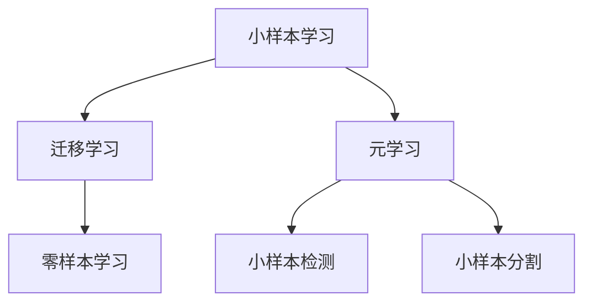

# 小样本图像分类：精准识别有限样本

## 1. 背景介绍

### 1.1 图像分类的重要性

在当今数字时代,图像数据无处不在,从社交媒体上的个人照片到医疗影像诊断,从自动驾驶汽车的环境感知到工业缺陷检测,图像分类技术都扮演着关键角色。准确高效的图像分类可以为各种应用带来巨大价值,提升用户体验、优化业务流程、确保安全等。

### 1.2 小样本学习的挑战

然而,传统的图像分类方法通常需要大量标注数据进行训练,这在某些领域可能是无法满足的,比如:

- 医疗影像诊断:某些罕见疾病缺乏足够的病例数据
- 濒危物种保护:稀有生物种类缺乏充足的图像样本  
- 工业缺陷检测:新产品上市初期缺陷图像数据有限

这种数据贫乏的情况被称为小样本学习(Few-Shot Learning),给图像分类带来了巨大挑战。在小样本场景下,如何有效利用有限的数据,快速学习新类别,实现准确分类,成为亟需解决的关键问题。

## 2. 核心概念与联系

### 2.1 小样本学习

小样本学习旨在利用少量标注样本(通常小于30个),快速学习新类别的判别模型。它与传统的大数据驱动的监督学习形成鲜明对比,需要开发新的算法思路和模型架构。

### 2.2 迁移学习

迁移学习(Transfer Learning)是小样本学习的基础,它利用在大规模数据集上预训练的模型,将学习到的知识迁移到新的小样本任务中,加速新类别的学习过程。

### 2.3 元学习

元学习(Meta Learning)是小样本学习的核心,它通过在多个任务上学习"如何快速学习",获取一种通用的学习能力,从而能在新的小样本任务上快速适应。

### 2.4 小样本学习与其他任务的关系

小样本学习与其他任务存在密切联系:

- 零样本学习(Zero-Shot Learning):无需任何示例,完全基于类别语义信息进行分类
- 小样本检测(Few-Shot Object Detection): 在有限样本下实现目标检测
- 小样本分割(Few-Shot Segmentation):在有限样本下实现像素级语义分割



## 3. 核心算法原理具体操作步骤  

### 3.1 基于迁移学习的小样本分类

这种方法利用在大型数据集(如ImageNet)上预训练的深度卷积神经网络(如VGGNet、ResNet等),将其作为特征提取器。然后在小样本数据上进行简单的fine-tuning或训练一个新的分类头,实现新类别的分类。

算法步骤:

1. 选择合适的预训练模型,如ResNet50
2. 在小样本数据上fine-tune全部或部分层
3. 添加新的全连接分类头
4. 在小样本数据上训练分类头
5. 评估新类别的分类性能

这种方法简单有效,但受限于预训练模型的知识,可能难以充分利用小样本数据的特征。

### 3.2 基于元学习的小样本分类

这种方法通过在大量任务上学习"如何快速学习",获取一种通用的学习能力,从而能在新的小样本任务上快速适应。主流的元学习方法包括:

1. **基于优化的元学习(Optimization-Based)**
    - 模型蒸馏(Model-Agnostic Meta-Learning, MAML)
    - 基于梯度的元学习(Meta-SGD)
    - 在线显式快速权重生成(LEO)

2. **基于度量的元学习(Metric-Based)** 
    - 匹配网络(Matching Networks)
    - 原型网络(Prototypical Networks)
    - 关系网络(Relation Networks)

3. **基于生成模型的元学习(Generation-Based)**
    - 记忆增强模型(Memory-Augmented Neural Networks)
    - 生成对抗网络(Generative Adversarial Networks)

这些方法通过设计特殊的训练方式和损失函数,使模型能够快速适应新的小样本任务。算法步骤因具体方法而异,但通常包括以下步骤:

1. 构建元学习的训练集(包含多个任务)
2. 采用特定的元学习算法进行训练
3. 在新的小样本任务上进行快速适应
4. 评估新类别的分类性能

基于元学习的方法通常比基于迁移学习的方法更加灵活和通用,能更好地利用小样本数据,但训练过程更加复杂。

### 3.3 融合迁移学习和元学习

为了结合两种方法的优势,一些研究工作尝试将迁移学习和元学习相结合,形成混合方法。典型的做法是:

1. 使用在大型数据集上预训练的模型作为特征提取器
2. 在小样本数据上使用元学习算法进行快速适应
3. 在新的小样本任务上进行分类

这种方法结合了迁移学习的高效特征提取能力和元学习的快速适应能力,通常能取得较好的分类性能。

## 4. 数学模型和公式详细讲解举例说明

小样本图像分类中涉及到多种数学模型和公式,下面将详细讲解其中几个核心部分。

### 4.1 原型网络(Prototypical Networks)

原型网络是一种基于度量的元学习方法,其核心思想是将每个类别用一个原型向量(prototype)表示,然后通过计算查询样本与原型向量之间的距离来进行分类。

给定一个包含 $C$ 个类别的小样本任务,对于每个类别 $c$,我们有一个支持集 $S_c = \{x_1^c, x_2^c, ..., x_k^c\}$,其中 $k$ 是每个类别的样本数量(通常很小,如1或5)。我们定义每个类别的原型向量为:

$$\boldsymbol{p}_c = \frac{1}{k}\sum_{i=1}^{k}f_{\phi}(x_i^c)$$

其中 $f_{\phi}$ 是一个编码器网络(如CNN),用于将输入图像 $x$ 映射到一个embedding空间中的向量。

对于一个新的查询样本 $x_q$,我们计算它与每个原型向量之间的距离(如欧几里得距离或余弦距离),并将其分配到距离最近的类别:

$$\hat{y}_q = \arg\min_{c} d(f_{\phi}(x_q), \boldsymbol{p}_c)$$

在训练过程中,我们最小化所有查询样本的交叉熵损失,从而学习一个良好的embedding空间,使得相同类别的样本聚集在一起,不同类别的样本分开。

原型网络的优点是简单高效,能够直接从少量数据中学习判别模型。但它也存在一些局限性,如对异常值敏感、难以捕捉类内变化等。

### 4.2 模型蒸馏(Model-Agnostic Meta-Learning, MAML)

MAML是一种基于优化的元学习方法,其核心思想是直接从多个任务的优化过程中学习一个良好的初始化参数,使得在新任务上只需少量梯度更新即可获得良好的性能。

具体而言,对于一个包含多个任务的元训练集 $p(\mathcal{T})$,我们定义一个模型 $f_{\theta}$ 参数化,其中 $\theta$ 是需要学习的参数。在每个任务 $\mathcal{T}_i$ 上,我们有一个支持集 $\mathcal{D}_i^{tr}$ 和一个查询集 $\mathcal{D}_i^{val}$。我们首先在支持集上进行 $k$ 步梯度更新:

$$\theta_i' = \theta - \alpha \nabla_{\theta}\mathcal{L}_{\mathcal{T}_i}(f_{\theta}, \mathcal{D}_i^{tr})$$

其中 $\alpha$ 是学习率, $\mathcal{L}_{\mathcal{T}_i}$ 是任务 $\mathcal{T}_i$ 上的损失函数。

然后,我们在查询集 $\mathcal{D}_i^{val}$ 上评估更新后的模型 $f_{\theta_i'}$,并计算查询损失 $\mathcal{L}_{\mathcal{T}_i}(f_{\theta_i'}, \mathcal{D}_i^{val})$。我们的目标是最小化所有任务的查询损失的总和:

$$\min_{\theta}\sum_{\mathcal{T}_i \sim p(\mathcal{T})} \mathcal{L}_{\mathcal{T}_i}(f_{\theta_i'}, \mathcal{D}_i^{val})$$

通过在大量任务上进行上述优化,我们可以获得一个良好的初始化参数 $\theta$,使得在新的小样本任务上,只需少量梯度更新即可快速适应。

MAML的优点是能够直接从优化过程中学习,获得一种通用的快速适应能力。但它也存在一些局限性,如计算开销较大、对任务分布敏感等。

### 4.3 关系网络(Relation Networks)

关系网络是一种基于度量的元学习方法,其核心思想是直接学习一个关系模块,用于测量一对样本之间的相似性,从而实现分类。

给定一个包含 $C$ 个类别的小样本任务,对于每个类别 $c$,我们有一个支持集 $S_c = \{x_1^c, x_2^c, ..., x_k^c\}$。我们定义一个关系模块 $g_{\phi}$,它接受一对样本 $(x, x')$ 作为输入,输出一个标量值 $g_{\phi}(x, x')$,表示这两个样本之间的相似性。

对于一个新的查询样本 $x_q$,我们计算它与每个支持集样本之间的相似性得分:

$$r_c(x_q) = \sum_{x_i^c \in S_c} g_{\phi}(x_q, x_i^c)$$

然后,我们将查询样本 $x_q$ 分配到得分最高的类别:

$$\hat{y}_q = \arg\max_{c} r_c(x_q)$$

在训练过程中,我们最小化所有查询样本的交叉熵损失,从而学习一个良好的关系模块 $g_{\phi}$,使得相同类别的样本对之间的相似性得分较高,不同类别的样本对之间的相似性得分较低。

关系网络的优点是能够直接学习样本之间的关系,捕捉更加细微的差异。但它也存在一些局限性,如计算开销较大、对支持集的选择敏感等。

通过上述数学模型和公式,我们可以看到小样本图像分类算法的核心思想和原理。这些方法通过巧妙的设计,能够在有限的数据下快速学习新类别的判别模型,实现精准分类。

## 5. 项目实践:代码实例和详细解释说明

为了更好地理解小样本图像分类算法,我们将通过一个实际的代码示例来演示如何使用PyTorch实现原型网络(Prototypical Networks)。

### 5.1 数据准备

我们将使用一个小型的图像数据集 `omniglot`,它包含来自不同字母表的手写字符图像。我们将把它作为一个小样本学习的任务,尝试从有限的字符样本中学习新的字母表。

```python
from torchvision.datasets import Omniglot
import torchvision.transforms as transforms

# 定义数据转换
data_transform = transforms.Compose([
    transforms.Resize(28),
    transforms.ToTensor(),
    transforms.Normalize(mean=[0.5], std=[0.5])
])

# 加载数据集
dataset = Omniglot(root='data', download=True, transform=data_transform)
```

### 5.2 原型网络实现

我们将实现一个简单的原型网络模型,包括一个编码器网络和原型计算逻辑。

```python
import torch
import torch.nn as nn
import torch.nn.functional as F

class Encoder(nn.Module):
    def __init__(self):
        super(Encoder, self).__init__()
        self.conv1 = nn.Conv2d(1, 64, 3, padding=1)
        self.bn1 = nn.BatchNorm2d(64)
        