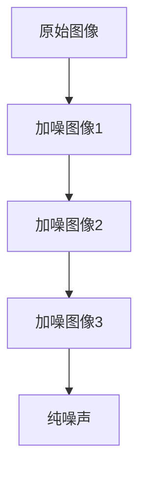
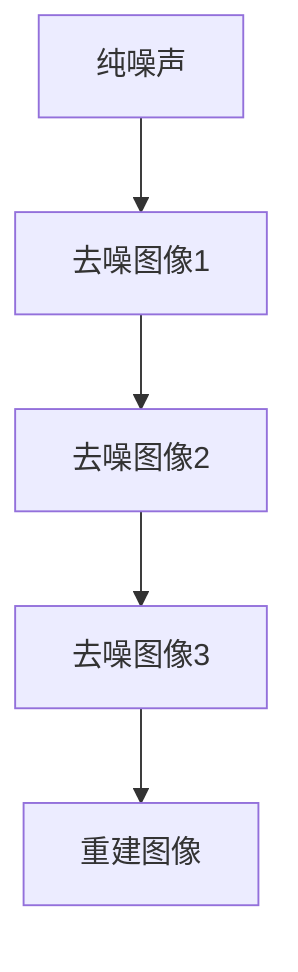
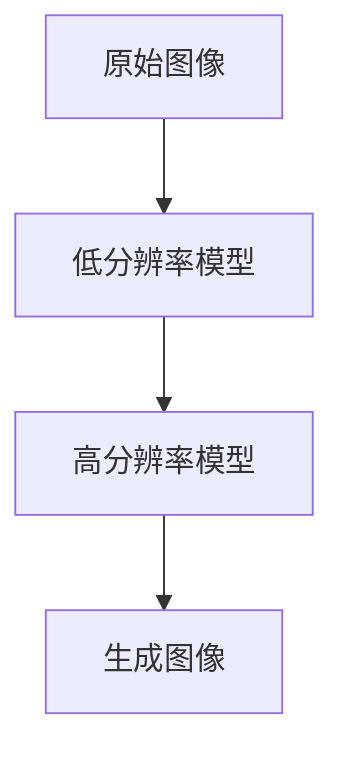

# 小样本扩散模型:几张图片就能训练出强大的生成器

## 1.背景介绍

### 1.1 生成式人工智能的兴起

近年来,生成式人工智能(Generative AI)在各个领域掀起了热潮。生成式AI系统能够基于输入数据生成全新的、高质量的内容,如图像、音频、视频和文本等。这种能力为人工智能带来了前所未有的创新应用,并极大推动了相关技术的发展。

### 1.2 生成式AI的挑战

然而,训练一个高质量的生成式AI模型通常需要大量的高质量数据。以图像生成为例,传统的生成对抗网络(Generative Adversarial Networks, GANs)和变分自编码器(Variational Autoencoders, VAEs)需要数十万甚至数百万张图像作为训练数据。收集和标注这些数据不仅成本高昂,而且对于某些专业领域(如医疗影像)也存在隐私和安全方面的顾虑。

### 1.3 小样本学习的重要性

针对上述挑战,小样本学习(Few-Shot Learning)应运而生。小样本学习旨在使AI系统能够仅从少量示例数据中学习,并在新的、看似不相关的任务上表现出色。这种能力对于降低数据需求、提高模型泛化性和隐私保护至关重要。

## 2.核心概念与联系

### 2.1 扩散模型(Diffusion Models)

扩散模型是一种新兴的生成式深度学习模型,近年来在图像、音频和视频生成等任务中取得了卓越的成绩。与GANs和VAEs不同,扩散模型采用了一种全新的生成过程。

#### 2.1.1 扩散过程

扩散过程是一个由若干个高斯噪声模型组成的马尔可夫链,旨在将一个清晰的数据点(如图像)逐步破坏为纯噪声。具体来说,在每一步,原始数据会被加性高斯噪声污染,并且噪声的方差会逐步增大。经过足够多的步骤后,原始数据将完全被破坏,只剩下纯噪声。

#### 2.1.2 反扩散过程

反扩散过程则是扩散过程的逆过程。给定一个纯噪声输入,反扩散模型的目标是通过逐步去噪,最终重建出原始的清晰数据。与扩散过程形成马尔可夫链的对应,反扩散过程也由若干个条件模型组成。每个条件模型的任务是预测当前的去噪步骤应该如何进行,以最大程度地逼近原始数据。

通过上述两个相反的过程,扩散模型能够高效地学习复杂的数据分布,并生成高质量的样本。

### 2.2 小样本学习与扩散模型

传统的扩散模型需要大量的训练数据来学习数据分布。然而,最新的研究表明,通过一些改进,扩散模型可以在小样本数据集上实现出色的性能。这使得扩散模型成为小样本学习的有力工具。

常见的小样本扩散模型方法包括:

- 元学习(Meta-Learning):在大量任务上预训练一个通用的初始化模型,然后在新的小样本任务上进行少量fine-tuning。
- 数据增强(Data Augmentation):通过各种技术(如裁剪、旋转等)人工扩充小样本数据集的规模。
- 正则化(Regularization):使用特殊的损失函数或网络结构,提高模型在小样本数据上的泛化能力。

上述方法使得扩散模型能够从仅有的少量示例中高效地学习,为小样本生成任务提供了强大的解决方案。

## 3.核心算法原理具体操作步骤

### 3.1 基本扩散模型

我们首先介绍基本的扩散模型算法。假设我们有一个数据分布 $x_0 \sim q(x_0)$,我们的目标是从该分布中学习并生成新样本。为此,我们定义一个由 $T$ 个高斯噪声模型组成的马尔可夫链:

$$
q(x_t|x_{t-1}) = \mathcal{N}(x_t;\sqrt{1-\beta_t}x_{t-1},\beta_tI)
$$

其中 $\beta_1,\ldots,\beta_T$ 是一个预先设定的方差序列。通过从 $x_0 \sim q(x_0)$ 开始,重复采样上述过渡核 $T$ 次,我们最终会得到一个纯噪声样本 $x_T$。这个过程被称为扩散(diffusion)或者噪声注入(noise injection)过程。

为了从噪声中恢复原始数据,我们定义一个反过来的过程,称为反扩散(denoising)过程。具体来说,我们训练一个序列 $p_\theta(x_{t-1}|x_t)$ 的条件模型,使其能够基于当前的噪声数据 $x_t$ 预测上一步的数据 $x_{t-1}$。从 $x_T \sim \mathcal{N}(0,I)$ 开始,通过 $T$ 次迭代地采样 $p_\theta(x_{t-1}|x_t)$,我们最终能够得到一个新的数据样本 $\tilde{x}_0$,它应当接近于原始的数据分布 $q(x_0)$。

上述过程可以用下面的公式总结:

$$
\begin{align*}
q(x_0) &\xrightarrow{\text{扩散}} q(x_T) = \mathcal{N}(0,I) \\
q(x_T) &\xrightarrow{\text{反扩散}} \tilde{x}_0 \approx q(x_0)
\end{align*}
$$

在训练过程中,我们最小化 $x_0$ 和 $\tilde{x}_0$ 之间的负对数似然,即:

$$
\mathcal{L}_\text{simple}(\theta) = \mathbb{E}_{x_0,\epsilon} \big[\lVert \epsilon - \epsilon_\theta(x_0 + \sigma\epsilon, \sigma) \rVert_2^2\big]
$$

其中 $\epsilon_\theta$ 是我们要学习的反扩散模型,用于从加噪数据 $x_0 + \sigma\epsilon$ 中预测噪声 $\epsilon$。$\sigma$ 是一个预先设定的常量序列。

通过上述训练,我们得到了一个能够从纯噪声中生成新样本的反扩散模型 $\epsilon_\theta$。该模型的生成质量在很大程度上取决于扩散过程的设计、训练目标的选择以及模型结构等多方面因素。

### 3.2 改进的扩散模型

基本的扩散模型存在一些缺陷,如训练不稳定、生成质量有限等。研究人员提出了多种改进方法,使得扩散模型在小样本场景下能够发挥更好的性能。

#### 3.2.1 级联扩散模型(Cascaded Diffusion Models)

级联扩散模型将整个扩散-反扩散过程分为多个阶段,每个阶段负责处理不同的频率信息。具体来说,我们首先训练一个低分辨率的扩散模型,用于捕获图像的粗略结构。然后在该模型的基础上,我们再训练一个高分辨率的扩散模型,以补充细节信息。通过级联多个模型,我们能够更高效地建模复杂的数据分布。

#### 3.2.2 条件扩散模型(Conditional Diffusion Models)

条件扩散模型引入了条件信息(如类别标签、文本描述等),使得生成过程能够受到来自其他模态的指导。在训练时,我们最小化条件负对数似然:

$$
\mathcal{L}_\text{cond}(\theta) = \mathbb{E}_{x_0,c,\epsilon} \big[\lVert \epsilon - \epsilon_\theta(x_0 + \sigma\epsilon, \sigma, c) \rVert_2^2\big]
$$

其中 $c$ 是条件信息。通过条件扩散模型,我们能够生成满足特定条件的图像,如"一只跳跃的狗"、"一幅水彩风景画"等。

#### 3.2.3 适应性扩散模型(Adaptive Diffusion Models)

适应性扩散模型通过改变扩散过程中的噪声方差序列 $\beta_1,\ldots,\beta_T$,使得模型能够更好地适应不同的数据集。具体来说,我们将方差序列也作为可学习的参数,并在训练过程中共同优化。这使得扩散过程能够自适应地匹配数据的统计特性,从而提高生成质量。

$$
\beta_1^*,\ldots,\beta_T^* = \arg\min_{\beta_1,\ldots,\beta_T} \mathcal{L}(\theta^*,\beta_1,\ldots,\beta_T)
$$

其中 $\theta^*$ 是在固定的 $\beta_1,\ldots,\beta_T$ 下优化得到的反扩散模型参数。

通过上述改进,扩散模型的性能得到了大幅提升,尤其是在小样本数据集上。下面我们将具体介绍如何将扩散模型应用于小样本图像生成任务。

## 4.数学模型和公式详细讲解举例说明

在小样本图像生成任务中,我们通常只有少量的图像示例(如5~50张),希望从中学习一个强大的生成模型。传统的生成方法如GANs和VAEs在这种情况下往往表现不佳,因为它们需要大量的训练数据来捕获复杂的数据分布。相比之下,扩散模型凭借其独特的生成过程,在小样本场景下展现了优异的性能。

### 4.1 小样本扩散模型

我们以最新的LADE(Latent Diffusion Energy-Based Model)为例,介绍小样本扩散模型的数学原理。LADE将扩散模型与能量模型(Energy-Based Model)相结合,从而能够在极少量的数据上学习高质量的生成器。

#### 4.1.1 能量模型

能量模型是一种基于统计物理学的无监督学习框架。给定一个数据分布 $p_\text{data}(x)$,能量模型的目标是学习一个能量函数 $E_\theta(x)$,使得:

$$
p_\theta(x) \propto \exp(-E_\theta(x))
$$

也就是说,能量函数为数据分布指定了一个参数化的概率密度。通过最大化能量模型的似然函数或最小化对比散度(Contrastive Divergence),我们能够得到拟合数据分布的能量函数 $E_\theta(x)$。

然而,传统的能量模型存在一些缺陷,如计算复杂度高、难以生成高质量样本等。LADE通过与扩散模型相结合,很好地解决了这些问题。

#### 4.1.2 LADE模型

LADE模型由两部分组成:一个扩散模型 $p_\phi(x_t|x_{t-1})$ 和一个能量模型 $E_\theta(x_0)$。其中扩散模型负责从噪声中生成粗糙的初始样本,而能量模型则通过对这些初始样本进行打分和采样,获得高质量的最终输出。

具体来说,给定少量的训练数据 $\{x_i\}_{i=1}^N$,我们首先使用扩散模型生成一批初始样本 $\{\tilde{x}_i\}_{i=1}^M$。然后,我们最小化下面的损失函数,同时优化扩散模型参数 $\phi$ 和能量模型参数 $\theta$:

$$
\mathcal{L}(\phi,\theta) = \mathbb{E}_{x \sim p_\text{data}}\big[E_\theta(x)\big] - \mathbb{E}_{\tilde{x} \sim p_\phi}\big[\log p_\phi(\tilde{x}) - E_\theta(\tilde{x})\big]
$$

其中第一项是训练数据在能量模型下