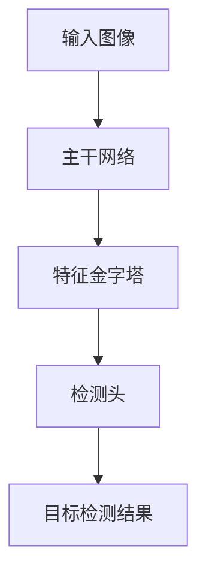
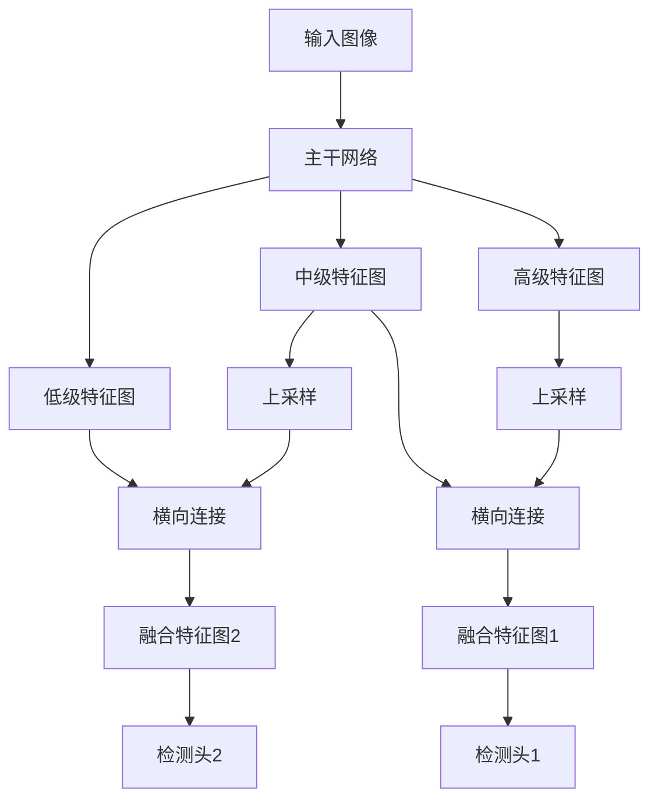
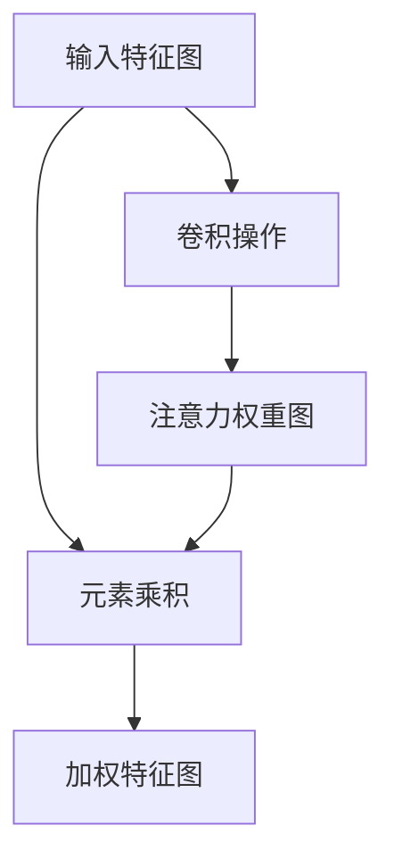

# 小目标无所遁形:YOLOv8小目标检测能力解密

## 1.背景介绍

### 1.1 目标检测任务的重要性

在计算机视觉领域,目标检测是一项基础且广泛应用的任务。它旨在从图像或视频中定位并识别出感兴趣的目标对象。目标检测技术已广泛应用于安全监控、自动驾驶、机器人视觉等诸多领域,对于保障公共安全、提高生产效率等具有重要意义。

### 1.2 小目标检测的挑战

尽管目标检测技术取得了长足进步,但对于小目标的检测仍然是一大挑战。小目标指的是在图像或视频中占据较小像素区域的目标对象,例如远处的行人、车辆等。由于小目标的分辨率较低、特征不明显,很容易被忽视或与背景混淆,导致检测精度下降。

### 1.3 YOLOv8算法的创新

为了更好地解决小目标检测问题,YOLOv8算法在其前身YOLOv7的基础上,针对小目标检测做出了多方面的创新和改进,提升了对小目标的检测能力。本文将重点解析YOLOv8在小目标检测方面的核心技术,为读者揭开这一算法的神秘面纱。

## 2.核心概念与联系

### 2.1 YOLOv8算法概述

YOLOv8是一种基于单阶段的目标检测算法,它将目标检测任务转化为回归问题,直接从图像像素预测目标边界框和类别概率。相比传统的两阶段目标检测算法,YOLOv8具有更高的inference速度和更好的实时性能。

### 2.2 特征金字塔结构

为了同时检测不同尺度的目标,YOLOv8采用了特征金字塔结构。它利用不同尺度的特征图来预测不同大小的目标边界框,从而提高了对大小目标的检测能力。



### 2.3 注意力机制

注意力机制是YOLOv8的一大核心创新点。通过引入注意力模块,算法能够自适应地关注图像中的重要区域,从而提高对小目标的检测精度。

### 2.4 数据增强策略

数据增强是提升目标检测模型性能的关键手段之一。YOLOv8采用了多种数据增强策略,包括旋转、平移、缩放等,从而增强了模型对小目标的鲁棒性。

## 3.核心算法原理具体操作步骤  

### 3.1 特征金字塔网络(FPN)

YOLOv8采用了改进的特征金字塔网络(FPN)结构,以获取多尺度的特征图。具体步骤如下:

1. 输入图像经过主干网络(如ResNet、EfficientNet等)提取特征,得到不同尺度的特征图。
2. 利用上采样(Upsampling)和横向连接(Lateral Connection)操作,将低级特征图与高级特征图融合,构建特征金字塔。
3. 在每个尺度的特征图上预测目标边界框和类别概率,从而实现多尺度目标检测。



### 3.2 注意力模块

YOLOv8引入了注意力模块,以提高对小目标的检测能力。注意力模块的工作原理如下:

1. 通过卷积操作,从输入特征图中生成注意力权重图。
2. 将注意力权重图与输入特征图逐元素相乘,得到加权后的特征图。
3. 加权特征图能够自适应地关注图像中的重要区域,从而增强对小目标的响应。



### 3.3 数据增强策略

YOLOv8采用了多种数据增强策略,以增强模型对小目标的鲁棒性。主要包括:

1. **几何变换**: 如旋转、平移、缩放等,模拟不同视角和尺度。
2. **颜色空间增强**: 如亮度调整、对比度调整、色彩抖动等,模拟不同光照条件。
3. **遮挡增强**: 在图像中随机添加矩形或椭圆遮挡块,模拟部分遮挡情况。
4. **混合增强**: 将两张图像按一定比例混合,生成新的训练样本。

通过上述数据增强策略,YOLOv8模型在训练阶段接触到更多样化的数据,从而提高了对小目标的泛化能力。

## 4.数学模型和公式详细讲解举例说明

### 4.1 特征金字塔网络(FPN)

在FPN中,不同尺度的特征图通过上采样和横向连接操作进行融合。设$F_l$表示第$l$层的特征图,则第$l$层融合后的特征图$P_l$可表示为:

$$P_l = \text{Conv}(U(P_{l+1}) + F_l)$$

其中,$U(\cdot)$表示上采样操作,$\text{Conv}(\cdot)$表示卷积操作。上式表明,融合特征图$P_l$是通过将上一层上采样后的特征图$U(P_{l+1})$与当前层特征图$F_l$相加,再经过卷积操作得到的。

### 4.2 注意力模块

注意力模块的核心是生成注意力权重图,用于加权输入特征图。设输入特征图为$X$,则注意力权重图$A$可通过如下公式计算:

$$A = \sigma(\text{Conv}(X))$$

其中,$\sigma(\cdot)$表示Sigmoid激活函数,$\text{Conv}(\cdot)$表示卷积操作。加权后的特征图$Y$可表示为:

$$Y = X \odot A$$

其中,$\odot$表示元素乘积操作。注意力权重图$A$的每个元素值在$[0,1]$范围内,对应着输入特征图$X$中每个位置的重要性权重。通过元素乘积,输出特征图$Y$能够自适应地关注重要区域,从而增强对小目标的响应。

### 4.3 实例分割损失函数

为了进一步提升小目标检测精度,YOLOv8引入了实例分割损失函数。该损失函数不仅考虑了目标边界框的位置和大小,还考虑了目标的像素级实例分割掩码。设$b_i$表示预测的边界框,$m_i$表示预测的分割掩码,$b_i^*$和$m_i^*$分别表示ground truth,则实例分割损失函数可表示为:

$$L_\text{ins} = \lambda_\text{box}L_\text{box}(b_i, b_i^*) + \lambda_\text{mask}L_\text{mask}(m_i, m_i^*)$$

其中,$L_\text{box}$表示边界框回归损失,$L_\text{mask}$表示分割掩码损失,$\lambda_\text{box}$和$\lambda_\text{mask}$为对应的损失权重系数。通过同时优化边界框和分割掩码,模型能够更好地学习小目标的形状和结构,从而提高检测精度。

## 5.项目实践:代码实例和详细解释说明

为了更好地理解YOLOv8算法在小目标检测方面的实现细节,我们提供了一个基于PyTorch的代码示例。以下是关键代码片段及解释:

### 5.1 特征金字塔网络(FPN)

```python
import torch
import torch.nn as nn
import torch.nn.functional as F

class FPNModule(nn.Module):
    def __init__(self, in_channels, out_channels):
        super(FPNModule, self).__init__()
        self.lateral_convs = nn.ModuleList([
            nn.Conv2d(in_channels[i], out_channels, kernel_size=1, stride=1, padding=0)
            for i in range(len(in_channels))
        ])
        self.fpn_convs = nn.ModuleList([
            nn.Conv2d(out_channels, out_channels, kernel_size=3, stride=1, padding=1)
            for _ in range(len(in_channels))
        ])

    def forward(self, features):
        results = []
        prev_feature = self.lateral_convs[-1](features[-1])
        results.append(self.fpn_convs[-1](prev_feature))

        for i in range(len(features) - 2, -1, -1):
            lateral_conv = self.lateral_convs[i]
            fpn_conv = self.fpn_convs[i]
            next_feature = F.interpolate(prev_feature, scale_factor=2, mode='nearest')
            lateral_feature = lateral_conv(features[i])
            prev_feature = lateral_feature + next_feature
            results.insert(0, fpn_conv(prev_feature))

        return results
```

上述代码实现了FPN模块,用于构建特征金字塔。`FPNModule`类接受一个列表`in_channels`,表示输入特征图的通道数;以及一个整数`out_channels`,表示输出特征图的通道数。

在`forward`函数中,首先通过`lateral_convs`对最高级别的特征图进行卷积,得到初始的`prev_feature`。然后,通过循环,对每个级别的特征图执行以下操作:

1. 使用`lateral_conv`对当前级别的特征图进行卷积,得到`lateral_feature`。
2. 使用最近邻上采样,将上一级别的`prev_feature`上采样两倍,得到`next_feature`。
3. 将`lateral_feature`和`next_feature`相加,得到当前级别的`prev_feature`。
4. 使用`fpn_conv`对当前级别的`prev_feature`进行卷积,得到最终的融合特征图,并添加到`results`列表中。

最终,`results`列表包含了所有级别的融合特征图,用于后续的目标检测任务。

### 5.2 注意力模块

```python
import torch
import torch.nn as nn

class AttentionModule(nn.Module):
    def __init__(self, in_channels, out_channels):
        super(AttentionModule, self).__init__()
        self.conv1 = nn.Conv2d(in_channels, out_channels, kernel_size=3, padding=1)
        self.conv2 = nn.Conv2d(out_channels, out_channels, kernel_size=3, padding=1)
        self.conv3 = nn.Conv2d(out_channels, 1, kernel_size=1)

    def forward(self, x):
        x = self.conv1(x)
        x = nn.ReLU()(x)
        x = self.conv2(x)
        x = nn.ReLU()(x)
        attention_map = torch.sigmoid(self.conv3(x))
        return x * attention_map
```

上述代码实现了注意力模块,用于加强对小目标的响应。`AttentionModule`类接受两个参数:`in_channels`表示输入特征图的通道数,`out_channels`表示中间特征图的通道数。

在`forward`函数中,输入特征图`x`首先经过一个`3x3`卷积层(`self.conv1`)和ReLU激活函数。然后,经过另一个`3x3`卷积层(`self.conv2`)和ReLU激活函数。最后,通过一个`1x1`卷积层(`self.conv3`)和Sigmoid激活函数,生成注意力权重图`attention_map`。

最终,输出特征图是输入特征图`x`与注意力权重图`attention_map`的元素乘积。这种注意力机制能够自适应地关注图像中的重要区域,从而增强对小目标的响应。

### 5.3 数据增强

```python
import albumentations as A

def get_transform(train=True):
    if train:
        transform = A.Compose([
            A.RandomRotate90(p=0.5),
            A.HorizontalFlip(p=0.5),
            A.VerticalFlip(p=0.5),
            A.RandomBrightnessContrast(p=0.2),
            A.RandomGamma(p=0.2),
            A.Blur(blur_limit=(3, 7), p=0