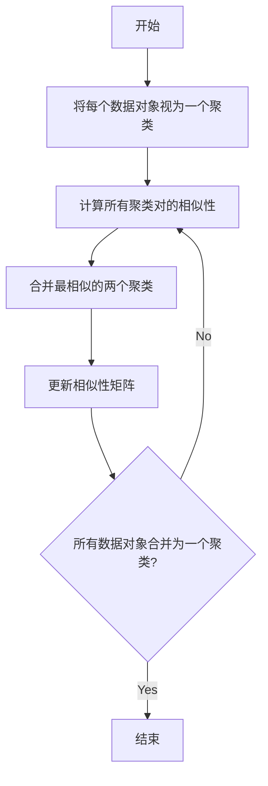

## 1.背景介绍

层次聚类(Hierarchical Clustering)是一种流行的无监督学习方法，广泛应用于各种领域，包括生物信息学、社会网络分析、市场研究等。该方法的主要目标是通过创建层次结构，将相似的对象分组在一起，从而发现数据中的模式和关系。

## 2.核心概念与联系

层次聚类的核心概念是“相似性”。在层次聚类中，我们将数据对象视为空间中的点，通过计算点之间的距离来衡量它们的相似性。通常，距离越近，相似性越大。

层次聚类的另一个关键概念是“聚类”。聚类是一组相似的对象，这些对象比非聚类中的对象更相似。在层次聚类中，我们从单个对象开始，逐步合并最相似的聚类，形成一个层次结构。

## 3.核心算法原理具体操作步骤

层次聚类的基本步骤如下：

1. 将每个数据对象视为一个聚类。
2. 计算所有聚类对的相似性。
3. 合并最相似的两个聚类。
4. 更新相似性矩阵。
5. 重复步骤2-4，直到所有数据对象合并为一个聚类。

这个过程可以用以下的 Mermaid流程图表示：



## 4.数学模型和公式详细讲解举例说明

层次聚类的关键是如何计算聚类的相似性。常用的方法有单链接法、全链接法和平均链接法。

单链接法定义聚类的相似性为两个聚类中最相似对象之间的相似性：

$$
sim(C_i, C_j) = \min_{x \in C_i, y \in C_j} sim(x, y)
$$

全链接法定义聚类的相似性为两个聚类中最不相似对象之间的相似性：

$$
sim(C_i, C_j) = \max_{x \in C_i, y \in C_j} sim(x, y)
$$

平均链接法定义聚类的相似性为两个聚类中所有对象对的平均相似性：

$$
sim(C_i, C_j) = \frac{1}{|C_i||C_j|}\sum_{x \in C_i, y \in C_j} sim(x, y)
$$

## 5.项目实践：代码实例和详细解释说明

我们可以使用Python的SciPy库进行层次聚类。以下是一个简单的例子：

```python
from scipy.cluster.hierarchy import linkage, dendrogram
import matplotlib.pyplot as plt

# 数据
X = [[i] for i in [2, 8, 0, 4, 1, 9, 9, 0]]

# 层次聚类
Z = linkage(X, 'ward')

# 绘制树状图
dendrogram(Z)

# 显示图像
plt.show()
```

这段代码首先导入了必要的库，然后创建了一个数据集X。然后，我们使用`linkage`函数进行层次聚类，参数`'ward'`表示我们使用Ward方法计算聚类的相似性。最后，我们使用`dendrogram`函数绘制了聚类的树状图。

## 6.实际应用场景

层次聚类在许多领域都有广泛的应用，例如：

- 生物信息学：通过对基因或蛋白质的聚类，可以发现生物学上的模式和关系。
- 社会网络分析：通过对社交网络用户的聚类，可以发现社区结构和影响力模式。
- 市场研究：通过对消费者的聚类，可以发现不同的市场细分和消费者行为。

## 7.工具和资源推荐

以下是一些有用的工具和资源，可以帮助你更深入地理解和应用层次聚类：

- SciPy：一个强大的Python科学计算库，提供了层次聚类的实现。
- sklearn：一个广泛使用的Python机器学习库，提供了各种聚类算法的实现，包括层次聚类。
- UCI Machine Learning Repository：一个包含多种数据集的资源，可以用于测试和比较聚类算法。

## 8.总结：未来发展趋势与挑战

虽然层次聚类是一种非常强大和灵活的方法，但它也面临着一些挑战。首先，层次聚类的计算复杂性较高，不适合大规模数据。其次，层次聚类的结果依赖于所选的相似性度量和链接方法，这需要用户有一定的专业知识。未来的研究可能会致力于开发更有效、更稳健的层次聚类算法，以应对这些挑战。

## 9.附录：常见问题与解答

**问题1：层次聚类和k-means聚类有什么区别？**

答：层次聚类和k-means聚类都是无监督学习的聚类方法，但它们的方法有所不同。k-means聚类需要预先指定聚类的数量，然后通过迭代优化来分配对象到聚类。而层次聚类不需要预先指定聚类的数量，而是通过创建一个层次结构来逐渐合并聚类。

**问题2：如何选择合适的链接方法？**

答：选择链接方法主要取决于你的数据和问题。一般来说，单链接方法对噪声和异常值较敏感，但可以发现非球形的聚类。全链接方法对噪声和异常值较稳健，但可能会破坏大的聚类。平均链接方法是一种折中的选择，它在很多情况下都能得到不错的结果。

**问题3：层次聚类的结果如何解释？**

答：层次聚类的结果通常通过树状图来解释。在树状图中，叶节点代表数据对象，内部节点代表聚类，节点的高度代表合并聚类时的相似性。通过观察树状图，我们可以了解数据的层次结构和聚类的相似性。

作者：禅与计算机程序设计艺术 / Zen and the Art of Computer Programming