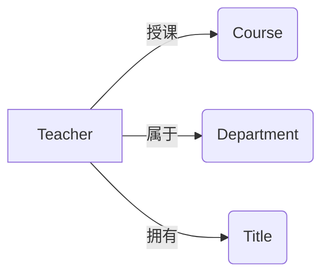

# 师资管理系统详细设计与具体代码实现

## 1.背景介绍

在现代教育管理中,师资管理是一个非常重要的环节。一个高效、智能化的师资管理系统可以大大提高学校人力资源管理的效率,减轻管理人员的工作负担。本文将详细介绍一个基于Java技术栈的师资管理系统的设计与实现。

### 1.1 师资管理的重要性

师资管理对于一所学校的发展至关重要,主要体现在以下几个方面:

- 合理配置教学资源,提高教学质量
- 加强对教师的绩效考核,提高教学积极性  
- 为教师职业发展提供数据支撑,促进教师专业成长
- 优化人力资源配置,提高学校整体管理水平

### 1.2 传统师资管理存在的问题

传统的师资管理方式主要依赖人工操作,存在以下问题:

- 效率低下,工作量大
- 数据不规范,缺乏统一标准
- 信息孤岛,数据难以共享
- 缺乏数据分析能力,决策支持不足

### 1.3 师资管理系统的目标

本系统旨在解决传统师资管理中存在的问题,实现师资管理的信息化、智能化,具体目标包括:

- 提高师资管理效率,减轻管理人员工作负担
- 规范师资数据管理,提高数据质量
- 实现师资数据的集中管理与共享
- 加强数据分析能力,为领导决策提供数据支持

## 2.核心概念与关联

在师资管理系统中,涉及到以下几个核心概念:

### 2.1 教师 Teacher

教师是师资管理的核心对象,包含教师的基本信息、学历学位、职称、教学情况等。

### 2.2 课程 Course

课程与教师的教学工作直接相关,每门课程都需要分配相应的授课教师。

### 2.3 学院 Department

学院是教师所属的组织机构,不同学院的教师在职称评定、考核等方面会有所不同。

### 2.4 职称 Title

职称是教师专业技术水平的体现,如助教、讲师、副教授、教授等,与教师的薪酬待遇密切相关。

以上几个核心概念之间的关系如下图所示:



## 3.核心算法原理与具体操作步骤

师资管理系统中涉及到一些核心算法,如教师工作量计算、教师绩效考核等。下面以教师工作量计算为例,介绍其基本原理与实现步骤。

### 3.1 教师工作量计算原理

教师工作量是衡量教师工作投入的重要指标,通常包括授课工作量、科研工作量、管理工作量等几个部分。其中授课工作量与教师所授课程的学时、学分等直接相关。

假设某教师所授课程如下:

| 课程编号 | 课程名称 | 学时 | 学分 |
| -------- | -------- | ---- | ---- |
| C001     | Java程序设计 | 48   | 3    |
| C002     | 数据结构  | 32   | 2    |

该教师学期授课工作量的计算公式为:

$W = \sum_{i=1}^{n} (H_i \times C_i \times K_i)$

其中:
- $W$ 表示教师该学期的总授课工作量
- $H_i$ 表示第 $i$ 门课程的总学时
- $C_i$ 表示第 $i$ 门课程的学分
- $K_i$ 表示第 $i$ 门课程的工作量系数,与课程类型、授课方式等相关
- $n$ 表示教师本学期所授课程门数

假设课程的工作量系数如下:

| 课程类型 | 授课方式 | 工作量系数 |
| -------- | -------- | ---------- |
| 理论课   | 授课     | 1.0        |
| 实验课   | 授课     | 1.5        |
| 理论课   | 辅导     | 0.5        |
| 实验课   | 辅导     | 0.75       |

则该教师的授课工作量为:

$$
W = 48 \times 3 \times 1.0 + 32 \times 2 \times 1.5 = 240
$$

### 3.2 教师工作量计算步骤

1. 获取教师所授课程列表
2. 对每门课程:
   - 获取课程学时、学分、类型、授课方式等信息 
   - 根据课程类型、授课方式确定工作量系数
   - 计算该门课程的工作量
3. 对所有课程的工作量求和,得到教师总授课工作量

## 4.数学模型和公式详细讲解举例说明

除了教师工作量计算,师资管理系统中还会涉及一些其他的数学模型,如教师绩效考核模型。下面我们以某学校的教师绩效考核模型为例进行讲解。

### 4.1 教师绩效考核指标体系

学校从教学、科研、管理三个维度对教师进行绩效考核,各维度权重及包含指标如下:

- 教学(50%)
  - 授课工作量(20%)
  - 教学质量(20%)
  - 教学研究与改革(10%)
- 科研(30%) 
  - 科研项目(15%)
  - 学术论文(10%)
  - 专利成果(5%)
- 管理服务(20%)
  - 管理岗位工作量(10%)
  - 社会服务(5%)
  - 学生指导(5%)

### 4.2 指标得分计算

每个考核指标都有对应的得分计算公式,分为定量指标和定性指标两种。

定量指标的得分计算公式为:

$$
S_i = \frac{A_i}{T_i} \times W_i
$$

其中:
- $S_i$ 表示第 $i$ 个指标的得分
- $A_i$ 表示教师在第 $i$ 个指标上的实际完成值
- $T_i$ 表示第 $i$ 个指标的目标值
- $W_i$ 表示第 $i$ 个指标的权重

定性指标的得分由考核组根据评价标准进行打分,满分为该指标权重分值。

### 4.3 综合绩效得分计算

教师的综合绩效得分为各项指标得分的加权和,计算公式为:

$$
S = \sum_{i=1}^{n} S_i
$$

其中:
- $S$ 表示教师的综合绩效得分
- $S_i$ 表示第 $i$ 个指标的得分
- $n$ 表示考核指标总数

例如,某教师各项指标的实际完成值与目标值如下:

| 指标     | 权重 | 实际完成值 | 目标值 |
| -------- | ---- | ---------- | ------ |
| 授课工作量 | 20%  | 240        | 200    |
| 教学质量  | 20%  | 95         | 100    |
| 教学研究与改革 | 10% | 良好     | -      |
| 科研项目 | 15%  | 2          | 3      |
| 学术论文 | 10%  | 3          | 2      |
| 专利成果 | 5%   | 1          | 1      |
| 管理岗位工作量 | 10% | 合格    | -      |
| 社会服务 | 5%   | 优秀       | -      |
| 学生指导 | 5%   | 良好       | -      |

则该教师各项指标得分为:

- 授课工作量:$20\% \times \frac{240}{200}=24\%$
- 教学质量:$20\% \times \frac{95}{100}=19\%$
- 教学研究与改革:$8\%$
- 科研项目:$15\% \times \frac{2}{3}=10\%$
- 学术论文:$10\% \times \frac{3}{2}=15\%$
- 专利成果:$5\% \times \frac{1}{1}=5\%$
- 管理岗位工作量:$8\%$
- 社会服务:$5\%$
- 学生指导:$4\%$

该教师的综合绩效得分为:

$$
S=24\%+19\%+8\%+10\%+15\%+5\%+8\%+5\%+4\%=98\%
$$

## 5.项目实践:代码实例和详细解释说明

下面我们以教师工作量计算模块为例,给出具体的代码实现。

### 5.1 数据库设计

首先需要设计教师、课程、教学任务等相关数据表。

```sql
-- 教师表
CREATE TABLE teacher (
  id INT PRIMARY KEY AUTO_INCREMENT COMMENT '教师ID',
  name VARCHAR(20) NOT NULL COMMENT '教师姓名',
  gender CHAR(1) COMMENT '性别',
  title VARCHAR(10) COMMENT '职称',
  department VARCHAR(20) COMMENT '所属学院'
);

-- 课程表  
CREATE TABLE course (
  id VARCHAR(8) PRIMARY KEY COMMENT '课程编号',
  name VARCHAR(50) NOT NULL COMMENT '课程名称',
  credit FLOAT NOT NULL COMMENT '学分',
  hours INT NOT NULL COMMENT '学时'
);

-- 教学任务表
CREATE TABLE teaching_task (
  id INT PRIMARY KEY AUTO_INCREMENT COMMENT '教学任务ID',
  course_id VARCHAR(8) COMMENT '课程编号',
  teacher_id INT COMMENT '教师ID',
  semester VARCHAR(11) COMMENT '学期',
  class_name VARCHAR(20) COMMENT '教学班',
  student_num INT COMMENT '学生人数',
  task_type VARCHAR(10) COMMENT '任务类型',
  FOREIGN KEY (course_id) REFERENCES course(id),
  FOREIGN KEY (teacher_id) REFERENCES teacher(id)
);
```

### 5.2 核心代码实现

教师工作量计算的核心代码如下:

```java
public class WorkloadCalculator {

    /**
     * 计算教师某学期的授课工作量
     * @param teacherId 教师ID
     * @param semester 学期
     * @return 该教师本学期授课工作量
     */
    public double calculateTeachingWorkload(int teacherId, String semester) {
        double totalWorkload = 0;
        
        // 查询教师本学期所授课程
        String sql = "SELECT c.credit, c.hours, t.task_type " +
                "FROM teaching_task t JOIN course c ON t.course_id=c.id " +
                "WHERE t.teacher_id=? AND t.semester=?";
        List<Object[]> courses = jdbcTemplate.query(sql, new Object[]{teacherId, semester}, 
                (rs, rowNum) -> new Object[]{rs.getDouble("credit"), rs.getInt("hours"), rs.getString("task_type")});
        
        // 计算每门课程的工作量
        for (Object[] course : courses) {
            double credit = (double) course[0];
            int hours = (int) course[1];
            String taskType = (String) course[2];
            
            double workload = credit * hours * getCoefficient(taskType);
            totalWorkload += workload;
        }
        
        return totalWorkload;
    }
    
    /**
     * 根据授课类型获取工作量系数
     * @param taskType 授课类型
     * @return 对应的工作量系数
     */
    private double getCoefficient(String taskType) {
        Map<String, Double> coefficientMap = new HashMap<>();
        coefficientMap.put("理论课授课", 1.0);
        coefficientMap.put("实验课授课", 1.5);
        coefficientMap.put("理论课辅导", 0.5);
        coefficientMap.put("实验课辅导", 0.75);
        
        return coefficientMap.get(taskType);
    }
}
```

代码说明:
1. `calculateTeachingWorkload`方法用于计算某教师某学期的授课工作量。方法参数为教师ID和学期。
2. 首先查询该教师本学期所授课程的学分、学时、授课类型等信息。
3. 遍历每门课程,根据授课类型获取对应的工作量系数,然后计算该门课程的工作量。
4. 对所有课程的工作量求和,得到教师本学期的总授课工作量。
5. `getCoefficient`方法根据授课类型返回对应的工作量系数,系数值可在代码中配置。

## 6.实际应用场景

师资管理系统可应用于各级各类教育机构,如高校、中小学、培训机构等。以高校为例,师资管理系统的主要应用场景包括:

### 6.1 教师信息管理

- 教师基本信息录入与维护
- 教师学历学位、职称等信息管理
- 教师任职情况、工作经历管理

### 6.2 教学任务管理

- 教师授课任务分配
- 教师授课工作量统计
- 教学质量评价

### 6.3 科研