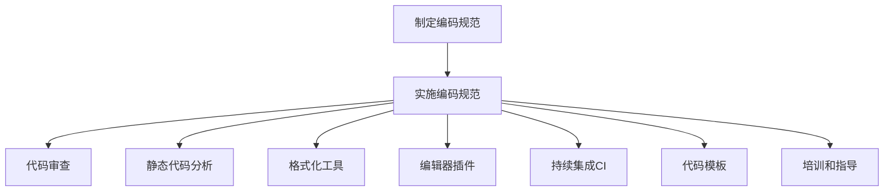

# 开发规范与编码标准原理与代码实战案例讲解

## 1.背景介绍

随着软件项目日益复杂,团队规模不断扩大,代码质量和可维护性成为了软件开发中至关重要的因素。为了确保代码的一致性、可读性和可维护性,遵循统一的开发规范和编码标准就显得尤为重要。良好的编码实践不仅有利于提高开发效率,还能减少潜在的Bug,提升代码的可靠性和可扩展性。

### 1.1 为什么需要编码规范

编码规范的主要目的是:

- **提高代码的可读性**: 统一的代码风格有助于提高代码的可读性,使代码更易于理解和维护。
- **增强代码的一致性**: 在团队协作中,统一的编码规范可以确保所有开发人员编写风格一致的代码,降低沟通成本。
- **提高代码质量**: 良好的编码实践有助于减少Bug,提高代码的健壮性和可靠性。
- **促进最佳实践**: 编码规范通常会包含一些最佳实践,有助于指导开发人员编写高质量的代码。

### 1.2 编码规范的种类

编码规范可以分为不同的层次,包括:

- **语言级别的规范**: 针对特定编程语言的编码规范,如Java编码规范、C++编码规范等。
- **项目级别的规范**: 根据项目的特点和需求制定的编码规范,适用于该项目的所有代码。
- **团队级别的规范**: 由团队成员共同制定的编码规范,用于规范团队内部的代码风格。
- **个人级别的规范**: 开发人员自己制定的编码习惯和风格偏好。

## 2.核心概念与联系

### 2.1 编码规范的核心概念

编码规范通常包含以下几个核心概念:

1. **命名规则**: 规范变量、函数、类等命名方式,如使用驼峰命名法、匈牙利命名法等。
2. **代码格式化**: 规范代码的缩进、空格、换行等格式,以提高代码的可读性。
3. **注释规范**: 规范代码注释的位置、风格和内容,确保注释清晰、准确。
4. **编程实践**: 包括编写高效、安全、可维护代码的最佳实践。
5. **代码结构**: 规范代码的组织结构,如文件组织、模块划分等。
6. **版本控制**: 规范代码的版本管理和协作流程。

这些核心概念相互关联,共同构建了一套完整的编码规范体系。

### 2.2 编码规范与其他概念的关系

编码规范与以下概念密切相关:

- **代码质量**: 良好的编码规范有助于提高代码质量,减少Bug和技术债务。
- **代码审查**: 代码审查过程中,编码规范是评判代码质量的重要标准。
- **自动化工具**: 许多自动化工具(如代码格式化工具、静态代码分析工具等)都基于编码规范进行配置和检查。
- **持续集成(CI)**: 编码规范通常会被集成到CI流水线中,确保每次提交的代码都符合规范。
- **文档规范**: 编码规范与文档规范密切相关,两者共同构建了项目的整体规范体系。

## 3.核心算法原理具体操作步骤

### 3.1 制定编码规范的步骤

制定编码规范通常需要遵循以下步骤:

1. **确定目标和范围**: 明确编码规范的目标和适用范围,如针对特定语言、项目或团队。
2. **研究现有规范**: 研究并评估现有的编码规范,如语言官方规范、开源项目规范等。
3. **团队讨论和评审**: 组织团队成员讨论和评审,收集反馈意见,达成共识。
4. **编写规范文档**: 根据讨论结果,编写详细的规范文档,包括各个方面的具体规则。
5. **实施和培训**: 在团队内部实施编码规范,并进行相应的培训和指导。
6. **持续改进**: 根据实践经验和新需求,持续改进和优化编码规范。

制定编码规范需要团队的共同参与和努力,以确保规范的合理性和可执行性。

### 3.2 实施编码规范的方法

实施编码规范的常见方法包括:

1. **代码审查**: 在代码审查过程中,检查代码是否符合编码规范,并提出修改建议。
2. **静态代码分析**: 使用静态代码分析工具自动扫描代码,发现违反规范的地方。
3. **格式化工具**: 使用代码格式化工具自动格式化代码,确保代码风格统一。
4. **编辑器插件**: 在IDE或编辑器中安装编码规范插件,实时提示和修复违规代码。
5. **持续集成(CI)**: 将编码规范检查集成到CI流水线中,确保每次提交的代码都符合规范。
6. **代码模板**: 提供符合编码规范的代码模板,供开发人员参考和复用。
7. **培训和指导**: 为团队成员提供编码规范的培训和指导,提高规范的执行力。

实施编码规范需要采用多种方法相结合,并根据具体情况选择合适的工具和流程。



## 4.数学模型和公式详细讲解举例说明

虽然编码规范主要关注代码的结构和风格,但在某些情况下,数学模型和公式也可能会被应用于编码实践中。例如,在算法优化、性能评估等领域,数学模型和公式可以为编码决策提供理论依据和量化指标。

### 4.1 代码复杂度度量

代码复杂度是评估代码质量和可维护性的重要指标之一。常用的代码复杂度度量方法包括:

1. **循环复杂度 (Cyclomatic Complexity)**: 用于度量程序的控制流复杂度,定义为程序中线性独立路径的条数加1。

$$
   M = E - N + 2P
$$

其中,M是循环复杂度,E是程序流程图中边的数量,N是节点的数量,P是连通区域的数量(对于单一程序,P=1)。

2. **赫尔斯塔德度量 (Halstead Metrics)**: 用于度量程序的大小和复杂度,包括以下几个指标:

- 不同操作符的数量 $n_1$
- 不同操作数的数量 $n_2$
- 总的操作符实例数 $N_1$
- 总的操作数实例数 $N_2$

程序长度 $N = N_1 + N_2$
程序词汇量 $n = n_1 + n_2$
程序体积 $V = N \log_2 n$
难度级别 $D = (n_1/2) \times (N_2/n_2)$

通过这些指标,可以评估程序的维护难度和潜在缺陷风险。

### 4.2 代码覆盖率分析

代码覆盖率分析是测试的一个重要指标,用于衡量测试用例对代码的覆盖程度。常见的代码覆盖率指标包括:

1. **语句覆盖率 (Statement Coverage)**: 测试用例执行过的代码语句占总语句数的比例。
2. **分支覆盖率 (Branch Coverage)**: 测试用例执行过的代码分支占总分支数的比例。
3. **条件覆盖率 (Condition Coverage)**: 测试用例执行过的条件取值情况占总条件取值情况的比例。
4. **路径覆盖率 (Path Coverage)**: 测试用例执行过的代码路径占总路径数的比例。

代码覆盖率可以用以下公式计算:

$$
   \text{覆盖率} = \frac{\text{已覆盖的元素数量}}{\text{总元素数量}}
$$

其中,元素可以是语句、分支、条件或路径等,取决于所选择的覆盖率类型。

通过分析代码覆盖率,可以发现测试用例的不足,并针对性地补充测试用例,从而提高代码的测试质量。

## 5.项目实践:代码实例和详细解释说明

为了更好地理解编码规范的实践,我们将通过一个简单的Java项目来演示如何应用编码规范。该项目实现了一个简单的购物车功能,包括添加商品、计算总价等功能。

### 5.1 命名规范示例

按照Java编码规范,我们采用以下命名约定:

- 类名使用`UpperCamelCase`风格,如`ShoppingCart`
- 方法名使用`lowerCamelCase`风格,如`addItem()`
- 常量名使用全大写,单词之间用下划线分隔,如`MAX_ITEMS`
- 变量名使用`lowerCamelCase`风格,如`totalPrice`

```java
public class ShoppingCart {
    private static final int MAX_ITEMS = 100;
    private List<Item> items;
    private double totalPrice;

    public ShoppingCart() {
        items = new ArrayList<>();
        totalPrice = 0.0;
    }

    public void addItem(Item item) {
        if (items.size() < MAX_ITEMS) {
            items.add(item);
            totalPrice += item.getPrice();
        } else {
            System.out.println("购物车已满,无法添加更多商品。");
        }
    }

    public double getTotalPrice() {
        return totalPrice;
    }

    // 其他方法...
}
```

### 5.2 代码格式化示例

为了提高代码的可读性,我们需要遵循统一的代码格式化规范。以下是一个格式化后的示例:

```java
public class ShoppingCart {

    private static final int MAX_ITEMS = 100;
    private List<Item> items;
    private double totalPrice;

    public ShoppingCart() {
        items = new ArrayList<>();
        totalPrice = 0.0;
    }

    public void addItem(Item item) {
        if (items.size() < MAX_ITEMS) {
            items.add(item);
            totalPrice += item.getPrice();
        } else {
            System.out.println("购物车已满,无法添加更多商品。");
        }
    }

    public double getTotalPrice() {
        return totalPrice;
    }

    // 其他方法...
}
```

这个示例遵循了以下格式化规范:

- 使用4个空格缩进
- 在大括号`{}`前留有一个空格
- 在控制语句(如`if`、`for`等)的括号`()`前后各留一个空格
- 方法之间留有一个空行,增强可读性

### 5.3 注释规范示例

良好的代码注释有助于提高代码的可读性和可维护性。以下是一个注释示例:

```java
/**
 * 购物车类,用于管理购物车中的商品和总价格。
 */
public class ShoppingCart {

    private static final int MAX_ITEMS = 100; // 购物车中允许的最大商品数量

    private List<Item> items; // 购物车中的商品列表
    private double totalPrice; // 购物车中所有商品的总价格

    /**
     * 构造函数,初始化购物车。
     */
    public ShoppingCart() {
        items = new ArrayList<>();
        totalPrice = 0.0;
    }

    /**
     * 向购物车中添加一个商品。
     *
     * @param item 要添加的商品
     */
    public void addItem(Item item) {
        if (items.size() < MAX_ITEMS) {
            items.add(item);
            totalPrice += item.getPrice();
        } else {
            System.out.println("购物车已满,无法添加更多商品。");
        }
    }

    /**
     * 获取购物车中所有商品的总价格。
     *
     * @return 总价格
     */
    public double getTotalPrice() {
        return totalPrice;
    }

    // 其他方法...
}
```

这个示例遵循了以下注释规范:

- 为类和方法添加JavaDoc风格的注释,描述其功能和用途
- 对于方法,在`@param`和`@return`标记中描述参数和返回值的含义
- 对于复杂的代码块,添加适当的行内注释,说明代码的逻辑和原因

### 5.4 编程实践示例

良好的编程实践有助于提高代码的质量和可维护性。以下是一些示例:

```java
public void checkout() {
    if (items.isEmpty()) {
        