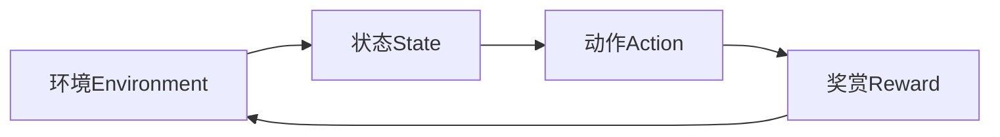
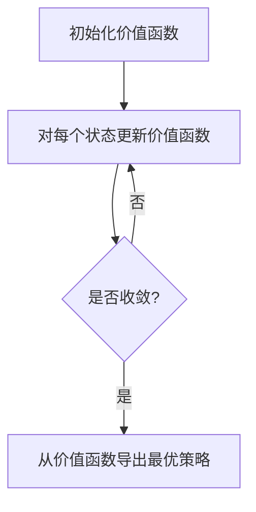
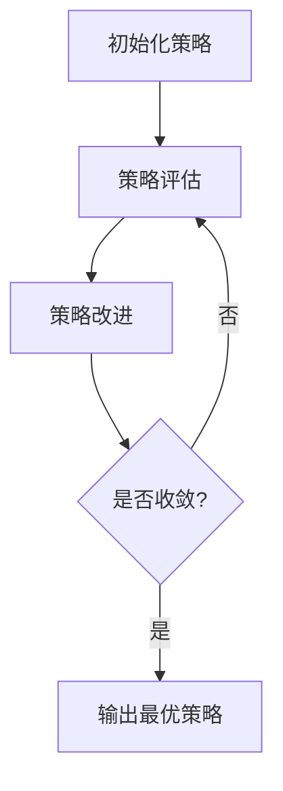
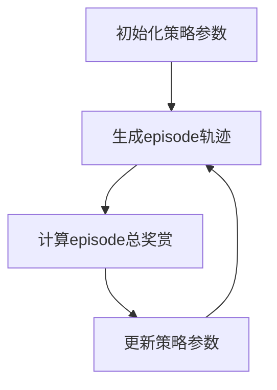
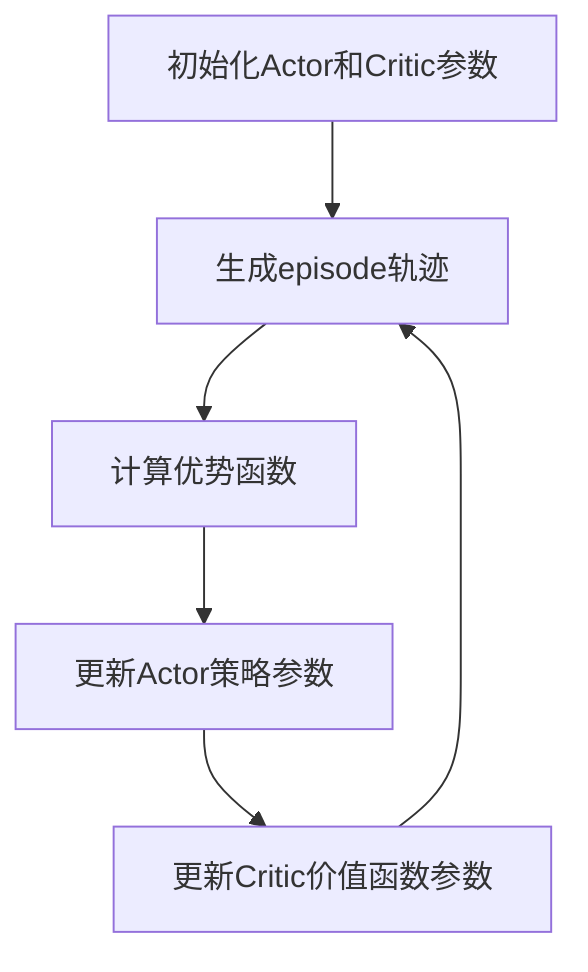

# 强化学习(Reinforcement Learning) - 原理与代码实例讲解

## 1.背景介绍

### 1.1 什么是强化学习?

强化学习(Reinforcement Learning, RL)是机器学习的一个重要分支,它研究如何基于环境反馈来学习行为策略,以最大化预期的长期回报。与监督学习不同,强化学习没有给定的输入-输出对样本,而是通过与环境的交互来学习。

### 1.2 强化学习的重要性

强化学习在人工智能领域扮演着关键角色,因为它能够解决复杂的决策问题,并在不确定和动态环境中学习最优策略。它已被广泛应用于机器人控制、游戏AI、自动驾驶、资源管理等诸多领域。

### 1.3 强化学习的挑战

尽管强化学习取得了令人瞩目的成就,但它也面临着一些挑战,例如探索-利用权衡、奖赏稀疏性、高维状态空间等。这些挑战推动了强化学习算法和技术的不断发展和创新。

## 2.核心概念与联系

### 2.1 强化学习的基本元素

强化学习系统由四个核心元素组成:

1. **环境(Environment)**: 代理与之交互的外部世界。
2. **状态(State)**: 环境的当前情况。
3. **动作(Action)**: 代理可以执行的操作。
4. **奖赏(Reward)**: 代理执行动作后从环境获得的反馈信号。



### 2.2 马尔可夫决策过程(MDP)

强化学习问题通常被建模为马尔可夫决策过程(Markov Decision Process, MDP),它是一种数学框架,用于描述完全可观测的决策过程。MDP由以下五个要素组成:

1. **状态集合(State Space) S**
2. **动作集合(Action Space) A**
3. **转移概率(Transition Probability) P(s'|s,a)**
4. **奖赏函数(Reward Function) R(s,a,s')**
5. **折扣因子(Discount Factor) γ**

### 2.3 价值函数和贝尔曼方程

价值函数(Value Function)是强化学习中的核心概念,它表示在给定策略下,从某个状态开始执行该策略所能获得的预期总奖赏。贝尔曼方程(Bellman Equation)提供了一种递归方式来计算价值函数。

### 2.4 策略和策略迭代

策略(Policy)是一个映射函数,它将状态映射到动作。强化学习的目标是找到一个最优策略,使得在执行该策略时能获得最大的预期总奖赏。策略迭代(Policy Iteration)是一种常用的算法,通过交替执行策略评估和策略改进来逼近最优策略。

## 3.核心算法原理具体操作步骤

### 3.1 动态规划算法

动态规划算法是强化学习中的一类经典算法,它适用于完全可观测的MDP问题。常见的动态规划算法包括:

1. **价值迭代(Value Iteration)**
2. **策略迭代(Policy Iteration)**

这些算法通过利用贝尔曼方程来计算最优价值函数和最优策略。

#### 3.1.1 价值迭代算法

价值迭代算法的步骤如下:

1. 初始化价值函数 $V(s)$ 为任意值
2. 重复以下步骤直到收敛:
    a. 对于每个状态 $s \in S$,计算 $V(s) = \max_{a \in A} \sum_{s' \in S} P(s'|s,a) [R(s,a,s') + \gamma V(s')]$
3. 从 $V(s)$ 导出最优策略 $\pi^*(s) = \arg\max_{a \in A} \sum_{s' \in S} P(s'|s,a) [R(s,a,s') + \gamma V(s')]$



#### 3.1.2 策略迭代算法

策略迭代算法的步骤如下:

1. 初始化策略 $\pi(s)$ 为任意策略
2. 重复以下步骤直到收敛:
    a. **策略评估**: 对于当前策略 $\pi$,计算其价值函数 $V^\pi$
    b. **策略改进**: 对于每个状态 $s$,计算 $\pi'(s) = \arg\max_{a \in A} \sum_{s' \in S} P(s'|s,a) [R(s,a,s') + \gamma V^\pi(s')]$
    c. 如果 $\pi' = \pi$,则停止迭代,否则令 $\pi = \pi'$
3. 输出最优策略 $\pi^*$



### 3.2 时序差分算法

时序差分(Temporal Difference, TD)算法是一类基于采样的强化学习算法,它不需要完全的环境模型,而是通过与环境交互来学习价值函数或策略。常见的时序差分算法包括:

1. **Sarsa**
2. **Q-Learning**

#### 3.2.1 Sarsa算法

Sarsa算法的步骤如下:

1. 初始化 $Q(s,a)$ 为任意值
2. 对于每个episode:
    a. 初始化状态 $s$
    b. 选择动作 $a$ 根据策略 $\pi$ 派生自 $Q$
    c. 重复以下步骤直到episode结束:
        i. 执行动作 $a$,观察奖赏 $r$ 和新状态 $s'$
        ii. 选择新动作 $a'$ 根据策略 $\pi$ 派生自 $Q$
        iii. $Q(s,a) \leftarrow Q(s,a) + \alpha [r + \gamma Q(s',a') - Q(s,a)]$
        iv. $s \leftarrow s', a \leftarrow a'$

```mermaid
graph TD
A[初始化Q函数] --> B[初始化状态]
B --> C[选择动作a]
C --> D[执行动作a获取r,s']
D --> E[选择新动作a']
E --> F[更新Q(s,a)]
F --> G{是否episode结束?}
G -->|是| B
G -->|否| H[s=s',a=a']
H --> D
```

#### 3.2.2 Q-Learning算法

Q-Learning算法的步骤如下:

1. 初始化 $Q(s,a)$ 为任意值
2. 对于每个episode:
    a. 初始化状态 $s$
    b. 重复以下步骤直到episode结束:
        i. 选择动作 $a$ 根据 $\epsilon$-贪婪策略派生自 $Q$
        ii. 执行动作 $a$,观察奖赏 $r$ 和新状态 $s'$
        iii. $Q(s,a) \leftarrow Q(s,a) + \alpha [r + \gamma \max_{a'} Q(s',a') - Q(s,a)]$
        iv. $s \leftarrow s'$

```mermaid
graph TD
A[初始化Q函数] --> B[初始化状态]
B --> C[选择动作a]
C --> D[执行动作a获取r,s']
D --> E[更新Q(s,a)]
E --> F{是否episode结束?}
F -->|是| B
F -->|否| G[s=s']
G --> C
```

### 3.3 策略梯度算法

策略梯度(Policy Gradient)算法是一类直接优化策略的强化学习算法,它通过估计策略的梯度来更新策略参数,从而逐步提高策略的性能。常见的策略梯度算法包括:

1. **REINFORCE**
2. **Actor-Critic**

#### 3.3.1 REINFORCE算法

REINFORCE算法的步骤如下:

1. 初始化策略参数 $\theta$
2. 对于每个episode:
    a. 生成一个episode的轨迹 $\tau = (s_0, a_0, r_0, s_1, a_1, r_1, \dots, s_T)$
    b. 计算episode的总奖赏 $R(\tau) = \sum_{t=0}^T \gamma^t r_t$
    c. 更新策略参数 $\theta \leftarrow \theta + \alpha \nabla_\theta \log \pi_\theta(\tau) R(\tau)$



#### 3.3.2 Actor-Critic算法

Actor-Critic算法将策略函数(Actor)和价值函数(Critic)分开学习,并利用价值函数的估计来更新策略参数。

1. **Actor**:
    a. 初始化策略参数 $\theta$
    b. 对于每个episode:
        i. 生成一个episode的轨迹 $\tau = (s_0, a_0, r_0, s_1, a_1, r_1, \dots, s_T)$
        ii. 计算优势函数(Advantage Function) $A(s_t, a_t) = r_t + \gamma V(s_{t+1}) - V(s_t)$
        iii. 更新策略参数 $\theta \leftarrow \theta + \alpha \nabla_\theta \log \pi_\theta(a_t|s_t) A(s_t, a_t)$
2. **Critic**:
    a. 初始化价值函数参数 $\phi$
    b. 对于每个episode:
        i. 生成一个episode的轨迹 $\tau = (s_0, a_0, r_0, s_1, a_1, r_1, \dots, s_T)$
        ii. 更新价值函数参数 $\phi \leftarrow \phi - \beta \nabla_\phi (r_t + \gamma V_\phi(s_{t+1}) - V_\phi(s_t))^2$



### 3.4 深度强化学习算法

深度强化学习(Deep Reinforcement Learning)算法是将深度神经网络与强化学习相结合的一类算法,它能够处理高维观测数据和连续动作空间。常见的深度强化学习算法包括:

1. **深度Q网络(Deep Q-Network, DQN)**
2. **策略梯度算法(Policy Gradient)**
3. **Actor-Critic算法**

这些算法将神经网络用于近似Q函数、策略函数或价值函数,并通过梯度下降法优化网络参数。

## 4.数学模型和公式详细讲解举例说明

### 4.1 马尔可夫决策过程(MDP)

马尔可夫决策过程(Markov Decision Process, MDP)是强化学习问题的数学建模框架。MDP由以下五个要素组成:

1. **状态集合(State Space) S**:所有可能状态的集合。
2. **动作集合(Action Space) A**:所有可能动作的集合。
3. **转移概率(Transition Probability) P(s'|s,a)**:在状态 $s$ 执行动作 $a$ 后,转移到状态 $s'$ 的概率。
4. **奖赏函数(Reward Function) R(s,a,s')**:在状态 $s$ 执行动作 $a$ 后,转移到状态 $s'$ 所获得的奖赏。
5. **折扣因子(Discount Factor) γ**:用于权衡即时奖赏和未来奖赏的重要性,取值范围为 $[0,1)$。

在MDP中,我们希望找到一个最优策略 $\pi^*$,使得在执行该策略时能获得最大的预期总奖赏,即:

$$\pi^* = \arg\max_\pi \mathbb{E}_\pi \left[ \sum_{t=0}^\infty \gamma^t R(s_t, a_t, s_{t+1}) \right]$$

其中 $\mathbb{E}_\pi$ 表示在策略 $\pi$ 下的期望值。

### 4.2 价值函数和贝尔曼方程

价值函数(Value Function)是强化学习中的核心概念,它表示在给定策略下,从某个状态开始执行该策略所能获得的预期总奖赏。

**状态价值函数(State-Value Function)** $V^\pi(s)$ 定义为:

$$V^\pi(