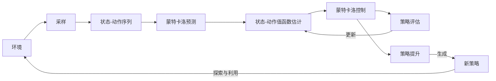

# 强化学习Reinforcement Learning中的蒙特卡洛方法实战技巧

## 1.背景介绍
强化学习(Reinforcement Learning, RL)是机器学习的一个重要分支,它研究如何让智能体(agent)在与环境的交互中学习最优策略,以获得最大的累积奖励。蒙特卡洛(Monte Carlo, MC)方法是强化学习中一类重要的无模型(model-free)算法,其核心思想是通过大量采样来估计状态-动作值函数。

### 1.1 强化学习的定义与要素
强化学习可以形式化地定义为一个马尔可夫决策过程(Markov Decision Process, MDP),包含以下要素:

- 状态空间 $\mathcal{S}$: 所有可能的状态集合
- 动作空间 $\mathcal{A}$: 在每个状态下可采取的动作集合  
- 转移概率 $\mathcal{P}$: 定义了在状态 $s$ 下执行动作 $a$ 后转移到状态 $s'$ 的概率 $p(s'|s,a)$
- 奖励函数 $\mathcal{R}$: 定义了在状态 $s$ 下执行动作 $a$ 后获得的即时奖励 $r(s,a)$
- 折扣因子 $\gamma \in [0,1]$: 用于平衡即时奖励和未来奖励

强化学习的目标是学习一个最优策略 $\pi^*: \mathcal{S} \rightarrow \mathcal{A}$,使得从任意状态出发,按照该策略与环境交互,能够获得最大的期望累积奖励。

### 1.2 蒙特卡洛方法的特点与优势
蒙特卡洛方法有以下特点:

1. 基于采样的无模型学习,不需要知道环境动力学模型(即转移概率和奖励函数)
2. 通过采样完整的状态-动作序列(episode)来更新值函数,可以处理回合式(episodic)任务
3. 使用平均回报(return)来估计状态-动作值函数,方差较大,但是渐进无偏
4. 可以同时应用在在线(online)和离线(offline)的学习场景

相比其他强化学习算法,蒙特卡洛方法的优势包括:

- 实现简单,易于理解和编程实现
- 可以从实际经验数据或者模拟器采样数据中学习,适用范围广
- 能够应对延迟奖励问题,回合更新使其能捕捉长期效果
- 渐进收敛到最优策略,理论保证可靠

## 2.核心概念与联系

### 2.1 状态-动作值函数
状态-动作值函数 $q_{\pi}(s,a)$ 表示在状态 $s$ 下采取动作 $a$ 并持续执行策略 $\pi$ 的期望回报:

$$q_{\pi}(s,a)=\mathbb{E}_{\pi}[G_t|S_t=s,A_t=a]$$

其中 $G_t$ 是从时刻 $t$ 开始的累积折扣回报:

$$G_t=R_{t+1}+\gamma R_{t+2}+\gamma^2 R_{t+3}+...=\sum_{k=0}^{\infty}\gamma^k R_{t+k+1}$$

最优状态-动作值函数 $q_*(s,a)$ 对应最优策略 $\pi^*$ 下的值函数。

### 2.2 蒙特卡洛预测(评估)
蒙特卡洛预测的目标是对一个给定策略 $\pi$ 估计其状态值函数 $v_{\pi}(s)$ 或状态-动作值函数 $q_{\pi}(s,a)$。

对于状态 $s$,其值函数可以通过多次采样到达 $s$ 的回合,计算平均回报来估计:

$$v_{\pi}(s) \approx \frac{1}{N(s)}\sum_{i=1}^{N(s)}G_i(s)$$

其中 $N(s)$ 是状态 $s$ 被访问的次数,$G_i(s)$ 是第 $i$ 次访问 $s$ 时的回报。

类似地,对于状态-动作对 $(s,a)$,可以通过采样包含 $(s,a)$ 的回合,计算平均回报来估计 $q_{\pi}(s,a)$:

$$q_{\pi}(s,a) \approx \frac{1}{N(s,a)}\sum_{i=1}^{N(s,a)}G_i(s,a)$$

其中 $N(s,a)$ 是状态-动作对 $(s,a)$ 被访问的次数。

### 2.3 蒙特卡洛控制(优化)
蒙特卡洛控制的目标是通过策略迭代找到最优策略 $\pi_*$。策略迭代包括策略评估和策略提升两个交替进行的步骤:

1. 策略评估:固定当前策略 $\pi$,通过蒙特卡洛预测估计 $q_{\pi}(s,a)$
2. 策略提升:基于估计的 $q_{\pi}(s,a)$ 来提升策略,生成一个贪婪策略 $\pi'$:

$$\pi'(s)=\arg\max_{a \in \mathcal{A}}q_{\pi}(s,a)$$

理论上,重复策略评估和提升的迭代过程,最终可以收敛到最优策略。

### 2.4 探索与利用
为了找到最优策略,agent需要在探索(exploration)新的可能性和利用(exploitation)已有的最佳选择间权衡。常见的探索策略有:

- $\epsilon$-贪婪($\epsilon$-greedy):以 $\epsilon$ 的概率随机探索,否则采取贪婪动作
- Softmax探索:根据值函数估计的优势,以Boltzmann分布的概率选择动作

下图展示了蒙特卡洛方法中各个核心概念之间的关系:

## 3.核心算法原理具体操作步骤
蒙特卡洛方法的核心算法可以分为预测(评估)和控制(优化)两大类,下面分别介绍。

### 3.1 每次访问型蒙特卡洛预测(First-Visit Monte Carlo Prediction)
1. 输入:目标策略 $\pi$ 
2. 初始化: 
   - $N(s) \leftarrow 0,\forall s\in\mathcal{S}$ 
   - $N(s,a) \leftarrow 0,\forall s\in\mathcal{S},a\in\mathcal{A}$
   - $Returns(s) \leftarrow [],\forall s\in\mathcal{S}$ 
   - $Returns(s,a) \leftarrow [],\forall s\in\mathcal{S},a\in\mathcal{A}$
3. 循环每一个回合:
   - 使用 $\pi$ 生成一个回合 $S_0,A_0,R_1,...,S_{T-1},A_{T-1},R_T$
   - $G \leftarrow 0$
   - 循环 $t=T-1,T-2,...,0$:
     - $G \leftarrow \gamma G+R_{t+1}$
     - 如果 $S_t$ 是首次访问:
       - $N(S_t) \leftarrow N(S_t)+1$
       - $Returns(S_t).append(G)$
       - $V(S_t) \leftarrow \frac{1}{N(S_t)}\sum Returns(S_t)$
     - 如果 $(S_t,A_t)$ 是首次访问:
       - $N(S_t,A_t) \leftarrow N(S_t,A_t)+1$
       - $Returns(S_t,A_t).append(G)$
       - $Q(S_t,A_t) \leftarrow \frac{1}{N(S_t,A_t)}\sum Returns(S_t,A_t)$
4. 输出:状态值函数 $V$ 和状态-动作值函数 $Q$

### 3.2 蒙特卡洛探索开始(Monte Carlo with Exploring Starts)
1. 初始化:
   - $\pi(s) \in \mathcal{A}(s)$ 任意初始化, $\forall s\in\mathcal{S}$
   - $Q(s,a) \in \mathbb{R}$ 任意初始化, $\forall s\in\mathcal{S},a\in\mathcal{A}$
   - $Returns(s,a) \leftarrow [],\forall s\in\mathcal{S},a\in\mathcal{A}$
2. 循环每一个回合:
   - 随机选择初始状态 $S_0\in\mathcal{S}$ 和动作 $A_0\in\mathcal{A}(S_0)$
   - 使用 $\pi$ 生成一个回合 $S_0,A_0,R_1,...,S_{T-1},A_{T-1},R_T$
   - $G \leftarrow 0$
   - 循环 $t=T-1,T-2,...,0$:
     - $G \leftarrow \gamma G+R_{t+1}$
     - 如果 $(S_t,A_t)$ 是首次访问:
       - $Returns(S_t,A_t).append(G)$
       - $Q(S_t,A_t) \leftarrow average(Returns(S_t,A_t))$
       - $\pi(S_t) \leftarrow \arg\max_{a\in\mathcal{A}(S_t)}Q(S_t,a)$
3. 输出:最优策略 $\pi_*$ 和最优状态-动作值函数 $Q_*$

### 3.3 带软性策略的蒙特卡洛控制(Soft-Policy Monte Carlo Control)
1. 输入:小正数 $\alpha \in (0,1]$
2. 初始化:
   - $Q(s,a) \in \mathbb{R}$ 任意初始化, $\forall s\in\mathcal{S},a\in\mathcal{A}$
   - $\pi(a|s)=\frac{1}{|\mathcal{A}(s)|},\forall s\in\mathcal{S},a\in\mathcal{A}$
   - $Returns(s,a) \leftarrow [],\forall s\in\mathcal{S},a\in\mathcal{A}$
3. 循环每一个回合:
   - 根据 $\pi$ 生成一个回合 $S_0,A_0,R_1,...,S_{T-1},A_{T-1},R_T$
   - $G \leftarrow 0$
   - 循环 $t=T-1,T-2,...,0$:
     - $G \leftarrow \gamma G+R_{t+1}$
     - $Returns(S_t,A_t).append(G)$
     - $Q(S_t,A_t) \leftarrow average(Returns(S_t,A_t))$
     - 对于 $\forall a\in\mathcal{A}(S_t)$:
       - $\pi(a|S_t) \leftarrow \frac{e^{Q(S_t,a)/\alpha}}{\sum_{b\in\mathcal{A}(S_t)}e^{Q(S_t,b)/\alpha}}$
4. 输出:最优策略 $\pi_*$ 和最优状态-动作值函数 $Q_*$

## 4.数学模型和公式详细讲解举例说明
本节我们详细讲解蒙特卡洛方法中的几个关键数学模型和公式。

### 4.1 马尔可夫决策过程(MDP)
马尔可夫决策过程由五元组 $\langle \mathcal{S},\mathcal{A},\mathcal{P},\mathcal{R},\gamma \rangle$ 定义,其中:

- $\mathcal{S}$ 是有限的状态集
- $\mathcal{A}$ 是有限的动作集
- $\mathcal{P}$ 是状态转移概率矩阵,其中 $\mathcal{P}_{ss'}^a=P[S_{t+1}=s'|S_t=s,A_t=a]$ 表示在状态 $s$ 下执行动作 $a$ 后转移到状态 $s'$ 的概率
- $\mathcal{R}$ 是奖励函数,其中 $\mathcal{R}_s^a=\mathbb{E}[R_{t+1}|S_t=s,A_t=a]$ 表示在状态 $s$ 下执行动作 $a$ 的期望即时奖励
- $\gamma \in [0,1]$ 是折扣因子,用于折算未来奖励的现值

MDP满足马尔可夫性质,即下一状态 $S_{t+1}$ 只依赖于当前状态 $S