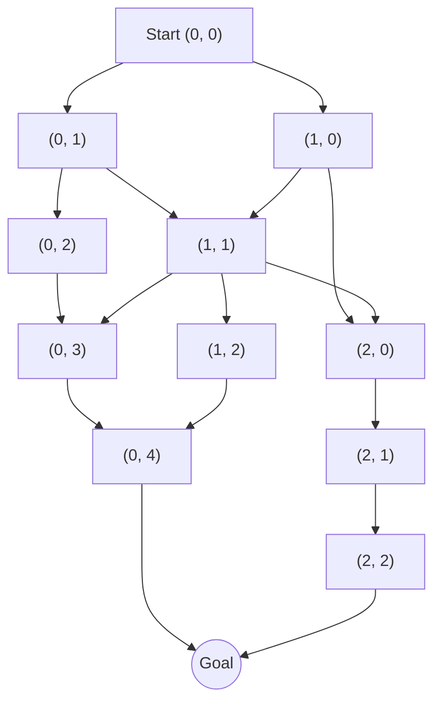

# 强化学习Reinforcement Learning的数据驱动策略在线调整实践

## 1.背景介绍

### 1.1 强化学习概述

强化学习(Reinforcement Learning, RL)是机器学习的一个重要分支,它关注基于环境反馈来学习行为策略的问题。与监督学习不同,强化学习没有给定的输入输出样本对,而是通过与环境的交互来学习。

在强化学习中,智能体(Agent)与环境(Environment)进行交互。智能体根据当前状态选择一个行动,环境会根据这个行动转移到新的状态,并给出对应的奖励信号。智能体的目标是学习一个策略,使得在环境中获得的长期累积奖励最大化。

### 1.2 数据驱动策略优化

传统的强化学习方法通常依赖于精心设计的特征工程和奖励函数,这往往需要大量的领域知识和人工努力。而数据驱动的策略优化方法则旨在直接从原始的状态和奖励数据中学习策略,无需人工设计特征。

数据驱动的策略优化方法通常基于深度神经网络来表示策略,并使用大量的交互数据对神经网络进行训练。这种方法的优势在于可以自动从原始数据中提取特征,减少人工干预,同时也能够处理高维和复杂的环境。

### 1.3 在线调整的重要性

在实际应用中,环境通常是动态变化的,智能体需要持续地与环境交互并根据新的数据来调整策略。因此,在线调整策略以适应环境变化是至关重要的。

在线调整策略的挑战在于,需要在exploitation(利用已学习的策略获取奖励)和exploration(探索新的状态和行动以获取更多数据)之间寻求平衡。过多的exploitation可能导致策略陷入局部最优,而过多的exploration则可能影响当前的奖励收益。

## 2.核心概念与联系

### 2.1 马尔可夫决策过程(Markov Decision Process, MDP)

马尔可夫决策过程是强化学习的数学基础。MDP由以下几个要素组成:

- 状态集合 $\mathcal{S}$
- 行动集合 $\mathcal{A}$
- 转移概率 $\mathcal{P}_{ss'}^a = \mathbb{P}(s' \mid s, a)$,表示在状态 $s$ 下执行行动 $a$ 后转移到状态 $s'$ 的概率
- 奖励函数 $\mathcal{R}_s^a$ 或 $\mathcal{R}_{ss'}^a$,表示在状态 $s$ 执行行动 $a$ 所获得的奖励
- 折扣因子 $\gamma \in [0, 1)$,用于权衡当前奖励和未来奖励的重要性

智能体的目标是学习一个策略 $\pi: \mathcal{S} \rightarrow \mathcal{A}$,使得在 MDP 中获得的长期累积奖励最大化。

### 2.2 策略函数近似

在实际问题中,状态空间和行动空间往往是高维和连续的,无法使用表格形式来精确表示策略。因此,我们需要使用函数近似器(如深度神经网络)来表示策略函数。

设 $\pi_\theta(a \mid s)$ 表示参数为 $\theta$ 的策略网络在状态 $s$ 下选择行动 $a$ 的概率分布。我们的目标是通过优化 $\theta$ 来最大化期望的累积奖励:

$$
J(\theta) = \mathbb{E}_{\tau \sim \pi_\theta} \left[ \sum_{t=0}^\infty \gamma^t r_t \right]
$$

其中 $\tau = (s_0, a_0, r_0, s_1, a_1, r_1, \ldots)$ 表示一个由策略 $\pi_\theta$ 生成的轨迹(trajectory)。

### 2.3 策略梯度方法

策略梯度方法是一种广泛使用的策略优化算法,它通过计算累积奖励对策略参数的梯度,并沿着梯度方向更新策略参数。

具体地,策略梯度可以表示为:

$$
\nabla_\theta J(\theta) = \mathbb{E}_{\tau \sim \pi_\theta} \left[ \sum_{t=0}^\infty \nabla_\theta \log \pi_\theta(a_t \mid s_t) Q^{\pi_\theta}(s_t, a_t) \right]
$$

其中 $Q^{\pi_\theta}(s_t, a_t)$ 表示在状态 $s_t$ 执行行动 $a_t$ 后按策略 $\pi_\theta$ 执行所能获得的期望累积奖励。

通过采样估计策略梯度,并沿着梯度方向更新策略参数,我们可以不断提高策略的性能。

### 2.4 Actor-Critic 架构

Actor-Critic 架构是一种常用的策略优化框架,它将策略函数(Actor)和值函数(Critic)分开建模和优化。

- Actor 网络 $\pi_\theta(a \mid s)$ 用于生成行动的概率分布
- Critic 网络 $V_\phi(s)$ 或 $Q_\phi(s, a)$ 用于估计状态值函数或状态-行动值函数

Actor 网络根据 Critic 网络提供的值估计来更新策略参数,而 Critic 网络则根据实际获得的奖励来更新值估计。两个网络相互促进,共同提高策略的性能。

## 3.核心算法原理具体操作步骤

在这一部分,我们将介绍一种基于 Actor-Critic 架构的数据驱动在线策略优化算法 - 逐步确定性策略梯度(Deterministic Policy Gradient, DPG)。

DPG 算法的核心思想是将确定性策略(Deterministic Policy)与兼顾在线和离线数据的 Actor-Critic 方法相结合,实现高效的在线策略优化。

### 3.1 确定性策略梯度定理

对于确定性策略 $\mu_\theta: \mathcal{S} \rightarrow \mathcal{A}$,我们可以得到以下策略梯度定理:

$$
\nabla_\theta J(\theta) = \mathbb{E}_{s \sim \rho^\mu} \left[ \nabla_\theta \mu_\theta(s) \nabla_{a} Q^\mu(s, a) \bigg|_{a=\mu_\theta(s)} \right]
$$

其中 $\rho^\mu$ 表示在策略 $\mu_\theta$ 下的状态分布, $Q^\mu(s, a)$ 表示在状态 $s$ 执行行动 $a$ 后按策略 $\mu_\theta$ 执行所能获得的期望累积奖励。

这个定理告诉我们,只需要计算 $Q^\mu$ 关于行动 $a$ 的梯度,并在 $a = \mu_\theta(s)$ 处进行评估,就可以得到策略梯度。这种方式避免了直接对策略进行采样,从而提高了数据效率。

### 3.2 DPG 算法步骤

1. **初始化**
   - 初始化 Actor 网络 $\mu_\theta(s)$ 和 Critic 网络 $Q_\phi(s, a)$ 的参数 $\theta$ 和 $\phi$
   - 初始化经验回放池 $\mathcal{D}$

2. **采样数据**
   - 根据当前策略 $\mu_\theta$ 与环境交互,采集一批转移样本 $(s, a, r, s')$
   - 将这些样本存入经验回放池 $\mathcal{D}$

3. **更新 Critic 网络**
   - 从经验回放池 $\mathcal{D}$ 中采样一批数据 $(s, a, r, s')$
   - 使用时序差分(Temporal Difference, TD)目标更新 Critic 网络的参数 $\phi$:
     $$
     y = r + \gamma Q_{\phi'}(s', \mu_{\theta'}(s'))
     $$
     其中 $\phi'$ 和 $\theta'$ 是目标网络的参数,用于稳定训练
   - 最小化 Critic 网络的损失函数:
     $$
     \mathcal{L}_\phi = \mathbb{E}_{(s, a, r, s') \sim \mathcal{D}} \left[ (Q_\phi(s, a) - y)^2 \right]
     $$

4. **更新 Actor 网络**
   - 根据确定性策略梯度定理,计算策略梯度:
     $$
     \nabla_\theta J(\theta) \approx \mathbb{E}_{s \sim \mathcal{D}} \left[ \nabla_\theta \mu_\theta(s) \nabla_{a} Q_\phi(s, a) \bigg|_{a=\mu_\theta(s)} \right]
     $$
   - 使用策略梯度更新 Actor 网络的参数 $\theta$

5. **软更新目标网络参数**
   - 平滑地更新目标网络的参数:
     $$
     \phi' \leftarrow \tau \phi' + (1 - \tau) \phi \\
     \theta' \leftarrow \tau \theta' + (1 - \tau) \theta
     $$
   其中 $\tau \ll 1$ 是软更新率,用于稳定训练

6. **重复步骤 2-5**,直到策略收敛

通过上述步骤,DPG 算法可以有效地利用离线数据和在线采样数据来优化确定性策略,实现数据驱动的在线策略优化。

## 4.数学模型和公式详细讲解举例说明

在这一部分,我们将详细解释 DPG 算法中涉及的数学模型和公式,并给出具体的例子说明。

### 4.1 马尔可夫决策过程 (MDP)

马尔可夫决策过程是强化学习的数学基础,它可以形式化描述智能体与环境之间的交互过程。一个 MDP 可以用一个五元组 $(\mathcal{S}, \mathcal{A}, \mathcal{P}, \mathcal{R}, \gamma)$ 来表示:

- $\mathcal{S}$ 是状态集合,表示环境可能的状态
- $\mathcal{A}$ 是行动集合,表示智能体可以执行的行动
- $\mathcal{P}$ 是转移概率函数,定义了在当前状态 $s$ 执行行动 $a$ 后转移到下一状态 $s'$ 的概率 $\mathcal{P}_{ss'}^a = \mathbb{P}(s' \mid s, a)$
- $\mathcal{R}$ 是奖励函数,定义了在当前状态 $s$ 执行行动 $a$ 后获得的即时奖励 $\mathcal{R}_s^a$ 或 $\mathcal{R}_{ss'}^a$
- $\gamma \in [0, 1)$ 是折扣因子,用于权衡当前奖励和未来奖励的重要性

智能体的目标是学习一个策略 $\pi: \mathcal{S} \rightarrow \mathcal{A}$,使得在 MDP 中获得的长期累积奖励最大化。

**例子**:考虑一个简单的网格世界环境,如下图所示:

在这个环境中:

- 状态集合 $\mathcal{S}$ 包含所有网格位置
- 行动集合 $\mathcal{A}$ 包含四个基本方向移动 {上, 下, 左, 右}
- 转移概率 $\mathcal{P}_{ss'}^a$ 定义了在状态 $s$ 执行行动 $a$ 后到达状态 $s'$ 的概率,例如在 $(0, 0)$ 执行 "右" 行动会以概率 1 转移到 $(1, 0)$
- 奖励函数 $\mathcal{R}_{ss'}^a$ 可以设置为在到达目标状态时获得正奖励,其他情况获得零奖励或小的负奖励(防止智能体停滞不前)
- 折扣因子 $\gamma$ 控制了对未来奖励的权衡,通常设置为