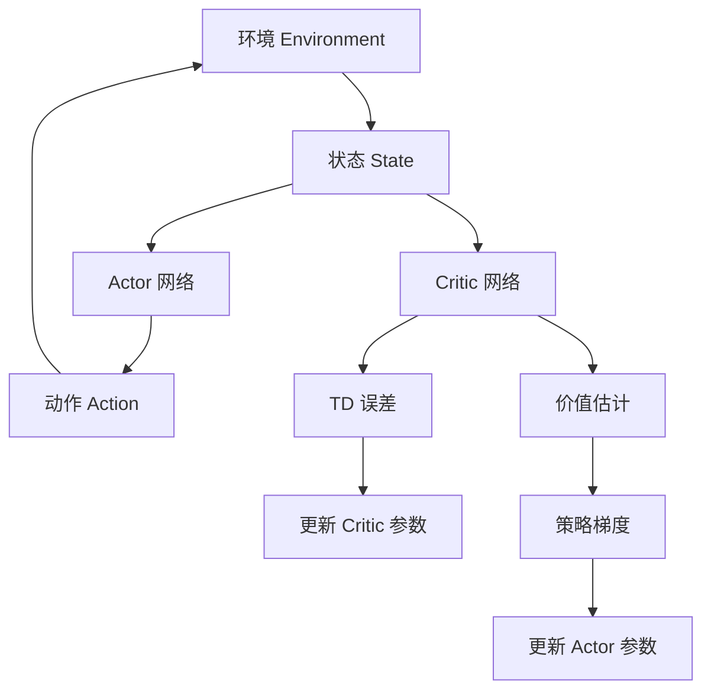

# 强化学习算法：Actor-Critic 原理与代码实例讲解

## 1. 背景介绍

### 1.1 强化学习概述

强化学习(Reinforcement Learning, RL)是机器学习的一个重要分支,它关注智能体(Agent)如何通过与环境(Environment)的交互来学习并采取最优策略(Policy),以最大化长期累积奖励(Reward)。与监督学习和无监督学习不同,强化学习没有提供明确的输入-输出示例,而是通过试错和奖惩机制来学习。

强化学习广泛应用于游戏、机器人控制、自动驾驶、资源管理等领域,展现出巨大的潜力。其核心思想是通过探索和利用的平衡,不断优化决策策略,以达到最佳行为。

### 1.2 Actor-Critic 算法的重要性

Actor-Critic 算法是强化学习中一种重要的策略梯度(Policy Gradient)方法,它将策略评估(Policy Evaluation)和策略改进(Policy Improvement)分离,使用两个独立的神经网络:Actor 网络用于选择行为,Critic 网络用于评估状态价值。

Actor-Critic 算法具有以下优势:

1. **高效学习**:通过引入基于价值的Critic网络,可以减少策略梯度的方差,提高学习效率。
2. **连续动作空间**:能够处理连续动作空间的问题,扩展了强化学习的应用范围。
3. **在线学习**:无需事先收集大量数据,可以在与环境交互的同时持续学习。
4. **稳定性**:Actor-Critic 架构具有更好的收敛性和稳定性。

Actor-Critic 算法在深度强化学习中扮演着关键角色,是理解和掌握现代强化学习技术的基础。

## 2. 核心概念与联系

### 2.1 马尔可夫决策过程(MDP)

马尔可夫决策过程(Markov Decision Process, MDP)是强化学习的数学基础。MDP由以下五元组组成:

- 状态集合 $\mathcal{S}$
- 动作集合 $\mathcal{A}$
- 转移概率 $\mathcal{P}_{ss'}^a = \Pr(s' | s, a)$
- 奖励函数 $\mathcal{R}_s^a = \mathbb{E}[R_{t+1} | S_t = s, A_t = a]$
- 折扣因子 $\gamma \in [0, 1)$

在 MDP 中,智能体在当前状态 $s_t$ 下选择动作 $a_t$,然后转移到新状态 $s_{t+1}$,并获得相应的奖励 $r_{t+1}$。目标是找到一个策略 $\pi$,使得期望的累积折扣奖励最大化:

$$J(\pi) = \mathbb{E}_\pi \left[ \sum_{t=0}^\infty \gamma^t r_{t+1} \right]$$

### 2.2 策略梯度方法

策略梯度(Policy Gradient)方法是求解 MDP 的一种重要方法,它直接对策略 $\pi_\theta$ 进行参数化,并通过梯度上升来优化策略参数 $\theta$,使期望奖励最大化。

策略梯度的目标函数为:

$$J(\theta) = \mathbb{E}_{\pi_\theta} \left[ \sum_{t=0}^\infty \gamma^t r_{t+1} \right]$$

根据策略梯度定理,我们可以计算目标函数的梯度:

$$\nabla_\theta J(\theta) = \mathbb{E}_{\pi_\theta} \left[ \sum_{t=0}^\infty \nabla_\theta \log \pi_\theta(a_t | s_t) Q^{\pi_\theta}(s_t, a_t) \right]$$

其中 $Q^{\pi_\theta}(s_t, a_t)$ 是在策略 $\pi_\theta$ 下,从状态 $s_t$ 执行动作 $a_t$ 开始的期望累积奖励。

### 2.3 Actor-Critic 架构

Actor-Critic 算法将策略评估和策略改进分离,使用两个独立的神经网络:

- **Actor 网络**:参数化策略 $\pi_\theta(a|s)$,输出在给定状态 $s$ 下选择动作 $a$ 的概率分布。
- **Critic 网络**:估计状态价值函数 $V^\pi(s)$ 或者状态-动作价值函数 $Q^\pi(s, a)$。

Actor 网络根据 Critic 网络提供的价值估计,通过策略梯度上升来更新策略参数 $\theta$。Critic 网络则根据时序差分(Temporal Difference, TD)误差来更新价值函数参数。

Actor-Critic 架构的核心思想是:Actor 专注于行为选择,而 Critic 则评估行为的好坏,二者相互作用,共同优化策略。

## 3. 核心算法原理具体操作步骤

### 3.1 Actor 网络

Actor 网络的目标是直接优化策略 $\pi_\theta(a|s)$,使期望累积奖励最大化。根据策略梯度定理,我们可以计算目标函数的梯度:

$$\nabla_\theta J(\theta) \approx \frac{1}{N} \sum_{i=1}^N \sum_{t=0}^\infty \nabla_\theta \log \pi_\theta(a_t^{(i)} | s_t^{(i)}) Q^{\pi_\theta}(s_t^{(i)}, a_t^{(i)})$$

其中 $N$ 是轨迹数量, $(s_t^{(i)}, a_t^{(i)}, r_{t+1}^{(i)})$ 是第 $i$ 条轨迹上的状态-动作-奖励序列。

为了减小梯度估计的方差,我们可以使用基线(Baseline)函数 $b(s_t)$,将梯度改写为:

$$\nabla_\theta J(\theta) \approx \frac{1}{N} \sum_{i=1}^N \sum_{t=0}^\infty \nabla_\theta \log \pi_\theta(a_t^{(i)} | s_t^{(i)}) \left( Q^{\pi_\theta}(s_t^{(i)}, a_t^{(i)}) - b(s_t^{(i)}) \right)$$

通常,我们将 Critic 网络估计的状态价值函数 $V^\pi(s_t)$ 作为基线函数。

在实践中,我们使用小批量(Mini-Batch)的方式来更新 Actor 网络参数:

$$\theta \leftarrow \theta + \alpha \frac{1}{N_b} \sum_{i=1}^{N_b} \sum_{t=0}^\infty \nabla_\theta \log \pi_\theta(a_t^{(i)} | s_t^{(i)}) \left( Q^{\pi_\theta}(s_t^{(i)}, a_t^{(i)}) - V^\pi(s_t^{(i)}) \right)$$

其中 $\alpha$ 是学习率, $N_b$ 是小批量大小。

### 3.2 Critic 网络

Critic 网络的目标是估计状态价值函数 $V^\pi(s)$ 或状态-动作价值函数 $Q^\pi(s, a)$。我们通常使用时序差分(TD)误差来更新 Critic 网络参数。

对于状态价值函数 $V^\pi(s)$,TD 误差为:

$$\delta_t = r_{t+1} + \gamma V^\pi(s_{t+1}) - V^\pi(s_t)$$

对于状态-动作价值函数 $Q^\pi(s, a)$,TD 误差为:

$$\delta_t = r_{t+1} + \gamma Q^\pi(s_{t+1}, a_{t+1}) - Q^\pi(s_t, a_t)$$

我们使用均方误差(Mean Squared Error, MSE)作为损失函数,通过梯度下降法更新 Critic 网络参数:

$$\theta_v \leftarrow \theta_v - \alpha \nabla_{\theta_v} \frac{1}{2} \delta_t^2$$

在实践中,我们通常使用目标网络(Target Network)和重播缓冲区(Replay Buffer)等技术来提高 Critic 网络的稳定性和样本效率。

## 4. 数学模型和公式详细讲解举例说明

### 4.1 策略梯度定理

策略梯度定理是 Actor-Critic 算法的理论基础,它给出了目标函数梯度的解析表达式。

$$\begin{aligned}
\nabla_\theta J(\theta) &= \mathbb{E}_{\pi_\theta} \left[ \sum_{t=0}^\infty \nabla_\theta \log \pi_\theta(a_t | s_t) Q^{\pi_\theta}(s_t, a_t) \right] \\
&= \mathbb{E}_{\pi_\theta} \left[ \sum_{t=0}^\infty \nabla_\theta \log \pi_\theta(a_t | s_t) \left( \sum_{t'=t}^\infty \gamma^{t'-t} r_{t'+1} \right) \right] \\
&= \mathbb{E}_{\pi_\theta} \left[ \sum_{t=0}^\infty \nabla_\theta \log \pi_\theta(a_t | s_t) \left( r_t + \gamma r_{t+1} + \gamma^2 r_{t+2} + \cdots \right) \right]
\end{aligned}$$

其中 $Q^{\pi_\theta}(s_t, a_t)$ 是在策略 $\pi_\theta$ 下,从状态 $s_t$ 执行动作 $a_t$ 开始的期望累积奖励。

我们可以看到,策略梯度是关于动作对数概率的梯度,加权了从该状态-动作对开始的累积奖励。这意味着,如果一个动作能够带来较高的累积奖励,那么我们就应该增加该动作在当前状态下被选择的概率。

### 4.2 基线函数

为了减小策略梯度估计的方差,我们可以引入基线函数 $b(s_t)$,将梯度改写为:

$$\nabla_\theta J(\theta) = \mathbb{E}_{\pi_\theta} \left[ \sum_{t=0}^\infty \nabla_\theta \log \pi_\theta(a_t | s_t) \left( Q^{\pi_\theta}(s_t, a_t) - b(s_t) \right) \right]$$

理想情况下,基线函数 $b(s_t)$ 应该满足:

$$\mathbb{E}_{a_t \sim \pi_\theta} \left[ b(s_t) \right] = \mathbb{E}_{a_t \sim \pi_\theta} \left[ Q^{\pi_\theta}(s_t, a_t) \right]$$

这样可以确保基线函数的期望等于状态-动作价值函数的期望,从而不会影响梯度的无偏性。

通常,我们将 Critic 网络估计的状态价值函数 $V^\pi(s_t)$ 作为基线函数:

$$b(s_t) = V^\pi(s_t)$$

这种选择可以最小化梯度估计的方差,因为 $V^\pi(s_t)$ 是 $Q^{\pi_\theta}(s_t, a_t)$ 在动作空间上的期望。

### 4.3 优势函数

优势函数(Advantage Function) $A^\pi(s_t, a_t)$ 定义为状态-动作价值函数 $Q^\pi(s_t, a_t)$ 与状态价值函数 $V^\pi(s_t)$ 的差值:

$$A^\pi(s_t, a_t) = Q^\pi(s_t, a_t) - V^\pi(s_t)$$

优势函数表示在状态 $s_t$ 下执行动作 $a_t$ 相对于平均行为的优势。如果 $A^\pi(s_t, a_t)$ 为正,则表示执行该动作比平均行为更好;如果为负,则表示执行该动作比平均行为更差。

将优势函数代入策略梯度公式,我们可以得到:

$$\nabla_\theta J(\theta) = \mathbb{E}_{\pi_\theta} \left[ \sum_{t=0}^\infty \nabla_\theta \log \pi_\theta(a_t | s_t) A^\pi(s_t, a_t) \right]$$

这种形式更加简洁,直观地反映了策略梯度的本质:增加那些具有正优势的动作的概率,减小那些具有负优势的动作的概率。

### 4.4 Actor-Critic 算法实例

考虑一个简单的网格世界(Grid World)环境,智能体需要从起点到达终点。我们使用 Actor-Critic 算法来训练智能体的