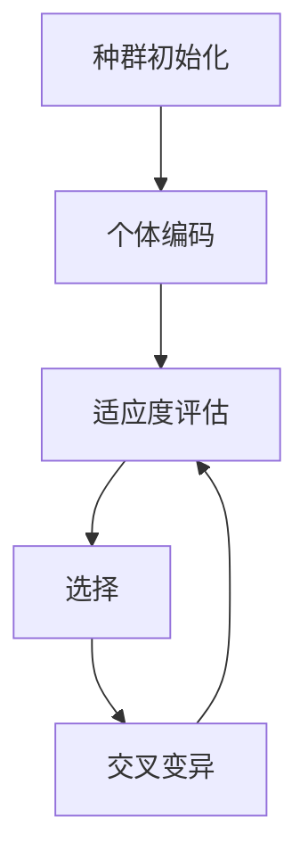
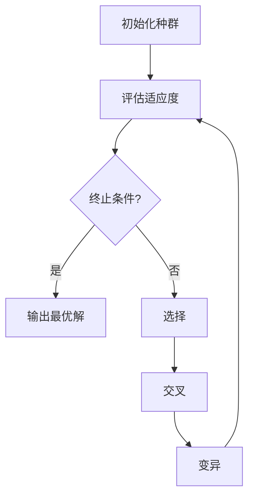

# 强化学习算法：遗传算法 原理与代码实例讲解

## 1.背景介绍

### 1.1 什么是强化学习?

强化学习(Reinforcement Learning)是机器学习的一个重要分支,它关注于如何基于环境反馈来学习做出最优决策。不同于监督学习需要大量标注数据,强化学习的智能体(Agent)通过与环境(Environment)持续交互,根据获得的奖励(Reward)信号来调整策略,最终达到最大化预期累积奖励的目标。

### 1.2 遗传算法在强化学习中的作用

遗传算法(Genetic Algorithm)是一种借鉴生物进化过程的优化算法,通过模拟自然选择、交叉变异等机制,从种群中不断进化出更优秀的个体。在强化学习领域,遗传算法常被用于:

1. 策略搜索(Policy Search):直接对策略参数进行编码和进化,寻找最优策略。
2. 价值函数近似(Value Function Approximation):对价值函数的参数进行编码和优化。
3. 环境模型发现(Environment Model Discovery):发现环境的转移函数和奖励函数。

## 2.核心概念与联系

### 2.1 遗传算法基本概念



1. **种群初始化**: 随机生成一定数量的个体,作为初始种群。
2. **个体编码**: 将问题的潜在解映射为染色体表示。
3. **适应度评估**: 计算每个个体的适应度,作为选择和进化的依据。
4. **选择**: 根据适应度,选择优秀个体进行交叉变异操作。
5. **交叉变异**: 通过交叉和变异产生新的个体,形成新一代种群。

### 2.2 遗传算法在强化学习中的应用

在强化学习中,遗传算法可以用于直接对策略或价值函数进行编码和优化。以策略搜索为例:

1. **编码**: 将策略参数编码为染色体表示。
2. **适应度评估**: 在模拟环境中执行策略,将累积奖励作为适应度。
3. **选择、交叉变异**: 根据适应度选择优秀个体,并通过交叉变异生成新策略。
4. **迭代进化**: 重复上述过程,直至满足终止条件。

通过这种进化方式,可以逐步发现更优秀的策略,达到强化学习的目标。

## 3.核心算法原理具体操作步骤

### 3.1 遗传算法流程

遗传算法的核心流程如下:



1. **初始化种群**: 随机生成一定数量的个体作为初始种群。
2. **评估适应度**: 计算每个个体的适应度,作为选择的依据。
3. **终止条件检查**: 若满足终止条件(如达到最大进化代数或适应度收敛),则输出当前最优解并结束;否则进行下一步。
4. **选择**: 根据适应度,选择优秀个体进行交叉变异操作。常用的选择方法包括轮盘赌选择、锦标赛选择等。
5. **交叉**: 将选中的父代个体按某种方式进行组合,产生新的子代个体。常用的交叉方式包括单点交叉、多点交叉等。
6. **变异**: 对子代个体的染色体进行少量随机变异,以维持种群多样性。常用的变异方式包括bit翻转、均匀变异等。
7. **回到步骤2**: 对新一代种群重复评估适应度,直至满足终止条件。

### 3.2 关键参数设置

遗传算法的性能与以下参数密切相关:

- **种群规模**: 种群中个体的数量。较大的种群规模有利于维持多样性,但计算代价也更高。
- **交叉概率、变异概率**: 控制交叉和变异操作的频率。过高或过低都会影响算法性能。
- **选择压力**: 指选择过程中优秀个体被选中的概率与较差个体的比值。选择压力过大易导致早熟收敛。
- **终止条件**: 常用的终止条件包括最大进化代数、适应度收敛阈值等。

合理设置这些参数对算法性能至关重要,通常需要进行大量实验调优。

## 4.数学模型和公式详细讲解举例说明

### 4.1 适应度函数

适应度函数(Fitness Function)用于评估个体的优劣,是遗传算法的核心部分。在强化学习中,适应度函数常与累积奖励挂钩。

假设策略$\pi$在环境$\mathcal{E}$中执行$N$个episode,每个episode的奖励序列为$\{r_1, r_2, ..., r_T\}$,则适应度函数可定义为:

$$\text{Fitness}(\pi) = \frac{1}{N}\sum_{i=1}^{N}\sum_{t=1}^{T}\gamma^tr_t^{(i)}$$

其中$\gamma$是折扣因子,用于权衡未来奖励的重要性。这种设计使得策略能够最大化预期累积奖励。

### 4.2 选择算子

选择算子(Selection Operator)决定了哪些个体将被选中进行交叉变异操作。常用的选择算子包括:

1. **轮盘赌选择(Roulette Wheel Selection)**:
   - 每个个体被选中的概率与其适应度成正比。
   - 适应度较高的个体被选中概率更大。
   - 数学表达式:$P(i) = \frac{\text{Fitness}(i)}{\sum_{j=1}^{N}\text{Fitness}(j)}$

2. **锦标赛选择(Tournament Selection)**:
   - 从种群中随机选取$k$个个体进行比赛,适应度最高者被选中。
   - 可控制选择压力的大小。
   - 数学表达式:$P(i) = \binom{N}{k}p_{\text{win}}^k(1-p_{\text{win}})^{N-k}$,其中$p_{\text{win}}$是$i$在$k$个个体中胜出的概率。

通过合理的选择算子,可以在多样性和选择压力之间取得平衡。

### 4.3 交叉算子

交叉算子(Crossover Operator)通过组合父代个体的特征产生新的子代个体。常用的交叉算子包括:

1. **单点交叉**:
   - 在父代个体的染色体上随机选取一个交叉点。
   - 将两个父代个体在该点前后的基因片段互换,形成两个子代个体。

2. **多点交叉**:
   - 在父代个体的染色体上随机选取多个交叉点。
   - 将父代个体在这些交叉点间的基因片段互换,形成子代个体。

3. **均匀交叉**:
   - 对于每一个基因位,随机从两个父代中选取一个基因组成子代。

交叉算子的设计需要考虑问题的特征,以产生更优秀的子代个体。

### 4.4 变异算子

变异算子(Mutation Operator)通过对个体的染色体进行少量随机变异,来维持种群的多样性。常用的变异算子包括:

1. **bit翻转变异**:
   - 对于二进制编码,随机选取一些基因位进行bit翻转(0变1,1变0)。

2. **均匀变异**:
   - 对于实数编码,随机选取一些基因位,将其替换为区间内的随机值。

3. **高斯变异**:
   - 对于实数编码,在原有基因值的基础上加上一个服从高斯分布的随机扰动。

变异算子的设计需要平衡多样性和局部搜索能力。过高的变异率会破坏优良个体的结构,过低则无法有效探索解空间。

## 5.项目实践:代码实例和详细解释说明

下面是一个使用Python实现的简单遗传算法示例,用于求解单峰函数$f(x) = x^2$的最小值:

```python
import random
import numpy as np

# 定义适应度函数
def fitness_func(x):
    return x**2

# 初始化种群
def init_population(pop_size, chromosome_length):
    population = []
    for _ in range(pop_size):
        chromosome = [random.randint(0, 1) for _ in range(chromosome_length)]
        population.append(chromosome)
    return population

# 计算适应度
def calculate_fitness(population):
    fitness_values = []
    for chromosome in population:
        x = decode_chromosome(chromosome)
        fitness = fitness_func(x)
        fitness_values.append(fitness)
    return fitness_values

# 将二进制编码解码为实数
def decode_chromosome(chromosome):
    chromosome = ''.join(map(str, chromosome))
    x = int(chromosome, 2)
    x = x / (2**len(chromosome) - 1) * 10 - 5  # 将x映射到[-5, 5]区间
    return x

# 轮盘赌选择
def roulette_wheel_selection(population, fitness_values):
    total_fitness = sum(fitness_values)
    selection_probs = [fitness / total_fitness for fitness in fitness_values]
    selected_indices = np.random.choice(len(population), size=len(population), p=selection_probs, replace=True)
    selected_population = [population[i] for i in selected_indices]
    return selected_population

# 单点交叉
def single_point_crossover(parent1, parent2):
    crossover_point = random.randint(1, len(parent1) - 1)
    child1 = parent1[:crossover_point] + parent2[crossover_point:]
    child2 = parent2[:crossover_point] + parent1[crossover_point:]
    return child1, child2

# 变异
def mutate(chromosome, mutation_rate):
    for i in range(len(chromosome)):
        if random.random() < mutation_rate:
            chromosome[i] = 1 - chromosome[i]
    return chromosome

# 遗传算法主循环
def genetic_algorithm(pop_size, chromosome_length, max_generations, mutation_rate):
    population = init_population(pop_size, chromosome_length)
    for generation in range(max_generations):
        fitness_values = calculate_fitness(population)
        best_fitness = min(fitness_values)
        best_chromosome = population[fitness_values.index(best_fitness)]
        print(f"Generation {generation}: Best fitness = {best_fitness}, Best chromosome = {best_chromosome}")

        selected_population = roulette_wheel_selection(population, fitness_values)
        offspring_population = []
        for i in range(0, pop_size, 2):
            parent1 = selected_population[i]
            parent2 = selected_population[i+1]
            child1, child2 = single_point_crossover(parent1, parent2)
            child1 = mutate(child1, mutation_rate)
            child2 = mutate(child2, mutation_rate)
            offspring_population.append(child1)
            offspring_population.append(child2)
        population = offspring_population

    best_fitness = min(calculate_fitness(population))
    best_chromosome = population[calculate_fitness(population).index(best_fitness)]
    best_x = decode_chromosome(best_chromosome)
    print(f"Best solution found: x = {best_x}, f(x) = {best_fitness}")

# 运行遗传算法
genetic_algorithm(pop_size=100, chromosome_length=10, max_generations=100, mutation_rate=0.1)
```

代码解释:

1. 定义适应度函数`fitness_func`为目标函数$f(x) = x^2$。
2. `init_population`函数用于初始化种群,每个个体由长度为`chromosome_length`的二进制串表示。
3. `calculate_fitness`函数计算每个个体的适应度,即目标函数值。
4. `decode_chromosome`函数将二进制编码解码为实数,并将其映射到[-5, 5]区间。
5. `roulette_wheel_selection`函数实现了轮盘赌选择算子。
6. `single_point_crossover`函数实现了单点交叉算子。
7. `mutate`函数实现了变异算子,对每个基因位以`mutation_rate`的概率进行bit翻转变异。
8. `genetic_algorithm`函数是遗传算法的主循环,包括适应度评估、选择、交叉变异等步骤。
9. 在每一代,打印当前最优个体的适应度和染色体编码。
10. 最终输出找到的最优解及其对应的目标函数值。

运行结果示例:

```
Generation 0: Best fitness = 15.2734375, Best chromosome = [1, 0, 1, 1, 0, 1, 0, 0, 1, 1]
Generation 1: Best fitness = 13.7109375