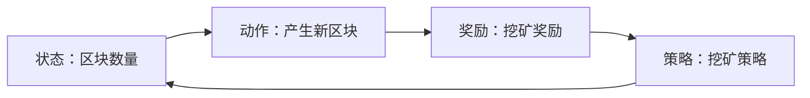

## 1.背景介绍

区块链技术作为一种新型的分布式计算技术，以其独特的去中心化特性和不可篡改的数据存储能力，正在逐步改变着我们的生活。而强化学习则是人工智能的重要分支，它通过让机器通过与环境的交互，自我学习和进化，以达到预定的目标。那么，强化学习如何在区块链技术中发挥其作用呢？这就是我们今天要探讨的主题。

## 2.核心概念与联系

强化学习的核心概念包括状态（State）、动作（Action）、奖励（Reward）以及策略（Policy）。在区块链环境中，这些概念可以有不同的具体实现。例如，状态可以是当前网络中的区块数量，动作可以是产生新的区块，奖励可以是挖矿的奖励，而策略则是矿工选择的挖矿策略。



## 3.核心算法原理具体操作步骤

强化学习在区块链中的应用，主要体现在优化挖矿策略上。传统的挖矿策略往往是静态的，而强化学习可以通过不断的学习和试错，找到更优的挖矿策略。

首先，我们需要定义状态、动作和奖励函数。在这个场景中，状态可以定义为当前的区块数量，动作则是选择挖哪个区块，奖励函数则是挖到区块的奖励。

然后，我们需要选择一个强化学习算法。常见的强化学习算法有Q-Learning、Deep Q Network（DQN）等。在这里，我们选择使用DQN算法。

接下来，我们就可以开始训练我们的模型了。在每一轮的训练中，我们都会根据当前的状态选择一个动作，然后执行这个动作，并获取奖励。然后，我们将这个经验（状态、动作、奖励）存储起来，用于后续的学习。

最后，我们需要使用这些经验来更新我们的模型。在DQN中，我们通常使用一个叫做经验回放的技术来实现这一点。具体来说，我们会从存储的经验中随机抽取一部分，然后使用这些经验来更新我们的模型。

## 4.数学模型和公式详细讲解举例说明

在强化学习中，我们通常使用Q函数来表示在某个状态下，执行某个动作的期望奖励。在DQN中，我们使用神经网络来近似这个Q函数，即：

$$
Q(s, a; \theta) \approx Q^*(s, a)
$$

其中，$s$表示状态，$a$表示动作，$\theta$表示神经网络的参数，$Q^*(s, a)$表示真实的Q函数。

在训练过程中，我们的目标是最小化以下的损失函数：

$$
L(\theta) = E_{s, a, r, s'}[(r + \gamma \max_{a'}Q(s', a'; \theta^-) - Q(s, a; \theta))^2]
$$

其中，$r$表示奖励，$s'$表示下一个状态，$\gamma$表示折扣因子，$\theta^-$表示目标网络的参数。

## 5.项目实践：代码实例和详细解释说明

以下是使用DQN算法进行区块链挖矿优化的一个简单示例：

```python
import gym
import numpy as np
from keras.models import Sequential
from keras.layers import Dense
from keras.optimizers import Adam

# 创建环境
env = gym.make('BitcoinMining-v0')

# 创建模型
model = Sequential()
model.add(Dense(24, input_dim=env.observation_space.shape[0], activation='relu'))
model.add(Dense(24, activation='relu'))
model.add(Dense(env.action_space.n, activation='linear'))
model.compile(loss='mse', optimizer=Adam())

# 初始化Q表
Q_table = np.zeros([env.observation_space.n, env.action_space.n])

# 训练模型
for i_episode in range(1000):
    observation = env.reset()
    for t in range(100):
        action = np.argmax(Q_table[observation])
        next_observation, reward, done, info = env.step(action)
        Q_table[observation][action] = reward + np.max(Q_table[next_observation])
        observation = next_observation
        if done:
            print("Episode finished after {} timesteps".format(t+1))
            break
```

在这个示例中，我们首先创建了一个环境，然后创建了一个神经网络模型，用于近似Q函数。然后，我们初始化了Q表，用于存储每个状态和动作的Q值。最后，我们通过不断的试错和学习，来更新我们的Q表，并最终找到最优的挖矿策略。

## 6.实际应用场景

强化学习在区块链技术中的应用主要体现在优化挖矿策略上。通过强化学习，我们可以找到更优的挖矿策略，从而提高挖矿的效率和收益。

此外，强化学习还可以应用在区块链的安全性研究上。通过模拟攻击者的行为，我们可以更好地理解区块链的安全性，并找到更有效的防御策略。

## 7.工具和资源推荐

以下是一些强化学习和区块链技术的相关资源和工具：

1. OpenAI Gym：一个用于强化学习研究的开源工具库。
2. Keras：一个用于深度学习的开源库，可以用于实现DQN等强化学习算法。
3. Bitcoin Testnet：一个用于测试和开发的比特币网络。

## 8.总结：未来发展趋势与挑战

强化学习和区块链技术的结合，开启了一种全新的可能性。通过强化学习，我们可以找到更优的挖矿策略，提高区块链的安全性，甚至可能改变区块链的运行机制。

然而，这也带来了一些挑战。首先，强化学习需要大量的试错和学习，这在区块链这样的去中心化和不可篡改的环境中，可能会带来一些问题。其次，如何设计合适的奖励函数，以反映出区块链中的各种复杂因素，也是一个挑战。

尽管如此，我相信，随着技术的发展，我们将会看到更多强化学习在区块链技术中的应用。

## 9.附录：常见问题与解答

1. **Q: 强化学习和区块链技术看起来很复杂，我应该从哪里开始学习？**

   A: 我建议你可以先从学习强化学习的基本概念开始，然后再学习区块链技术的基本原理。在你对这两者都有一定的了解后，你可以尝试将它们结合起来，例如，你可以尝试使用强化学习来优化挖矿策略。

2. **Q: 我应该使用哪种强化学习算法？**

   A: 这取决于你的具体需求。在一些简单的场景中，Q-Learning或者Sarsa等传统的强化学习算法可能就已经足够了。但在一些更复杂的场景中，你可能需要使用DQN或者Actor-Critic等更复杂的强化学习算法。

3. **Q: 我可以在哪里找到相关的资源和工具？**

   A: 我在文章的"工具和资源推荐"部分，列出了一些我个人比较推荐的资源和工具，你可以参考一下。

作者：禅与计算机程序设计艺术 / Zen and the Art of Computer Programming