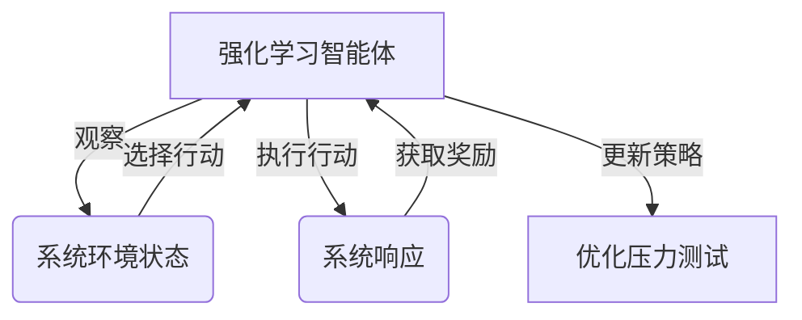

# 强化学习：在压力测试中的应用

## 1.背景介绍

### 1.1 压力测试的重要性

在现代软件开发过程中,压力测试是一个至关重要的环节。随着应用程序复杂性的不断增加,以及用户对性能和可靠性要求的提高,确保系统在高负载和极端条件下的稳定运行变得至关重要。压力测试旨在模拟真实世界中的高压力场景,评估系统的性能、可扩展性和容错能力,从而发现潜在的瓶颈和漏洞。

### 1.2 传统压力测试方法的局限性

传统的压力测试方法通常依赖于预先定义的测试用例和脚本,这些用例和脚本是基于开发人员和测试人员对系统行为的假设而设计的。然而,随着系统复杂度的增加,预测所有可能的行为模式变得越来越困难。此外,手动设计和维护这些测试用例和脚本也变得越来越耗时和昂贵。

## 2.核心概念与联系

### 2.1 强化学习概述

强化学习(Reinforcement Learning)是机器学习的一个重要分支,它涉及一个智能体(Agent)与环境(Environment)之间的交互。智能体通过观察环境的状态,选择行动,并根据行动的结果获得奖励或惩罚,从而学习最优策略。强化学习的目标是找到一个策略,使智能体在给定环境中获得最大的累积奖励。

### 2.2 强化学习在压力测试中的应用

将强化学习应用于压力测试,可以克服传统方法的局限性。智能体可以通过与系统交互来探索不同的行为模式,而不需要预先定义所有可能的测试用例。通过奖励机制,智能体可以学习到哪些行为模式更有可能导致系统故障或性能下降,从而自动生成高质量的压力测试用例。

该方法的优势在于,它可以自动发现系统的薄弱环节,而不需要人工干预。此外,由于智能体可以持续学习和适应,因此压力测试过程可以动态调整,以应对系统的变化和演化。

### 2.3 Mermaid 流程图



该流程图描述了强化学习在压力测试中的应用过程。智能体通过观察系统环境状态,选择行动并执行。根据系统的响应,智能体获得奖励或惩罚,并基于这些反馈更新其策略。通过不断优化,智能体可以逐步发现最佳的压力测试方案。

## 3.核心算法原理具体操作步骤

### 3.1 马尔可夫决策过程

强化学习问题通常被建模为马尔可夫决策过程(Markov Decision Process, MDP)。MDP由以下几个要素组成:

- 状态集合 $\mathcal{S}$: 描述环境的所有可能状态
- 行动集合 $\mathcal{A}$: 智能体可以采取的所有可能行动
- 转移概率 $\mathcal{P}_{ss'}^a = \mathcal{P}(s'|s, a)$: 在状态 $s$ 下采取行动 $a$ 后,转移到状态 $s'$ 的概率
- 奖励函数 $\mathcal{R}_s^a$: 在状态 $s$ 下采取行动 $a$ 后获得的即时奖励

目标是找到一个策略 $\pi: \mathcal{S} \rightarrow \mathcal{A}$,使得在该策略下,智能体可以获得最大的期望累积奖励。

### 3.2 Q-Learning 算法

Q-Learning 是一种常用的强化学习算法,它不需要事先知道环境的转移概率和奖励函数,而是通过与环境的交互来学习最优策略。

Q-Learning 算法维护一个 Q 表,其中 $Q(s, a)$ 表示在状态 $s$ 下采取行动 $a$ 后,可以获得的期望累积奖励。算法通过不断更新 Q 表,逐步逼近最优策略。

具体操作步骤如下:

1. 初始化 Q 表,所有 $Q(s, a)$ 值设置为任意值(通常为 0)
2. 对于每一个时间步:
    - 观察当前状态 $s$
    - 根据某种策略(如 $\epsilon$-贪婪策略)选择行动 $a$
    - 执行行动 $a$,观察下一个状态 $s'$ 和即时奖励 $r$
    - 更新 $Q(s, a)$ 值:
        $$Q(s, a) \leftarrow Q(s, a) + \alpha \left[r + \gamma \max_{a'} Q(s', a') - Q(s, a)\right]$$
        其中 $\alpha$ 是学习率, $\gamma$ 是折扣因子

3. 重复步骤 2,直到 Q 表收敛

通过上述步骤,Q-Learning 算法可以逐步学习到最优策略,而无需事先了解环境的细节。

## 4.数学模型和公式详细讲解举例说明

### 4.1 贝尔曼方程

贝尔曼方程(Bellman Equation)是强化学习理论的基础,它描述了最优策略和最优值函数之间的关系。

对于任意策略 $\pi$,我们定义其值函数 $V^\pi(s)$ 为在状态 $s$ 下遵循策略 $\pi$ 所能获得的期望累积奖励:

$$V^\pi(s) = \mathbb{E}_\pi \left[ \sum_{t=0}^\infty \gamma^t r_{t+1} \mid s_0 = s \right]$$

其中 $\gamma \in [0, 1)$ 是折扣因子,用于权衡即时奖励和长期奖励的重要性。

贝尔曼方程为值函数提供了一个递归定义:

$$V^\pi(s) = \mathbb{E}_\pi \left[ r(s, a) + \gamma \sum_{s'} \mathcal{P}_{ss'}^a V^\pi(s') \right]$$

该方程表明,在状态 $s$ 下遵循策略 $\pi$ 所能获得的期望累积奖励,等于在该状态下获得的即时奖励,加上根据转移概率加权的下一状态的值函数之和。

类似地,我们可以定义行动值函数 $Q^\pi(s, a)$,表示在状态 $s$ 下采取行动 $a$,之后遵循策略 $\pi$ 所能获得的期望累积奖励:

$$Q^\pi(s, a) = \mathbb{E}_\pi \left[ r(s, a) + \gamma \sum_{s'} \mathcal{P}_{ss'}^a V^\pi(s') \right]$$

最优值函数 $V^*(s)$ 和最优行动值函数 $Q^*(s, a)$ 分别定义为:

$$V^*(s) = \max_\pi V^\pi(s)$$
$$Q^*(s, a) = \max_\pi Q^\pi(s, a)$$

它们满足以下贝尔曼最优方程:

$$V^*(s) = \max_a \mathbb{E} \left[ r(s, a) + \gamma \sum_{s'} \mathcal{P}_{ss'}^a V^*(s') \right]$$
$$Q^*(s, a) = \mathbb{E} \left[ r(s, a) + \gamma \sum_{s'} \mathcal{P}_{ss'}^a \max_{a'} Q^*(s', a') \right]$$

这些方程为强化学习算法提供了理论基础,许多算法都是在试图求解这些方程。

### 4.2 Q-Learning 算法的收敛性

Q-Learning 算法的目标是找到最优行动值函数 $Q^*(s, a)$。在满足某些条件下,Q-Learning 算法可以保证收敛到 $Q^*$。

具体来说,如果满足以下条件:

1. 每个状态-行动对 $(s, a)$ 被探索无限次
2. 学习率 $\alpha_t(s, a)$ 满足:
    - $\sum_{t=0}^\infty \alpha_t(s, a) = \infty$ (持续学习)
    - $\sum_{t=0}^\infty \alpha_t^2(s, a) < \infty$ (适当衰减)

那么,Q-Learning 算法将以概率 1 收敛到 $Q^*$。

证明思路如下:

令 $Q_t(s, a)$ 表示第 $t$ 次迭代后的 $Q$ 值估计,我们可以证明 $Q_t(s, a)$ 是一个关于 $Q^*(s, a)$ 的无偏估计,即:

$$\mathbb{E}[Q_t(s, a)] = Q^*(s, a)$$

根据随机过程理论,如果一个无偏估计满足适当的条件(如上述条件 1 和 2),那么它将以概率 1 收敛到其期望值。因此,Q-Learning 算法将以概率 1 收敛到 $Q^*$。

### 4.3 探索与利用权衡

在强化学习过程中,智能体需要权衡探索(exploration)和利用(exploitation)之间的平衡。

- 探索: 尝试新的行动,以发现潜在的更优策略
- 利用: 利用当前已知的最优行动,以获得更高的即时奖励

过多的探索可能会导致浪费时间和资源,而过多的利用则可能会陷入次优解。因此,需要一个合理的策略来平衡这两者。

一种常用的策略是 $\epsilon$-贪婪(epsilon-greedy)策略。在该策略下,智能体有 $\epsilon$ 的概率随机选择一个行动(探索),有 $1 - \epsilon$ 的概率选择当前已知的最优行动(利用)。$\epsilon$ 的值通常会随着时间的推移而递减,以确保在后期更多地利用已学习的知识。

此外,还有其他策略可以用于探索与利用权衡,如软max策略、上限置信度加强(Upper Confidence Bound)等。选择合适的策略对于强化学习算法的性能至关重要。

## 5.项目实践:代码实例和详细解释说明

为了更好地理解强化学习在压力测试中的应用,我们将通过一个简单的示例项目来演示。在这个项目中,我们将使用 Q-Learning 算法训练一个智能体,以找到一种有效的压力测试方案。

### 5.1 环境设置

我们将构建一个简化的Web服务器环境,其中包含以下组件:

- Web服务器: 处理传入的HTTP请求
- 负载均衡器: 将请求分发到多个Web服务器实例
- 数据库: 存储Web应用程序的数据

智能体的目标是通过发送不同类型和强度的请求,找到一种能够导致系统性能下降或故障的压力测试方案。

环境状态由以下几个指标描述:

- CPU利用率
- 内存利用率
- 网络吞吐量
- 数据库连接数
- 响应时间

智能体可以选择以下行动:

- 增加HTTP请求数
- 减少HTTP请求数
- 改变请求类型(读/写)
- 改变请求分布(均匀/集中)

根据系统的响应,智能体将获得相应的奖励或惩罚。

### 5.2 Q-Learning 实现

我们将使用 Python 和 OpenAI Gym 库来实现 Q-Learning 算法。以下是一个简化的代码示例:

```python
import gym
import numpy as np

# 创建环境
env = gym.make('WebServerEnv-v0')

# 初始化 Q 表
Q = np.zeros((env.observation_space.n, env.action_space.n))

# 超参数
alpha = 0.1  # 学习率
gamma = 0.99  # 折扣因子
epsilon = 1.0  # 探索率

# Q-Learning 算法
for episode in range(num_episodes):
    state = env.reset()
    done = False
    
    while not done:
        # 选择行动
        if np.random.uniform() < epsilon:
            action = env.action_space.sample()  # 探索
        else:
            action = np.argmax(Q[state])  # 利用
        
        # 执行行动
        next_state, reward, done, _ = env.step(action)
        
        # 更新 Q 表
        Q[state, action] += alpha * (reward + gamma * np.max(Q[next_state]) - Q[state, action])
        
        state = next_state
    
    # 更新探索率
    epsilon *= 0.99

# 输出最优策略
policy = np