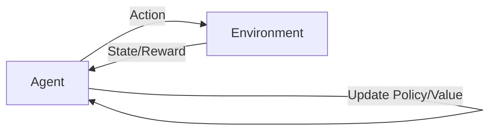

# 强化学习：在电子游戏中的应用

## 1.背景介绍

强化学习(Reinforcement Learning, RL)是机器学习的一个重要分支,它旨在使智能体(agent)通过与环境的交互来学习最优策略,从而最大化累积奖励。近年来,随着深度学习的发展,深度强化学习(Deep Reinforcement Learning, DRL)取得了显著进展,在电子游戏、机器人控制、自动驾驶等领域展现出巨大潜力。

电子游戏是强化学习的理想测试平台。游戏环境提供了丰富的状态信息和及时的奖励反馈,同时具有可控、可重复、低成本等优点。通过在游戏中训练智能体,可以验证强化学习算法的有效性,并为现实世界中更复杂的决策问题提供解决思路。本文将重点探讨强化学习在电子游戏领域的应用,介绍相关概念、算法、实践案例以及未来发展方向。

### 1.1 强化学习的定义与特点

强化学习是一种目标导向的学习范式,旨在通过试错与环境交互来学习最优决策。与监督学习和非监督学习不同,强化学习并不依赖于预先标注的数据,而是让智能体在与环境交互的过程中自主学习和优化策略。

强化学习的核心要素包括:

- 智能体(Agent):做出决策和执行动作的主体。
- 环境(Environment):智能体所处的外部环境,提供状态信息和奖励反馈。
- 状态(State):环境在某一时刻的表征。
- 动作(Action):智能体根据当前状态选择的行为。
- 奖励(Reward):环境对智能体动作的即时反馈,用于引导智能体学习最优策略。
- 策略(Policy):智能体的决策函数,将状态映射为动作的概率分布。
- 价值函数(Value Function):评估状态或状态-动作对的长期累积奖励。

强化学习的目标是通过不断与环境交互,使智能体学习到一个最优策略,使得在该策略下获得的累积奖励最大化。这一过程可以用下面的Mermaid流程图表示:

### 1.2 强化学习在游戏中的优势

电子游戏为强化学习提供了理想的实验平台,具有以下优势:

1. 丰富的状态和动作空间:游戏环境通常具有高维度的状态表示(如屏幕像素)和复杂的动作组合,为智能体提供了足够的探索和学习空间。

2. 明确的奖励机制:游戏中的得分、生命值等指标可以直接作为奖励信号,引导智能体优化策略。

3. 可控的环境:游戏环境是确定性的,可以方便地重置和重复实验,有利于算法的调试和优化。

4. 低成本和高效:与真实世界的实验相比,在游戏中训练智能体的成本更低,速度更快,可以支持大规模的数据采集和策略迭代。

5. 安全性:游戏环境是虚拟的,不会对现实世界造成直接影响,因此可以放心地进行各种尝试和探索。

### 1.3 强化学习在游戏中的应用历史

强化学习在游戏领域已有数十年的研究历史,一些里程碑式的进展包括:

- 1992年,Gerald Tesauro开发了TD-Gammon系统,使用时间差分(TD)学习算法在西洋双陆棋游戏中达到了人类专家水平。

- 2013年,DeepMind提出了深度Q网络(DQN)算法,将深度学习与Q学习相结合,在Atari 2600游戏平台上实现了超越人类的表现。

- 2016年,DeepMind开发的AlphaGo系统在围棋比赛中击败了世界冠军李世石,展示了深度强化学习在复杂博弈问题上的巨大潜力。

- 2019年,OpenAI的Five系统在Dota 2游戏中击败了职业人类选手团队,证明了多智能体强化学习在协作与对抗环境中的有效性。

这些里程碑式的进展推动了强化学习理论和算法的不断发展,也为现实世界中更广泛的应用奠定了基础。

## 2.核心概念与联系

### 2.1 马尔可夫决策过程

马尔可夫决策过程(Markov Decision Process, MDP)是强化学习的理论基础,用于描述智能体与环境交互的过程。MDP由以下要素组成:

- 状态空间 $\mathcal{S}$:所有可能的状态集合。
- 动作空间 $\mathcal{A}$:智能体可选择的动作集合。
- 转移概率 $\mathcal{P}(s'|s,a)$:在状态 $s$ 下执行动作 $a$ 后转移到状态 $s'$ 的概率。
- 奖励函数 $\mathcal{R}(s,a)$:在状态 $s$ 下执行动作 $a$ 获得的即时奖励。
- 折扣因子 $\gamma \in [0,1]$:用于平衡即时奖励和未来奖励的相对重要性。

MDP的目标是找到一个最优策略 $\pi^*$,使得在该策略下获得的期望累积奖励最大化:

$$\pi^* = \arg\max_\pi \mathbb{E}\left[\sum_{t=0}^{\infty} \gamma^t \mathcal{R}(s_t,a_t) | \pi \right]$$

其中, $s_t$ 和 $a_t$ 分别表示在时刻 $t$ 的状态和动作。

### 2.2 价值函数

价值函数是强化学习中的核心概念,用于评估状态或状态-动作对的长期累积奖励。常见的价值函数包括:

- 状态价值函数 $V^\pi(s)$:在策略 $\pi$ 下,从状态 $s$ 开始的期望累积奖励。

$$V^\pi(s) = \mathbb{E}\left[\sum_{t=0}^{\infty} \gamma^t \mathcal{R}(s_t,a_t) | s_0=s, \pi \right]$$

- 动作价值函数 $Q^\pi(s,a)$:在策略 $\pi$ 下,从状态 $s$ 开始执行动作 $a$ 的期望累积奖励。

$$Q^\pi(s,a) = \mathbb{E}\left[\sum_{t=0}^{\infty} \gamma^t \mathcal{R}(s_t,a_t) | s_0=s, a_0=a, \pi \right]$$

价值函数满足贝尔曼方程(Bellman Equation),刻画了当前状态(或状态-动作对)的价值与后续状态(或状态-动作对)价值之间的递归关系:

$$V^\pi(s) = \sum_{a} \pi(a|s) \sum_{s'} \mathcal{P}(s'|s,a) \left[ \mathcal{R}(s,a) + \gamma V^\pi(s') \right]$$

$$Q^\pi(s,a) = \sum_{s'} \mathcal{P}(s'|s,a) \left[ \mathcal{R}(s,a) + \gamma \sum_{a'} \pi(a'|s') Q^\pi(s',a') \right]$$

贝尔曼方程是许多强化学习算法的理论基础,如动态规划、时间差分学习等。

### 2.3 探索与利用

探索(Exploration)和利用(Exploitation)是强化学习中的两个基本问题。探索是指智能体尝试新的动作以发现潜在的高奖励策略,而利用则是指智能体基于当前已知的最优策略做出决策以获得稳定的奖励。

探索和利用之间存在权衡(Tradeoff)。过度探索会导致智能体花费大量时间尝试次优策略,而过度利用则可能使智能体陷入局部最优而无法发现全局最优策略。常见的平衡探索和利用的方法包括:

- $\epsilon$-贪心($\epsilon$-greedy):以 $\epsilon$ 的概率随机选择动作,以 $1-\epsilon$ 的概率选择当前最优动作。
- 软性最大值(Softmax):根据动作的价值函数计算选择概率,价值较高的动作被选择的概率更大。
- 上置信界(Upper Confidence Bound, UCB):根据动作的平均奖励和不确定性来选择动作,鼓励探索被选择次数较少的动作。

在实践中,通常采用随时间衰减的探索率,即初期鼓励探索,后期逐渐减少探索以稳定策略。

### 2.4 策略梯度

策略梯度(Policy Gradient)是一类直接优化策略函数的强化学习算法。与价值函数方法不同,策略梯度直接将策略函数参数化(如使用神经网络),并通过梯度上升来最大化期望累积奖励。

策略梯度的核心思想是利用策略函数参数 $\theta$ 对期望累积奖励的梯度来更新策略:

$$\nabla_\theta J(\theta) = \mathbb{E}_{\tau \sim p_\theta(\tau)} \left[ \sum_{t=0}^T \nabla_\theta \log \pi_\theta(a_t|s_t) Q^{\pi_\theta}(s_t,a_t) \right]$$

其中, $\tau$ 表示一条轨迹(trajectory), $p_\theta(\tau)$ 表示在策略 $\pi_\theta$ 下生成轨迹 $\tau$ 的概率分布。

常见的策略梯度算法包括:

- REINFORCE:使用蒙特卡洛方法估计动作价值函数 $Q^{\pi_\theta}(s_t,a_t)$。
- 演员-评论家(Actor-Critic):引入价值函数近似器(Critic)来估计动作价值函数,减少方差。
- 近端策略优化(Proximal Policy Optimization, PPO):通过约束策略更新幅度来提高训练稳定性。
- 信任区域策略优化(Trust Region Policy Optimization, TRPO):通过约束策略更新的KL散度来保证单调性能提升。

策略梯度方法在连续动作空间和高维状态空间问题中表现出色,已成为深度强化学习的主流方法之一。

## 3.核心算法原理具体操作步骤

本节将详细介绍几种经典的强化学习算法在游戏中的应用,包括Q学习、深度Q网络(DQN)、策略梯度和演员-评论家(Actor-Critic)算法。

### 3.1 Q学习

Q学习是一种经典的无模型(model-free)、离线策略(off-policy)的时间差分学习算法,通过迭代更新动作价值函数 $Q(s,a)$ 来逼近最优策略。

Q学习的核心思想是利用贝尔曼最优方程(Bellman Optimality Equation)来更新动作价值函数:

$$Q(s,a) \leftarrow Q(s,a) + \alpha \left[ r + \gamma \max_{a'} Q(s',a') - Q(s,a) \right]$$

其中, $\alpha$ 是学习率, $\gamma$ 是折扣因子, $r$ 是即时奖励, $s'$ 是执行动作 $a$ 后转移到的下一个状态。

Q学习的具体操作步骤如下:

1. 初始化Q表格 $Q(s,a)$,对于所有的状态-动作对,初始值可以设为0或随机值。
2. 重复以下步骤直到收敛或达到最大训练轮数:
   - 根据当前状态 $s$,使用 $\epsilon$-贪心策略选择动作 $a$。
   - 执行动作 $a$,观察奖励 $r$ 和下一个状态 $s'$。
   - 根据贝尔曼最优方程更新 $Q(s,a)$。
   - 将当前状态更新为 $s \leftarrow s'$。
3. 返回最终的Q表格,用于决策。

在游戏中应用Q学习时,状态可以是游戏画面或抽象特征,动作可以是游戏中的可选操作(如上下左右移动、攻击等)。Q学习的优点是简单易实现,适用于离散状态和动作空间的问题。但对于高维状态空间和连续动作空间,Q表格的存储和更新开销会变得不可行。

### 3.2 深度Q网络(DQN)

深度Q网络(Deep Q-Network, DQN)是将深度学习与Q学习相结合的算法,使用深度神经网络(如