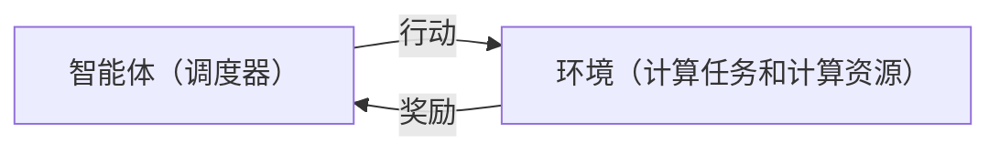

## 1.背景介绍

网格计算是一种通过网络连接的计算机组成的分布式计算环境，它能提供大规模的并行计算能力。然而，有效地管理和调度这些资源以达到最优的运行效率是一个具有挑战性的问题。强化学习，作为一种能够通过与环境的交互来学习最佳策略的机器学习方法，被认为是解决这个问题的一种有效的方法。

## 2.核心概念与联系

强化学习的核心是通过智能体（agent）与环境的交互，通过试错的方式学习最佳的行动策略。在网格计算的环境中，智能体可以是调度器，环境可以是各种计算任务和计算资源，行动可以是分配任务到特定的计算资源上，奖励可以是完成任务的效率或者完成任务的时间。



## 3.核心算法原理具体操作步骤

强化学习的算法主要包括价值迭代（Value Iteration）、策略迭代（Policy Iteration）和Q学习（Q-Learning）。其中，Q学习是最常用的一种，其基本步骤如下：

1. 初始化Q值表；
2. 选择一个行动；
3. 执行该行动，观察奖励和新的状态；
4. 更新Q值表；
5. 如果达到终止条件，则结束，否则回到步骤2。

## 4.数学模型和公式详细讲解举例说明

Q学习的更新公式为：

$$
Q(s, a) = Q(s, a) + \alpha [r + \gamma \max_{a'} Q(s', a') - Q(s, a)]
$$

其中，$s$是当前状态，$a$是当前行动，$r$是获得的奖励，$s'$是新的状态，$a'$是新的行动，$\alpha$是学习率，$\gamma$是折扣因子，$\max_{a'} Q(s', a')$是在新的状态下，所有可能行动的最大Q值。

## 5.项目实践：代码实例和详细解释说明

以下是一个简单的Q学习的Python代码实例：

```python
import numpy as np

# 初始化Q表
Q = np.zeros([state_space, action_space])

# 学习过程
for episode in range(total_episodes):
    state = env.reset()
    done = False
    
    while not done:
        action = choose_action(state)  # 选择一个行动
        next_state, reward, done, info = env.step(action)  # 执行行动
        
        # 更新Q表
        Q[state, action] = Q[state, action] + alpha * (reward + gamma * np.max(Q[next_state, :]) - Q[state, action])
        
        state = next_state
```

## 6.实际应用场景

强化学习在网格计算中的应用主要是用于任务调度，例如，可以通过学习最佳的任务分配策略，提高计算资源的利用率，减少任务完成的时间。

## 7.工具和资源推荐

推荐使用Python的强化学习库Gym和Stable Baselines，他们提供了丰富的环境和算法，可以方便地进行强化学习的实验。

## 8.总结：未来发展趋势与挑战

强化学习在网格计算中的应用还处于初级阶段，但已经显示出了巨大的潜力。然而，也存在一些挑战，例如如何设计合适的奖励函数，如何处理大规模的状态和行动空间等。

## 9.附录：常见问题与解答

Q: 强化学习和监督学习有什么区别？  
A: 监督学习是从标签的数据中学习，而强化学习是通过与环境的交互来学习最佳的行动策略。

Q: 什么是网格计算？  
A: 网格计算是一种通过网络连接的计算机组成的分布式计算环境，它能提供大规模的并行计算能力。

作者：禅与计算机程序设计艺术 / Zen and the Art of Computer Programming